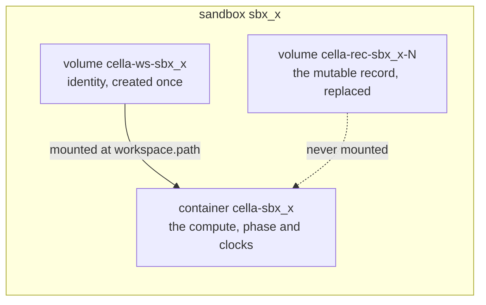

# Podman driver

## Overview

Slice 035 of [[031-hosted-sandbox-consolidation]]. It ports
`sandbox/internal/runtime/podman` into `latere.ai/x/cella/runtime/podman`
as the first `container` driver of [[004-runtime-contract]]: one
container and one workspace volume per sandbox, driven over the libpod
REST API on a unix socket, passing `runtimetest.Run`
([[032-runtime-conformance-suite]]) against a real engine.

What crosses from the source: the hand-written HTTP client over the
socket, the multiplexed stream demultiplexer, the workspace-as-named-volume
decision, the exec and archive paths, and the phase mapping. What does
not: the warm pool, the display stack, the hijacked attach, the
credential projection, the billing legs, and the in-process overlay the
source used for mutable metadata. Attach lands in slice 034, display and
input in 041, secrets and egress in 039; none is declared here.

The one design the source did not have is the sandbox's record. The
hosted driver kept the mutable half of a sandbox's state in a process
map and accepted that a restart lost it. [[005-lifecycle-controller]]'s
recovery reads what the engine holds, so this driver keeps nothing in
process and reads every field of `State` back from podman.

## Current state

`runtime/native` is the only driver. `runtime.CreateSpec` carries
`User`, `Resources` and `Workspace.Path` from [[044-manifest-fields]],
and the controller fills all three. `internal/config` accepts
`CELLA_RUNTIME=podman` as a value and `cmd/cellad` refuses it as not
implemented. `runtimetest` holds twelve cases and the
`DeclaredWithoutCase` report.

## Design

### What podman holds

Podman fixes a container's labels and a volume's labels at create: the
libpod update endpoint accepts a label map and ignores it, verified
against podman 5.7.1. A driver that stamps identity as labels therefore
cannot edit a stamp. Three objects per sandbox follow from that, split
by what changes:

| Object | Lifetime | Carries |
|---|---|---|
| workspace volume `cella-ws-<id>` | create to delete | the workspace itself, and the immutable half as labels: `id`, `kind=workspace`, `name`, `owner`, `created-at`, `image`, `image-digest`, `workspace-path`, `disk` |
| record volume `cella-rec-<id>-<n>` | replaced on every mutation | the mutable half as labels: `id`, `kind=record`, `generation`, `last-activity-at`, `stopped`, `ttl`, `auto-stop`, `auto-delete`, `env`, and the user's labels as `label.<key>` |
| container `cella-<id>` | create to delete | the compute; `id` and `kind=sandbox` as labels; `State.Status`, `State.ExitCode`, `State.StartedAt` and `State.FinishedAt` are read as the phase and the clocks |

Every key is prefixed `cella.latere.ai/`. The record volume holds no
data and is never mounted, so a process inside a sandbox cannot read or
forge its own expiry.

A mutation writes generation $n+1$ and then removes generation $n$, so
a crash between the two leaves both and the reader takes the higher.
`Inspect` and `List` sweep the generations below the highest they see.
Editing a label in place does not exist on this engine. Re-creating the
container to restamp its labels does, and is refused here because
`Touch` is the most frequent mutation there is and re-creating a
container kills the workload it holds.

`Update` therefore rewrites neither the container nor its labels. It
writes a new record. `Change.Env` lands in the record and is merged into
every later `Exec`, which is how a running sandbox observes it; the main
process keeps the environment it was created with, because podman fixes
a container's environment at create and the contract asks for no
restart.

### Naming and the id

A sandbox id is the `sbx_` form of [[004-runtime-contract]]. Podman
accepts `[A-Za-z0-9][A-Za-z0-9_.-]*` for a container or volume name, so
the id passes through unchanged and the driver refuses any other shape
with `ErrInvalid` rather than letting podman decide.

### Phases

The mapping `Inspect` and `List` apply, which is also the package
documentation's table:

| Container | Record's `stopped` | Phase | `ExitCode` |
|---|---|---|---|
| absent | any | `Stopped` | none |
| `created`, `configured`, `initialized` | any | `Pending` | none |
| `running`, `paused` | any | `Running` | none |
| `stopping` | any | `Stopping` | none |
| `removing` | any | `Deleting` | none |
| `exited`, `stopped`, `dead` | set | `Stopped` | none |
| `exited`, `stopped`, `dead`, code $0$ | unset | `Stopped` | $0$ |
| `exited`, `stopped`, `dead`, code $\neq 0$ | unset | `Failed` | the code |

`podman stop` sends SIGKILL after the grace period and the container
exits 137, so without the intent flag every stopped sandbox would read
`Failed`. The flag is the difference between an operator's stop and a
workload that died.

`CreatedAt` is the driver's own `created-at` label, not podman's, so the
instant is the one the control plane recorded and survives any container
change. `StartedAt` and `StoppedAt` are the container's `StartedAt` and
`FinishedAt`; `StoppedAt` is zero while `Running`. `ExpiresAt` is
`CreatedAt` plus the record's `ttl`, so one clock owns it.

### Lifecycle

`Create` resolves the image and pulls it when absent, bounded by
`CELLA_PODMAN_PULL_TIMEOUT` (default five minutes), records its digest,
creates the workspace volume, writes generation one of the record,
creates the container with the workspace volume at
`CreateSpec.Workspace.Path`, and starts it. Any step that fails removes
what the earlier steps made. A second `Create` of an id whose workspace
volume exists is `ErrAlreadyExists`.

`CreateSpec.Command` and `Args` become the container's command. A spec
with neither gets `["sh", "-c", "while :; do sleep 3600; done"]`, an
idle process every OCI base image can run, so a sandbox created to be
`Exec`ed into stays `Running`.

`Start` and `Stop` are the container's own operations, which podman
already answers 304 to when there is nothing to do; `Stop` sets the
record's intent first and `Start` clears it, and neither writes a record
when the flag already holds the value it wants, so the second call
changes no clock. `Delete` force-removes the container, then every
record generation, then the workspace volume, and a delete of what is
not there is not an error.

### Resources

`Resources.CPU` and `.Memory` are parsed with `manifest.ParseQuantity`,
which returns milli-units, and become the libpod `resource_limits`: CPU
as a CFS quota over a fixed 100 ms period,

$$\text{quota} = \frac{\text{cpu}_{\text{milli}} \times \text{period}}{1000},$$

memory as a byte limit. `Resources.Disk` has no enforcement point: the
local volume driver takes no size, so the request is recorded as the
`disk` label and nothing bounds it. The warning an operator reads for
that is `Resolve`'s stage 7 ([[044-manifest-fields]]), from the driver's
declared capabilities, not a per-create message from here.

### Files

`ExportTar` and `ImportTar` go through the compat archive endpoint,
which answers on a stopped container as well as a running one, so
`Files` is declared and both directions work while `Stopped`.

Neither direction hands podman the caller's bytes unread. `ImportTar`
reads the caller's archive with `archive/tar` and refuses, before any
byte reaches the engine, an entry that is not a regular file or a
directory, one whose name is absolute, escapes with `..`, or is not a
valid slash path: podman would extract all of them. `ExportTar` re-frames
what the engine returns, because podman names its entries after the base
of the path asked for, `workspace/tree/hello.txt` for the workspace root
and `tree/hello.txt` for the tree, and the contract's names are relative
to the workspace either way. Re-framing is also where several requested
paths become one archive and where a directory header loses its trailing
slash.

A path outside the sandbox's workspace is `ErrInvalid` in both
directions, checked against `CreateSpec.Workspace.Path` as the native
driver checks against `/workspace`.

### Exec and logs

`Exec` creates an exec session with stdout and stderr attached, starts
it, demultiplexes the 8-byte-framed stream into the two readers, and
polls the session for the exit code. The record's environment is merged
under the request's, and the request's workdir defaults to the
container's. `Stdin` and `TTY` are `ErrUnsupported` because `Attach` is
not declared; an empty command is `ErrInvalid`; a sandbox that is not
`Running` is `ErrNotRunning`.

`Timeout`, a cancelled request context, and `Close` each end `Wait` with
the matching error and close both readers. They do not kill the process
inside: libpod exposes no way to signal an exec session, and the pid it
reports is the engine's, not the container's. The process is reaped when
the sandbox stops or is deleted, which is stated in the package
documentation rather than worked around.

`Logs` is the container's log endpoint with `Follow`, `Since` as a unix
instant and `TailLines` as `tail`, demultiplexed the same way.

### Transport and dependencies

The client is `net/http` over a unix dialer with hand-written request
types, as the source's was. No podman module is added, so this driver's
build list is the standard library plus `manifest` and `runtime`, and
`arch_test.go` takes it as the strict case with an empty engine list.
That also settles the transport: the driver does not reach
`latere.ai/x/pkg/otel`, because doing so would put the whole
OpenTelemetry build list under a driver package that the architecture
test holds to the contract types alone, and a local engine socket is not
a traced peer that a span could be continued into.

### Socket and selection

`CELLA_RUNTIME=podman` selects the driver. `CELLA_PODMAN_SOCKET` names
the socket; unset, the driver tries the rootless user socket
`$XDG_RUNTIME_DIR/podman/podman.sock` and then the system socket
`/run/podman/podman.sock`, in that order. `Preflight` dials each
candidate's `info` endpoint, keeps the first that answers, names it in
the start-up line, and refuses with every candidate listed when none
does. Nothing shells out to the podman command: the driver speaks to a
socket, which is all a remote engine offers.

### Tests

Unit tests drive the driver against a fake libpod server: an
`httptest.Server` on a unix socket in the test's own temporary
directory, answering the endpoints this driver calls with recorded
shapes, so every method and every error branch runs with no engine
present. They are hermetic and carry the coverage.

`TestPodmanConformance` runs `runtimetest.Run` against a real engine. It
skips, naming the sockets it tried, when none answers, so the hermetic
and the CI suites pass on a machine with no podman. Options: the alpine
image, the default shell, `Down` and `Up` nil.

## Not in this spec

Attach and the hijacked stream ([[004-runtime-contract]], slice 034);
display and input (slice 041); egress, the per-sandbox network and the
gateway (slice 039); the mesh network (slice 040); the warm pool (slice
038); volumes as first-class objects ([[019-volumes]]); the token and CA
projection ([[006-identity]]); `Watch`, which the interface does not
carry yet.

## Acceptance criteria

| Criterion | Test that proves it | State |
|---|---|---|
| The driver passes every case of the conformance suite against a real engine, and skips with the sockets it tried when there is none | `TestPodmanConformance` | done |
| `Isolation()` is `container` and the declared capabilities are `Files` and `Detach` and nothing else | `TestDeclarations` | done |
| A fresh driver over the same engine reads every field of `State` back: name, owner, labels, the four instants, the lifecycle durations | `TestRecordSurvivesANewDriver`, conformance `DetachRecovers` | done |
| `Touch`, `Update` and `Stop` each write one record generation and remove the one below, and a reader that finds two takes the higher | `TestRecordGenerations` | done |
| `Stop` then `Start` keeps the workspace and the clocks, and the second call of each changes nothing | conformance `StopStartKeepsTheWorkspace`, `TestStartStopAreIdempotent` | done |
| A container killed by `Stop` reads `Stopped`, one that exited non-zero on its own reads `Failed` with its code | `TestPhaseTable`, `TestAWorkloadThatDiedReadsFailed`, conformance `LogsFollow` | done |
| An archive entry that is absolute, traverses, or is a symbolic or hard link is `ErrInvalid` before a byte reaches the engine | `TestImportRefusals`, conformance `TarOutAndIn` | done |
| Export names are relative to the workspace whether the whole workspace or one tree was asked for | `TestExportNames`, `TestTarRoundTrip`, conformance `TarOutAndIn` | done |
| `Resources.CPU` and `.Memory` become a CFS quota and a byte limit; `.Disk` is recorded and enforces nothing | `TestResourceLimits`, `TestCreateStampsIdentityAndRecord` | done |
| `Preflight` names the socket it found and lists every candidate when none answers | `TestPreflightSockets` | done |
| `CELLA_RUNTIME=podman` reaches the driver and a start-up with no engine fails at its preflight naming the socket | `TestPodmanRuntimeSelected`, `TestPodmanSocket` | done |
| Nothing under `runtime/podman` names a Latere host, image, pool or namespace | `TestNoLatereCoordinates` | done |
| The driver's build list is the contract packages and the standard library | `TestRootPackagesDialNothing` | done |

## Outcome

Landed 2026-09-19. `latere.ai/x/cella/runtime/podman` is the `container`
driver: `client.go` (the socket, the request shapes, the refusals),
`podman.go` (declarations, the identity and the record, the lifecycle,
the phases, the resources and the paths), `exec.go`, `logs.go`,
`files.go`. Coverage 94.6% of 738 statements, and the whole bar passes,
including the race, hermetic and tempdir runs.

`TestPodmanConformance` ran for real against podman 5.7.1 on a rootless
macOS machine, over the podman machine's socket, and every case passed:
`NameIsolationCapabilities`, `PreflightAndReady`, `CreateInspectDelete`,
`StopStartKeepsTheWorkspace`, `UpdateEveryMutableField`,
`ListReadsIdentityBack`, `FilterSelectsOnLabels`, `ExecStreamsAndExits`,
`LogsFollow`, `TarOutAndIn`, `TouchStampsActivity`, `DetachRecovers`.
Nothing is left on the engine after the run. It skips with the sockets it
tried where none answers, so the hermetic gate and a machine with no
podman still run the suite; the fake engine of `fake_test.go` carries the
coverage there.

Four things the design settled that the spec above states and that the
next container driver inherits:

1. Podman fixes an object's labels at create. The libpod update endpoint
   accepts a label map and answers 201 without applying it, which was
   verified rather than assumed, so a mutable record is a replaced object
   with a generation and not an edited label.
2. `Update` rewrites neither the container nor its labels. `Change.Env`
   lands in the record and reaches the sandbox through `Exec`. The
   alternative, re-creating the container, kills the workload, and
   `Touch` is frequent enough that it would do so constantly.
3. `Detach` is declared, which [[004-runtime-contract]]'s table did not
   expect of this driver. The driver keeps nothing in this process, so a
   second instance over the same engine reads every sandbox back and the
   suite's `DetachRecovers` proves it. The table's cell is corrected in
   this slice.
4. The driver reaches the standard library and the contract packages and
   nothing else, so `arch_test.go` takes it as the strict case. That
   rules out `latere.ai/x/pkg/otel`, whose build list a driver package may
   not carry, and a local engine socket is not a peer a client span
   continues into.

Two hazards for whoever operates this backend, both of the engine rather
than the driver: `podman volume prune` removes a volume nothing mounts,
which is every record volume, and `podman container prune` removes a
stopped container, which is every stopped sandbox. Neither is recoverable
from the remaining objects; the driver does not rebuild a container it
did not create.

Not built here and listed where they belong above: attach, display and
input, egress and the mesh, the warm pool, the token and CA projection,
and `Watch`.
