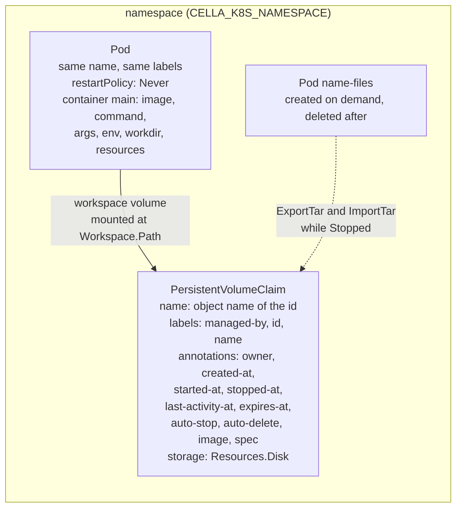
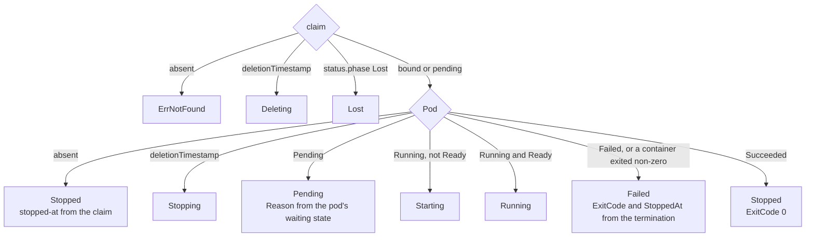

# Kubernetes driver

## Overview

Slice 036 of [[031-hosted-sandbox-consolidation]]. It ports the hosted
sandbox's Kubernetes runtime, its production data plane, into the
`runtime.Driver` contract of [[004-runtime-contract]] as
`latere.ai/x/cella/runtime/k8s`: a driver of isolation class `container`
that drives `k8s.io/client-go` against one namespace and turns a
`CreateSpec` into one `PersistentVolumeClaim` and one `Pod`.

The source is 12.4k lines across `internal/runtime/k8s`, `labelsnap`,
`resources` and `spec`. Most of it belongs to other slices or to
nothing: the warm pool (038), the display and input surfaces (041), the
egress, mesh, sidecar and sandbox-token wiring (039, 040, 045), the
tier machinery that the `Volume` kind of [[019-volumes]] replaces, and
the withdrawn drive mount. What lands here is the part the contract
names: the two objects, the lifecycle between them, the identity
stamped on them, execution, logs, archive transfer, activity, and the
readiness checks an operator needs before the first sandbox.

The driver assumes nothing about the cloud. Every value an installation
supplies (namespace, storage class, node selector, tolerations, image
pull secrets, the uid the workload runs as) is an option with a default
that names no deployment.

## Design

### The two objects

The claim is the sandbox; the Pod is compute attached to it. A stop
deletes the Pod and keeps the claim, so a stopped sandbox costs a
volume and no CPU, and a start renders a new Pod from the spec the
claim carries.



The claim outlives every Pod, so `List` and `Inspect` rebuild `State`
from the two objects with no store behind them, which is what
[[010-state]] asks of a control plane that comes up against a cluster
already holding sandboxes.

### Names and identity

A sandbox id is not a Kubernetes name: `sbx_01J...` holds underscores
and case, and an object name is a DNS-1123 subdomain. The driver
derives the object name once, deterministically: an id that is already
a legal name is used as it stands; any other id is lowercased, its
illegal bytes replaced by `-`, and suffixed with eight hex digits of
the id's SHA-256, so two ids never collide on one object. The id
itself is a label value, where `_` and case are legal, and every read
path checks the label rather than trusting the name.

| Stamped as | Keys |
|---|---|
| labels, selectable | `cella.latere.ai/managed-by`, `cella.latere.ai/id`, `cella.latere.ai/name` when the name is a legal label value |
| annotations | `cella.latere.ai/owner`, `created-at`, `started-at`, `stopped-at`, `last-activity-at`, `expires-at`, `auto-stop`, `auto-delete`, `image`, `spec` |

[[004-runtime-contract]] writes the user's labels as one annotation per
label, `label.<key>`. A user label key may hold a `/`, and an
annotation key may not hold one after its prefix, so the same spec's
requirement that every stamped key is legal for a key with a `/` cannot
hold in that shape. The driver stamps the user's labels inside the
`spec` annotation instead, which is JSON and legal for every key and
value, and is the one place the rendering input already lives.

The `spec` annotation carries the `CreateSpec` the sandbox was created
with, mutated by `Update`. `Start` renders the Pod from it, `Exec`
reads the environment and the workdir from it, and `Inspect` reads the
user's labels from it. Every timestamp the reaper of
[[005-lifecycle-controller]] reads is its own annotation, in RFC 3339
with nanoseconds, so a sweep reads them without parsing the spec.

### Phases

The phase is a function of the two objects and nothing else.



`Queued` and `Recovering` are the controller's and never appear here.
The table is in the package documentation as [[004-runtime-contract]]
requires.

### Rendering

`Create` renders the claim from `Resources.Disk` and the option's
storage class, and the Pod from the rest of the spec:

| Spec field | Pod field |
|---|---|
| `Image` | `containers[main].image`; empty is refused with `ErrInvalid` |
| `Command`, `Args` | `command`, `args`; an empty command runs a keep-alive that traps `TERM`, so a sandbox with no main process stays available to `Exec` |
| `Env` | `containers[main].env`, sorted so two renders of one spec are equal |
| `Workdir` | `containers[main].workingDir`, defaulting to `Workspace.Path` |
| `User` | `runAsUser` and `runAsGroup` from `uid` or `uid:gid`; `0` is refused with `ErrInvalid`, a user name with `ErrUnsupported`, since the field is numeric |
| `Resources.CPU`, `Resources.Memory` | limits as written; requests are the limit times `CPURequestRatio` and `MemoryRequestRatio` |
| `Resources.Disk` | the claim's storage request |
| `Workspace.Path` | the claim's mount path |
| `Lifecycle` | the `expires-at`, `auto-stop` and `auto-delete` annotations |

Requests below limits are the hosted driver's packing decision, kept as
a ratio option rather than a constant: a cluster that runs one sandbox
per node sets both ratios to 1 and gets requests equal to limits.

Every Pod carries the baseline of [[013-security-and-threat-model]] as
[[004-runtime-contract]] tabulates it: `runAsNonRoot`, capabilities
dropped, a read-only root filesystem with the workspace and `/tmp` as
the only writable mounts, `seccompProfile: RuntimeDefault`, no
privilege escalation, no host namespaces, and no service account token.
`fsGroup` is the run-as group so the claim is writable by the workload.

### Lifecycle

| Call | What it does |
|---|---|
| `Create` | claim, then Pod, then wait for readiness within `ReadyTimeout`; a claim that exists is `ErrAlreadyExists` and nothing is touched; a failure after the claim was created by this call deletes what this call created |
| `Start` | a live Pod is a no-op; a terminal or terminating Pod is deleted first; then a Pod is rendered from the claim's spec annotation against the same claim, `started-at` is stamped and `stopped-at` cleared, and a failure to become ready deletes the Pod again |
| `Stop` | deletes the Pod with the option's grace period, waits for it to be gone, and stamps `stopped-at` on the claim; a second stop does not restamp |
| `Delete` | deletes the Pod, waits, then deletes the claim and waits; both absent is not an error |
| `Update` | rewrites the spec annotation and the lifecycle annotations under a compare-and-swap |
| `Touch` | patches `last-activity-at` on the claim and on the Pod |

Waiting is what makes a failure legible. A `Create` that returns before
the Pod is scheduled hands the caller an id and no answer; a `Create`
that waits returns the reason the Pod is not running, read from its
waiting containers or its `PodScheduled` condition, the way the hosted
driver's `waitReady` did.

### Compare-and-swap

`Update` is a JSON patch whose first operations are `test` operations:
one on the claim's resource version when the API server supplies one,
and one on the current value of the spec annotation. A patch that loses
the race fails, and the driver re-reads and rebuilds it, up to a bounded
number of attempts. This is the hosted pattern, and it is why two
concurrent updates cannot interleave into a spec that neither writer
wrote. JSON pointer segments are escaped, so a key holding `/` patches
the key it names.

### Execution, logs and files

`Exec` runs through the remote command executor on the `exec`
subresource. The subresource carries no environment and no working
directory, so the driver wraps the argv the way the hosted driver did:
`env K=V ... sh -c 'cd "$0" && exec "$@"' <workdir> <argv...>`, with the
stored environment merged under the request's, both sorted. Exit codes
come from the executor's coded error; a request timeout and a cancelled
context surface from `Wait` as `context.DeadlineExceeded` and
`context.Canceled`; `Stdin` and `TTY` are refused with `ErrUnsupported`
because `Attach` is not declared; a sandbox with no Pod is
`ErrNotRunning`.

`Logs` is the pod log subresource with `Follow`, `SinceTime` and
`TailLines`.

`ExportTar` and `ImportTar` run `tar` in the container, and the driver
owns both ends of the stream. On the way out the archive is rewritten
so its names are workspace-relative with no `./` prefix and no trailing
slash on directories, which is the shape the suite of
[[032-runtime-conformance-suite]] reads back and the shape the native
driver writes. On the way in every entry is validated before it reaches
the container: an absolute name, a traversal, a symbolic link, a hard
link or a special file is `ErrInvalid`, and a destination outside the
workspace is refused before any exec is opened.

`Files` is declared, so both work while the sandbox is `Stopped`. With
no Pod there is nothing to exec into, so the driver creates a helper
Pod from the sandbox's own image with the same hardening, mounts the
claim, runs the transfer, and deletes it. The image is the sandbox's,
not one this repository names, so no default image exists to inherit.

### Preflight and readiness

`Preflight` proves the four things an operator gets wrong: the API
server answers, the namespace exists, the service account holds the
verbs the driver uses (`pods` and `persistentvolumeclaims` get, list,
create, delete and patch, `pods/exec` create, `pods/log` get), and the
configured storage class exists. It asks the cluster with one
`SelfSubjectAccessReview` per verb, so a missing rule is named rather
than discovered at the first create. `Ready` is the cheap half: one
list of one object in the namespace.

### Configuration

Every variable is read only when `CELLA_RUNTIME=k8s`, and no default
names a deployment.

| Variable | Default | Meaning |
|---|---|---|
| `CELLA_K8S_NAMESPACE` | `cella` | the namespace the objects live in |
| `CELLA_K8S_KUBECONFIG` | empty | a kubeconfig path; empty means the in-cluster configuration and nothing else |
| `CELLA_K8S_STORAGE_CLASS` | empty | the claim's storage class; empty is the cluster's default |
| `CELLA_K8S_NODE_SELECTOR` | empty | `key=value` pairs, comma separated |
| `CELLA_K8S_TOLERATIONS` | empty | `key[=value][:effect]` entries, comma separated |
| `CELLA_K8S_IMAGE_PULL_SECRETS` | empty | secret names, comma separated |
| `CELLA_K8S_RUN_AS_USER` | `1000` | the uid a sandbox runs as when the manifest names none |
| `CELLA_K8S_RUN_AS_GROUP` | `1000` | the gid and the `fsGroup` |
| `CELLA_K8S_CPU_REQUEST_RATIO` | `0.1` | the request as a fraction of the CPU limit |
| `CELLA_K8S_MEMORY_REQUEST_RATIO` | `1` | the request as a fraction of the memory limit |
| `CELLA_K8S_DEFAULT_CPU` | `1` | the CPU limit when the manifest names none |
| `CELLA_K8S_DEFAULT_MEMORY` | `1Gi` | the memory limit when the manifest names none |
| `CELLA_K8S_DEFAULT_DISK` | `5Gi` | the claim's size when the manifest names none |
| `CELLA_K8S_READY_TIMEOUT` | `90s` | how long `Create` and `Start` wait for a Pod to be ready |
| `CELLA_K8S_GRACE_PERIOD` | `10s` | the Pod's termination grace period |

### Capabilities

`Files` and nothing else. `Attach`, `Dial`, `Display`, `Input`, `Pool`,
`Mesh`, `Ingress`, `Volumes`, `Snapshots`, `Resize` and the egress modes
are the cluster's to give and this driver's to declare, and each waits
for the slice that builds it. A capability declared without its
behaviour fails the suite, which is the point of declaring none.

## Not in this spec

The warm pool and `Prewarm` (038). The egress NetworkPolicy, the
gateway sidecar and the projected token and CA (039, 045). The mesh
policy and the headless service (040). Display and input (041). The
decorator and exposer seams of [[004-runtime-contract]], and the
`runtimeClassName` that lets one cluster serve isolation `vm`: both
need a case in the suite before they can be proven, and neither has a
consumer in this repository yet. `Watch`, which the `Driver` interface
does not carry.

## Acceptance criteria

| Criterion | Test that proves it | State |
|---|---|---|
| A `CreateSpec` renders one claim and one Pod with the image, command, args, env, workdir, user, resources and workspace mount the spec names | `TestRenderPodAndClaim`, `TestRenderDefaults`, `TestSchedulingOptionsReachThePod` | passing |
| Every Pod carries the security baseline field by field | `TestPodCarriesTheBaseline` | passing |
| Requests are the configured fraction of limits, and one spec renders equal objects twice | `TestResourcesAreConsistent` | passing |
| The identity stamped on the objects reads back as `State` with no store: id, name, owner, labels, every instant | `TestIdentityReadsBack` | passing |
| Every stamped label value is legal and every key is legal, for an owner holding `@` and a user label key holding `/` | `TestStampedIdentityIsLegal`, `TestNameTooLongForALabelIsAnnotationOnly` | passing |
| An id that is no legal object name maps to one that is, and two ids never collide | `TestObjectNameIsDerived`, `TestInspectRefusesAnotherSandboxesObject` | passing |
| A claim with no Pod is `Stopped`, not `Lost`; every row of the phase table holds | `TestPhaseTable`, `TestOrphanClaimIsStoppedNotLost` | passing |
| A `Create` whose Pod cannot be created deletes the claim it made; a `Create` against an existing claim is `ErrAlreadyExists` and touches nothing | `TestCreateRollsBack`, `TestCreateRollsBackWhenThePodNeverStarts`, `TestCreateRollsBackAfterCancellation`, `TestCreateInspectDelete` | passing |
| A `Start` whose Pod never becomes ready deletes the Pod and reports what the Pod was waiting for | `TestStartRollsBackOnTimeout` | passing |
| `waitReady` names the image pull state and the unschedulable condition, and passes a caller's cancellation through | `TestWaitReadyReports`, `TestWaitingNamesWhatThePodIsDoing` | passing |
| Every lifecycle call on an unknown id is `ErrNotFound` | `TestLifecycleNotFound` | passing |
| An `Update` that loses the compare-and-swap is retried and lands | `TestUpdateRetriesTheConflict`, `TestUpdateGivesUpAndSaysSo`, `TestPatchGuardsAgainstAStaleRead` | passing |
| `Exec` wraps env and workdir as the hosted driver did, propagates the exit code, and refuses stdin and a TTY | `TestExecWrapsAndExits`, `TestExecRefusals`, `TestExecStreamsWhileTheCommandRuns`, `TestExecTimeoutAndCancellation` | passing |
| An archive is rewritten to workspace-relative names, and a traversal, an absolute name, a symbolic link and a hard link are each `ErrInvalid` | `TestArchiveNames`, `TestImportRefuses`, `TestExportRefusesWhatIsNotTheWorkspace` | passing |
| A transfer while `Stopped` runs in a helper Pod that is deleted afterwards | `TestFilesWhileStopped`, `TestHelperPodCarriesTheBaselineAndNoIdentity` | passing |
| `Preflight` names the missing verb, the missing namespace and the missing storage class | `TestPreflightNamesWhatIsMissing`, `TestPreflightChecksTheStorageClass` | passing |
| The driver passes the whole conformance suite against a real cluster | `TestClusterConformance` | built and skipped: no cluster could be raised on this machine, see the Outcome |
| No file under `runtime/k8s` names a Latere host, image, pool or namespace | `TestNoLatereCoordinates`, whose walk from the runtime root covers every driver package, pinned by `TestNoLatereCoordinatesCoversEveryDriver` | passing |

## Outcome

`latere.ai/x/cella/runtime/k8s` is the container driver: `Driver` over
`k8s.io/client-go` v0.35.4, isolation `container`, capability `Files`
and nothing else. 1.6k lines of driver and 2.2k of tests, at **93.6%**
statement coverage (756 of 808), `go test -race` green, and the whole
bar of `go tool lateregate` green at 16 gates.

What landed, against the 12.4k lines of the hosted source: the two
objects and their rendering, the lifecycle between them with the
readiness wait and the rollbacks, the compare-and-swap on the claim's
record, execution with the hosted argv wrapping, logs, archive transfer
in both directions with a helper Pod for a stopped sandbox, activity
stamping, and the preflight an operator reads before the first sandbox.

### Decisions this slice made

- **No informer cache.** The hosted driver read Pods and claims through
  shared informers and carried `InspectFresh` for the reads that could
  not be stale. Every read here is a live one: `Inspect` after `Update`
  has to show the update, and a cache is an optimisation a later slice
  can add behind the same methods.
- **A derived object name.** A sandbox id holds `_` and upper case and
  an object name may not, so the name is the id when the id is already
  legal and a sanitised form plus eight hex digits of its hash when it
  is not. The id itself is a label value, and every read checks that
  label rather than trusting the name.
- **The user's labels live in the spec annotation.**
  [[004-runtime-contract]] writes them as `label.<key>` annotations,
  which cannot hold a key containing `/` while the same spec requires
  such a key to be stamped legally. One JSON annotation is legal for
  every key and every value, and it is where the rendering input
  already is.
- **Create and Start both wait.** A create that returns before the Pod
  is scheduled hands the caller an id and no answer. Both wait within
  `CELLA_K8S_READY_TIMEOUT` and roll back what they made, and the error
  is the reason the Pod gave: an image pulling, a Pod nothing can
  schedule.
- **A Pod that ran and exited has started.** The hosted `waitReady`
  treated a terminal Pod as a failure, because its Pods only ever ran a
  keep-alive. Here a sandbox may carry a main command that exits, so
  only a Pod that never starts spends the budget.
- **Archives are rewritten on both sides.** The container's `tar`
  writes `./x` and `dir/`; the contract's other drivers write `x` and
  `dir`. Export normalises every name, and import validates every entry
  in this process before it reaches the container, so a traversal, an
  absolute name, a link of either kind and a special file are refused
  where the check still holds.

### What the conformance run did

`TestClusterConformance` runs `runtimetest.Run` against a real cluster
when `CELLA_TEST_KUBECONFIG` or `KUBECONFIG` names one, and skips with
the variables to set when neither does, so the hermetic bar stays
clean. It did not run: `kind` v0.32.0 and `kubectl` v1.31.0 are both
installed on this machine, and two `kind create cluster` attempts over
the podman provider failed in `kubeadm`'s wait-control-plane phase, the
second with a four-minute budget. The machine's podman virtual machine
holds 2 GiB and was running 40 containers of other work with 463 MiB
free, which is under what a control plane needs; resizing it would have
stopped every one of them. The cluster was deleted after each attempt
and the machine left as it was found. The run is therefore open, and it
is one command on a machine with room:

```
kind create cluster --name cella
KUBECONFIG=$(kind get kubeconfig-path --name cella) go test ./runtime/k8s -run TestClusterConformance -v
```

### Hosted behaviour deliberately dropped

The warm pool (`AcquireWarm`, the bucket ordering, the warm-to-leased
JSON patch) waits for 038; the Cilium network policies, the egress CA
and proxy wiring and the sandbox-token Secret for 039 and 045; the mesh
policy and its headless service for 040; the GUI display and input
surfaces for 041. The tier machinery and `ConvertTier` are dropped
outright, since the `Volume` kind of [[019-volumes]] replaces them, and
so are the billing stamps, the quota counter and the drive mount. The
hosted `Hostname: spec.Name` on the Pod is dropped: a sandbox name is
not a DNS label, and the hostname belongs to the mesh that 040 brings.

### Left open

- `TestClusterConformance` has not been run against a cluster.
- The decorator and exposer seams of [[004-runtime-contract]], the
  `runtimeClassName` and the isolation an operator declares for it, and
  `Watch`: each needs a case in the suite or an operation on `Driver`
  before it can be proven, and neither has a consumer here yet.
- `arch_test.go` has no `engines` row for `./runtime/k8s`. Its allow
  list matches import paths exactly, and this package's build list is
  390 of them, so a row would have to be a prefix. Giving that map
  prefix matching is one change to a file no slice owns, and it is left
  to whoever lands the next client-driving driver.
