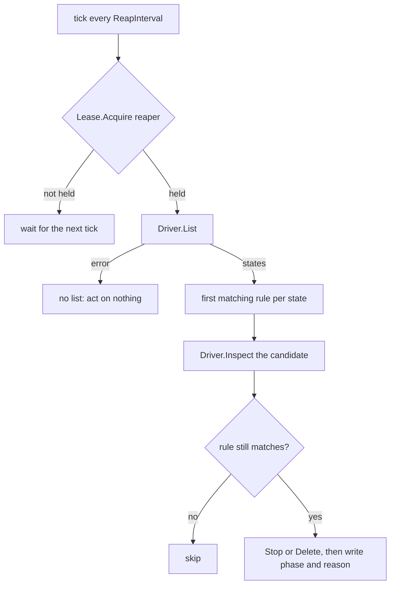

# Lifecycle enforcement

## Overview

Slice 037 of [[031-hosted-sandbox-consolidation]]. It ports the reaper of
`sandbox/internal/runtime/reaper.go` and the touch throttle of
`sandbox/internal/pkg/activitytouch` into the controller of
[[005-lifecycle-controller]], over the `runtime.Driver` and the
`runtime.Lifecycle` the contract already carries.

A sandbox that no one uses keeps its workspace, its process and its
substrate quota until something ends it. Today nothing does: the
controller acts only when a request arrives, so an idle sandbox runs
until an operator deletes it by hand. This slice gives the controller a
clock: one loop that reads the driver's list and applies the three
deadline rules of [[005-lifecycle-controller]] that need neither a
durable store nor a token, and one activity path that stamps use onto
the substrate without writing it per keystroke.

The three rules this slice builds (`expired`, `autoDelete`, `autoStop`)
read only what `runtime.State` already reports, so the loop runs from
the substrate alone: a control plane that restarts with an empty store
still ends what the driver says is past its deadline. The two rules it
does not build (`lost`, `token`) need the observed index of
[[010-state]] and the mint of [[006-identity]]; they arrive with slices
043 and 045.

## Design

### The rules

`Reap` evaluates one `runtime.State` against one instant and returns the
first rule it matches, in the order of [[005-lifecycle-controller]]'s
table. First match wins, so a sandbox past its deadline and idle is
deleted rather than stopped.

| Rule | Condition | Action | Reason |
|---|---|---|---|
| expired | `expiresAt != 0` and `now >= expiresAt` | `Driver.Delete` | `Expired` |
| autoDelete | `phase = Stopped`, `autoDelete > 0`, `stoppedAt != 0`, `now >= stoppedAt + autoDelete` | `Driver.Delete` | `AutoDelete` |
| autoStop | `phase = Running`, `autoStop > 0`, `now >= activity + autoStop` | `Driver.Stop` | `AutoStop` |

where

```
activity = lastActivityAt  when lastActivityAt != 0
         = createdAt       otherwise
```

The `createdAt` fallback is the hosted reaper's: a driver that has not
stamped activity yet must not hold a sandbox open forever, so a sandbox
that was never touched ages from its creation. A rule fires at its
second and not one before, which is `!now.Before(deadline)` and not
`now.After(deadline)`.

`never` is the zero value. `runtime.Lifecycle` carries durations and
`runtime.State` a zero `ExpiresAt`, and the driver contract refuses a
negative duration, so zero is the only sentinel a rule reads:
`autoStop: 0` never stops, `autoDelete: 0` never deletes, no `ExpiresAt`
never expires. The manifest's spelling of `never` resolves to that zero
in slice 044.

`autoDelete` requires a stamped `stoppedAt`. A `Stopped` state without
one carries no evidence of when it stopped, and the rule deletes; the
conformance suite of [[004-runtime-contract]] asserts every driver
stamps `StoppedAt` on `Stop`, so a conforming driver never lands there.

### The tick



`List` is read without the controller's lock, since a driver answers it
concurrently. Every action takes the lock, re-reads the candidate with
`Inspect`, and re-evaluates the same rule against the fresh state. A
sandbox touched between the list and the action keeps running, and a
sandbox whose deadline moved is not deleted on a stale reading. Those
are the three regressions the hosted reaper's tests pin
(`TestReaperRevalidatesFreshActivityBeforeIdleStop`,
`TestReaperRevalidatesExtendedDeadlineBeforeDelete`,
`TestReaperSkipsDeleteWhenGuardSeesNewDeadline`); with one process and
one lock they are a re-read rather than a conditional write, and they
become the conditional write of [[010-state]] when a second writer
exists.

An error from `List` is no list, not an empty one. An environment the
controller cannot read reports nothing, and a tick that treated silence
as emptiness would delete the fleet it could not see. The tick returns
that error and acts on nothing.

A driver object with no desired record is still acted on: the substrate
is the truth the rules read. There is no status to write for it.

### The seams

```go
// Clock is the controller's view of time.
type Clock interface {
	Now() time.Time
	Ticker(d time.Duration) (ticks <-chan time.Time, stop func())
}

// Lease is the single-writer seam of design 010.
type Lease interface {
	Acquire(ctx context.Context, name string, ttl time.Duration) (held bool, err error)
}

// LocalLease grants every lease: one cellad is the only writer.
type LocalLease struct{}
```

`Options` gains `Clock`, `Lease`, `ReapInterval`, `TouchInterval` and
`Lifecycle`; `Open` fills each default, so a caller written against the
previous options compiles and runs unchanged.

`Acquire` is called once per tick with the name `reaper` and a 15 second
TTL, the names and TTL of [[010-state]]. Renewal at a third of the TTL
is the lease implementation's, and `LocalLease` has nothing to renew:
the in-process controller of one `cellad` is the only writer, and the
Postgres lease of [[010-state]] replaces it where a second replica runs
(slice 043). The reaper asks per tick rather than holding a handle, so a
lease lost to another replica stops this replica at its next tick.

`Clock.Now` is read once per tick and used for every rule in it, so the
rules of one tick agree on the instant. `Clock.Ticker` drives the loop,
so a test advances the loop without sleeping.

### Activity

`Controller.Touch` stamps use on the substrate. It coalesces per
sandbox: the first call for an id reaches `Driver.Touch`, and the calls
inside `TouchInterval` after it return without one, so an interactive
session writes the substrate once a minute rather than once a keystroke.
A suppressed call is dropped, not deferred, so `lastActivityAt` lags
true activity by up to `TouchInterval` and an `autoStop` shorter than
`TouchInterval` is not meaningful.

The exec and files handlers of [[008-api]] call it, which is the
activity list of [[005-lifecycle-controller]] as far as this repository
implements it; attach and input arrive with slices 034 and 041. `Logs`
does not touch: following a log is watching a sandbox, not using it, and
a dashboard tailing output would otherwise hold every sandbox open.

A touch that fails is logged and never fails the request that carried
it, because activity is a stamp on a sandbox and not the work the caller
asked for.

### Lifecycle into the driver

`runtime.CreateSpec.Lifecycle` is what makes a rule have anything to
read, and it has one source in the controller:

```go
// lifecycleOf is the one place the manifest's lifecycle meets the driver's.
func (c *Controller) lifecycleOf(obj v1.Sandbox) runtime.Lifecycle
```

`manifest/v1` carries no `spec.lifecycle` until slice 044, so today every
sandbox takes `Options.Lifecycle`, the environment's default. Slice 044
reads the object's own field in that function and nowhere else. Update,
which sends `runtime.Change.Lifecycle`, is the update path of
[[005-lifecycle-controller]] and waits for the field it would diff.

### Phase and reason

An action writes the phase it produced and its reason from the enum of
[[009-events]] into the object's status, in the store, before the next
reconcile can read it:

- `Stop` refreshes the object from the driver and writes `Stopped` with
  reason `AutoStop`.
- `Delete` writes `Deleting` with `Expired` or `AutoDelete` and saves
  before it calls the driver, so a crash between the two leaves an
  intent that names why, then removes the record.

`Refresh` keeps a reason the controller wrote while the phase it was
written for still holds. A driver reports the reason for a transition it
made itself, and reports none for a `Stop` it was told to make, so
without that rule the first read after an `AutoStop` would erase it.

The status field `expiresAt` and the warnings of
[[003-manifest-contract]] arrive with slice 044; this slice writes only
`phase` and `reason`, which `v1.SandboxStatus` already has.

### Configuration

| Variable | Default | Bounds | Meaning |
|---|---|---|---|
| `CELLA_REAP_INTERVAL` | `30s` | `1s` to `1h` | how often the reaper reads the environment and applies the rules |
| `CELLA_TOUCH_INTERVAL` | `1m` | `1s` to `1h` | how often one sandbox's activity reaches the driver |

Both are read at start-up with every other variable of spec 002, and a
value outside its bounds is a start-up failure with the rest of the
configuration's problems, not a silent clamp.

## Not in this spec

The `lost` rule, recovery and `Recovering`: they need the durable
desired state and the observed index of [[010-state]], which slice 043
carries. The `token` rule: it needs the mint and the revocation of
[[006-identity]], which slice 045 carries. The update path and the
cascade of [[005-lifecycle-controller]]. The environment phase gate of
[[021-data-plane-workers]]: with one in-process driver there is one
environment and its readiness is the process's.

A native limitation this slice inherits: `native.List` fails while any
sandbox holds a terminal metadata-write failure, so one unwritable
record silences the reaper for that environment until an operator stops
or deletes the sandbox. That is the driver's fail-closed choice from
slice 030, and the tick's error path reports it once per tick.

## Acceptance criteria

| Criterion | Test that proves it | State |
|---|---|---|
| Each rule fires at its second and not one before under a fake clock; `never` disables it; a sandbox matching two rules gets the first | `TestReaperRules` | built |
| An expired sandbox is deleted, a stopped one past `autoDelete` is deleted, and an idle one is stopped with the reason in its status | `TestReaperActs` | built |
| The reaper does not act on a replica without the lease, and a lease error is not an action | `TestReaperNeedsTheLease` | built |
| An errored `List` acts on nothing and returns the error | `TestListErrorIsNotEmpty` | built |
| A sandbox touched between the list and the action is not stopped; one whose deadline moved is not deleted | `TestReaperRevalidatesBeforeActing` | built |
| `Touch` reaches the driver at most once per `TouchInterval` per sandbox, and each sandbox is counted apart | `TestTouchCoalesces` | built |
| The loop ticks under the clock, holds the lease, survives a failed tick, and returns with its ticker stopped when its context ends | `TestRunReaperTicksAndStops` | built |
| A native sandbox with a short `autoStop` reaches `Stopped` with reason `AutoStop`, and with a short `autoDelete` is then deleted | `TestReaperEndToEndOverNative` | built |
| A failing driver or store leaves the record with its intent and the tick reports the failure | `TestReaperDriverFailuresKeepTheIntent`, `TestReaperStoreFailuresKeepTheRecord` | built |
| A reason the controller wrote survives a refresh while its phase holds, and goes when the phase does | `TestRefreshKeepsTheControllerReason` | built |
| `CELLA_REAP_INTERVAL` and `CELLA_TOUCH_INTERVAL` take their defaults, accept a duration, and refuse one outside the bounds | `TestReaperIntervals` | built |
| The exec and files routes stamp activity, and a failed stamp does not fail the request | `TestActivityIsStamped` | built |
| No file under `controller/` names a Latere host, image, pool or namespace outside an example | `TestNoLatereCoordinates` with `controller/` in its roots | built |

## Outcome

The reaper runs in `controller/reaper.go`: `Reap` is one tick and
`RunReaper` the loop, over the `Clock` and `Lease` seams `Options` now
carries with `ReapInterval`, `TouchInterval` and the environment's
default `Lifecycle`. `reapRule` is the whole rule table in one function,
and it is what both the tick and its table test evaluate, so the rules
have one statement. Every action re-reads its candidate under the
controller's lock and acts only while the same rule still matches, which
is how the hosted reaper's three revalidation regressions land here
without the hosted conditional writes.

`runtime/native` needed no change: slice 025 already stamped `ExpiresAt`
from `CreatedAt + TTL` at create, honoured `Change.Lifecycle` on update,
and slice 032's `UpdateEveryMutableField` and `TouchStampsActivity`
already assert both, capability-neutral. The conformance suite therefore
gained nothing; this slice reads what the contract already produced.

`Controller.Touch` coalesces per sandbox and the exec and files handlers
call it. `cellad` starts the loop after the controller opens and stops
it before the runtime closes, so no tick outlives the driver it drives.
`CELLA_REAP_INTERVAL` and `CELLA_TOUCH_INTERVAL` are read with every
other variable and bounded to between `1s` and `1h`.

`go tool lateregate` passes all 16 gates. `go test -race ./...` passes.
Coverage: `controller` 96.1% (319/332), `cmd/cellad` 92.1%,
`internal/api` 92.3%, `internal/config` 98.3%; every package clears 90%.
The end-to-end case is `TestReaperEndToEndOverNative`: a native sandbox
with a 40ms auto-stop and a 40ms auto-delete is created, observed
`Stopped` with reason `AutoStop`, then observed gone from both the
controller's records and the driver, with the loop under the wall clock
and a 5ms tick.

Left open, each with the slice that closes it: the `lost` rule, the
grace and recovery need the durable desired state and the observed index
of [[010-state]] (slice 043), which is also where the `Lease` seam gets
its Postgres implementation and its renewal; the `token` rule needs the
mint and the revocation of [[006-identity]] (slice 045); the lifecycle
a caller asks for arrives with `spec.lifecycle` in slice 044, which
fills `lifecycleOf` and adds `status.expiresAt`, and until then a
sandbox takes the environment default the controller was opened with.
The update path, the cascade and the environment phase gate stay with
their own specs. `Logs` does not stamp activity, which is
[[005-lifecycle-controller]]'s list and not a shortcut: tailing output
is watching a sandbox, not using it.
