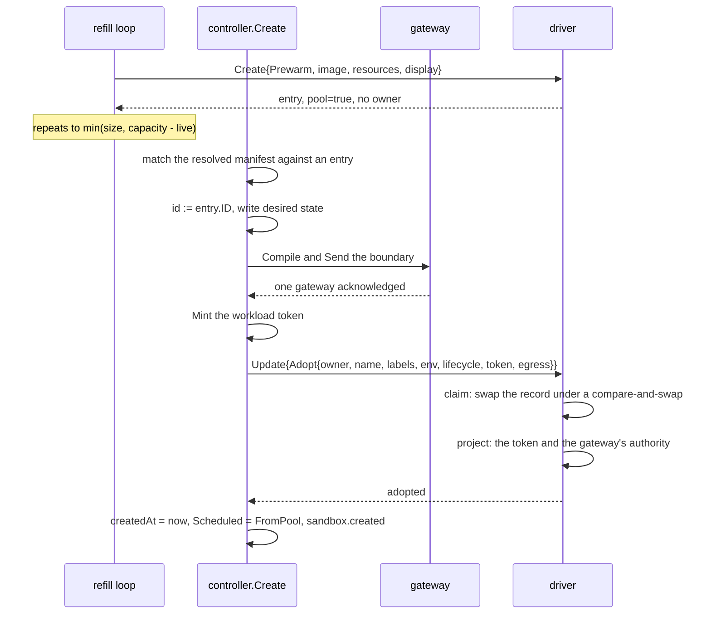

# Environment pools

## Overview

Slice 038 of [[031-hosted-sandbox-consolidation]]. It ports the hosted
warm pool of `sandbox/internal/sandbox/pool` into the shape
[[020-scheduling-and-sets]] fixes: the pool is the environment's, a
manifest never asks for it, and an entry is an ordinary sandbox object
with no owner that a create turns into the caller's in one exclusive
driver act.

A create that adopts skips the image pull, the workspace provision and
the container start, which is the whole of what a pool buys: seconds
become milliseconds, and nothing else about the sandbox differs. The
acceleration is transparent. The caller's manifest, its boundary, its
identity and its lifecycle are the same whether the sandbox was adopted
or created, and `status.conditions[Scheduled].reason` is the only place
the difference is visible.

What the hosted product carried and this slice drops: per-image warm
floors keyed by a bucket of image and size, since the environment
declares one shape; the admin API that resized a floor at runtime, since
[[021-data-plane-workers]] makes the size a field of the `Environment`
object; and the hosted fast path that adopted a Pod already running for
another tenant, which this contract refuses because an entry has no
owner until adoption and an owner until deletion.

## Current state

Nothing prewarms. `controller.Create` walks the seven steps of
[[005-lifecycle-controller]] and calls `Driver.Create` at the last one;
`runtime.CreateSpec` has no `Prewarm`, `runtime.Change` no `Adopt`, and
`runtime.State` no `Pool`. Every driver declares `Capabilities.Pool`
false, and [[004-runtime-contract]]'s `PrewarmAndAdoptIsExclusive` is
the one conformance case with no implementation behind it.

`manifest/v1.Environment` carries `spec.isolation` and the observed
status of the driver, which is what [[044-manifest-fields]] left it.
`spec.scheduling` and `spec.pool` are declared nowhere, so the
environment's own scheduling decision has no vocabulary yet.

## Design

### Scheduling is the environment's

`EnvironmentSpec` gains `scheduling` and `pool`:

```go
type EnvironmentSpec struct {
	Isolation  Isolation      `json:"isolation"`
	Scheduling SchedulingSpec `json:"scheduling,omitzero"`
	Pool       PoolSpec       `json:"pool,omitzero"`
}

type SchedulingSpec struct {
	Mode string `json:"mode,omitempty"` // direct; queued is 020's later work
}

type PoolSpec struct {
	Size      int       `json:"size,omitempty"`
	Image     string    `json:"image,omitempty"`
	Resources Resources `json:"resources,omitzero"`
	Display   *Display  `json:"display,omitempty"`
}
```

`mode` is `direct` here, which starts a sandbox now or fails. `queued`
is accepted vocabulary and refused as `capability_unsupported` until the
queue of [[020-scheduling-and-sets]] lands, so an operator who writes it
learns at start-up rather than watching sandboxes never start. A
manifest never chooses the mode, and this slice adds no `scheduling`
field to `SandboxSpec`.

The default environment's values come from the variables of the
configuration table below. There is no `Environment` store yet, so
`controller.Options` carries the pool of the one environment `cellad`
drives, typed as `v1.PoolSpec`: the vocabulary from the variable to the
refill loop is one type, and it is the type the stored object will hold
when [[021-data-plane-workers]] lands.

### The entry

An entry is a sandbox object the control plane made for nobody. The
driver receives `CreateSpec.Prewarm` and makes it with no owner, no
name, no token, no boundary, no user labels, an empty workspace, and
whatever it runs for a sandbox that names no command, which is the image's
entrypoint on a driver that starts one and an idle process on the two that
hold a container open for `Exec`. It stamps `cella.latere.ai/pool: "true"` on the
object it holds for that sandbox. `Inspect` and `List` report
`State.Pool` from that stamp, and `Filter.Pool` selects on it.

| Field | A prewarmed entry | After adoption |
|---|---|---|
| `Owner` | empty | the caller's subject |
| `Name` | empty | the manifest's `metadata.name` |
| `Labels` | the pool's shape stamp | the manifest's labels |
| `Env` | empty | the manifest's, with the boundary's placeholders |
| `Lifecycle` | none, so no deadline rule fires | the sandbox's own |
| `Token` | none | the workload token of [[045-workload-tokens]] |
| `Egress` | none | the compiled boundary of [[039-egress-gateway]] |
| `CreatedAt` | the prewarm | the adoption |
| `LastActivityAt` | the prewarm | the adoption |
| `Pool` | true | false |

`CreatedAt` and `LastActivityAt` both move, because the deadline rules
of [[005-lifecycle-controller]] count from them: an entry that sat warm
for two hours would otherwise be expired or auto-stopped on the first
tick after it was adopted.

An entry keeps the id it was prewarmed with, and the adopted sandbox
takes that id as its own `status.id`. The id is the object's name on
both container drivers, `cella-ws-<id>` on podman and the claim's name
on k8s, and neither can be renamed; carrying the entry's id forward is
what makes the boundary's principal, the token's subject and the
driver's stamped identity name one thing.

### The runtime contract

| Type | Addition |
|---|---|
| `CreateSpec` | `Prewarm bool` |
| `Change` | `Adopt *Adoption` |
| `Adoption` | `Owner, Name string`, `Labels, Env map[string]string`, `Workspace Workspace`, `Lifecycle Lifecycle`, `Token []byte`, `Egress Egress` |
| `State` | `Pool bool` |
| `Filter` | `Pool *bool` |

`Adoption` carries no `Volumes` yet: [[019-volumes]] has not landed and
`CreateSpec` has no mount list to rewrite. The field joins with that
slice.

`Adopt` is exclusive of every other field of `Change`: a call carrying
both is `ErrInvalid`, because adoption writes the same record a
mutation would and one act cannot be two. A driver that declares no
`Pool` answers `Prewarm` and `Adopt` with `ErrUnsupported`.

Adoption refuses with `ErrInvalid` when `Adoption.Workspace.Path`
differs from the entry's. The files are already provisioned at the
entry's path on every driver, and on both container drivers the path is
the mount destination the container was started with. The controller
reads that refusal as a mismatch and falls back to a real create; its
match rule holds the path as well, so the refusal is the second line of
defence and not the first.

### The match rule

A create matches an entry when the resolved manifest asks for nothing
the entry cannot carry:

| Field | Rule | Why |
|---|---|---|
| `image` | equals `spec.pool.image` | the container is already running that image |
| `resources` | equal `spec.pool.resources`, field by field, as written | the cgroup is already set |
| `display` | equals `spec.pool.display` | the desktop is already up or not |
| `command`, `args` | unset | the entry is already running what the driver runs for a sandbox with no command, and a process cannot be replaced under a container that is up |
| `workspace.source` | unset or `empty` | the entry's workspace is empty |
| `workspace.path` | unset, or the entry's path | the files are provisioned there |
| `user` | unset | the container is already running as its user |

A quantity is compared as the caller wrote it rather than parsed,
because [[003-manifest-contract]] keeps the caller's own spelling and a
pool whose `1000m` did not match a manifest's `1` would merely be slower
and never wrong.

The environment's shape is stamped on the entry as
`cella.latere.ai/pool-shape`, the hash of the image, the resources and
the display the entry was made for. It is what the drift rule compares,
since `State` reports no image, and adoption clears it with the rest of
the labels.

### Adoption

Adoption is [[005-lifecycle-controller]]'s create from step 3 with the
driver call at step 7 replaced. Every step before it is the same act on
the same id, so an adopted sandbox and a created one hold the same
boundary, the same identity and the same record.



The driver claims before it projects. The claim is the one act two
adopters race on, and the loser must not already have written its
caller's token into a container the winner now owns. A projection that
fails after a won claim deletes the entry and answers the error, so the
controller falls back to a real create rather than handing a caller a
sandbox with no identity.

A lost adoption is `ErrNotFound`: the entry the caller asked for is no
longer an entry. The controller undoes what it wrote under that id, the
purge of the boundary, the revocation of the token and the removal of
the desired row, and creates for real under a new id.

| Driver | The claim | Exclusivity |
|---|---|---|
| podman | the record volume swap of [[035-podman-driver]], `cella-rec-<id>-<n+1>` | the engine refuses a second volume of that name, so a generation is written once |
| k8s | the guarded JSON patch of [[036-k8s-driver]] | `test` on `resourceVersion` and on the pool label, both of which the winner changes |
| native | the record rewrite under the driver's lock | one process owns the directory, which is what the driver already requires |

The environment a workload reads is the environment the entry started
with, and the manifest's own reaches it through `Exec`, which is the
rule both container drivers already follow for `Change.Env`: podman and
k8s fix a process's environment at create. This is why the match rule
refuses a `command`. A sandbox with no command runs what its driver starts
for one, and the caller's work arrives through `Exec`, which carries the
adopted record.

### Capacity

Capacity is a count here. [[020-scheduling-and-sets]]'s resource form
needs the granted resources of every sandbox, which no driver reports
yet, so `Options.Capacity` is the ceiling on sandboxes of the
environment and zero is no ceiling.

With ceiling `C`, owned sandboxes in a counted phase `N`, and entries
`P`, a real create fits when

$$N + P + 1 \le C$$

and an adoption always fits, because it turns one entry into one
sandbox and moves nothing. A create that does not fit while `P > 0`
deletes entries, oldest first, until it does. A create that does not fit
with no entry left is `ErrQuota`.

The refill loop's target is

$$T = \min(S, \max(0, C - N))$$

with `S` the declared `spec.pool.size`. Without the second term the loop
and the create path would fight: a create would evict an entry to make
room and the next tick would make it again.

### The refill loop

One loop per environment under the lease `pool:<environment>`, acquired
per tick the way the reaper acquires its own, ticking on the same
interval. A list the driver refuses ends the tick without acting: a
partial view of the environment would read as a pool that is short and
answer with creates.

What counts toward `T` is an entry that is `Running`, and one that is
still coming up and younger than the grace. What is deleted is the rest:

| Condition | Act |
|---|---|
| entries counted below `T` | prewarm, at most `CELLA_POOL_IN_FLIGHT` per tick |
| entries counted above `T` | delete the oldest `Running` entries, down to `T` |
| an entry whose shape stamp is not the environment's, past the grace | delete it |
| an entry that is not `Running`, past the grace | delete it |
| `size` zero, or the driver declares no `Pool` | delete every entry and prewarm none |

The grace is `CELLA_POOL_GRACE`, counted from the entry's `createdAt`. A
driver reports a container between its create and its first running
status as `Pending`, and an entry deleted in that window would be made
and unmade on alternating ticks. A create that fails ends the tick's
prewarming, so an environment that refuses every create is asked twice
and not fifty times.

Drift and the orphan are one rule read two ways: an entry the pool no
longer wants is deleted, whether the shape changed under it, the engine
moved it out of `Running`, or the size fell. Nothing returns an entry to
the pool. An adoption that fails after its claim deletes the entry, and
the next tick makes a clean one, because an entry that carries half of
one caller's identity is worth less than the seconds it saves.

The reaper never ends an entry. An entry carries no owner and no
lifecycle, so `expired`, `autoDelete` and `autoStop` cannot fire on it
by construction; the loop states it as a rule anyway, because a driver
that stamped a deadline on an entry would otherwise have it reaped by a
rule that was never meant to see it. The lost rule does not see an entry
either: entries are not desired state, and the controller's map holds
one row per sandbox a caller asked for.

### Events and conditions

An adopted sandbox emits `sandbox.created`, the same record a created
one emits ([[042-events]]), because in manifest terms adoption is a
create. A prewarm and a deleted entry emit nothing: an entry is the
control plane's own machinery, not an act on a caller's object.

`status.conditions[Scheduled]` carries the placement:

| Reason | When |
|---|---|
| `FromPool` | the sandbox was adopted from an entry |
| `Placed` | the sandbox was created for real |

### Configuration

| Variable | Default | Purpose |
|---|---|---|
| `CELLA_SCHEDULING_MODE` | `direct` | the default environment's `spec.scheduling.mode`; `queued` is refused at start-up until the queue lands |
| `CELLA_POOL_SIZE` | `0` | `spec.pool.size`; zero runs no pool |
| `CELLA_POOL_IMAGE` | unset | `spec.pool.image` |
| `CELLA_POOL_CPU`, `CELLA_POOL_MEMORY`, `CELLA_POOL_DISK` | unset | `spec.pool.resources` |
| `CELLA_POOL_IN_FLIGHT` | `2` | how many entries one tick prewarms |
| `CELLA_POOL_GRACE` | `5m` | how long an entry is left alone before the deletion rules read it |

A size above zero on a driver that declares no `Pool` is a start-up
problem naming the driver, which is [[021-data-plane-workers]]'s
`capability_unsupported` where the field is applied through the API. The
image is not required here: the native driver runs no image, and an
environment whose driver needs one refuses the prewarm itself.

## Not in this spec

The queue, its ordering, preemption, the `SandboxSet` kind and the
`Scheduler` interface ([[020-scheduling-and-sets]]); the resource form of
capacity, which waits on drivers reporting granted resources; the
`Environment` object's store, its API and the rest of its field table
([[021-data-plane-workers]]); `spec.display` on a sandbox, which
[[023-computer-use-operations]] owns, so `PoolSpec.Display` is declared
and carried and no driver reads it yet; the git workspace clone at
adoption, which waits on a workspace source the manifest does not have.

## Acceptance criteria

| Criterion | Test that proves it | State |
|---|---|---|
| `Prewarm` makes an entry with no owner, no token and the pool stamp; `Inspect` reports `Pool`; an owner filter does not select it and does after adoption | `PrewarmIsNotOwned` in `runtimetest` | built |
| Adoption rewrites owner, name, labels, env, lifecycle, token and the boundary, and moves `createdAt` and `lastActivityAt` to the adoption | `AdoptRewritesTheRecord` in `runtimetest` | built |
| Two concurrent adoptions of one entry yield one success and one `ErrNotFound`, and the winner's record is whole | `PrewarmAndAdoptIsExclusive` in `runtimetest` | built |
| A differing workspace path is `ErrInvalid` and the entry is untouched; `Adopt` beside another `Change` field is `ErrInvalid`; a driver without `Pool` answers `ErrUnsupported` | `AdoptRefusals` in `runtimetest` | built |
| The match rule accepts an equal manifest and refuses each of image, resources, display, command, args, user, workspace source and workspace path | `TestPoolMatch` | built |
| A matching create adopts: one `Update{Adopt}`, no `Create`, `Scheduled` is `FromPool`, `createdAt` is the adoption, the boundary and the token are the sandbox's own | `TestPoolAdoption` | built |
| An adoption lost to a race falls back to a real create under a new id, with no leaked map, token or desired row | `TestPoolAdoptionFallsBack` | built |
| A non-matching create never touches an entry and is `Scheduled: Placed` | `TestPoolMismatchCreatesForReal` | built |
| The refill loop reaches `spec.pool.size` and stops, runs only under its lease, holds `min(size, capacity - live)`, prewarms at most the in-flight cap per tick, and acts on no tick whose list failed | `TestPoolRefill`, `TestPoolRefillHoldsTheLease`, `TestPoolRefillBounds` | built |
| What the loop prewarms is what the match rule accepts for a manifest that asks for the environment's own shape | `TestPoolPrewarmMatchesItsOwnShape` | built |
| A real create that does not fit deletes the oldest entries first, and is `ErrQuota` with none left | `TestPoolYieldsCapacity` | built |
| An entry whose shape stamp differs, one that left `Running`, and every entry once the size is zero are deleted, and an entry inside the grace is left alone | `TestPoolDrift`, `TestPoolOrphans`, `TestPoolGrace` | built |
| The reaper ends no entry under any rule, with a deadline stamped on one | `TestReaperLeavesPoolEntries` | built |
| A node on the native driver with `CELLA_POOL_SIZE=2` holds two entries, adopts a matching create with `FromPool` and a fresh `createdAt`, and creates a non-matching one for real | `TestPoolEndToEnd` in `cmd/cellad` | built |
| `CELLA_SCHEDULING_MODE=queued` and a size above zero on a driver without `Pool` are start-up problems | `TestPoolConfig` | built |

## Outcome

Built as specified, with the drivers' claims in the shapes the table names.

`runtime` gained `CreateSpec.Prewarm`, `Change.Adopt *Adoption`, `State.Pool`,
`Filter.Pool`, and the two contract checks every driver runs first:
`Change.Adoption`, which refuses an adoption beside any other change, and
`CreateSpec.CheckPrewarm`, which refuses a prewarm carrying an owner, a name, a
command, an identity, a boundary or an environment. `Filter.Selects` moved the
narrowing every driver's `List` does into one place, so `Pool` reached all
three at once.

Each driver claims before it projects, which is what keeps a loser of the race
from having written its caller's token into a sandbox the winner owns:

- `native` rewrites the record under the lock one process already holds over
  its root.
- `podman` writes record generation n+1, and the engine's refusal of a second
  volume of one name is the compare-and-swap. It holds between two driver
  instances over one engine, where the in-process lock does not, which
  `TestAdoptionIsExclusiveAcrossDrivers` drives with two drivers over one fake
  engine. The owner, the name and the creation instant moved onto the record,
  because podman fixes a volume's labels at create and all three are rewritten
  at adoption.
- `k8s` sends one guarded patch testing the pool label, the resource version
  and the spec annotation, and removing the label in the same act. A prewarmed
  Pod is rendered with the token projection already mounted and no Secret
  behind it: the kubelet cannot add a volume to a running Pod, so an entry
  without the mount could never be handed the identity an adoption mints.

A projection that fails after a won claim deletes the sandbox on every driver.
Nothing is ever returned to the pool: an entry carrying half of one caller's
identity is worth less than the seconds it saves, which is the hosted
platform's own conclusion.

`controller/pool.go` holds the refill loop, the match rule, the shape stamp,
the capacity arithmetic and the placement condition. `Create` gained ten lines:
the entry is matched before the id is minted, the driver call at the end is
`Update{Adopt}` instead of `Create`, and an adoption the driver refuses with
`ErrNotFound`, `ErrInvalid` or `ErrUnsupported` withdraws the whole attempt,
its map and its identity with it, and creates again under a new id. The
adopted sandbox takes the entry's id, because the id is the object's name on
both container drivers and neither can be renamed.

Three bounds came from the hosted platform's own regressions rather than from
the design: the grace, which keeps a tick from deleting an entry that is still
coming up; the in-flight cap, which keeps a cold start from opening every image
pull at once; and the rule that a list the driver refused ends the tick, since
a partial view reads as a pool that is short. `TestPoolPrewarmMatchesItsOwnShape`
is the one the hosted suite says matters most: what the loop makes must be what
the match rule accepts, or every create takes the slow path with no test
failing.

The end-to-end run is `TestPoolEndToEnd` in `cmd/cellad`: a node on the native
driver with `CELLA_POOL_SIZE=2`, the two entries read back through a second
driver over the same root, a create that lands on one of them with
`Scheduled: FromPool` and a `createdAt` after the prewarm, a create with a
command that lands on neither with `Scheduled: Placed`, and the loop replacing
what the adoption took. `podman` ran the four conformance cases against a real
engine; `k8s` ran its own against the client double, and the cluster run
carries them where a cluster is configured.

Coverage on the packages this slice touched: `controller` 93.8%, `runtime`
100%, `runtime/native` 90.3%, `runtime/podman` 93.0%, `runtime/k8s` 92.6%,
`runtime/runtimetest` 98.2%, `manifest/v1` 100%, `internal/config` 94.8%,
`cmd/cellad` 90.6%. `go test -race` passes and `go tool lateregate` reports
sixteen gates passed.

Four things left open. The count ceiling is `controller.Options.Capacity` and
no variable sets it: the environment's capacity is [[021-data-plane-workers]]'s
`CELLA_CAPACITY`, and reading it here would fix a field that spec owns. The
resource form of capacity waits on drivers reporting granted resources.
`spec.pool.display` is carried and hashed into the shape and no driver renders
it, because a sandbox has no `display` field yet ([[023-computer-use-operations]]).
And a create whose adoption is lost emits `sandbox.created` and
`sandbox.deleted` for an id no caller was ever given, which is truthful about
what the control plane did and noisier than what the caller experienced; the
alternative is deferring the desired write past the driver call, which
[[005-lifecycle-controller]]'s create order forbids.
