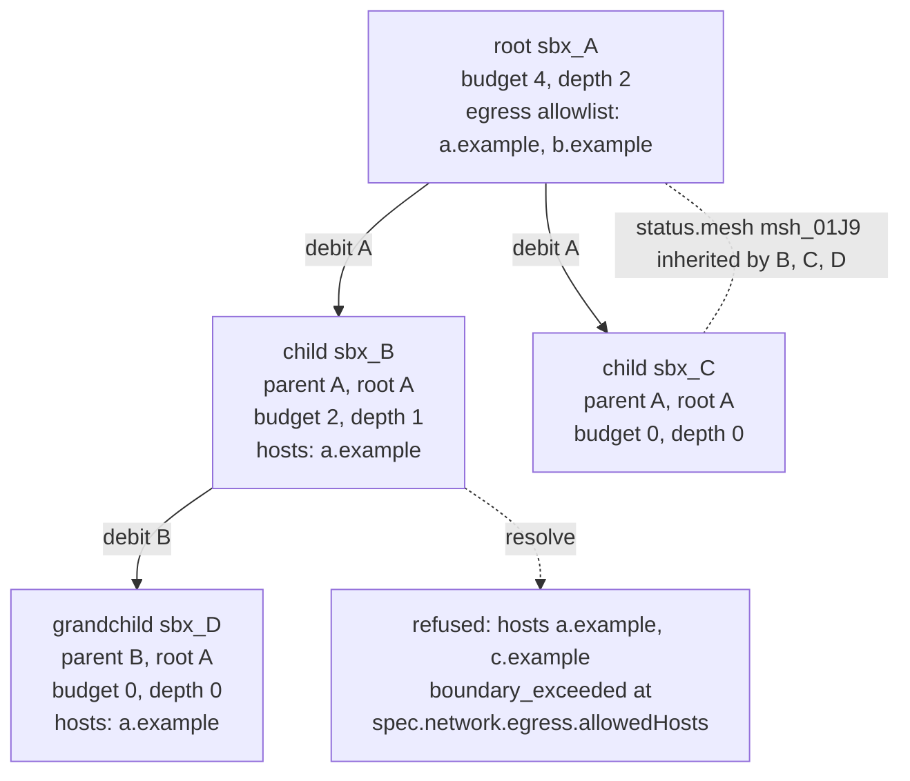

# Mesh and spawn

## Overview

Slice 040 of [[031-hosted-sandbox-consolidation]]. It ports the mesh
identity, the membership and the runtime spawning of
`sandbox/internal/sandbox/mesh` and `sandbox/internal/sandbox/spawn`
into the shape [[022-mesh-and-spawn]] states, and it adds the rule the
manifest contract made possible and the hosted platform never had: the
boundary a root declared bounds every descendant, checked at resolve as
a subset and never negotiated as a policy.

A process inside a sandbox creates further sandboxes with its own
workload token. The control plane treats that apply as a spawn: the
child's resolved manifest is held to the parent's on every boundary
field, the parent's spawn budget is debited in the same store
transaction that writes the child, the child inherits the parent's mesh
and root, and deleting an ancestor deletes the tree below it.

What the hosted product carried and this slice drops: the two-axis
ledger (descendants and compute credits) keyed by root, the mTLS peer
identity and its certificate issue path, the reserve-commit-rollback
handle, and the descendant garbage-collection sweeper that recounted
live pods. [[010-state]] fixes one row per sandbox with a conditional
decrement; [[004-runtime-contract]] fixes the mesh as a driver-owned
network with a `.mesh` zone rather than a mutual-TLS fabric; the
cascade of [[022-mesh-and-spawn]] replaces the sweeper, because desired
state names the tree and no recount is needed.

## Current state

`manifest` has no `mesh` section and no `status.parent`, `.root`,
`.mesh` or `.spawn`. `Options` has no `Parent` and `Resolve` runs six
of its seven stages, stage 6 absent. `internal/auth` mints the `spawn`
claim shape (`auth.Spawn`) and `WorkloadTokens.Mint` leaves it nil with
a comment naming this slice. `internal/store` declares `Ledger` in
[[010-state]]'s prose and neither the accessor nor the table exists;
[[043-postgres-store]] left it as a seam. `controller.Create`
takes no parent, mints no mesh id and debits nothing; its delete acts on
one sandbox. `internal/api` refuses `?root=` with
`capability_unsupported`. `runtime.CreateSpec` has no `Mesh` and
`runtime.State` no `MeshID` or `Parent`; no driver declares the `Mesh`
capability.

## Design

### The spawn tree



Every sandbox carries `status.root` and `status.parent`. A sandbox a
subject applied is its own root and has no parent. A sandbox a workload
applied has that workload's sandbox as `parent` and the parent's `root`
as `root`. Both are written by the controller at create and never
change. `owner` is the root's owner throughout the tree, so a child
differs from a sandbox the owner applied directly only by `parent`.

The budget flows down by subtraction. Write `b(x)` for the resolved
`spec.mesh.spawn.budget` of `x`, `u(x)` for the ledger's count of
children `x` created, and `d(x)` for its `spec.mesh.spawn.depth`. A
spawn from parent `p` to child `c` is admitted only when

```
b(p) - u(p) > 0   and   d(p) > 0
b(c) <= b(p) - u(p) - 1
d(c) <= d(p) - 1
```

The first line is the gate, the second and third the subset rule on the
two spawn fields. `u(p)` counts children created in total, so a deleted
child never returns a unit and the tree's total size is bounded by
`b(root)` at every instant.

### The boundary as a subset

Stage 6 of [[003-manifest-contract]] runs when `Options.Parent` is set,
after semantic validation and before the capability check. Each rule is
a containment, and every violation is `boundary_exceeded` naming its
path. One error names every offending path.

| Rule | Field | Containment |
|---|---|---|
| 1 | `spec.network.egress.mode` | `EgressModeRank(child) >= EgressModeRank(parent)`, the order `open > allowlist > none` |
| 2 | `spec.network.egress.allowedHosts` | every child pattern is covered by some parent pattern under the host rule |
| 2 | `spec.network.egress.deniedHosts` | every parent pattern is present in the child's, since narrowing a deny list adds entries |
| 3 | `spec.secrets[]` | every child mount names a secret the parent mounts |
| 4 | `spec.volumes[]`, `spec.workspace.volume` | no field yet ([[019-volumes]]); the rule lands with the kind |
| 5 | `spec.resources.{cpu,memory,disk}` | the child's parsed quantity does not exceed the parent's |
| 6 | `spec.lifecycle.ttl` | `createdAt + ttl <= Parent.status.expiresAt`; a parent that never expires bounds nothing |
| 7 | `spec.mesh.spawn.{budget,depth}` | the two inequalities above; the gate `d(p) > 0` is refused at `spec.mesh.spawn.depth` |
| 8 | `spec.environment` | equal to the parent's |
| 9 | `spec.mesh.enabled` | unset, since the mesh is inherited |

Rule 2 reads `allowedHosts` as the declared list on both sides. A
secret's hosts join the allow list at stage 4 for parent and child
alike, so a child that passes rule 3 carries no host rule 2 did not
already admit.

Rule 6 needs the wall clock, which is why `Options.Now` exists. A child
that names no `ttl` is defaulted at stage 2 to the lesser of
`Defaults.TTL` and the time from `Now()` to `Parent.status.expiresAt`,
so the common case conforms without the caller computing anything.

### Mesh

A mesh is an `msh_` id and nothing more: no row, no kind. It is the set
of live sandboxes whose `status.mesh` carries the id. The controller
mints the id at the create of a root whose `spec.mesh.enabled` is true;
a child inherits its parent's `status.mesh` whatever the parent's
`enabled` says, and may not set the field. Membership is therefore
`status.mesh`, and `MeshMember` in `manifest` is the one function that
answers it: `spec.mesh.enabled` on a root, a non-empty `status.mesh` on
a child. [[023-computer-use-operations]]'s `expose: mesh` port reads the
same function, so the port rule and the mesh rule cannot disagree.

What each driver enforces, from [[004-runtime-contract]]'s table:

| Driver | Mesh | Mechanism |
|---|---|---|
| podman | yes | one network per mesh, named from the mesh id, with `<sandbox-name>` and `<sandbox-name>.mesh` as the container's aliases on it; the container keeps its default network, so the gateway route is unchanged |
| k8s | yes | one `NetworkPolicy` per mesh admitting ingress from pods carrying the same `mesh` label and no other, and one headless `Service` per mesh; each Pod's `hostname` is the sandbox name and its `subdomain` the Service, so `<name>.<mesh-service>` resolves |
| native | no | the capability is false; `mesh.enabled` is `capability_unsupported` and `status.mesh` stays empty |

The mesh id is not a DNS-1123 label: `msh_01J9ZK...` carries an
underscore and uppercase Crockford digits. One function per driver
package derives the object name, lowercasing and replacing the prefix
separator, and a test holds the result to the label syntax.

A mesh is not a bypass of egress. Traffic to a peer stays inside the
environment and never reaches the gateway; traffic out of any member
still goes through that member's own map. The east-west rule is the
driver's, so `egress` and `internal/egressd` are unchanged by this
slice.

### One spawn

```mermaid
sequenceDiagram
  participant W as workload in sbx_A
  participant API as internal/api
  participant M as manifest.Resolve
  participant C as controller
  participant S as store
  participant D as driver
  W->>API: POST /v1/sandboxes, bearer the projected token
  API->>API: caller.Sandbox() is sbx_A; load A
  API->>M: Resolve with Actor.Workload, Options.Parent = A
  M->>M: stages 1 to 5, then stage 6 against A, then 7
  M-->>API: resolved child, or boundary_exceeded
  API->>API: owner is A's owner; resource carries parent and root
  API->>C: Spawn(child, A, max)
  C->>C: id, name, quota; parent, root and mesh from A
  C->>S: one Tx: debit A against b(A), put the child, append sandbox.created
  S-->>C: ErrBudgetExhausted, or committed
  C->>D: Create with Mesh{ID}
  D-->>C: running
  C->>S: sandbox.spawned on A with the child and the budget left
  C-->>API: the child with status.parent, .root, .mesh, .spawn
```

The debit is inside the transaction that writes the child, which is
what makes two concurrent spawns against one remaining unit yield one
child. Every undo path of the create order credits the parent back: a
gateway that refused the map, a mint that failed, a driver that refused.
A child deleted later credits nothing, because `used` counts children
created in total.

### The ledger

[[010-state]] fixes one row per sandbox with `budget` and `used`, and
`Debit` as `UPDATE ... WHERE used < budget`. This slice puts the budget
where the manifest already keeps it, in desired state, and the ledger
keeps `used` alone:

```go
type Ledger interface {
	// Debit records one child against the parent, atomically, refusing
	// at budget with ErrBudgetExhausted.
	Debit(ctx context.Context, parentID string, budget int) error
	// Credit is the undo of a create that did not complete.
	Credit(ctx context.Context, parentID string) error
	// Used is how many children the parent has created in total.
	Used(ctx context.Context, parentID string) (int, error)
	// Forget drops one sandbox's row.
	Forget(ctx context.Context, parentID string) error
}
```

The budget travels as an argument rather than a column because a root
narrowed after its children exist must take effect at the next debit
with no second write, and because two sources of truth for one number
is a drift the contract does not need. `status.spawn.used` is projected
from `Used` after every debit and credit, so a reader of the status and
the row that gates the next spawn are the same count.

Both stores carry it. The durable store of [[010-state]] runs the
decrement inside `Tx`, in one statement with a `WHERE` on the count. The
single-process snapshot store holds a ledger map in the same document as
the objects, so one `rename` commits the child and the debit together.

### The workload token's claim

`spawn: {budget, depth, mesh}` is the grant at mint, from desired state,
and carries no `used`. The control plane never reads it: every gate is
the ledger and the store's copy of the parent. `Caller.Spawn` exposes
the claim to a caller that wants to know what it was granted without a
round trip, and a token carrying a forged higher budget spawns exactly
as far as the store says.

### Cascade

Deleting a sandbox deletes its descendants deepest generation first,
then the sandbox, each descendant with reason `Parent` and the sandbox
with the request's own reason. The tree is read from desired state by
`status.parent`, so no driver is asked what belongs to what. A
descendant the driver has already lost is forgotten rather than
retried, because the delete of its ancestor is the last word on it.

### A parent narrowed after its children exist

An update of a sandbox with live descendants runs stage 6 again with
the updated sandbox as the parent of each immediate child, and a child
left outside is `boundary_exceeded` naming that child's id in the
message and the offending path in `Path`. The tree is therefore a subset
at every instant, and no child's manifest is rewritten behind its
author.

## Not in this spec

The `Volume` kind and rule 4 ([[019-volumes]]); `network.ports[]` and
`expose: mesh` at the port level ([[023-computer-use-operations]], slice
041), which reads `MeshMember` from here; the `SandboxSet` template as a
parent ([[020-scheduling-and-sets]]); the installation's `*.mesh` DNS
rewrite, which is a cluster concern and not a driver call.

## Acceptance criteria

| Criterion | Test that proves it | State |
|---|---|---|
| Each boundary rule with a field, violated one at a time, is `boundary_exceeded` naming the path; a conforming child passes | `TestBoundaryCheck` in `manifest`, table-driven over thirteen widenings | built |
| Each host list is read under its own mode: a child narrowing from open is not refused for the list it does not carry, and a narrowed mode does not lift the parent's deny list | `TestBoundaryReadsEachListUnderItsOwnMode`, `TestDeniedHostsAreInheritedByTheChild` | built |
| A child that declares no boundary takes its parent's; one that declares one keeps it; one that mounts a secret infers the allowlist the mount asks for | `TestChildInheritsTheParentsBoundary` | built |
| A child that names no `ttl` is cut to the parent's remaining life with its idle stop; one that names a longer `ttl` is refused; an expired parent spawns nothing | `TestChildTTLIsBoundedByTheParent`, `TestChildIdleStopIsCutWithItsLife`, `TestChildOfAnExpiredParentIsRefused`, `TestParentThatNeverExpiresBoundsNoLife` | built |
| A child's absent `spawn` is zero; one asking above the remainder is refused; a parent at `depth: 0` refuses at `spec.mesh.spawn.depth`; a spent budget resolves and is refused at the debit | `TestSpawnFieldsAndDepth`, `TestASpentBudgetIsTheLedgersRefusal` | built |
| `MeshMember` answers membership for a root and for a child; stage 7 refuses `mesh.enabled` where the environment declares no `Mesh`; the field is immutable | `TestMeshMembership`, `TestMeshCapability`, `TestMeshEnabledIsImmutable` | built |
| A workload may lower either spawn axis and may not raise one; its owner may do either | `TestWorkloadCannotRaiseItsOwnBudget` | built |
| `Debit` at one remaining unit under contention yields one success; `Credit` restores it; both adapters agree | `storetest.Run`'s `Ledger` case, eight goroutines over memory and Postgres | built |
| The debit and the child's row commit together: exhaustion writes neither the row nor the record | `TestBridgeSpawnDebitsWithTheChild`, `TestSpawnDebitIsAtomic` | built |
| A child is created with `parent`, `root`, the inherited mesh and the root's owner; a grandchild's parent is its immediate parent | `TestSpawnInheritance`, `TestSpawnMintsAMesh` | built |
| Two concurrent spawns against one remaining unit yield one child and one `spawn_budget_exhausted` | `TestConcurrentSpawnsRaceForTheLastUnit` | built |
| A create that fails after the debit credits the parent back; a deleted child does not | `TestFailedSpawnCreditsBack`, `TestDeletedChildDoesNotCredit` | built |
| Deleting a root deletes every descendant deepest first with reason `Parent`, and the root with the request's reason | `TestCascade`, `TestCascadeOverTheAPI` | built |
| Narrowing a root below a live descendant is `boundary_exceeded` naming the descendant | `TestParentCannotBeNarrowedBelowAChild`, `TestDescendantOutsideBoundary` | built |
| The token's `spawn` claim equals the grant at mint; a forged higher budget does not raise the ledger; a token cellad did not mint carries no grant | `TestTheMintCarriesTheGrantFromDesiredState`, `TestCallerSpawnIsTheGrantAtMint`, `TestClaimsAreTheGrant` | built |
| The authorizer's `workload` member carries the store's tree position and budget, never the claim's | `TestTheWorkloadMemberIsTheStores` | built |
| `sandbox.spawned` is recorded on the parent with the child, the root and the budget left | `TestSpawnedEvent`, `TestBridgeWritesARecordWithItsOwnData` | built |
| `GET /v1/sandboxes?root=` returns the tree and composes with the other selectors | `TestRootQuery` | built |
| A person cannot apply a child: `status` is ignored on apply and the named parent's budget is untouched | `TestOnlyWorkloadsSpawn` | built |
| podman creates one network per mesh and attaches members with a `.mesh` alias; the network ends with the last member; a failed join leaves nothing behind | `TestMeshNetwork`, `TestMeshJoinFailureUndoesTheCreate`, `TestMeshConnectFailureUndoesTheCreate`, `TestMeshNetworkAlreadyGone`, and `TestPodmanMeshOnARealEngine` against an engine | built |
| k8s renders the policy admitting the mesh and nothing else, the headless Service, and each Pod's `hostname` and `subdomain`; both end with the last member | `TestRenderMesh`, `TestMeshPolicyAdmitsTheMeshAndNothingElse`, `TestMeshLifetime`, `TestMeshObjectsAlreadyGone` | built |
| The mesh object's name is a DNS label whatever the mesh id is; the two stamped fields narrow a list | `TestMeshObjectName`, `TestFilterSelectsTheTree` | built |
| native declares no `Mesh` | `TestNativeDeclaresNoMesh` | built |
| The reaper's delete cascades as a request's does, so a deadline on an ancestor ends the tree | `TestADeadlineEndsTheTree` | built |
| A spawn and a mesh root take the slow path rather than adopting a prewarmed entry, because the tree position is create-time identity | `TestATreeNeverAdoptsAnEntry` | built |
| A first member whose mesh objects could not be made leaves neither the sandbox nor the objects | `TestMeshJoinFailureLeavesNoObjects`, `TestMeshJoinFailureUndoesTheCreate` | built |
| A node on native serves a spawn tree end to end: two children, a third refused with `spawn_budget_exhausted`, a grandchild refused at `spec.mesh.spawn.depth`, a child reaching one more host refused with `boundary_exceeded`, and the root's delete taking both children | `TestSpawnTreeEndToEnd` in `cmd/cellad` | built |

## Outcome

Completed on 2026-09-20. `go tool lateregate` passes; the whole tree is green
under `-race`, hermetic and tempdir included. Coverage on the packages this
slice touched: `manifest` 97.4%, `manifest/v1` 100%, `controller` 91.3%,
`internal/store` 91.0% with its adapters at 94.9% and 91.0%, `internal/auth`
95.5%, `internal/api` 91.5%, `runtime` 100%, `runtime/k8s` 92.4%,
`runtime/podman` 93.0%, `cmd/cellad` 91.1%.

`TestSpawnTreeEndToEnd` is the acceptance run: one `cellad serve` on the
native environment with one gateway connected, a root with
`mesh.spawn.budget: 2, depth: 1` and an allow list of one host, a process
inside it reading `$CELLA_TOKEN_FILE` and applying two children through
`POST /v1/sandboxes` with that token, the third refused
`spawn_budget_exhausted`, a grandchild refused `boundary_exceeded` at
`spec.mesh.spawn.depth`, a child asking for a second host refused
`boundary_exceeded` at `spec.network.egress.allowedHosts`, the root's
`status.spawn.used` reading two, `?root=` returning three sandboxes, and the
root's delete leaving none of them. `TestPodmanMeshOnARealEngine` ran against
a live podman machine: the network is created with the first member, both
members carry it, it survives the first delete and is gone after the second.

### What differs from what the specs said

- **The ledger's shape.** [[010-state]] declares `Debit(parentID)`,
  `Credit(parentID)` and `Balance(parentID) (budget, used int, error)` over a
  row holding both numbers. This slice implements `Debit(parentID, budget)`,
  `Credit(parentID)`, `Used(parentID) (int, error)` and `Forget(parentID)`
  over a row holding the count alone. The budget stays in desired state, where
  the manifest already keeps it, so a root narrowed after its children exist
  takes effect at the next debit with no second write and one number has one
  source of truth. [[010-state]]'s `TestLedgerIsAtomic` row is filled by the
  suite's `Ledger` case.
- **Rule 4 has no field.** `spec.volumes[]` and `spec.workspace.volume` arrive
  with [[019-volumes]]; the containment is written in this spec's table and
  has nothing to check yet.
- **A child with no boundary inherits its parent's.** Neither
  [[003-manifest-contract]] nor [[022-mesh-and-spawn]] said what an absent
  `network.egress` resolves to for a child. Left to the open-mode inference,
  every simple child of a narrowed root was refused at rule 1 for a boundary
  nobody wrote. Stage 2 now takes the parent's egress for a child that
  declares none and mounts no secret, which is the rule
  [[003-manifest-contract]] already states for defaulting: an absent field
  takes its default from `Parent`.
- **A spent budget is the ledger's refusal, not the boundary's.** Rule 7's
  containment on `spawn.budget` is read only where a unit remains. A parent
  with none resolves its child and is refused at the debit, which keeps
  `spawn_budget_exhausted` (a race a caller retries) apart from
  `boundary_exceeded` (a manifest a caller rewrites).
- **The k8s Role grew two rules.** The driver now writes a headless Service
  and a NetworkPolicy per mesh, and `Preflight` proves both with an access
  review, so `deploy/base/rbac.yaml` grants `create` and `delete` on
  `services` and on `networking.k8s.io/networkpolicies`. The review now
  carries the API group, which it did not before.

### Left open

- **Two last members deleted at once both leave the mesh's objects.** Each
  sees the other in its own list and neither removes the network or the
  policy and Service. The objects leak; nothing reads them, and the next
  member of a mesh with that id finds them made. A count the driver takes
  under one lock would end it.
- **`NarrowingRefusal` has no caller.** The rule is built and tested; the
  route that would run it is the `PUT` of a sandbox [[008-api]] has yet to
  serve.
- **A sandbox written before this slice has no `status.root`.** `?root=` and
  the `root` field of an authorizer request skip it, because the field is
  written at create and a stored object is never rewritten.

- **A workload cannot mount a secret over the API.** Rule 3 is proven in
  `manifest` against a lookup; through the API the mount decision reaches
  `workloadDecision`, whose default is `not_its_own`, so a child mounts
  nothing even where its parent mounts it. The fix belongs in the API's secret
  lookup: for a workload actor, answer from `Parent.Spec.Secrets` by name
  rather than asking the authorizer, since the parent's own mount was already
  decided.
- **A workload's list pages the tree by asking per row.** [[006-identity]]
  narrows a sandbox's `list` to its descendants, and the API does that with
  one `sandbox.read` decision per row rather than by selecting the tree. The
  output is right and the cost is quadratic in the page.
- **The mesh policy admits peers and the control plane's own pods are not in
  it.** Nothing in this contract dials a member's port from `cellad`: exec,
  logs and files go through the API server. A capability that dials a Pod
  directly ([[004-runtime-contract]]'s `Dial`) needs a second `from` on the
  policy.
