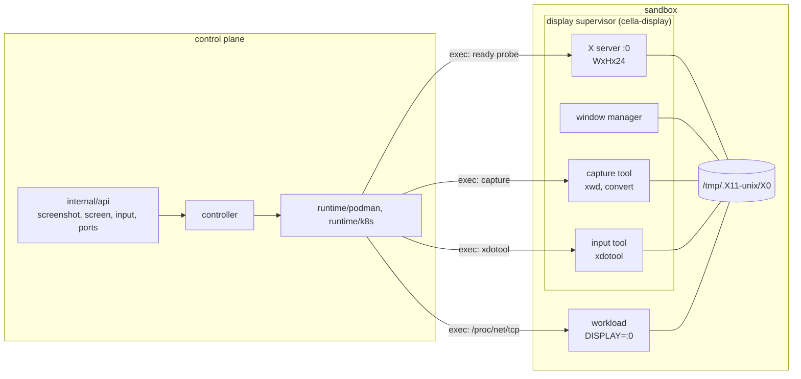

# Display and input

## Overview

Slice 041 of [[031-hosted-sandbox-consolidation]]. It ports
`sandbox/internal/runtime/guidisplay` and
`sandbox/internal/kernel/inputaction` into the `Display` and `Input`
capabilities of [[004-runtime-contract]] and the computer-use
operations of [[023-computer-use-operations]]. After it, a sandbox that
asks for `spec.display` runs a virtual desktop, answers a screenshot,
streams its screen, accepts a batch of pointer and keyboard events, and
reports which of its declared ports something is listening on.

Three things cross from the source: the action vocabulary and the
argument list each action expands to, the keysym rule that keeps a
leading `-` out of the input tool's argument vector, and the supervisor
that brings the X server, the window manager and the capture tool up and
restarts each one that exits. Three do not. The remote framebuffer
protocol, its per-session passwords and the byte relay that carried it:
[[008-api]] fixes the screen stream as encoded frames over a WebSocket,
so the desktop has no network listener and the control plane holds no
display credential. The screenshot cache, which exists in the source to
collapse a poll loop onto one capture per window while a password-bearing
warm-up runs; without the warm-up a capture is one command and the cache
is state with no reader. The warm-credentials manager, for the same
reason.

## Current state

`runtime` has no display, input, dial or port type. `manifest` accepts
neither `spec.display` nor `spec.network.ports[]`. No driver declares
`Display`, `Input` or `Dial`; `runtime.State` carries neither conditions
nor ports, so `DisplayReady` has a constant in `manifest/v1` and no
writer. `internal/api` serves the file, log, exec and attach routes of
[[033-file-operations]] and [[034-terminal-attach]] and none of the four
operations here. `internal/events` names `sandbox.exec` and
`sandbox.files` and neither `sandbox.screenshot`, `sandbox.input` nor
`sandbox.screen`.

## Design

### The desktop beside the workload

The desktop is the X server, the window manager and the two tools. Every
operation reaches it the same way: one command run inside the sandbox,
through the driver's own execution seam. The desktop has no listener and
the control plane dials nothing, so an environment that provides a
desktop provides no new way in.

Placement follows [[023-computer-use-operations]]. On k8s the desktop is
a second container in the Pod from the `cella-display` image of
[[014-release-and-installation]], and `/tmp` is one `emptyDir` both
containers mount, which is the writable mount the baseline of
[[004-runtime-contract]] already grants; the X socket under
`/tmp/.X11-unix` is therefore shared without host IPC and without a
shared process namespace. On podman the desktop is a second process in
the sandbox's own container, so the sandbox's image carries the tools;
`cella-display` is that image for a desktop sandbox. Native has no
desktop: it runs host processes under no display server, declares
`Display` and `Input` false, and implements neither interface.

The desktop is rebuilt at every `Start`, because it lives in the process
tree a `Stop` ends. The start script is idempotent: it exits when the pid
file names a live supervisor, so `Create`, `Start` and a repeated call
converge on one supervisor.

### Readiness

`DisplayReady` is the driver's condition, written when the X socket
accepts a connection and the window manager has registered. The ready
command is one line: `xdpyinfo` against `:0` succeeds and
`xprop -root _NET_SUPPORTING_WM_CHECK` names a window. On k8s the command
is the display container's `readinessProbe`, so the condition is read off
`pod.status.containerStatuses` at every `Inspect` and every `List` with
no command run by the control plane. On podman there is no probe seam in
the engine, so the driver runs the command at `Inspect` and only for a
running sandbox whose record declares a display; `List` never probes,
because a sweep of every sandbox is the reaper's path and a command per
sandbox per tick is a cost the reaper must not carry.

### Types

`runtime/display` holds the vocabulary, its validation and the argument
lists it expands to, and `runtime` aliases the four types, so a driver
validates against one implementation and the API and the drivers name one
type. The package imports the standard library alone.

| Type | Fields |
|---|---|
| `Geometry` | `Width`, `Height` int |
| `ScreenshotRequest` | `Format` (`png`, `jpeg`), `Scale` (0.1 to 1.0) |
| `Frame` | `At` time, `Format`, `Data []byte` |
| `InputEvent` | `Type`, `X`, `Y`, `ToX`, `ToY *int`, `Button`, `Modifiers []string`, `Key`, `Text`, `Direction`, `Amount`, `Ms` |

The four coordinates are `*int` where
[[023-computer-use-operations]]'s table writes int. `x` and `y` are
optional on a click and on a press, where absent means at the pointer,
and an explicit 0 is the left or top edge of the desktop. An int cannot
hold that difference, and reading a click at the corner as a click where
the pointer already is loses events no caller can express another way.
The JSON shape is unchanged: an absent field decodes to nil.

Validation runs over the whole batch before anything executes, and every
refusal names `events[i].<field>`:

| Rule | Path |
|---|---|
| a batch above 256 events | `events` |
| an unknown or empty type | `events[i].type` |
| a missing required coordinate, or one outside the geometry | `events[i].x`, `.y`, `.toX`, `.toY` |
| a button outside `left`, `middle`, `right` | `events[i].button` |
| a modifier outside `ctrl`, `alt`, `shift`, `super` | `events[i].modifiers` |
| a direction outside `up`, `down`, `left`, `right` | `events[i].direction` |
| an amount outside 1 to 50 | `events[i].amount` |
| a key that does not match `^[A-Za-z0-9_]+$` | `events[i].key` |
| empty text, or text above 1 KiB | `events[i].text` |
| a wait outside 1 to 10000 ms, or a batch whose waits exceed 60 s | `events[i].ms` |

The keysym rule is the source's, narrowed: the source admitted a chord
(`ctrl+c`) in the key field, and this contract carries the modifiers in
their own field, so `+` is not a keysym byte. What both rules keep out is
the same: a value that begins with `-`, which the input tool would read
as a flag of its own.

### The four operations

| Operation | Driver call | Inside the sandbox |
|---|---|---|
| geometry and readiness | `Display(ctx, id) (Geometry, error)` | nothing; the geometry is the persisted spec's and the readiness is the condition |
| screenshot | `Screenshot(ctx, id, ScreenshotRequest) (io.ReadCloser, error)` | one capture piped through the encoder at the requested format and scale |
| screen | `Screen(ctx, id, fps int, format string) (<-chan Frame, error)` | one command for the whole stream |
| input | `Input(ctx, id, []InputEvent) error` | one input-tool command per argument list, in order |

The screen stream is one command, not one command per frame. A stream at
10 frames a second over a command each would be ten round trips a second
against the engine or the API server for as long as a person watches. The
command instead loops inside the sandbox: capture, write the frame length
as eight hexadecimal digits, write the frame, sleep the remainder of the
interval. The driver reads length-prefixed frames off the command's
output and sends each on a channel of capacity one with a non-blocking
send, so a consumer a frame behind loses the newest frame and never
queues, which is what [[023-computer-use-operations]] asks for. The
channel closes when the command ends, which a `Stop` causes, and the API
turns that into a close with code 1000.

An operation on a sandbox whose desktop is not ready is an error naming
`DisplayReady`, not a bring-up. The source warmed the desktop on first
use because the desktop's password had to be minted before a viewer could
attach; here the desktop is started by the lifecycle and a caller that
arrives early is told what it is waiting for.

### Ports

`spec.network.ports[]` is `{name, port, expose}` under the rules of
[[003-manifest-contract]]: a DNS-1123 label unique in the list, a port of
1 to 65535 unique in the list, and an `expose` of `none`, `mesh` or
`public`. All three are accepted by the schema as [[003-manifest-contract]]
states them; `mesh` needs the `Mesh` capability of
[[022-mesh-and-spawn]] and `public` the `Ingress` capability an
`Exposer` decorator of [[004-runtime-contract]] provides, and no driver
of this repository declares either, so both are
`capability_unsupported` at resolve today. The
refusal is the ordinary capability row, not a special case: the day a
driver declares `Mesh`, `expose: mesh` resolves with no change here.

`status.ports[]` is `{name, port, state}`, where `state` is `listening`
or `closed`, probed by the driver at `Inspect` and at nothing else. The
probe is one command that reads `/proc/net/tcp` and `/proc/net/tcp6`; the
driver parses the hexadecimal local port of every row whose state is
`0A`, which is `TCP_LISTEN`, and reports a declared port found there as
`listening`. Reading the kernel's own table is the only probe that
answers for a port bound on any address without opening a connection to
the workload.

### The routes

| Method | Path | Answer | Action |
|---|---|---|---|
| `GET` | `/v1/sandboxes/{id}/display` | `{width, height, ready}`; `not_found` without a display | `sandbox.read` |
| `GET` | `/v1/sandboxes/{id}/screenshot?format=&scale=` | `image/png` or `image/jpeg` | `sandbox.exec` |
| `GET` | `/v1/sandboxes/{id}/screen?fps=&format=` | a WebSocket, `cella.screen.v1`, binary frames | `sandbox.exec` |
| `POST` | `/v1/sandboxes/{id}/input` | `{"executed": n}` or `{"executed": n, "failed": {...}}` | `sandbox.exec` |
| `GET` | `/v1/sandboxes/{id}/ports` | `{"items": [{name, port, state}]}` | `sandbox.read` |

An environment that declares no `Display` answers 422
`capability_unsupported` on the first four before any driver call, and
`input` needs `Input` as well. The input body is capped at 1 MiB, its own
bound and not the manifest's, because
[[023-computer-use-operations]] requires a batch of 256 one-KiB events to
fit; a body above it is 413 `body_too_large` before validation. Each of
the five stamps activity through `Controller.Touch`.

`sandbox.screenshot {width, height, format}`, `sandbox.input {events: n}`
and `sandbox.screen {durationMs, bytesIn, bytesOut}` are the records
[[009-events]] names. No record holds a frame, a byte of a frame, a key
or a character of typed text.

### The image

`images/display/Dockerfile` builds `cella-display`: a Debian base, the X
server, the window manager, the capture and encoding tools, the input
tool, a browser for the browser-ready manifest of
[[023-computer-use-operations]], a non-root user, and the start and ready
scripts the drivers run. The image carries no registry coordinate of its
own; [[014-release-and-installation]] derives the namespace from the
repository owner at release. The k8s driver takes the reference as an
option and refuses a desktop when the operator named none, because a
default reference is a coordinate.

## Not in this slice

The HTTP port proxy and the dial WebSocket of [[008-api]]: both need
`Dialer`, which no driver implements here. The `Dialer` interface is
declared so a driver that gains one implements the contract's own type,
and `Dial` stays false everywhere.

`expose: public` and the `Exposer` decorator's URL; `expose: mesh` and
the mesh name, which is slice 040's.

The `vm` driver's guest agent, which is [[024-vm-driver]]'s.

## Acceptance criteria

| Criterion | Test that proves it | State |
|---|---|---|
| Every rule of the validation table refuses with the `events[i].<field>` path; 256 events pass and 257 do not; waits above 60 s in total are refused; a key with `+`, a leading `-` or a space is refused | `TestValidate`, table-driven | not built |
| Every event type expands to the argument lists the desktop's input tool takes, modifiers held around a click, a scroll as wheel buttons 4 to 7 | `TestArgv`, table-driven | not built |
| A podman sandbox with `spec.display` renders the display container spec the golden records, starts the supervisor once per `Start`, and reports `DisplayReady` from the ready command | `TestDisplayLifecycle`, `TestDisplayGolden` | not built |
| A k8s Pod with `spec.display` carries the display container, the shared `/tmp`, the geometry, the ready probe and the hardened context, and no display container without it | `TestPodWithDisplay`, golden | not built |
| `DisplayReady` reaches `status.conditions` and the probe reaches `status.ports[].state` | `TestRefreshCarriesDisplayAndPorts` | not built |
| A screenshot is the capture command's output, at the requested format and scale; a stopped or not-ready desktop is an error naming the condition | `TestScreenshot` | not built |
| The screen stream reads length-prefixed frames off one command and drops the newest frame for a consumer that is behind | `TestScreenFrames`, `TestScreenDropsForASlowReader` | not built |
| A driver failure at event 5 of 10 answers 200 with `executed: 4` and the index | `TestInputPartialFailure` | not built |
| The ports probe reads the kernel table and reports a declared port as listening or closed | `TestPortsProbe` | not built |
| The four routes authorize as their row says, answer `capability_unsupported` on an environment without the capability before any driver call, and stamp activity | `TestDisplayRoutes`, `TestDisplayCapabilityGate` | not built |
| An input body above 1 MiB is `body_too_large` before validation | `TestInputBodyCap` | not built |
| `spec.display` and `spec.network.ports[]` validate per 003, are immutable, and `expose: mesh` and `expose: public` are `capability_unsupported` | `TestDisplayFields`, `TestPortFields` | not built |
| A declared `Display` serves a screenshot of the declared geometry, `Input` accepts a click and refuses one outside it, and `Ports` reports a port a process bound | `runtimetest` `DisplayScreenshot`, `InputAcceptsAndRefuses`, `PortsReportListening` | not built |
| Native declares no `Display`, no `Input` and no `Dial`, and implements none of the three interfaces | `TestNativeHasNoDisplay` | not built |
| No record holds a frame, a key or typed text | `TestOperationRecordsCarryNoContent` | not built |

## Outcome

Built. The desktop, the screenshot, the screen stream, the input batch and
the port probe are in the tree, on podman and on k8s, with the API routes,
the manifest fields, the events and the conformance cases.

### What the slice holds

`runtime/display` is the vocabulary and the commands: the four types, the
rule table, the argument lists an event expands to, the supervisor, and the
capture, stream, readiness and socket-table scripts. `runtime` aliases the
types and declares `DisplayDriver`, `InputDriver` and `Dialer`, with
`CreateSpec.Display`, `CreateSpec.Ports`, `State.Ports` and
`State.Conditions`. `runtime/podman` runs the desktop as a second process in
the sandbox's container, started at create and at every start;
`runtime/k8s` runs it as a second container from the operator's display
image, sharing the workload's `/tmp` and carrying the readiness probe.
`runtime/native` declares none of the three and implements none of them.
`internal/api` serves the five routes with the `Display` and `Input` gates
and the 1 MiB input cap. `manifest` takes `spec.display` and
`spec.network.ports[]`, holds both to the field table of
[[003-manifest-contract]], makes both immutable, and refuses them against an
environment that cannot serve them. `images/display/Dockerfile` builds the
image, and the supervisor it bakes in is the file the Go package embeds, so
the desktop both drivers bring up is one desktop.

### The display protocol

Encoded frames over a WebSocket, not a remote framebuffer. The hosted source
ran an X11 VNC server and a WebSocket bridge inside the sandbox and relayed
the raw protocol out through an exec'd TCP relay, with a per-session password
written into the sandbox and held by the control plane. [[008-api]] fixes the
screen stream as binary frames on `cella.screen.v1` instead, so none of that
is ported: the desktop opens no listener, the control plane holds no display
credential, and the frames a caller reads are the frames a screenshot would
have answered. One command serves a whole session, because a command per
frame is ten calls a second into the container engine or the cluster's API
server for as long as somebody watches.

### What the real engine found

`podman build -f images/display/Dockerfile` produced a 502 MB arm64 image
without the browser in about four minutes, and the whole of
`TestPodmanConformance` then ran against podman 5.7.1 on a rootless macOS
machine with `CELLA_TEST_DISPLAY_IMAGE` naming it: thirty cases, the four
new ones included, in 28.6 seconds. A real desktop comes up inside a
sandbox in about a second, `Display` reports the declared geometry, a
screenshot decodes as an 800 by 600 PNG and a half-scale one as a 400 wide
JPEG, a frame arrives off the stream, a move, a click, a keysym and typed
text run through the input tool without error, a click off the screen is
refused, and a `nc` listener reads `listening` beside a declared port that
reads `closed`. What the desktop then shows is not asserted, which is the
partial row of [[023-computer-use-operations]].

The first run found a defect no fake could: the install command joined its
lines with semicolons, and a shell reads a semicolon after a background
command as a syntax error, so the supervisor never started and
`DisplayReady` stayed false for the whole ninety-second budget. The scripts
now join by newline, which is the one change the real engine forced.

### Coverage

`runtime/display` 96.9%, `runtime/runtimetest` 98.2%, `runtime/podman`
93.5%, `runtime/k8s` 93.4%, `controller` 93.5%, `internal/api` 90.9%,
`manifest` 97.6%, `manifest/v1` 100%. The whole bar passes, the race,
hermetic, tempdir and coverage runs included, and every one of the 23
measured packages clears 90%.

### Two rules the port changed

The hosted input code pressed the modifiers around a click and then passed
the input tool's clear-modifiers flag to the click itself, which releases
the keys the command before it pressed, so a chorded click never reached the
desktop chorded. A click held under modifiers now carries no such flag, and
`TestArgvHoldsModifiersAroundAClick` pins it.

The Pod's own readiness condition is no longer what makes a sandbox
`Running`. A Pod carrying a desktop is not Ready until the desktop is, and a
sandbox whose desktop has not come up is a running sandbox with
`DisplayReady` false, never one stuck at `Starting` until the create's
budget runs out. The workload container's readiness is the sandbox's, and a
Pod whose container statuses are not written yet still falls back to the Pod
condition.

### Left open

1. The HTTP port proxy and the dial socket of [[008-api]]. Both need
   `Dialer`, which this slice declares and no driver implements. The
   acceptance rows of [[023-computer-use-operations]] for the proxy stay
   not built and name the reason.
2. `expose: mesh` and `expose: public` resolve to `capability_unsupported`,
   because no driver declares `Mesh` and no `Exposer` is installed. The
   refusal is the ordinary capability row, so the day one is declared the
   field resolves with no change here.
3. The k8s display image has no configuration variable yet:
   `Options.DisplayImage` is set by a caller and `internal/config` reads no
   variable for it, so a deployment cannot name the image without one. The
   variable belongs with the rest of the driver's configuration table.
4. The gesture row of [[023-computer-use-operations]] is partial: every
   event type expands to the commands the input tool takes, and no case
   asserts what the desktop then shows. That needs a frame comparison
   against a desktop with something on it, which the browser-ready example
   of that spec is the natural place for.
5. `docs/examples/browser.yaml` and the `case023BrowserReady` conformance
   scenario are not built, and the image was built and run without the
   browser, so the browser-ready manifest has not been exercised.
6. A podman `Create` of a sandbox whose image carries no desktop succeeds
   and leaves `DisplayReady` false: the bring-up is logged and not returned,
   because a running sandbox with no screen is the honest state and a failed
   create would throw the workload away with it. Anything that needs the
   desktop up, a pool entry of [[020-scheduling-and-sets]] among them, waits
   on the condition and not on the create.
7. A screen session ends itself after an hour, which the API closes with the
   same 1000 a stop causes, so a client cannot tell the bound from the
   sandbox stopping. The bound exists because a container engine cannot end
   an exec session it started; a close reason that names it would need a
   frame the design does not have.
