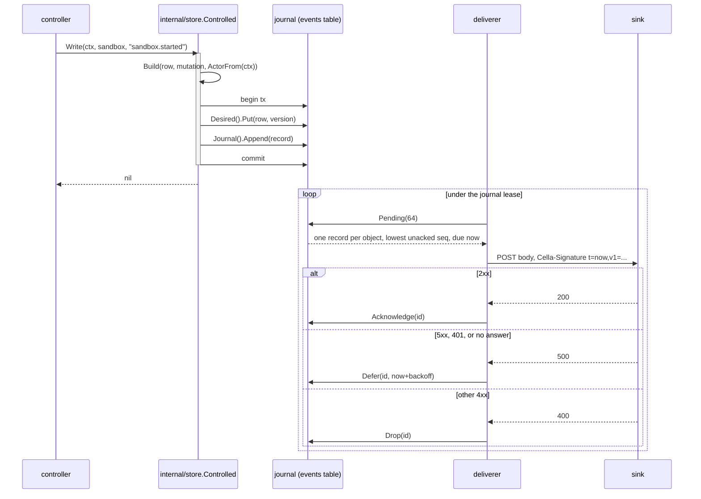

# Events

## Overview

Slice 042 of [[031-hosted-sandbox-consolidation]] ports the hosted
sandbox's audit pipeline into the record and the delivery contract of
[[009-events]]. One signed record per mutation and per operation reaches
the sink the operator names, at least once, in `seq` order per object,
and carries no content.

The hosted source is `internal/platform/audit`, `audit/schema` and
`internal/pkg/auditscan`. What is ported: the envelope, the redaction,
the ordering, the at-least-once delivery with a dedupe key, the retry
backoff, and the drop bound. What is not: the S3 day-partition layout,
the activity and usage folds derived from it, and the two payload fields
that carried content, `ExecPayload.Argv` and `ExecPayload.StdoutTail`.
Those two are the reason the canary test of [[009-events]] exists, and
this slice drops them rather than redacting them.

The journal of [[010-state]] is already built ([[043-postgres-store]]):
`Append`, `ByObject` and `Prune`, with `attempts`, `next_attempt_at` and
`acked_at` on the row and no statement reading them. This slice fills
the delivery half named there, `Pending`, `Acknowledge`, `Defer` and
`Drop`, and adds the one column the retry bound needs.

The sink already exists on the other side. The platform built it against
[[009-events]] before this repository emitted a record, so the wire is
not negotiable here: the four findings recorded in
[[031-hosted-sandbox-consolidation]] are requirements, and where
[[009-events]] disagrees it is amended.

## Current state

`controller` appends one journal row per act it takes, typed with the
`Mutation*` names of `controller/store.go`, with the sandbox's status as
the payload. Nothing reads those rows but a test. There is no record
type, no signature, no sink, and no delivery loop. `internal/api` writes
an `X-Request-ID` header on every response and nothing carries it
further.

## Design

### The record

The wire shape is what the sink decodes. Fields are flat: `subject`,
`workload` and `requestId` are not nested under an actor.

```go
type Record struct {
	ID        string          `json:"id"`        // evt_ and 26 characters
	Seq       int64           `json:"seq"`       // the journal's, per object
	Type      Type            `json:"type"`      // the closed enum
	Time      time.Time       `json:"time"`
	Object    Object          `json:"object"`
	Sandbox   *Object         `json:"sandbox,omitempty"`
	Subject   string          `json:"subject"`
	Workload  *Workload       `json:"workload,omitempty"`
	RequestID string          `json:"requestId"`
	Reason    Reason          `json:"reason,omitempty"`
	Data      json.RawMessage `json:"data,omitempty"`
}

type Object struct {
	Kind   string            `json:"kind"`
	ID     string            `json:"id"`
	Name   string            `json:"name"`
	Owner  string            `json:"owner"`
	Labels map[string]string `json:"labels,omitempty"`
}

type Workload struct {
	ID string `json:"id"` // sbx_ of the sandbox whose token made the call
}
```

Three amendments to [[009-events]] land with this slice.

`Object.Labels` and the sandbox's labels are on the record. The sink
files a record under the tenant an object's labels name and under
nothing else, so a record without them belongs to no tenant. `Labels` is
omitted when the object carries none, which a reader of the map handles
without a branch.

`Seq` is on every record, operations included. The journal assigns it
per object, so an operation on a sandbox takes the next sequence of that
sandbox and the per-object feed and the usage fold read one order.

`Workload` is `{id}`, not the `v1.WorkloadRef` of [[009-events]]. That
type arrives with the tokens of slice 045; until then the one fact the
record has is the sandbox id a workload token names, and the object
shape leaves room for the rest of the reference without a wire break.

### The types this slice emits

| Type | Emitted by | `data` | `reason` |
|---|---|---|---|
| `sandbox.created` | `controller.Create`, on the accepted intent | the resolved manifest, `spec.env` reduced to its keys | none |
| `sandbox.started` | `controller.Act` start, and the first driver read after a create that came up running | `{phase}` | `Request` |
| `sandbox.stopped` | `controller.Act` stop, `stopLocked` | `{phase}` | `Request`, `AutoStop`, `Expired` |
| `sandbox.deleted` | `controller.forget` | `{phase}` | `Request`, `AutoDelete`, `Expired`, `Lost` |
| `sandbox.failed` | `controller.Create` on a driver failure, recovery exhaustion | `{phase}` | `CreateFailed`, `RecoveryExhausted` |
| `sandbox.lost` | the lost rule of [[037-lifecycle-enforcement]] | `{phase}` | `Lost` |
| `sandbox.recovering` | a recreation beginning | `{phase}` | `Lost` |
| `sandbox.recovered` | a recreation that succeeded | `{phase}` | none |
| `sandbox.updated` | an update applied | `{paths}` | none |
| `sandbox.exec` | `internal/api` exec | `{exitCode, durationMs}` | none |
| `sandbox.files` | `internal/api` files | `{direction, paths, bytes}` | none |

`sandbox.recovering` and `sandbox.recovered` are already named by
[[009-events]]; `sandbox.failed` and `sandbox.lost` are its terminal
transitions. Each carries the phase it reached, which is the shape every
transition shares. [[009-events]] gives `sandbox.recovered` a
`{workspace, volumes}` data instead; neither fact exists until volumes
land ([[019-volumes]]), so the phase is what this slice carries and the
row is filled by the slice that has the rest.

`sandbox.updated` is in the vocabulary and has no caller: no route
applies an update to a `Sandbox` yet ([[008-api]]). Its `{paths}` data
arrives with that route, because the paths an apply changed are the
route's to name and nothing else in this slice knows them.

A driver names failures the enum does not have: the native backend
writes `ProcessUnrecoverable` and `LogWriteFailed`. The enum is closed,
so a reason outside it becomes `DriverFailed` on a terminal transition
and is dropped on one that is not, and the sandbox's own status keeps
the driver's word for it.

No `sandbox.logs` type exists. Reading a process's output is a read, and
[[009-events]] lists no type for it, so `internal/api` emits none.

A create is two records where the driver brings the sandbox up at once:
`sandbox.created` on the accepted intent, and `sandbox.started` on the
first driver read that finds it running. The sink's usage fold opens its
interval on `sandbox.started` and closes it on a terminal transition, so
a sandbox that ran from creation and never said it started would meter
as never having run. A driver that comes up asynchronously reports
`Pending` at that read and writes a status row instead; the record that
says it started waits on the loop that observes a phase change, which no
spec of this repository builds yet.

The controller writes journal rows for two acts that are not events:
`sandbox.deleting`, the intent written before the driver is asked, and
`sandbox.status`, the status the controller writes back after a driver
read. [[010-state]] wants one row per mutation, so both are appended and
both are stored acknowledged, which is what keeps them out of `Pending`
forever rather than relying on a filter in the delivery loop.

### What an event never carries

The exec record carries an exit code and a duration and no command. This
departs from [[009-events]]'s table, which names `command: []string`,
and [[009-events]] is amended. A command line is where a secret reaches
a process: the hosted pipeline carried `Argv` and a 16 KiB
`StdoutTail`, and the scan that proved no secret value reached a record
existed because of them. A record that never holds the string needs no
scan to prove it.

The file record carries the direction, the workspace paths and the byte
count, and no file content. `audit.RedactJSON` of `latere.ai/x/pkg`
runs over every `data` before it is stored, behind the structural rule,
which is [[009-events]]'s second line.

### Where the record is written



A record commits with the mutation that produced it. `Controlled.Write`
already opens one transaction for the conditional write and the journal
append; the record is built inside it, from the row it is writing, the
mutation's name, and the actor the context carries. `Controlled.Remove`
reads the row inside the same transaction before it deletes, so
`sandbox.deleted` carries the labels, name, owner and reason of an
object that no longer exists when the transaction ends.

Where no transactional store is configured, `cellad` runs on the local
file snapshot of [[026-direct-control-plane]], which has no journal at
all. There the controller's `Events` option is the seam: `persist` and
`forget` hand the act to the emitter after a successful save, and the
emitter appends to a memory store opened for the journal alone. One
process, one writer, one in-process ring; the start-up line already says
the snapshot is not durable, and an unacknowledged record is lost at
process end the same way desired state's recovery is.

The two paths share one builder and one deliverer. They never both run:
the option is set only where the store is not the journal.

An operation has no mutation and no transaction of its own.
`internal/api` emits through one helper, `h.emit`, which builds the
record from the sandbox it authorized and appends it in a transaction
holding nothing else.

### The actor

`internal/events` carries the actor on the context.
`api.ServeHTTP` calls `WithActor` once per request with the caller's
rendered subject, the sandbox id where the bearer is a workload token
([[006-identity]]), and the `X-Request-ID` it just wrote. Every mutation
below a request reads it through the context the handler already passes
down. The reaper and the recovery loop run under no request, and a
record they produce carries the subject `controller` and an empty
`requestId`.

A terminal transition with no reason on the object and an actor that is
not the controller took `Request`: a person asked for it. The controller
writes no reason for an act it was told to make, and the enum of
[[009-events]] has one value for that act.

### The journal's delivery half

`store.Journal` gains four methods, and `store.Event` gains the three
delivery columns already in the schema plus one.

```go
Pending(ctx context.Context, limit int) ([]Event, error)
Acknowledge(ctx context.Context, id string) error
Defer(ctx context.Context, id string, next time.Time) error
Drop(ctx context.Context, id string) error
```

`dropped_at` is a new column, migration `000002`. [[010-state]] says
`Prune` applies retention to acknowledged or dropped rows, which needs
the two to be distinguishable; overloading `acked_at` would report a
record the sink never took as one it did.

`Pending` picks the lowest unacknowledged, undropped `seq` of each
object first and filters by `next_attempt_at` after, never the other way
around. Filtering first lets `seq 2` overtake a deferred `seq 1` and
breaks the one ordering guarantee the contract makes. In Postgres that
is `distinct on (object_id) ... order by object_id, seq` in a subquery
with the due filter outside it.

### The body and its signature

The journal row is the record: `id`, `seq`, `type` and `at` are columns
and the rest is the payload. The body is rebuilt from both on every
read, by one function, so the per-object feed and the wire agree byte
for byte and a retry days later signs the same bytes. `seq` is not in
the stored payload, because the journal assigns it as the row is
written.

```
Cella-Signature: t=<unix seconds of this attempt>,v1=<hex>[,v1=<hex>]
```

Each `v1` is the hex HMAC-SHA256 of `<t>.<body>` under one half of
`CELLA_EVENTS_SECRET`, in the order the variable lists them. `t` is the
attempt's clock, not the record's `time`, and is recomputed on every
attempt, so a record deferred for a day still arrives inside the sink's
five minute freshness window. No `Authorization` header is sent: the
signature is the credential, and a second one would be a second secret
to rotate.

### Delivery

A 2xx is `Acknowledge`. A 5xx, a connection failure or a timeout is
`Defer` with exponential backoff from 1 second, doubling per attempt, to
5 minutes.

A 401 is `Defer`, not `Drop`. [[009-events]] says every 4xx but a
retryable one drops at once, on the ground that a sink refusing these
bytes refuses them tomorrow. A 401 is the one 4xx that says nothing
about the bytes: it says the two ends hold different secrets, which is a
configuration fault an operator repairs, and dropping would discard
every record emitted during a botched rotation. It is deferred with the
same backoff and logged at error with the sink's host, so the fault is
loud and no record is lost to it. [[009-events]] is amended to name the
exception.

Every other 4xx is `Drop` at once. A record still unacknowledged
`CELLA_EVENTS_RETRY_WINDOW` after its time is `Drop`ped, counted, and
named in a log line.

Delivery runs on the replica holding the `journal` lease of
[[010-state]], which is the name that spec enumerates. One pass takes
`Pending` in batches of 64, at most one record per object, and delivers
up to 16 objects concurrently, so a slow object holds only its own
successors. With Postgres a restart resumes from the row; without, the
memory journal loses what it had not delivered.

### Configuration

| Variable | Default | Meaning |
|---|---|---|
| `CELLA_EVENTS_URL` | unset | the sink; unset turns delivery off and records are still journaled |
| `CELLA_EVENTS_SECRET` | unset | one secret or two separated by a comma; the first is required |
| `CELLA_EVENTS_TIMEOUT` | `10s` | one delivery attempt's deadline |
| `CELLA_EVENTS_RETRY_WINDOW` | `24h` | how long a record is retried before it is dropped |
| `CELLA_EVENTS_INSECURE_SINK` | unset | `1` admits a non-loopback `http://` sink; the stubs set it and no deployment does |

A URL without a secret is a start-up failure, and so is a non-loopback
`http://` URL without the escape hatch. A secret without a URL is a
start-up failure too: it is a deployment that believes it delivers.

## Not in this spec

`GET /v1/events` and `GET /v1/sandboxes/{id}/events` ([[008-api]]): the
journal already serves `ByObject` and the routes need the envelope and
the follow stream, which [[008-api]] owns. The types of
[[018-egress-and-secrets]], [[019-volumes]], [[020-scheduling-and-sets]],
[[021-data-plane-workers]], [[022-mesh-and-spawn]] and
[[023-computer-use-operations]], and the cross-spec test that reads every
spec for its emission points: each waits on the slice that emits it. The
metrics names of [[017-observability]]: the deliverer counts drops and
delivery and exports the counts on its own type until that spec lands.
`CELLA_JOURNAL_CAP` on the memory journal's ring ([[010-state]]).

## Acceptance criteria

| Criterion | Test that proves it | State |
|---|---|---|
| Every type this slice emits produces the record shape of the table above, with the object's labels, a reason from the enum on every terminal transition, and no content | `TestRecordShapes` over golden JSON per type | built |
| The header verifies against a verifier that mirrors the platform sink's, for each of two secrets, with a fresh `t` per attempt, and a body changed by one byte does not verify | `TestSignatureVerifies`, `TestSignatureRejects` | built |
| A record commits with the mutation that produced it and is rolled back with it | `TestRecordCommitsWithTheMutation` | built |
| One object's records are delivered in `seq` order, a deferred record holds its successors and no other object's, and concurrent mutations on many objects interleave without reordering any one | `TestDeliveryIsOrderedPerObject`, `TestOrderUnderConcurrentMutations` | built |
| A sink that fails and then succeeds receives every record exactly once in order; a 400 drops at once; a 401 defers and logs; a record past the retry window drops and is counted | `TestDeliveryRetries`, `TestDropRules` under a fake clock | built |
| Delivery runs only on the lease holder | `TestDeliveryNeedsTheLease` | built |
| A canary command string, a canary file body and a secret-shaped value reach no record across an end-to-end run | `TestNoContentInEvents` | built |
| `cellad serve` on the native driver delivers create, exec, files, stop and delete to a stub sink that verifies every signature, each once, in `seq` order per object, with labels | `TestEventsEndToEnd` | built |
| A URL without a secret, a secret without a URL, and a non-loopback `http://` sink are start-up failures; the escape hatch admits the stub | `TestSinkStartupRules` | built |
| `Pending` holds an object's later records behind a deferred one, `Acknowledge`, `Defer` and `Drop` move the row's columns, and both adapters agree | the store suite's `Delivery` case under `TestSuiteHoldsTheMemoryAdapter` and `TestPostgresStore` | built |

## Outcome

Built. `internal/events` holds the record, the actor on the context, the
signature and the delivery loop; `internal/store` holds the journal's
delivery half and builds a mutation's record inside the mutation's own
transaction; `internal/api` emits the three operations; `cellad` wires
the journal, the emitter and the loop.

Coverage: `internal/events` 96.6%, `internal/store` 90.7%,
`internal/api` 92.9%, `internal/config` 98.8%, `controller` 96.0%,
`cmd/cellad` 92.3%. `go test -race` passes over each. Every gate of
`go tool lateregate` passes, the hermetic and tempdir gates included.

The end-to-end run is `TestEventsEndToEnd` in `cmd/cellad`: `cellad
serve` on the native driver against a stub sink that verifies every
signature with a second implementation of the formula and refuses an
unsigned, stale or bearer-carrying delivery. The run creates a sandbox,
imports an archive, execs, exports, stops and deletes; the sink's first
two answers are 500, and all seven records still arrive once, in
sequence order, with the labels the sink files them under, the request
id, and `Request` on the three transitions a person asked for.
`TestNoContentInEvents` drives the same session with a canary command, a
canary file body and a value shaped like a secret, and holds the bytes
the sink received: none of the three appears in any record.

Departures from [[009-events]], each amended there: the exec record
carries no command; a 401 defers instead of dropping; `Object.Labels`
and `Seq` are on every record; `Workload` is `{id}` until the tokens of
slice 045; `CELLA_EVENTS_RETRY_WINDOW` names the drop bound; a secret
without a URL is a start-up failure.

Left open, each with the slice that closes it. The routes `GET
/v1/events` and `GET /v1/sandboxes/{id}/events` ([[008-api]]): the
journal reads back per object and the envelope and the follow stream are
that spec's. The cross-spec test that reads every spec for its emission
points, and the types of [[018-egress-and-secrets]] through
[[023-computer-use-operations]]: each waits on the slice that emits it.
`CELLA_JOURNAL_CAP` on the memory journal, which [[010-state]] names and
no adapter enforces. The metric names of [[017-observability]]: the
deliverer counts delivered, dropped and deferred on its own type and
exports none yet.

Two bounds this slice does not close. `Journal.Prune` exists on both
adapters and nothing calls it: [[010-state]] runs retention on the
reaper's tick and no tick does, so the journal grows, and the operation
records this slice adds are the high-volume ones. And a sandbox whose
main process exits on its own produces no record until some later act
writes its status, because nothing observes a phase change; `Exited` is
in the enum and no act writes it. Both are the observation loop's, not
this slice's, and both shorten the usage fold's intervals until then.
