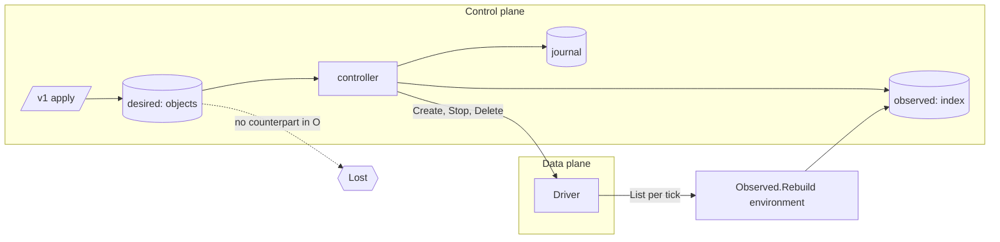
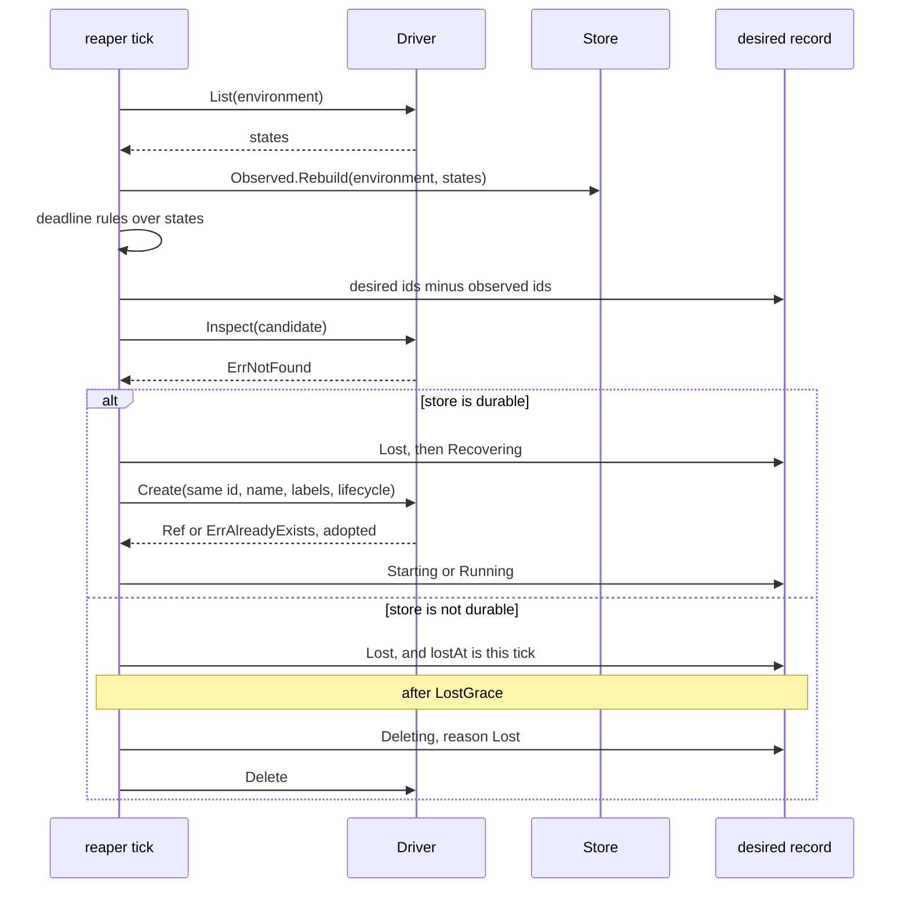

# Postgres store

## Overview

Slice 043 of [[031-hosted-sandbox-consolidation]]. It ports the Postgres
conventions of `sandbox/internal/platform/postgres`, `pgxpoolx` and
`sandbox/migrations` into `internal/store` as the contract of
[[010-state]], and it gives [[005-lifecycle-controller]]'s `lost` rule
the durable desired state and the observed index it waited for.

Today the control plane keeps desired state in one JSON snapshot under
`CELLA_DATA_DIR`, locked to one process. A sandbox the data plane loses
is reported `Lost` on the next read and nothing acts on it: slice 037
built the three deadline rules that read only what the driver reports
and left `lost` unbuilt, because the rule needs a fact no driver reports.
That fact is the desired record. With a durable store the control plane
knows a sandbox it never deleted is missing and recreates it; without
one it knows the same thing only until the process ends, so the sandbox
is reported and reaped after a grace.

The hosted product carried none of this. Its Postgres held product
state, its runtime truth came from labels, and a vanished sandbox
produced one audit event. What is ported is the shape of the access
layer, not its tables: golang-migrate numbering from `000001`, one pool
per process with a small bound, `updated_at` on every row, and the
migrator on a session-scoped connection.

## Current state

`controller.Store` is `Load`, `Save` and `Close` over one map, with
`OpenFileStore` as its only implementation ([[026-direct-control-plane]]).
`controller.Lease` is a seam whose only implementation grants every
lease ([[037-lifecycle-enforcement]]). Nothing in the tree opens a
database, and the `postgres` gate decides the repository's role from the
absent client.

## Design

### What this slice builds

[[010-state]] states one contract with ten method sets. This slice
builds the five the lost rule, recovery and a second replica need, and
leaves the rest as declared interfaces with their tables, so a later
slice writes statements and not a schema.

| Method set | This slice | Filled by |
|---|---|---|
| `Desired` | built: versioned put, get, by name, list, delete, count, status, last applied | - |
| `Observed` | built: put, get, list, `Rebuild` per environment | - |
| `Journal` | built: append with a per object sequence, `ByObject`, `Prune` | delivery in [[009-events]] |
| `Leases` | built: conditional upsert on the server's clock, renewal, release | - |
| `Values` | built: the envelope and `Put`, `Open`, `Delete`; no caller in the tree | the `Secret` kind, slice 046 |
| `Revocations` | seam: the interface and the `revocations` table | slice 045 |
| `Queue` | seam: the interface and the `queue` table | slice 038, ordering in [[020-scheduling-and-sets]] |
| `Operations` | seam: the interfaces and the `operations` and `workers` tables | [[021-data-plane-workers]] |

A seam has no accessor on `Tx`. An interface a caller can reach and
every method of which returns an error is a contract that lies; a table
with no accessor is a schema decision already made in [[010-state]] and
written down once.

### The contract

```go
// Store is the whole of design 010 this slice carries. Every call runs in a
// transaction, so a write and the journal row that records it commit
// together or not at all.
type Store interface {
	Tx(ctx context.Context, fn func(Tx) error) error
	// Durable reports whether what is written outlives this process.
	Durable() bool
	Ready(ctx context.Context) error
	Close() error
}

type Tx interface {
	Desired() Desired
	Observed() Observed
	Journal() Journal
	Values() Values
	Leases() Leases
}
```

[[010-state]] also gives `Store` the method sets outside a transaction, each
call its own. They are sugar over `Tx(ctx, fn)` and this slice does not build
them: every caller in the tree writes an object and its journal row together,
which is a transaction by definition, and a second way to reach the same
statements is a second thing to keep right.

`Object` is one desired row: `Kind`, `ID`, `Owner`, `Name`,
`Environment`, `Phase`, `Labels`, the resolved manifest as `Data`, the
controller's `Status`, and `Version`. [[003-manifest-contract]] has no
`v1.Object` interface yet, so the store carries the identity as columns
and the object as bytes, and `Sandbox` is the only kind written.

### Two states



Desired state is what a caller applied and the control plane owns.
Observed state is what the driver reports, and the store keeps a copy as
an index of one environment at a time. `Rebuild` replaces the rows of
the environment it is given and touches no other environment's rows and
no `objects` row, so the index is a cache that is always rebuildable and
never a second desired state.

The invariant the two states exist for: a desired sandbox whose id is
absent from the environment's observed rows is `Lost`. The store is what
makes that sentence survive a restart of the control plane.

### The lost rule and recovery



The candidate is re-read with `Inspect` under the controller's lock
before anything is written, and only `ErrNotFound` confirms it: a create
that completed between the list and the rule would otherwise be declared
lost and recreated on top of itself. That is the same revalidation the
three deadline rules of slice 037 do, for the same reason.

A sandbox in `Pending`, `Failed` or `Deleting` is never `Lost`. `Pending`
has not reached the driver, `Failed` never will, and `Deleting` is the
control plane's own act in flight. This is the cella restatement of the
hosted reaper's terminal probe, which suppressed a lost event for a
sandbox the platform had just ended.

Recreation is the create order of [[005-lifecycle-controller]] as far as
this repository implements it: the same id, name, labels, annotations
and lifecycle, a `Create` whose `ErrAlreadyExists` is an adoption rather
than a failure, and a refresh from the driver. The map, the token and
the volumes of steps 3 to 5 are slices 039, 045 and [[019-volumes]].

Attempts are bounded. Recovery `n` of one sandbox waits

```
backoff(n) = min(30s * 2^(n-1), 8m)
```

and after `RecoveryAttempts` the sandbox is `Failed` with reason
`RecoveryExhausted`. An unbounded recreate against a driver that refuses
every create is a load generator with a retry loop around it.

Without a durable store the grace is counted in the process, because the
intent it protects also lives in the process. `lostAt` is the tick that
first saw the sandbox missing; a sandbox that reappears before
`LostGrace` passes loses the mark.

### The controller's seam

`controller.Store` keeps `Load`, `Save` and `Close`, so `OpenFileStore`
and every caller written against it are unchanged. The durable half is
one narrow interface the controller declares and `internal/store`
implements, in the rule of [[001-architecture]] that `controller`
imports nothing under `internal/`:

```go
// Durable is design 010's store as the controller reads it. A Store that
// is also a Durable recovers a lost sandbox; one that is not reaps it
// after LostGrace.
type Durable interface {
	Store
	// Durable reports whether what is written outlives this process.
	Durable() bool
	// Write stores one object at the version this process last saw and
	// appends the mutation to the journal, in one transaction.
	Write(ctx context.Context, obj v1.Sandbox, mutation string) error
	// Remove deletes one object and appends the mutation, in one
	// transaction.
	Remove(ctx context.Context, id, mutation string) error
	// Rebuild replaces the observed rows of this environment.
	Rebuild(ctx context.Context, environment string, states []driver.State) error
}
```

One call is one mutation and one journal row, so "every mutation is
journaled" holds by construction rather than by a rule somebody has to
remember. The version is the adapter's rather than the controller's: the
bridge in `internal/store` remembers the version of every row this process
read or wrote and writes conditionally on it, so a second replica cannot
overwrite a row it never read and the controller holds no bookkeeping it
would have to keep right. A durable store takes the per object write; a plain
`Store` takes `Save` of the whole map, which is what a single process with
one JSON snapshot already did.

### Memory

Maps under one mutex, which is the transaction. `Tx(ctx, fn)` holds the
lock for the duration and hands `fn` a view that assumes it; the direct
accessors take the lock per call. The two are separate types, because a
direct accessor called inside `fn` would deadlock. A failed `fn` restores
the snapshot taken at the start, so a transaction commits together or
not at all.

`Durable` is false. Nothing recovers and the start-up log says so.

### Postgres

Selected by `CELLA_DB_URL`. One `pgxpool` per process, `MaxConns` from
`CELLA_DB_MAX_CONNS`, `MinConns` zero, a 30 minute connection lifetime
and a one minute idle time: the family's managed database has about 22
usable connection slots across every service, so a replica holds few and
none idle.

Migrations are embedded under `internal/store/postgres/migrations`,
numbered from `000001`, and applied at start through
`latere.ai/x/pkg/pgxmigrate.Up`. That package imports no driver by
design, so this one blank-imports golang-migrate's `pgx/v5` driver and
rewrites the URL's scheme to `pgx5://` for the migrator. Before `Up` the
store reads `schema_migrations`: a dirty flag is a start-up failure
naming the version, and a version above the highest embedded migration
is a start-up failure naming both, since `Up` would report no change and
then run against a schema the binary does not know.

A migration holds a session-scoped advisory lock across its statements.
A transaction-mode pooler reassigns the backend between transactions and
the lock is lost, so `CELLA_DB_URL` is a direct endpoint or a
session-mode pooler. The repository declares the `direct` role for the
`postgres` gate: it reads one operator-supplied URL, and the family's
two-name convention of a pooled serving DSN beside a direct migration
DSN belongs to the hosted plane that deploys this binary.

`Ready` is `SELECT 1` inside a one second budget, which is the readiness
check `cellad` mounts when the database store is in use.

Tables, with the indexes of [[010-state]]: `objects`, `observed`, `events`,
`secret_values`, `leases`, and the seams `revocations`, `queue`,
`operations`, `workers`.

### Leases

`leases` rows are `name`, `holder`, `expires_at`. `Acquire` is one
conditional upsert decided by the database's own clock, so two replicas
with skewed clocks still agree:

```sql
insert into leases (name, holder, expires_at) values ($1, $2, now() + $3)
on conflict (name) do update set holder = $2, expires_at = now() + $3
where leases.holder = $2 or leases.expires_at < now()
```

The holder is one identity per process, the hostname and eight random
bytes. `Acquire` by the current holder renews, which is what a reaper
that asks once per tick needs. A lease the process holds is renewed by a
goroutine at a third of the TTL, so a tick that takes longer than the
term does not hand the environment to a second writer, and `Close`
releases every lease this process holds rather than waiting out the TTL.

### Secret values

The envelope of [[018-egress-and-secrets]], built here and called by
nothing: a random 32 byte data key per secret, the value sealed under it
with AES-256-GCM, the data key sealed under the key from
`CELLA_SECRET_KEY` with AES-256-GCM. The wrapped data key and the
ciphertext are separate columns, so a later `Rewrap` rewrites one and
leaves every ciphertext byte alone. Both adapters hold the same
ciphertext, so no store keeps a plaintext at rest and the memory adapter
is not the weaker one.

### Configuration

| Variable | Default | Bounds | Meaning |
|---|---|---|---|
| `CELLA_DB_URL` | unset | a `postgres://` or `postgresql://` URL | the store. Unset keeps desired state in the file store of `CELLA_DATA_DIR` and turns recovery off |
| `CELLA_DB_MAX_CONNS` | `4` | 1 to 32 | connections this replica holds |
| `CELLA_SECRET_KEY` | unset | 32 bytes, base64 | the key wrapping every secret's data key. Validated when set; required once a `Secret` exists (slice 046) |
| `CELLA_LOST_GRACE` | `10m` | `1s` to `1h` | how long a `Lost` sandbox waits before it is reaped, without a durable store |

The start-up line says which store is in use and what a lost sandbox
gets, which is the sentence [[001-architecture]]'s State section asks
for: `store=postgres recovery=on` or `store=file recovery=off lost-grace=10m`.

## Not in this spec

The `Ledger` of [[022-mesh-and-spawn]] and the egress `Records` of
[[018-egress-and-secrets]]: neither has a caller in this repository, and
neither is named by this slice's row in [[031-hosted-sandbox-consolidation]].
The delivery half of the journal, which is [[009-events]]'s `Pending`,
`Acknowledge`, `Defer` and `Drop`. The queue's ordering
([[020-scheduling-and-sets]]) and the worker protocol
([[021-data-plane-workers]]). `Values.Rewrap` and every caller of
`Values.Open` (slice 046, [[018-egress-and-secrets]]). The token half of
recovery, the re-mint and the revocation (slice 045). Volumes
([[019-volumes]]). The `Environment`, `Secret`, `Volume` and
`SandboxSet` kinds: `Desired` is written over any kind and only
`Sandbox` is stored.

## Acceptance criteria

| Criterion | Test that proves it | State |
|---|---|---|
| One suite over every built method runs against both adapters; the memory adapter is exempt from durability across a restart and from the schema check | `TestMemoryStore`, `TestPostgresStore` over `storetest.Run` | built |
| The suite fails an adapter that answers nothing and one that fails everything, so a passing run says what it proves | `TestSuiteCatchesAStoreThatAnswersNothing`, `TestSuiteCatchesAStoreThatFailsEverything` | built |
| `Put` with a stale version is `ErrVersionConflict`; with the current version it advances it; version 0 creates and a second create conflicts | `storetest` case `Versions` | built |
| `(kind, owner, name)` is unique among live rows and reusable after delete; `Count` excludes `Deleting` and deleted rows | `storetest` cases `Names`, `Count` | built |
| Writes inside `Tx` commit together or not at all | `storetest` case `Transactions` | built |
| `Rebuild` replaces one environment's observed rows, leaves another environment's alone, and touches no `objects` row or status | `storetest` case `Observed` | built |
| The journal appends one row per mutation with a per object sequence, reads back newest first, and prunes by age | `storetest` case `Journal` | built |
| Two holders contend for one lease: one holds, the other acquires after the term lapses, the holder renews, and a release frees it at once | `storetest` case `Leases`, `TestLeaseRenewal`, `TestRenewalStopsWhenTheLeaseMoves` | built |
| A value round trips through the envelope; the row holds neither the plaintext nor the key; a wrong key fails to open | `storetest` case `Values`, `TestEnvelopeSealsAndOpens`, `TestEnvelopeRefusesTheWrongKey` | built |
| A schema ahead of the binary and a dirty migration each refuse to start, naming the version | `TestSchemaGuards` | built |
| The Postgres adapter runs the whole suite against a real server in a container, and skips with one sentence where no container runtime answers | `TestPostgresStore` | built |
| What one process wrote, the next process reads | `TestDurable` | built |
| A desired sandbox with no observed counterpart is `Lost`; one in `Pending`, `Failed` or `Deleting` is not | `TestLostForVanishedSandbox`, `TestLostSuppressedForEndedSandbox` | built |
| A sandbox that reappears between the list and the action is not declared lost, and a driver that does not answer is not evidence of one | `TestLostRevalidatesBeforeActing`, `TestLostRevalidationReportsADriverFailure` | built |
| With a durable store a lost sandbox is `Recovering` and then recreated with the same id, name, labels and lifecycle, and the journal holds the mutations in order | `TestRecoveryRecreates` | built |
| A create that reports `ErrAlreadyExists` during recovery is adopted | `TestRecoveryAdopts` | built |
| Recovery attempts back off and end in `Failed` with reason `RecoveryExhausted` | `TestRecoveryExhausts`, `TestRecoveryWaitsOutTheBackoff` | built |
| Without a durable store a lost sandbox is `Deleting` with reason `Lost` after `LostGrace` and not one tick before | `TestLostGraceReaps` | built |
| `Observed.Rebuild` is called once per tick with what `List` returned, and a rebuild that fails holds the lost rule for that tick | `TestRebuildPerTick`, `TestRebuildIsNotAskedOfASnapshotStore` | built |
| A native sandbox whose driver object is deleted behind the controller's back is recovered on the next tick with the same id and labels | `TestRecoveryEndToEndOverNative` | built |
| `CELLA_DB_URL`, `CELLA_DB_MAX_CONNS`, `CELLA_SECRET_KEY` and `CELLA_LOST_GRACE` take their defaults, accept a value, and refuse a malformed one | `TestStoreDefaults`, `TestStoreConfiguration` | built |
| The start-up line names the store and whether a lost sandbox is recovered, and a database that does not answer is a start-up failure | `TestServeNamesTheStore`, `TestTheStartUpLineReportsRecovery`, `TestServeRefusesADatabaseItCannotReach` | built |
| No package outside `internal/store/postgres` imports the Postgres driver or the migrator | `TestDriverIsConfined` | built |

## Outcome

`internal/store` is the contract of [[010-state]] and `internal/store/memory`
and `internal/store/postgres` are its two adapters, proven by one suite in
`internal/store/storetest`. The suite runs against a real Postgres in a
container, one database per case, and against the memory adapter always; it
also runs against two deliberately wrong adapters through a recorder, one
that answers nothing and one that fails everything, and every case is
required to fail both. A suite that only passes says nothing about the
adapter it would catch, which is the pattern
[[032-runtime-conformance-suite]] set for `runtime/runtimetest`.

Two rules the suite holds every adapter to, learned from running it against
Postgres first: a statement that fails ends its transaction, so a caller
rolls back and retries rather than writing on, and a JSON column is a value
and not a byte string, so a comparison is of documents and not of the
server's formatter.

The controller keeps `Load`, `Save` and `Close`, and takes the per object
write where the store is also a `Durable`. `persist` and `forget` are the two
places the controller writes state, so every mutation of a sandbox is one
conditional write and one journal row. The `lost` rule and recovery are in
`controller/recovery.go`: `vanished` is the desired sandboxes with no
counterpart in the driver's list, `enforceLost` re-reads each one under the
lock and only `ErrNotFound` confirms it, and then either `recoverLocked`
recreates it by the create order or `graceLocked` counts the grace and
deletes it. `RunReaper` runs its first tick at once, which is the start-up
reconcile: desired state has just been read from the store and everything in
it is compared against the driver before the process serves a request.

`go tool lateregate` passes all 16 gates. `go test -race ./...` passes.
Coverage: `internal/store` 90.2%, `internal/store/memory` 97.8%,
`internal/store/postgres` 93.5%, `internal/store/postgres/migrations` 94.1%,
`internal/store/storetest` 90.2%, `controller` 96.2%, `cmd/cellad` 91.2%,
`internal/config` 98.6%; every package clears 90%. The end-to-end case is
`TestRecoveryEndToEndOverNative`: a native sandbox whose object is deleted
behind the controller's back is `Lost`, `Recovering` and running again under
the same id and labels within one tick, with the three mutations in the
journal in that order.

The Postgres suite ran for real: `postgres:17-alpine` under Testcontainers,
one fresh database per case, terminated in `TestMain`. The container runtime
writes its own state under `TMPDIR`, so the `tempdir` gate admits `podman`
and `storage-run-501` with the reason, which is what `latere-ai/auth` and
`latere-ai/platform` do rather than gating the suite behind a variable that
would leave the adapter unmeasured in CI.

Left open, each with the slice that closes it. `Values` is built and has no
caller: the `Secret` kind, `Rewrap` and `egress.Compile` are slice 046 and
[[018-egress-and-secrets]]. `Revocations` is the interface and the table
only; the mint and the revocation are slice 045. `Queue` is the interface and
the table only; the order `Dequeue` returns is [[020-scheduling-and-sets]]
and slice 038. `Operations` and `workers` are the interfaces and the tables
only; the worker protocol is [[021-data-plane-workers]]. The journal's
delivery half, `Pending`, `Acknowledge`, `Defer` and `Drop`, is
[[009-events]]. Recovery re-pushes no egress map, mints no token and
reattaches no volume: those are steps 3 to 5 of the create order and arrive
with slices 039 and 045 and [[019-volumes]]. `CELLA_RECOVERY_ATTEMPTS` is an
`Options` field with its default and not yet a variable. Two names moved and
the rest of the tree has not caught up: the key secret values are sealed
under is `CELLA_SECRET_KEY` here and in [[010-state]], while
[[012-test-stubs-and-tiers]], [[013-security-and-threat-model]],
[[018-egress-and-secrets]] and [[002-repository-scaffold]] still say
`CELLA_SECRETS_KEK`, and `CELLA_DB_MAX_CONNS` defaults to 4 here and in
[[010-state]] where [[002-repository-scaffold]] says 8. Slice 046 is where
the first of those is read by a caller, so it carries the rename. The coordinates
check of [[031-hosted-sandbox-consolidation]] walks `runtime/` and
`controller/`; adding `internal/store/` to its roots is an edit to
`runtime/coordinates_test.go`, which two other slices hold open, so it is
left for whoever merges them.
