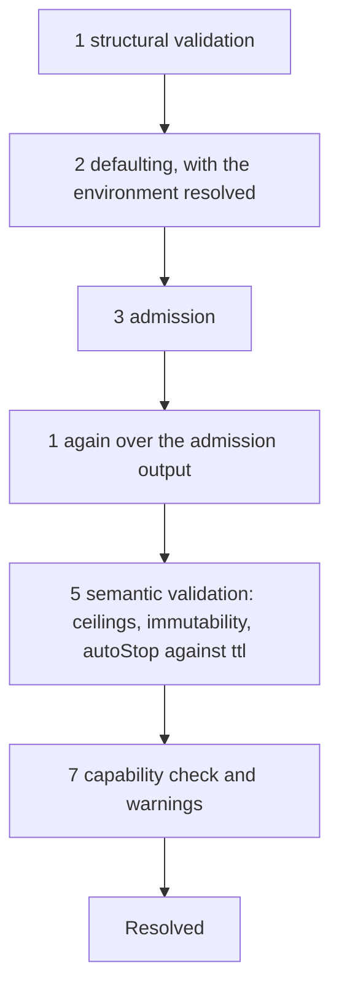

# Manifest fields

## Overview

Slice 044 of [[031-hosted-sandbox-consolidation]]. The container
drivers of slices 035 and 036 and the lifecycle enforcement of slice
037 need three things a manifest cannot express today: how much
compute a sandbox asks for, who it runs as, and when it stops and is
deleted. This slice adds those fields of [[003-manifest-contract]] to
`manifest/v1.SandboxSpec`, adds `status.expiresAt` and
`status.warnings` to `SandboxStatus`, completes the `metadata` and
`env` rules the field table states, and replaces the single-purpose
`ResolveNative` with the staged `Resolve` the spec fixes, keeping
`ResolveNative` as a thin native-defaults call into it.

The fields are the hosted product's, ported rather than lifted: the
hosted manifest carried `tier`, `policy`, `mesh` as a string,
`deadline` beside `ttl`, and `mounts` keyed by a drive workspace id,
and parsed its quantities with the Kubernetes API machinery. None of
those cross. What crosses is the behaviour its regressions pin: the
quantity subset, the duration rules, the reserved label prefix, the
label syntax, and the annotation size limit.

## Current state

`manifest/v1.SandboxSpec` carries `environment`, `image`, `command`,
`args`, `workdir`, and `env`, the strict subset
[[026-direct-control-plane]] admitted. `manifest.ResolveNative` is one
function that validates and defaults that subset for the one native
environment. `runtime.CreateSpec` carries `Lifecycle` already and the
native driver computes `State.ExpiresAt` from its `TTL`, but no
manifest field reaches it. `manifest.Error` is `{Code, Detail}`, with
no field path.

## Design

### Fields added

`spec`, each exactly as the field table of [[003-manifest-contract]]
states it:

| Field | Type | Default | Rule in this slice |
|---|---|---|---|
| `user` | string | the image's | a uid, `uid:gid`, or a user name |
| `resources.cpu`, `.memory`, `.disk` | `Quantity` | `Defaults.CPU`, `.Memory`, `.Disk` | Kubernetes quantity syntax, decimal and binary SI, positive |
| `workspace.path` | string | `/workspace` | absolute, clean, not `/`, not under `/run/cella` |
| `workspace.source` | enum | `empty` | `empty` only; `git` waits on the clone the contract describes and `volume` on [[019-volumes]], and both are `capability_unsupported` until then |
| `lifecycle.autoStop` | `Duration` | `Defaults.AutoStop` | Go syntax and positive, or `never` |
| `lifecycle.ttl` | `Duration` | `Defaults.TTL` | Go syntax and positive, or `never` |
| `lifecycle.autoDelete` | `Duration` | `Defaults.AutoDelete` | Go syntax and positive, or `never` |

`status.expiresAt` and `status.warnings` join `SandboxStatus`.
`expiresAt` is the controller's, taken from the driver's observed
state, which computes it from `createdAt` plus the `ttl` it was
created with, so one clock owns it. `warnings` are `Resolve`'s, carried
through create and returned on every read.

`Quantity` and `Duration` are named string types in `manifest/v1`, so a
resolved manifest returns the caller's own spelling and never a
re-rendered one, and `manifest` owns their parsers. `manifest.Quantity`
and `manifest.Duration` alias them, the pattern `runtime.Capabilities`
already uses for `v1.Capabilities`.

### The quantity parser

`manifest` parses the Kubernetes quantity subset itself, so an
importer validating a manifest pulls no Kubernetes API machinery
([[003-manifest-contract]], package layout). A quantity is

$$v = d \times 10^{e - f + s} \times 2^{10b}$$

where $d$ is the mantissa's digits as an integer, $f$ its fraction
digit count, $e$ the decimal exponent of an `e`/`E` form, $s$ the
decimal SI suffix exponent (`n` $-9$, `u` $-6$, `m` $-3$, none $0$,
`k` $3$, `M` $6$, `G` $9$, `T` $12$, `P` $15$, `E` $18$), and $b$ the
binary SI suffix index (`Ki` $1$ through `Ei` $6$). `E` at the end of
the string is the exa suffix; `E` followed by a signed number is an
exponent.

The parser returns the value in milli-units of the base unit, cores
for `cpu` and bytes for `memory` and `disk`, as an `int64`. Two
consequences, both `invalid_field`: a value with precision finer than
one thousandth of the base unit, which no cgroup and no volume can
carry, and a value whose milli-unit form exceeds `int64`, which starts
inside the `Ei` range. Resolution compares parsed values and stores the
unparsed string.

### Resolve

```go
func Resolve(ctx context.Context, in *v1.Sandbox, o Options) (*Resolved, error)

type Options struct {
	Actor    Actor
	Lookup   Lookup
	Defaults Defaults
	Ceilings Ceilings
	Limits   Limits
	Admit    AdmitFunc
	Existing *v1.Sandbox
	Now      func() time.Time
	NewName  func() string
}

type Resolved struct {
	Sandbox  v1.Sandbox
	Warnings []string
}
```

`Lookup` carries `Environment` alone in this slice. `Secret` and
`Volume` have no manifest field to name them yet, so the interface
does not declare them; the fields and the methods arrive together in
[[018-egress-and-secrets]] and [[019-volumes]]. `AdmitFunc` and
`AdmitRequest` are [[007-admission]]'s, with the request fields this
slice can fill; `Claims`, `Workload`, `Parent`, `Set`, and `RequestID`
join as their slices land.

The stages run in the order [[003-manifest-contract]] fixes, each
total before the next begins:



The environment is resolved inside stage 2 rather than at stage 4,
because both stage 2 and stage 3 read it: defaulting takes the
environment's default queue from it, and `AdmitRequest.Environment`
carries it with its capabilities. Stage 4 keeps the secret and volume
references, which nothing before them reads. `Lookup.Environment` with
the empty name answers the default environment, and `Resolve` writes
that environment's name back into `spec.environment`, so a resolved
manifest names where it runs.

Stage 6, the boundary check, has no `Parent` to check against until
[[022-mesh-and-spawn]] and is not in this slice.

`Resolve` never mutates its input. It works on a deep copy and returns
it with `status` cleared apart from `warnings`, so a caller may `GET`,
edit, and apply the same document back.

Determinism: the same input, options, `Now`, `NewName`, and lookup
answers produce byte-identical output. Warnings are appended in a
fixed order, never in map order.

### Rules this slice fixes

- `metadata.name`: a DNS-1123 label of at most 63 characters, taken
  from `Options.NewName` when absent and validated after generation.
  With no `NewName` the name stays empty and the controller's own
  generator names the object, as it does today.
- `metadata.labels` and `metadata.annotations`: Kubernetes label
  syntax for keys; label values are label syntax and at most 63
  characters; annotation values are any string up to 4 KiB with at
  most 64 KiB over all annotations. A key under `cella.latere.ai/` is
  `reserved_prefix`, and so is a key under any subdomain of it, which
  Kubernetes reserves the same way and the hosted product did not
  check.
- `env`: POSIX names, values without NUL, 32 KiB over all entries, and
  the reserved set of [[018-egress-and-secrets]], already implemented
  as `ReservedEnv`.
- `lifecycle`: `autoStop` is compared against `ttl` only when both are
  durations. `autoStop: never` under a duration `ttl` is accepted,
  because the ttl already ends the sandbox and an idle stop before it
  is what the caller declined. A defaulted `autoStop` above a caller's
  shorter `ttl` refuses at stage 5, where the spec puts validation
  after defaults; the caller sets `autoStop` to resolve it.
- `Ceilings`: a zero ceiling is no ceiling; `ttl: never` under a set
  `Ceilings.TTL` is `ceiling_exceeded`. `Limits.MaxPriority` bounds
  `scheduling.priority`, which [[020-scheduling-and-sets]] adds; until
  then the only representable priority is zero, and a negative
  `MaxPriority`, a ceiling below it, is `ceiling_exceeded` rather than
  a limit silently unenforced.
- `immutable_field` on update names every changed path in one error.
  `manifest.Error` gains `Path` and `Paths` for that, the shape
  [[008-api]]'s envelope renders.

### The native environment

An environment whose isolation class is `none` runs the workload as
the server's own process with no confinement. It therefore cannot
apply a cgroup limit or a uid, and `resources` and `user` on such an
environment are recorded and warned about rather than refused: a
manifest written for a container environment stays valid when it is
run natively, which is the point of one manifest across environments.
The two sentences land in `status.warnings`:

- `The native environment does not limit cpu, memory or disk; the requested resources are recorded and not enforced.`
- `The native environment runs the workload as the server's own user; spec.user is not applied.`

`ResolveNative(ctx, obj, environment)` is `Resolve` with a lookup that
answers one environment of isolation `none`, no defaults, and no
ceilings. Its native-only refusals stay where they are: an `image` is
`capability_unsupported`, `args` without `command` is `invalid_field`,
and a `workdir` or `workspace.path` other than `/workspace` is
`capability_unsupported`, because the native driver owns the workspace
directory.

### Into the driver

`runtime.CreateSpec` gains `User`, `Resources{CPU, Memory, Disk}`, and
`Workspace{Path}`, the names [[004-runtime-contract]]'s type table
gives them, additively and with no change to any `Driver` method. The
controller fills them from the resolved manifest and parses
`lifecycle` into the `Lifecycle` the spec already carries, where
`never` is the zero duration, the value every driver already reads as
no bound.

## Not in this spec

YAML decoding and the `Decode` rules beyond JSON, the golden corpus,
and the fuzz agreement with the Kubernetes parser
([[003-manifest-contract]]). The `secrets`, `volumes`, `network`,
`ports`, `mesh`, `scheduling`, and `display` fields, which land with
the specs that own them, and with them stage 4's secret and volume
resolution, stage 6, and the rest of stage 7. The empty-egress warning
of stage 7, which needs an egress field to be about. Wiring
`Options.NewName` into the API, which [[008-api]] owns together with
the name generator. Where `Defaults` and `Ceilings` come from
([[007-admission]]).

## Acceptance criteria

| Criterion | Test that proves it | State |
|---|---|---|
| The quantity parser takes the decimal and binary SI subset, refuses a bad suffix, sub-milli precision, and an out-of-range value, and agrees with the hosted parser's cases | `TestParseQuantity` | built |
| A duration is Go syntax and positive, or `never`; zero and negative are refused | `TestParseDuration` | built |
| `autoStop` above a duration `ttl` is `invalid_field`; `autoStop: never` under a duration `ttl` is accepted; a defaulted `autoStop` above a caller's `ttl` refuses | `TestAutoStopAgainstTTL` | built |
| Every default in this slice's table is applied and returned, and a field the caller set is never overwritten | `TestDefaultsFillOnlyAbsentFields` | built |
| A key under `cella.latere.ai/` or any subdomain of it, in labels or annotations, is `reserved_prefix`; label syntax, label value length, the 4 KiB annotation value and the 64 KiB annotation total are refused with `invalid_field` | `TestMetadataRules` | built |
| `user`, `workspace.path`, and `workspace.source` refuse each bad form with the table's code | `TestFieldSyntax` | built |
| Ceilings refuse with the field and the ceiling, a zero ceiling is no ceiling, `ttl: never` under a ceiling is `ceiling_exceeded`, and a negative `MaxPriority` is `ceiling_exceeded` | `TestCeilings` | built |
| Every immutable field changed on update is named in one `immutable_field` error | `TestImmutableFields` | built |
| An admission function's output is validated again; one that changes `kind` or `metadata.name` on update is `admission_refused`; a nil `Admit` is the identity | `TestAdmissionOutputIsValidated` | built |
| An absent `metadata.name` comes from `NewName` and is validated | `TestNameGeneration` | built |
| `Lookup` returning not-found surfaces as `not_found`; an unavailable lookup surfaces as `authorizer_unavailable` | `TestLookupErrors` | built |
| `status` on apply is ignored and `Resolve` returns an empty status but warnings | `TestStatusIsIgnoredOnApply` | built |
| `Resolve` on the same input, options, and lookup answers twice yields byte-identical JSON, and never mutates its input | `TestResolveIsDeterministic` | built |
| An environment of isolation `none` warns about `resources` and `user` instead of refusing them | `TestNativeWarnsInsteadOfRefusing` | built |
| `manifest/v1` imports only the standard library; `manifest` imports no `internal/` or `runtime` package | `TestManifestImports` | built |
| No file of this slice names a Latere host, image, pool, or namespace outside an example | `TestNoLatereCoordinates` | built |
| `user`, `resources`, `workspace.path`, and `lifecycle` reach the driver's `CreateSpec`, and `never` reaches it as the zero duration | `TestCreateSpecCarriesManifestFields` | built |
| A create over HTTP with all four fields returns 201 with the warnings and an `expiresAt` in its status, and reads back the same | `TestNativeManifestFieldsEndToEnd` | built |

## Outcome

`manifest/v1.SandboxSpec` carries `user`, `resources`, `workspace` and
`lifecycle`; `SandboxStatus` carries `expiresAt` and `warnings`;
`Quantity` and `Duration` are named string types, so a resolved
manifest returns the caller's own spelling. `manifest` holds the
quantity parser over the decimal and binary SI subset in milli-units,
the duration parser with `never`, the metadata, env, user, workspace
and lifecycle rules, and `Resolve` with `Actor`, `Lookup`, `Defaults`,
`Ceilings`, `Limits`, `Admit`, `Existing`, `Now` and `NewName`.
`ResolveNative` is that function with a lookup of one environment of
isolation `none` and the native refusals after it.
`runtime.CreateSpec` carries `User`, `Resources` and `Workspace`
additively, with no change to any `Driver` method, and the controller
fills them and parses `lifecycle` into the `Lifecycle` the spec already
had, where `never` is the zero duration. The API maps
`immutable_field`, `ceiling_exceeded` and `admission_refused` to their
statuses and renders `paths`.

`go tool lateregate` passes all 16 gates, `go test -race ./...`
included. Coverage: manifest 97.4%, controller 95.3%, internal/api
93.0%, runtime/native 93.1%, cmd/cellad 91.4%, every package above 90%.
The end-to-end test is `TestNativeManifestFieldsEndToEnd`: a create
over HTTP with `user`, `resources`, `workspace.path` and `lifecycle`
returns 201 with both warnings and an `expiresAt` an hour after
creation, a read returns the same, and six refusals return their codes
and statuses.

Divergences from the design above, each deliberate:

- `manifest.Error` is `{Code, Path, Detail, Paths}`. The contract names
  a `Message`; this repository's register rule puts the fixed user
  sentence in the API envelope's `message` and the developer detail in
  a field of its own, so the field keeps the name `Detail` the tree
  already uses. `Paths` carries every path of a multi-path refusal.
- `ResolveNative` takes the caller's context, so a resolve that reaches
  a lookup is cancelled with its request.
- An operator's invalid default or ceiling returns a plain error, not a
  contract error, so a server misconfiguration cannot surface to a
  caller as a 400 about a field the caller did not write.

Not built here, each with its owner: YAML decoding and the golden
corpus, the fuzz agreement with the Kubernetes parser, the secret,
volume, network, port, mesh, scheduling and display fields with stage
4's secret and volume resolution, stage 6, the rest of stage 7, the
host rule, and the name generator behind `Options.NewName`, which
[[008-api]] owns.
