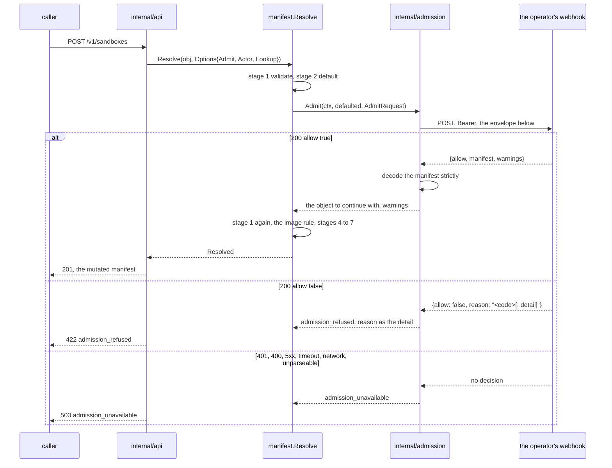

# The admission client

## Overview

[[044-manifest-fields]] built stage 3 of `Resolve` and the `AdmitFunc`
seam it calls. Nothing fills that seam: every `cellad` runs with
`Options.Admit` nil, which is the identity, so an installation that wants
an image catalogue, a plan shape or a policy profile has no way to express
one. This slice of [[031-hosted-sandbox-consolidation]] builds the client
half of [[007-admission]]'s webhook: one `POST` per `Sandbox` apply to
`CELLA_ADMISSION_URL`, the mutated manifest back or a refusal, fail
closed, and no retry.

The endpoint already exists. The hosted plane built it against
[[007-admission]] before this client did, so the wire shape is settled by
what that endpoint reads rather than by what the Go type in
[[007-admission]] suggests, and this spec amends [[007-admission]] where
the two disagreed.

Two rules move with the client. `spec.image` becomes required after
admission rather than before it, because a catalogue that pins an alias is
exactly the thing that supplies one; and the per-subject count ceiling
gets the single definition [[007-admission]] states, with the
`authorizer` package's second definition withdrawn.

## Current state

`manifest.Options.Admit` is called at stage 3 and is nil everywhere.
`manifest.AdmitRequest` carries `Actor`, `Action`, `Existing` and
`Environment`; [[007-admission]] names `Claims`, `Workload`, `Parent`,
`Set` and `RequestID` beside them. `manifest.Actor` carries the rendered
subject and the workload flag, not the issuer and the sub the wire
flattens it into.

`admit` in `manifest/resolve.go` folds every error the step returns into
`admission_refused`, so a step that cannot reach its endpoint reads as a
policy refusal, and folds the reason through `upperFirst`, which would
turn a code into `Ceiling_exceeded`.

`spec.image` has no rule at all: [[026-direct-control-plane]] refuses an
image outright, in `ResolveNativeWith` and after `Resolve` has returned,
because the one environment that exists runs no image.

`internal/api` resolves a create with `NativeOptions`, which sets no
`Admit`, no `Defaults` and no `Ceilings`. `errorEnvelope` has no
`admission_unavailable` row. `controller.Create` counts every desired
sandbox of the owner whose phase is not `Deleting`, which is
[[007-admission]]'s definition already; `authorizer/limits.go` documents
the same figure as "the live sandboxes one subject holds", which is a
second and narrower definition.

## Design

### The call



One call, one attempt. The authorizer of [[006-identity]] retries once on
a connection that failed before a response line arrived because its call
is a pure read; admission may rewrite the manifest, so a resend could
apply a mutation twice and there is no retry at any layer.

### The envelope

The wire body flattens the actor into three members and carries the
request id under `request`. [[007-admission]]'s Go `AdmitRequest` is the
in-process type and is not the JSON shape:

```json
{
  "subject":     "https://auth.example|alice",
  "issuer":      "https://auth.example",
  "sub":         "alice",
  "claims":      {"org_id": "org-one", "roles": ["member"]},
  "workload":    null,
  "action":      "create",
  "existing":    null,
  "parent":      null,
  "environment": {"id": "env_01J9", "name": "default", "isolation": "container", "capabilities": {"egress": ["open", "allowlist"]}},
  "set":         null,
  "manifest":    {"apiVersion": "cella.latere.ai/v1beta1", "kind": "Sandbox", "metadata": {"name": "dev"}, "spec": {"environment": "default", "image": "base"}},
  "request":     {"id": "req_01J9"}
}
```

`workload`, `existing`, `parent` and `set` are present and `null` where
they are absent, never omitted: an endpoint that reads the envelope reads
four members whose absence and whose null are the same statement, and a
fixture that drives the exact shape needs them written down.
`environment` is the summary [[007-admission]] states, the environment's
id, name, isolation class and capabilities, and not the whole
`v1.Environment` object. `request` carries the id alone; the peer address
and the user agent are the authorizer's envelope and not this one.

`manifest` is the stage 2 output marshalled from `v1.Sandbox`. Stage 1
refuses an unknown field before admission runs, so the typed object is
the whole of what the caller sent and the marshalling loses nothing. An
endpoint holds the document as a decoded map and writes named fields into
it, so a field a later `v1` adds survives an endpoint that does not know
it.

The response is [[007-admission]]'s: `allow`, `manifest`, `reason`,
`warnings`. `allow` is read as a pointer, so a body that names no `allow`
is no decision rather than a deny.

### The refusal and the outage

A policy refusal is a parsed 200 with `allow: false`. The `reason` is a
stable code, optionally followed by a colon and a figure, and it reaches
the caller verbatim as the developer detail of `admission_refused`, 422.
The client neither parses the code nor rewrites its case: an endpoint
that answers `ceiling_exceeded: spec.resources.cpu is 8, above the plan's
4` is quoted, not paraphrased.

Everything that is not a parsed 200 carrying `allow` is
`admission_unavailable`, 503, and never a pass: a 401 on the bearer, a
400 on the envelope, any other non-200, a body over 1 MiB, a body that
does not parse, a body without `allow`, a connection failure, a TLS
failure, and a timeout of `CELLA_ADMISSION_TIMEOUT`.

### The manifest that comes back

The returned manifest is decoded the way a caller's manifest is decoded,
strictly, so an endpoint that writes a field the schema does not know is
`unknown_field` and one that writes a bad quantity is `invalid_field`,
each naming the path. [[007-admission]] said `invalid_field` for both;
the code is [[003-manifest-contract]]'s own, so the spec is amended to
the two codes the decoder gives.

`admit` then holds the output to the rules [[007-admission]] names:
`apiVersion` and `kind` unchanged, `metadata.name` unchanged on an
update, and stage 1 run again. Stages 4 to 7 follow, so the ceilings of
stage 5 and the boundary check of stage 6 apply to what the endpoint
returned and an endpoint cannot raise a value or open a boundary.

### The image rule

`spec.image` is required by [[003-manifest-contract]]'s field table and
was never checked, and where it had been checked, at stage 1, no endpoint
could supply one. It becomes the closing rule of stage 3,
keyed on the environment's isolation class:

| Environment isolation | `spec.image` absent | `spec.image` present |
|---|---|---|
| `none` | pass | `capability_unsupported` at `spec.image` |
| anything else | `missing_field` at `spec.image` | pass |

The `none` row is the refusal [[026-direct-control-plane]] wrote after
`Resolve` returned, moved inside it: an environment that runs no image
neither requires one nor admits one. The other row is the required check,
now after admission, so a catalogue may supply the image and a manifest
that still names none after both the operator's default and the endpoint
is `missing_field`.

`CELLA_DEFAULT_IMAGE` is the operator's fallback, unset by default, with
no value this project ships. It is applied at stage 2 where the
environment runs images, so an installation with no endpoint can still
serve a manifest that names no image, and an installation whose
environment runs none is unaffected by an operator who set it.

### What a hosted control plane runs with

Stage 2 runs before stage 3, and an endpoint cannot tell a field the
caller wrote from a field stage 2 defaulted. A control plane whose
policy lives in an endpoint therefore leaves every `CELLA_DEFAULT_*`
unset and sets only `CELLA_MAX_*`: the endpoint supplies the defaults,
and the ceilings stay the operator's own second check over whatever the
endpoint returned. Every `CELLA_DEFAULT_*` is optional and
`CELLA_DEFAULT_IMAGE` is added as one more. [[002-repository-scaffold]]'s
table records the rule beside the variables, and its six resource and
lifecycle rows change from baked-in figures to `unset`: a figure stage 2
applied whether or not an operator asked for it is a field the endpoint
then cannot default, because an endpoint cannot tell a defaulted field
from a written one. `manifest.Defaults` has always read an empty value as
"leave the field absent"; the table now says the same.

### The count ceiling

[[007-admission]]'s definition is the one: the count is every desired
`Sandbox` of the subject whose phase is not `Deleting`, `Queued` and
`Stopped` included. `controller.Create` counts exactly that under the
same lock that reserves the name, and refuses with `ErrQuota`, which
`internal/api` renders as `quota_exceeded`, 422.

`authorizer/limits.go` documented `max_sandboxes` as the live sandboxes a
subject holds, which is a narrower figure: a stopped sandbox holds a
workspace and a name and counts. The doc comment and [[006-identity]] are
corrected to the one definition. The endpoint's own allow body carries no
`limits` at all, by [[007-admission]]'s rule that ceilings are the
authorizer's, so there is no second source of the figure to reconcile.

### Configuration

| Variable | Default | What |
|---|---|---|
| `CELLA_ADMISSION_URL` | unset | the endpoint stage 3 calls; unset is the built-in identity step |
| `CELLA_ADMISSION_TOKEN` | unset | the bearer the endpoint requires; required with the URL |
| `CELLA_ADMISSION_TIMEOUT` | `3s` | one call's deadline, between 100ms and 30s |
| `CELLA_DEFAULT_IMAGE` | unset | the image a manifest that names none takes, where the environment runs images |

A URL without a token is a start-up failure, and an `http://` URL on a
host other than loopback is a start-up failure, both the rules
`CELLA_AUTHORIZER_URL` already carries. The start-up line says
`admission=webhook` or `admission=builtin`.

Transport trust is the system roots. A deployment whose endpoint is
served under a private certificate authority adds that authority to the
trust store of the image, which `SSL_CERT_DIR` and `SSL_CERT_FILE`
select; there is no `CELLA_ADMISSION_CA`, because a second trust
configuration for one client is a second place for a deployment's trust
to be wrong.

## Not in this spec

The six `CELLA_DEFAULT_*` figures and the four `CELLA_MAX_*` ceilings are
still read by nothing: `manifest.Defaults` and `manifest.Ceilings` exist
and `internal/config` loads neither, so `internal/api` passes both zero.
That wiring belongs with [[002-repository-scaffold]]'s table and is one
loader and one option, not a part of the admission client.

`Parent` and `Set` are always `null`: the spawn of [[022-mesh-and-spawn]]
and the replicas of [[020-scheduling-and-sets]] have no code to set them.
The `workload` member is set from the caller and the API has no update
route, so `existing` is always `null` as well.

## Acceptance criteria

| Criterion | Test that proves it | State |
|---|---|---|
| The body the client sends decodes into the endpoint's own request type with every member and type intact, and carries the flattened actor, the request id and the manifest | `TestEnvelopeMatchesTheEndpoint` over the endpoint's fixture | not built |
| An allow whose manifest rewrites the image, stamps annotations and narrows egress is what the caller reads back | `TestAllowMutationReachesTheCaller` | not built |
| An allow's warnings land in `status.warnings` | `TestAllowWarnings` | not built |
| `allow: false` is `admission_refused` with the endpoint's code verbatim in the detail | `TestRefusalCarriesTheCode`, table-driven over the endpoint's codes | not built |
| 401, 400, 500, a timeout, a refused connection, an unparseable body, a body with no `allow`, and an oversized body are each `admission_unavailable`, each after exactly one request | `TestFailsClosedWithoutRetry` | not built |
| A returned manifest with an unknown field is `unknown_field`; one that changes the kind is `admission_refused` | `TestReturnedManifestIsValidated` | not built |
| An image is required after admission and not before: an endpoint may supply one, `CELLA_DEFAULT_IMAGE` supplies one without an endpoint, and a manifest with neither is `missing_field` | `TestImageIsRequiredAfterAdmission` | not built |
| An environment that runs no image still refuses one | `TestNativeRefusesAnImage` | not built |
| `CELLA_ADMISSION_URL` without a token, and on a non-loopback `http://` host, are start-up failures; the timeout is bounded | `TestAdmissionStartupRules` | not built |
| An endpoint cannot raise a value above `CELLA_MAX_*` | `TestCeilingsAreAFloorOnStrictness` | not built |
| The count ceiling counts every desired sandbox of the subject that is not `Deleting`, `Stopped` included | `TestCountCeilingCountsStopped` | not built |
| A server with an endpoint configured serves a create through it end to end, refuses above a ceiling, and answers `admission_unavailable` once the endpoint stops | `TestServeWithAdmission` in `cmd/cellad` | not built |

## Outcome

Built. `internal/admission` is the client: one `POST` per apply, no
retry, everything that is not a parsed 200 carrying `allow` answered as
`admission_unavailable`. Coverage: `internal/admission` 95.2%,
`manifest` 97.5%, `internal/api` 91.7%, `internal/config` 94.7%,
`cmd/cellad` 90.1%, `authorizer` 100%; every package of the tree clears
90%. `go test -race` passes and the `identity` gate passes with no
exemption added.

The end-to-end tier is `TestServeWithAdmission` in `cmd/cellad`: one
`cellad serve` on the native driver with `CELLA_ADMISSION_URL` pointed at
an endpoint that decodes spec 007's envelope into the type the hosted
plane's own webhook declares, and one gateway of the environment, because
the endpoint narrows the boundary to an allow list and an allow list is a
boundary a gateway holds. It proves four things over the wire: the
start-up line says `admission=webhook`; a create carries the flattened
actor, the claims, the environment summary and the request id, and the
caller reads back the endpoint's annotations, resources, lifetime and
narrowed egress with its warning, and reads the same object back on a
second request; a create above the endpoint's ceiling is a 422
`admission_refused` carrying `ceiling_exceeded: spec.resources.cpu is 8,
above the plan's 4`; and a create after the endpoint has stopped is a 503
`admission_unavailable` with no second request and no object left behind.
`TestServeWithoutAdmissionSaysBuiltin` is the other half:
`admission=builtin` and a create that goes through.

### What was decided along the way

1. **The image rule closes stage 3 rather than becoming a stage of its
   own.** A new numbered stage would renumber stages 4 to 7 across
   [[003-manifest-contract]], [[007-admission]], [[022-mesh-and-spawn]]
   and four archived specs, and an archived spec records what existed
   when it was written. The rule is inseparable from admission, so it is
   stated as the sentence stage 3 ends on.

2. **The refusal is quoted, not paraphrased.** `manifest.admit` folded
   every error the step returned into `admission_refused` and put it
   through `upperFirst`, which would have rendered an endpoint's
   `ceiling_exceeded` as `Ceiling_exceeded` and an outage as a policy
   refusal. A typed error now passes through untouched, which is how
   `admission_unavailable` and the decoder's `unknown_field` reach the
   caller at all.

3. **The returned manifest goes through `manifest.Decode`.** It is the
   same strict decode a caller's manifest gets, so an endpoint that
   writes a field the schema does not have is `unknown_field` naming it.
   [[007-admission]] said `invalid_field` for that case and is amended to
   the code the decoder gives.

4. **A redirect is no decision.** The client refuses to follow one: a 3xx
   would be a second request carrying the manifest and the bearer to an
   address the operator did not configure, which is both the retry this
   contract forbids and a bearer where it does not belong.

5. **The actor is an embedded struct.** [[007-admission]] has an `Actor`
   type and the wire flattens it, so the envelope embeds a three-member
   `actor`. This is the literal statement of the flattening and it is not
   the authorizer's envelope, which one shared package declares and this
   repository does not re-declare. The `identity` gate passes on it with
   no `envelope_exempt` entry.

6. **Transport trust is the system roots.** No `CELLA_ADMISSION_CA` was
   added: a deployment whose endpoint is served under a private authority
   adds that authority to the trust store of the image, which
   `SSL_CERT_DIR` and `SSL_CERT_FILE` select, and a second trust
   configuration for one client is a second place for a deployment's
   trust to be wrong.

7. **The count ceiling needed no code.** `controller.Create` already
   counted every desired sandbox of the owner whose phase is not
   `Deleting`, under the same lock that reserves the name, which is
   [[007-admission]]'s definition. `authorizer/limits.go` and
   [[006-identity]] carried a narrower one in prose and now carry this
   one. The endpoint's allow body has no `limits` member at all, by
   [[007-admission]]'s rule that ceilings are the authorizer's, so there
   was no second source of the figure to reconcile.

### Left open

| What | Why, and where it belongs |
|---|---|
| The six `CELLA_DEFAULT_*` figures and the four `CELLA_MAX_*` ceilings are read by nothing; `internal/api` passes `Defaults` with only the image set and `Ceilings` zero | The resolver has held both since [[044-manifest-fields]] and the loader is one function; it is [[002-repository-scaffold]]'s table and not the admission client. `TestCeilingsAreAFloorOnStrictness` proves the rule at the resolver |
| `parent` and `set` are always `null` on the wire | The spawn of [[022-mesh-and-spawn]] and the replicas of [[020-scheduling-and-sets]] have no code to set them |
| `existing` is always `null`: there is no update route | [[008-api]] has no `PUT /v1/sandboxes/{id}`. The client sends `existing` and the action `update` as soon as one exists, and `TestAdmitCarriesTheWorkloadAndTheExisting` drives that path already |
| An image rewritten by an endpoint cannot be shown end to end | `internal/api` resolves every runtime against `manifest.NativeEnvironment`, whose isolation class runs no image. The image legs are proven in `manifest` and `internal/admission` against a container environment; the end-to-end tier proves the rest of the mutation. The API's environment modelling is the gap, and it belongs with the driver that needs it |
| The stub admission endpoint of [[012-test-stubs-and-tiers]] and its `-fail-mode` flags | This slice drove every failure mode from an `httptest` server in-process; the standalone stub is the conformance tier's |
