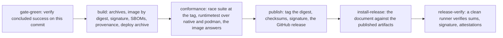

# Release and check

## Overview

Slice 048 of [[031-hosted-sandbox-consolidation]], the last row of its
cutover critical path. Every other slice made `cellad` able to run a
tenant's sandboxes; this one makes a tag produce something a plane can
pin. It builds [[014-release-and-installation]]'s pipeline, deploy tree,
install document and `check` subcommand against what the tree carries on
2026-09-20, and states in the pipeline itself which jobs are real and
which wait on [[012-test-stubs-and-tiers]] and [[015-conformance-suite]].

The consumer is fixed. A hosted plane pins `ghcr.io/<owner>/cellad:<tag>`
and runs the two subcommands `serve` and `egress` from that one image; it
also runs `check` as a Job or an init container before the first manifest.
The image reference is derived from the account that pushed the tag and
is written nowhere in the tree, so a fork's tag publishes under the fork.

## Current state

When this slice started: `verify.yml` ran the gate, the tidy check and
the developer image.
There was no `release.yml`, no `Dockerfile.ci`, no `deploy/`, no
`docs/install.md`, and `check` was an unknown subcommand. One tag
existed, `v0.1.0`, cut before the drivers, the store and the gateway role
landed, which is why the hosted deploy of the platform's slice 60 pins a
placeholder it cannot apply.

## Design

### Artifacts

| Artifact | Name | State |
|---|---|---|
| binaries | `cellad_<tag>_<os>_<arch>.tar.gz` for `linux` and `darwin`, `amd64` and `arm64` | built |
| checksums | `checksums.txt`, and `checksums.txt.sigstore.json`, the bundle `cosign sign-blob` writes | built |
| image | `ghcr.io/<owner>/cellad:<tag>`, `linux/amd64` and `linux/arm64`, pushed by digest and tagged after the candidate passes | built |
| attestations | a cosign signature over the image, an SPDX bill of materials for the image and one for the module graph, each attested with `actions/attest-sbom`, and a build-provenance attestation | built |
| deploy archive | `deploy-<tag>.tar.gz`, the kustomize base, the bootstrap templates and both examples, with the base's image reference rewritten to the release by digest | built |
| `cella_<tag>_<os>_<arch>.tar.gz` | the agent client of [[011-agent-client]] | no `cmd/cella` in the tree |
| `ghcr.io/<owner>/cella-stubs:<tag>` | the stub binary of [[012-test-stubs-and-tiers]] | not built |
| `ghcr.io/<owner>/cella-display:<tag>` | the desktop of [[023-computer-use-operations]] | not built |

`RELEASE_IMAGE_NAMESPACE`, a repository variable, overrides the derived
namespace; unset, the namespace is `github.repository_owner` lowered.
Neither the workflow nor any file of the deploy archive holds a literal
account, which `TestReleasePublishesUnderTheOwnersNamespace` reads.

### Pipeline

`release.yml` on a `v*` tag. The jobs are [[014-release-and-installation]]'s,
in its order, with one job ahead of them and with the two that depend on
unbuilt specs reduced to what is provable today.

What each job does, and what it does not.

| Job | Real today | Waiting on |
|---|---|---|
| `gate-green` | the `verify` run for the push of this commit concluded success; a tag on a red or ungated commit publishes nothing | - |
| `build` | the eight archives from one compilation, the multi-arch image pushed by digest and under no tag, `cosign sign`, two SPDX documents attested, the deploy archive with the image pinned by digest | - |
| `conformance` | `go test -race ./...` at the tag, which is the unit and race tiers and carries `runtimetest` over the native driver and over podman with the engine the job starts; then the published image answers `version` and `check` fails closed on an unreachable issuer with every optional dependency reported not configured | the kind stack of [[012-test-stubs-and-tiers]] and the suite of [[015-conformance-suite]]; the job runs neither and says so |
| `publish` | the digest takes the `:<tag>` reference, `checksums.txt` is signed, and the release body is the CHANGELOG section the gate's reader returns | - |
| `install-release` | the published deploy archive and binary archive are downloaded on a runner with nothing of the checkout, every overlay renders, and the rendered image reference is the published digest | the kind walk of `docs/install.md`, which needs an OpenID Connect issuer the job can reach: the stub issuer is [[012-test-stubs-and-tiers]]'s. The walk runs when the repository variable `RELEASE_INSTALL_KIND` is `1` |
| `release-verify` | on a clean runner with no checkout: every asset present, `cosign verify-blob` over the checksums against this workflow's identity, `sha256sum -c`, `cosign verify` over the image, `gh attestation verify` over the image, and the image's binary compared byte for byte with the archive's | - |

The every-push half is the `install` job of `verify.yml`: it renders
every overlay with `kubectl kustomize` and asserts the base pins no
namespace and no registry. The same reason holds it back from the walk.

`Dockerfile.ci` has no build stage. Its runtime stage is `Dockerfile`'s
between the two `shared runtime base` markers, byte for byte, which
`TestRuntimeStagesMatch` reads; the file's own instructions are the
`COPY` of `dist/cellad_linux_${TARGETARCH}`, the file buildx substitutes
per platform, and the entry point. The image and the archive therefore
carry one compilation, which `release-verify` proves with `cmp`.

### Deploy manifests

`deploy/base` pins no namespace and no registry, so an overlay sets both
and the release pipeline appends the `images` entry that points the
placeholder `cellad` at the published digest.

| Object | What it carries |
|---|---|
| `Deployment` | one replica, `Recreate`, the hardening below, the probes of [[002-repository-scaffold]] on the internal port, `terminationGracePeriodSeconds: 90` |
| `Service` | the public port; the internal port is the cluster's and is not routed |
| `ServiceAccount` | mounted, unlike a sandbox's: the k8s driver builds its client from the in-cluster configuration |
| `Role`, `RoleBinding` | the twelve accesses `runtime/k8s`'s verb table names, in one namespace: `get`, `list`, `create`, `delete`, `patch` on Pods and PersistentVolumeClaims, `create` on `pods/exec`, `get` on `pods/log` |
| `NetworkPolicy` | `cellad` itself: ingress on the public port, egress to DNS and to the endpoints it dials |
| `PodDisruptionBudget` | `maxUnavailable: 1`; a budget of `minAvailable: 1` over one replica blocks every node drain |

The Role is narrower than [[014-release-and-installation]] first wrote.
That spec named a dry-run create of a Pod, a PVC, a NetworkPolicy and a
Secret. The driver of [[036-k8s-driver]] writes no NetworkPolicy, because
the boundary is the gateway's ([[018-egress-and-secrets]]), and no Secret,
because a secret value is sealed in Postgres under `CELLA_SECRET_KEY`.
Granting either would be access nothing uses. The same two objects drop
out of the check.

The Pod's security context is the one [[014-release-and-installation]]
lists and is distinct from the sandbox baseline of
[[013-security-and-threat-model]]: `runAsNonRoot`, a non-zero uid, every
capability dropped, `seccompProfile: RuntimeDefault`, no privilege
escalation, and a read-only root filesystem with `CELLA_DATA_DIR` on an
`emptyDir`. `CELLA_K8S_NAMESPACE` comes from the downward API, so the
driver writes in the namespace the overlay chose rather than in the
driver's default, which would be a namespace the Role does not cover.

`deploy/bootstrap` holds the Namespace and the Secret templates an
operator applies once by hand: `CELLA_TOKEN_KEY`, the authorizer's URL
and bearer, the sink's URL and secret, `CELLA_DB_URL` with
`CELLA_SECRET_KEY`, and the gateway's `CELLA_ENVIRONMENT_KEY` with
`CELLA_EGRESS_CA_KEY`. Each template carries the command that mints its
value. A bearer and the URL it authorises are one Secret, because a URL
without its bearer is a start-up failure and the pair is rotated
together.

`deploy/examples/kind` and `deploy/examples/generic` are the two
overlays an operator starts from: the first with the memory store on a
laptop cluster, the second with Postgres, an authorizer and a sink.
`prometheusrule.yaml` sits beside the base's kustomization and outside
it, because the kind it declares is the Prometheus Operator's CRD and a
cluster without that operator refuses the apply. Its groups are
[[017-observability]]'s alerts as placeholders: the metric names are the
ones that spec fixes, and the spec is not built, so the file is a
template an operator edits rather than a rule set that fires.

### cellad check

`internal/check` reads the whole configuration and prints one line per
requirement, `ok`, `FAIL` with the reason, or `skip` with why the
requirement does not apply. Exit 1 on any failure. The mandatory rows
come first, then the optional ones in configuration order, so the output
of two installations can be read side by side.

The checks are not written twice. The line is the start-up path of
`cellad serve` asked one question at a time: `config.Load`,
`auth.Start`, `Authorizer.Check`, `Driver.Preflight`. An installation
that passes `check` is one that would have started.

| Line | What it asks | Failure means |
|---|---|---|
| `configuration` | `config.Load` over the environment | a variable is missing or malformed; the line carries every problem in one sorted message, so a deployment is fixed in one round |
| `identity` | `auth.Start`: each issuer's discovery document and key set fetched, `CELLA_TOKEN_KEY` parsed into a signer | an issuer that does not answer, publishes no usable key, or a key that cannot sign |
| `authorizer` | `Authorizer.Check`: the reserved probe id `sbx_00000000000000000000000000` ([[006-identity]]) | the endpoint is unreachable, or it allowed the probe, which is an endpoint that does not read the request. The line holds under the built-in owner policy, which denies the probe too |
| `backend` | `Driver.Preflight` for the selected `CELLA_RUNTIME` | on `k8s`, the cluster does not answer or the ServiceAccount lacks one of the verb table's accesses, which the line names, or the storage class does not exist; on `podman`, no candidate socket answered; on `native`, the state directory is gone |
| `data directory` | a file created and removed under `CELLA_DATA_DIR` | the readiness probe of [[002-repository-scaffold]] would fail from the first request |
| `admission` | `CELLA_ADMISSION_URL` | not configured when unset. Set, the line reports that the client lands with slice 047: `internal/config` reads no admission variable today, so `check` cannot probe an endpoint the binary does not dial |
| `sink` | `CELLA_EVENTS_URL`: one signed probe record, `Cella-Signature` over the body under each configured secret | not configured when unset. A 2xx is the acknowledgement; a 400 also passes, because the signature verified and the sink refused the body, which is [[009-events]]'s permanent drop; a 401 is a secret the two ends do not share |
| `store` | `CELLA_DB_URL`: the pool opens and `schema_migrations` is read | not configured when unset. A database with no schema passes, since `serve` applies it at start; a version below the binary's passes and says how many migrations are pending; a dirty schema, or a version above the binary's, fails with both numbers, which is `internal/store/postgres`'s own guard |
| `gateway` | `CELLA_GATEWAY`: the host resolves | not configured when unset. The line resolves and does not dial: the boundary a plane deploys admits the sandboxes to the gateway and not the control plane, so a refused connection from `cellad` is the policy working |

The backend line asks `Preflight` rather than issuing a dry-run create.
The two are the same question: `Preflight` runs one
`SelfSubjectAccessReview` per entry of the driver's own verb table, which
is the list a Role is written from, and it writes nothing. A dry-run
create would need the driver's Pod renderer, which is `runtime/k8s`'s,
and would prove less.

The store line reads and never migrates. `postgres.Open` applies the
pending migrations, which is right for a process that is about to serve
and wrong for a command an operator points at a live database.

### Versioning

Semantic versions, and the module stays `v0`, so a minor may change the
schema or an exported package with a CHANGELOG entry until `v1.0.0`. The
image tag is the git tag, unaltered: `ghcr.io/<owner>/cellad:v0.2.0` is
built from `v0.2.0` and from no other commit. `cellad version` prints
the same identity as `cellad -version`, so a Job that is one container
and one argument can read it.

A `v*` tag needs its CHANGELOG section, which the pre-push hook refuses
without and which `publish` reads with the gate's own reader. The tag is
cut with `go tool lateregate release vX.Y.Z`.

## Not in this spec

The stubs and the tiers ([[012-test-stubs-and-tiers]]); the suite the
conformance job will run ([[015-conformance-suite]]); the alert rules
themselves ([[017-observability]]); `docs/upgrades/` and the backup and
restore rows of [[014-release-and-installation]], which belong with a
second release to roll back to.

## Acceptance criteria

| Criterion | Test that proves it | State |
|---|---|---|
| `Dockerfile` and `Dockerfile.ci` share the runtime stage byte for byte, and the release file has no build stage | `TestRuntimeStagesMatch` | open |
| No workflow, manifest, document or script names a fixed image namespace, and the workflow derives one from the repository owner | `TestReleasePublishesUnderTheOwnersNamespace` | open |
| Every overlay renders and the base pins no namespace and no registry | `TestOverlaysRender` | open |
| The base carries every Pod security field and the Role holds exactly the driver's verb table | `TestBaseIsConfined`, `TestRoleMatchesTheDriversVerbs` | open |
| Nothing under `deploy/`, `docs/`, the workflows or `internal/config`'s defaults names a Latere host, image, pool or namespace | `TestNoLatereCoordinatesInReleasedArtifacts` | open |
| `cellad check` fails on each mandatory requirement removed one at a time, an authorizer that allows the probe included | `TestCheckNamesEachFailure`, `TestCheckFailsAnAuthorizerThatAllowsTheProbe` | open |
| Each optional dependency reports not configured when its variable is unset, and answers when it is set | `TestCheckSkipsUnconfigured`, `TestCheckReachesEachOptionalDependency` | open |
| `cellad check` and `cellad version` are subcommands, and an unknown one is still exit 2 | `TestCheckSubcommand`, `TestVersionSubcommand`, `TestUnknownSubcommandIsAUsageError` | open |
| A tag's release carries every artifact of the table and verifies from a clean runner | the `release-verify` job | open |

## Outcome

Built on 2026-09-20 in nine commits. `go tool lateregate`: 16 gates pass,
3 skipped by configuration, `go test -race ./...` included. Coverage:
`internal/check` 97.2% (139 of 143 statements), `cmd/cellad` 91.5%, every
one of the 22 measured packages above 90%.

### What runs for real, and what does not

| Job | Today |
|---|---|
| `gate-green` | real: the `verify` run for the push of the tag's commit must have concluded success |
| `build` | real: eight archives from one compilation, the multi-arch image pushed by digest and under no tag, `cosign sign`, two SPDX documents attested with `actions/attest-sbom` and a provenance attestation, and the deploy archive whose overlays are rendered against the published digest before it is packed |
| `conformance` | real in part. `go test -race ./...` at the tag, which carries `runtimetest` over the native driver and over podman with the engine the job starts, and the published image answering `version` and failing `check` closed on an unreachable issuer with every optional line reported not configured. The kind stack of [[012-test-stubs-and-tiers]] and the suite of [[015-conformance-suite]] do not run: neither is built, and the job's comment says which spec brings each one |
| `publish` | real: the digest takes the tag, `checksums.txt` is signed with `cosign sign-blob`, and the body is the CHANGELOG section the gate's own reader returns |
| `install-release` | real in part. The published deploy archive and binary archive are downloaded on a runner holding nothing of the checkout, the binary reports its identity, and every overlay of the archive renders against the published digest. The kind walk of `docs/install.md` is behind the repository variable `RELEASE_INSTALL_KIND`, because `cellad serve` verifies every caller against an OpenID Connect issuer, ships none, and the stub issuer is [[012-test-stubs-and-tiers]]'s |
| `release-verify` | real: on a clean runner with no checkout, every asset present, `cosign verify-blob` over the checksums against this workflow's identity, `sha256sum -c`, `cosign verify` and `gh attestation verify` over the image, the image's binary compared byte for byte with the archive's, and the release body diffed against the CHANGELOG section at the tag |

The every-push half is the `install` job of `verify.yml`, which renders
the deploy tree by running the root package's suite on a runner that has
`kubectl` and failing on a skipped test. The document walk waits on the
same stub issuer.

### What was built

`.github/workflows/release.yml` on a `v*` tag, `Dockerfile.ci` whose
runtime stage is `Dockerfile`'s between the markers,
`tools/release/build.sh`, `tools/docs/run-blocks.sh`, `deploy/` with the
base, the bootstrap templates and two overlays, `docs/install.md`,
`internal/check` with the `check` and `version` subcommands of
`cmd/cellad`, and `deploy/README.md`.

The artifacts a tag produces: `cellad_<tag>_<os>_<arch>.tar.gz` for
linux and darwin on amd64 and arm64, `checksums.txt` with
`checksums.txt.sigstore.json`, `deploy-<tag>.tar.gz`,
`sbom-module.spdx.json`, `sbom-cellad.spdx.json`, and
`ghcr.io/<owner>/cellad:<tag>`. No `cella_*` archive, because
`cmd/cella` is [[011-agent-client]]'s and is not in the tree; no
`cella-stubs` or `cella-display` image, for the same reason.

### Decisions

| Decision | Why |
|---|---|
| The pipeline is written here rather than called from `latere-ai/ci` | the reusable workflows do not fit: `notes-release` builds nothing, `cli-release` is goreleaser, and `service-release` deploys to a cluster and smokes a live host. The shared piece that does fit, the release-note reader, is called |
| `cellad check` takes the driver from its caller | the role holds no `switch` over `CELLA_RUNTIME` of its own; `cmd/cellad`'s `openRuntime` is one function that the serve role and the check role both call, so the check drives the driver the node would |
| The backend line is `Preflight`, not a dry-run create | `Preflight` asks the same question with one `SelfSubjectAccessReview` per entry of the driver's verb table, which is the list a Role is written from, and writes nothing. A dry-run create would need the driver's Pod renderer and would prove less |
| The store line reads and never migrates | `postgres.Open` applies the pending migrations, which is right for a process about to serve and wrong for a command an operator points at a live database. A fresh database and a pending migration pass; a dirty schema and one above this binary's fail |
| The gateway line resolves and does not dial | the boundary an installation deploys admits the sandboxes to the door and not the control plane, so a refused connection from `cellad` is the policy working and a dial would fail a correct deployment |
| The admission line reports which release reaches it | `internal/config` reads no admission variable, so a probe would answer for a call this binary never makes. A hosted plane already sets the pair ahead of the client |
| `cellad check` is a Job and not an init container | an init container makes every optional dependency mandatory for a restart: a sink briefly down would keep the Pod from starting, where `cellad serve` starts and journals |
| `maxUnavailable: 1` rather than `minAvailable: 1` | one replica under `minAvailable: 1` refuses every node drain |
| `CELLA_K8S_NAMESPACE` from the downward API | the driver's `cella` default would write sandbox Pods in a namespace the overlay did not choose and the Role does not cover |
| The base's image is the bare name `cellad` | a base that named a registry would carry an account, and the release's `images` entry points the placeholder at the published digest |

### What the tests hold

| Test | What it would catch |
|---|---|
| `TestRuntimeStagesMatch` | a runtime stage that drifted between the developer and the release image, a build stage in the release file, a binary copied from somewhere other than the pipeline's |
| `TestReleasePublishesUnderTheOwnersNamespace` | a literal account under `ghcr.io` anywhere outside `specs/`, and a workflow that stopped deriving the namespace or dropped the override |
| `TestNoLatereCoordinatesInReleasedArtifacts` | a host, image, pool, namespace, storage class, pull secret or service name of one hosted plane under `deploy/`, `docs/`, `.github/`, `internal/config` or `tools/` |
| `TestOverlaysRender`, `TestEveryKustomizationIsRendered` | an overlay that does not build, a base that pinned a namespace or a registry, an overlay added without a test |
| `TestBaseIsConfined` | a Pod that lost one of the six security fields, or a data directory that is not writable under a read-only root |
| `TestRoleMatchesTheDriversVerbs` | a verb the driver needs and a verb it does not, and anything cluster-wide |
| `TestTheCheckJobRunsTheDeploymentsConfiguration` | the two documents' environments drifting apart, which would make the check answer for an installation the control plane does not meet |
| `TestTheAudienceIsNamedInEveryContainer`, `TestNoCredentialIsSharedBetweenTwoVariables` | the two rules the `identity` gate reads over `deploy/` |
| `TestTheReleaseRunsSpec014sJobsInOrder` | a job that moved before `publish`, or one this spec does not name |
| `TestCheckNamesEachFailure` | each mandatory requirement, removed one at a time, including an authorizer that allows the probe |
| `TestEveryOptionalLineNamesItsVariableWhenUnset`, `TestSinkReadsEachAnswer`, `TestSchemaLineReadsEveryAnswerTheDatabaseCanGive`, `TestGatewayResolvesAndDoesNotDial` | an optional dependency that failed instead of reporting itself unconfigured, a sink answer read wrongly, a schema state read wrongly, a gateway line that dialled |
| `TestRunBlocksRunsAFencedProgram` | a document runner that does not run the blocks in one shell, runs a block of another language, or continues past a failure |

`internal/check` is tested against a real OpenID Connect issuer
(`issuertest`), the shared stub authorizer, an httptest sink and the
native backend. The store line's schema reading is tested as a pure
function over every case the guard of [[010-state]] names, with the pool
path covered by a database that does not answer: a container per case
would duplicate the suite `internal/store/postgres` already runs.

### Left open

- The kind walk of `docs/install.md`, on every push and on a tag, waits
  on the stub issuer of [[012-test-stubs-and-tiers]]. Both jobs say so
  and the tag's half is one repository variable away.
- The conformance job runs the driver suite and not the API suite of
  [[015-conformance-suite]], which is not built.
- `docs/upgrades/`, the backup and the restore walk of
  [[014-release-and-installation]]: there is one tag to roll back to, so
  the document is written with the second release.
- The distroless base is pinned by tag and not by digest, as it was
  before this slice. Pinning it is a one-line change in two files and a
  decision about who updates the digest.
