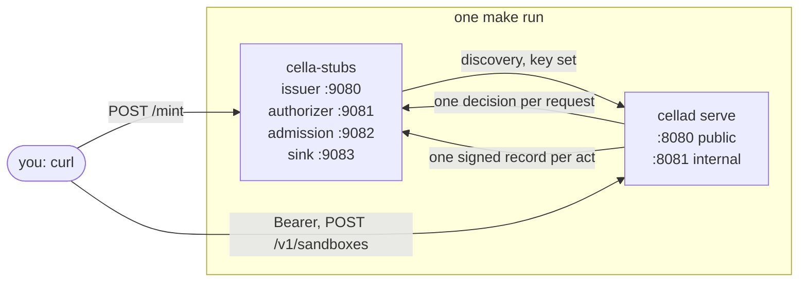
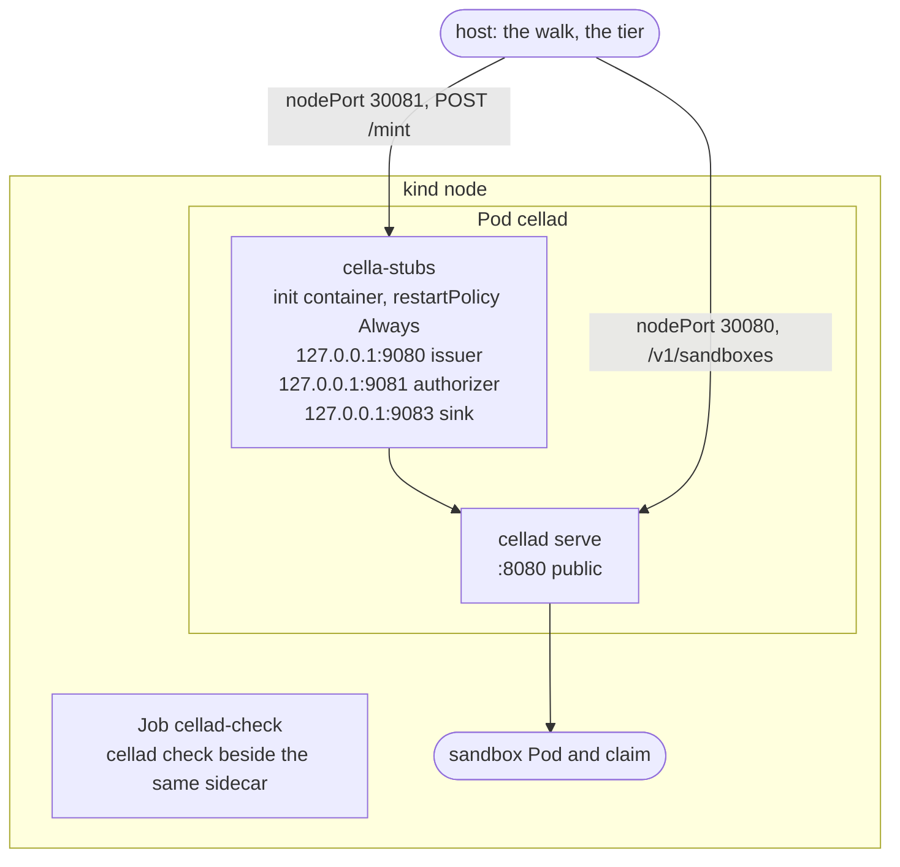

# Stubs and tiers

## Overview

Slice 049 of [[031-hosted-sandbox-consolidation]]. Slice 048 built the
release pipeline of [[014-release-and-installation]] and left two halves
gated: the `install` job of `verify.yml` renders the deploy tree and does
not walk `docs/install.md`, and `install-release` walks the published
artifacts and hides the cluster half behind `RELEASE_INSTALL_KIND`. One
thing is missing in both, and it is the same thing: `cellad serve`
verifies every caller against an OpenID Connect issuer and ships none, so
a Pod in a continuous integration cluster has nothing to verify a token
against and never becomes ready.

This slice builds the part of [[012-test-stubs-and-tiers]] that closes
that gap: one binary, `cella-stubs`, that serves the operator endpoints
the control plane dials, a `make run` that needs no issuer of your own, a
kind overlay that runs the stubs beside `cellad` in one Pod, and the two
jobs that walk the document against that stack.

It does not build the whole of 012. The upstream stub, the gateway and
worker tiers, the Postgres and local tiers, and `make run-worker` stay
with the slices whose behaviour they exercise.

## Current state

`make run` refuses without `CELLA_OIDC_ISSUERS`, and the comment in the
recipe names this spec as the reason. `deploy/examples/kind` is the
operator's laptop overlay and has no issuer in it. `verify.yml` has one
`install` job that renders. `release.yml` has a `conformance` job whose
comment says the kind stack is not built and an `install-release` job
whose cluster half is a repository variable away. `pkg/authkit/issuertest`
and `pkg/authz/stub` are the family's issuer and authorizer stubs and both
already build without a listener, for a binary that serves them itself.

## Design

### The four roles

One binary with four listeners, each on loopback, each a role that can be
turned off with an empty address. The two endpoints the family already
carries are reused; the two that answer a contract of this repository are
written here.

| Role | Serves | Built from |
|---|---|---|
| issuer | `GET /.well-known/openid-configuration`, `GET /jwks`, `POST /mint`, `POST /rotate`, `GET /requests` | `latere.ai/x/pkg/authkit/issuertest` behind a listener |
| authorizer | `POST /` and the control API of the shared stub, the envelope of [[006-identity]] | `latere.ai/x/pkg/authz/stub` behind a listener |
| admission | `POST /`, the envelope of [[007-admission]] | written here |
| sink | `POST /`, `GET /events`, the record of [[009-events]] | written here |

The reuse stops where the stub is the counterparty of the code under
test. The sink verifies `Cella-Signature` with its own HMAC over
`<t>.<body>`, and not with `internal/events`'s `Signature`, because a
counterparty that shares the implementation cancels out a defect in the
formula instead of catching it. The admission endpoint decodes the body
of [[007-admission]] into its own struct for the same reason, and because
the client that sends it is slice 047's and is not in this tree.

| Flag | Role | Effect |
|---|---|---|
| `-issuer <addr>` | issuer | listen address, empty to turn the role off; the default is `127.0.0.1:9080` |
| `-issuer-url <url>` | issuer | the `iss` every token carries and the discovery base; the listener's own address when empty |
| `-issuer-audience <aud>` | issuer | the `aud` a minted token carries when the request names none; `cella` |
| `-issuer-alg rs256\|es256` | issuer | the key set's algorithm |
| `-authorizer <addr>` | authorizer | `127.0.0.1:9081` |
| `-authorizer-token <bearer>` | authorizer | the bearer the endpoint requires |
| `-authorizer-deny <action>` | authorizer | deny one action, repeatable; `X-Stub-Deny: <action>` is the same refusal per request |
| `-authorizer-limits <json>`, `-authorizer-filter <json>`, `-authorizer-ttl <seconds>` | authorizer | what an allow carries |
| `-authorizer-fail <mode>` | authorizer | `timeout`, `malformed`, `no-allow`, `status:<code>` |
| `-admission <addr>` | admission | `127.0.0.1:9082` |
| `-admission-default <field=value>` | admission | an operator default applied where the manifest leaves the field empty, repeatable |
| `-admission-rewrite <field=value>` | admission | a rewrite applied whatever the manifest says, repeatable |
| `-admission-warn <text>` | admission | a warning on every allow, repeatable |
| `-admission-refuse <reason>` | admission | refuse every apply |
| `-admission-refuse-image <ref>` | admission | refuse an apply naming that image |
| `-admission-fail <mode>` | admission | the four modes above |
| `-sink <addr>` | sink | `127.0.0.1:9083` |
| `-sink-secret <secret>` | sink | a secret the signature is verified against, repeatable for a rotation |
| `-sink-fail-first <n>`, `-sink-fail-status <code>` | sink | answer the first n deliveries with that status, 503 by default, so the retry of [[009-events]] is exercised |
| `-sink-status <code>` | sink | answer the next delivery with that status and then return to normal |

A role holds nothing across a restart: the minted tokens, the recorded
requests and the delivered records live in memory and the process writes
no file. Every role logs one line per request, `<role> <method> <path>
<status>`, so a failed tier reads as a sequence of calls.

The stubs refuse an apply, deny a decision and reject a signature; they
never decide anything a real endpoint would not. The one rule the shared
authorizer stub enforces for free is the one the check command reads: the
probe id `authz.ProbeID` is denied for every subject and every action.

### make run

`make run` builds both binaries, starts `cella-stubs`, waits for the
issuer's key set, starts `cellad serve` pointed at the stub issuer, the
stub authorizer and the stub sink, prints the one command that mints a
caller token, and stops both on an interrupt. `tools/run/up.sh` is the
bootstrap and the Makefile target is its name, so the same script is what
a test drives.

The signing key is generated once under `out/run/` and kept, so a restart
does not invalidate the tokens of the last one. `CELLA_RUNTIME=native`
with `CELLA_ALLOW_UNSAFE_NATIVE=true` stays written out in the recipe:
[[002-repository-scaffold]] makes the consent explicit and a bootstrap
that hides it would be the one place it is not read.

The admission endpoint runs and `cellad` does not dial it. This tree reads
no admission variable; the client and `CELLA_ADMISSION_URL` are slice
047's. The bootstrap prints the endpoint's address and wires nothing, so a
variable no binary reads is not exported as though it were configuration.

### Tiers

| Tier | Command | Needs | Runs |
|---|---|---|---|
| unit | `make test` | Go | the gate, every push |
| podman | `make test-podman` | a rootless Podman socket | every push on `ubuntu-latest`, and in the release pipeline's conformance job |
| kind | `make test-kind` | kind, kubectl, a container runtime | on demand, and in the two jobs below |

The kind tier is one Go test behind the `e2e` build tag, so the gate's
untagged suite never reaches `kind`, `kubectl` or a cluster. It reads two
variables: with `CELLA_TEST_KIND=1` it brings the stack up itself through
`deploy/examples/kind-stubs/up.sh` and tears it down after; with
`CELLA_TEST_URL` and `CELLA_TEST_TOKEN` it runs the same assertions
against a stack somebody else brought up, which is what the two workflow
jobs do with the cluster the document walk created. With neither it skips
and says which variable turns it on.

### The kind stack

The stubs are a container of the `cellad` Pod and not a Deployment of
their own. That is not a packaging preference: `CELLA_AUTHORIZER_URL` that
is `http://` on a host other than loopback is a start-up failure with no
escape hatch ([[006-identity]]), and [[007-admission]] states the same
rule for its endpoint. A second Deployment could serve the issuer, which
has `CELLA_OIDC_INSECURE_ISSUERS`, and could not serve the authorizer at
all. Sharing the Pod's network namespace makes every endpoint
`http://127.0.0.1:<port>` and the rule holds with nothing waived.

It is a sidecar in the Kubernetes sense: an init container with
`restartPolicy: Always`, which starts before `cellad` and is terminated
when the Job's main container ends. Ordering alone is not enough, because
`cellad` fetches the discovery document at start and the check Job has
`backoffLimit: 0`, so a sidecar that has started and is not yet listening
is a permanently failed Job. A `startupProbe` over the issuer's discovery
document is what the main container waits on.

`deploy/examples/kind-stubs` is an overlay over `deploy/examples/kind`
with the sidecar patch, the two Secrets the base reads as optional keys
(the authorizer's URL and bearer, the sink's URL and secret), a ConfigMap
patch naming the loopback issuer and the administrator it renders, and a
second NodePort that publishes the issuer to the host so a caller outside
the cluster can mint. `up.sh` creates the cluster, loads the two image
archives, applies the overlay and prints `CELLA_TEST_URL` and
`CELLA_TEST_TOKEN`; `down.sh` deletes the cluster.

The stack is the test installation and not an installation: the overlay
carries a stub issuer, a stub authorizer and a stub sink, which is why it
is a second directory and why `deploy/examples/kind` is left as the
document's own.

### CI

`verify.yml`'s `install` job keeps the render and gains the walk: it
builds both images, creates one cluster, loads them, applies the stubs
overlay's images entry, walks `docs/install.md` with the stub issuer as
the installation's issuer, and then runs the kind tier against the cluster
the walk left standing. One cluster per run, one `docker build` per image,
and the walk and the tier share both.

`release.yml` changes in two jobs and adds none, because
[[014-release-and-installation]]'s order is a test of its own. `build`
also builds and pushes `ghcr.io/<owner>/cella-stubs:<tag>` from
`Dockerfile.stubs`. `conformance` keeps the race tier and the driver suite
and replaces the comment that says the kind stack is not built with the
stack itself, run against the published `cellad` image and the stubs
image, and the API end-to-end of the kind tier against it. The API
conformance suite of [[015-conformance-suite]] is still not built and the
job still says so. `install-release` loses `RELEASE_INSTALL_KIND`: the
walk runs on every tag, against the published deploy archive, the
published image and the stub issuer the pipeline just built.

`cella-stubs` is a test image. `Dockerfile.stubs` labels it so, nothing
under `deploy/base` names it, and it is never an installation:
[[014-release-and-installation]] lists it beside `cellad` because the
conformance job pulls it, not because an operator does.

### Configuration

No `CELLA_*` variable is added. Every stub is configured by flag, because
a stub is a process a test starts with arguments and not an installation
somebody deploys. The variables a tier reads, `CELLA_TEST_URL` and
`CELLA_TEST_TOKEN`, are [[012-test-stubs-and-tiers]]'s own and are not
`cellad`'s configuration; `CELLA_TEST_KIND` joins them for the tier that
brings its own cluster up.

### Decisions

| Decision | Why |
|---|---|
| `cmd/cella-stubs` and `internal/stubs` rather than 012's `test/stubs` | the roles are a binary of this module with a depcheck row of its own, and `internal/` is where this repository puts a package no consumer imports. 012's path predates the repository's layout |
| One container with four ports, not five sidecars | one binary serves every role, so four listeners in one process is the same loopback surface with one container to schedule, one image to load and one log to read |
| The sink serves `GET /events`, not `/records` | 012 fixes the name and the tier reads it |
| `-issuer-alg` picks the algorithm rather than adding a second key | `issuertest` is the family's issuer and its options select the key set's algorithm; a key set holding two algorithms at once is the verifier's own test and not a deployment any issuer serves |
| The admission role runs and nothing dials it | this tree reads no admission variable. Wiring one that no binary reads would be configuration theatre, and slice 047's client brings the variable and its bearer rule together |
| The sink and the admission endpoint are written here | a counterparty built from the implementation under test proves the two agree and not that either is right |
| The kind tier is one test with two entry points | the workflow already has a cluster from the walk, and a tier that insisted on creating its own would double the slowest step in the run |

## Not in this spec

The upstream stub and the egress tiers ([[018-egress-and-secrets]]); the
worker tier and `make run-worker` ([[021-data-plane-workers]]); the
Postgres and local tiers; the API conformance suite the kind stack will
also run ([[015-conformance-suite]]); Cilium in the kind cluster, which
[[012-test-stubs-and-tiers]] brings with the no-inbound proof of the
worker tier.

## Acceptance criteria

| Criterion | Test that proves it | State |
|---|---|---|
| The issuer serves a discovery document and a key set `internal/auth`'s verifier accepts, and mints a token it verifies, under RS256 and under ES256 | `TestTheIssuerIsOneTheVerifierAccepts`, `TestTheIssuerMintsWhatItIsAskedFor`, `TestTheIssuerNamesTheAddressItIsGiven` | passing |
| The authorizer denies `authz.ProbeID`, answers the shared conformance suite, and every flag in its row changes one answer | `TestTheAuthorizerPassesTheSharedConformanceSuite`, `TestTheAuthorizerDeniesTheProbe`, `TestTheAuthorizerAnswersWhatItsFlagsSay`, `TestTheAuthorizerDeniesOneRequestByHeader`, `TestTheAuthorizerProducesEachOutage` | passing |
| The admission endpoint answers the envelope of [[007-admission]] with the operator defaults applied, refuses the image it is told to, and produces each failure mode | `TestTheAdmissionEndpointAnswersTheEnvelope`, `TestTheAdmissionEndpointRefuses`, `TestTheAdmissionEndpointRefusesEveryApply`, `TestTheAdmissionEndpointProducesEachOutage` | passing |
| The sink accepts a record signed under either secret, refuses a bad signature and a stale `t`, serves what it stored, and fails the first n deliveries when asked | `TestTheSinkVerifiesWhatTheDelivererSigns`, `TestTheSinkRefusesWhatItCannotVerify`, `TestTheSinkServesWhatItHeld`, `TestTheSinkFailsTheFirstDeliveries` | passing |
| The binary serves the four roles on the addresses it was given, logs one line per request, and stops on an interrupt | `TestEveryRoleListensAndIsLogged`, `TestARoleWithNoAddressIsNotStarted`, `TestStartRefusesWhatItCannotServe`, `TestTheBinaryServesEveryRoleAndStops`, `TestTheBinaryRefusesWhatItCannotRun` | passing |
| `make run` needs no `CELLA_OIDC_ISSUERS`, brings both processes up, and a token minted at the stub issuer creates a sandbox | `TestRunBootstrap` behind the `e2e` tag | passing; run here and in the `install` job |
| The kind overlay renders, and its Deployment and check Job carry the stubs beside `cellad` | `TestOverlaysRender`, `TestTheStubsRunBesideTheControlPlane` | passing |
| The kind stack runs the lifecycle through the API with a token from the stub issuer, and the check Job is green | `TestClusterLifecycle`, and the document's own `kubectl wait` over the Job in the walk | built; it runs in the `install` job and in the release pipeline, which is its first execution: see "What was tried on the machine that built this" |
| The install job walks `docs/install.md` against kind with the stubs on every push | the `install` job of `verify.yml`, and `TestTheInstallJobWalksTheDocument` over it | passing |
| The release pipeline builds the stubs image, runs the kind stack in `conformance`, and walks the document in `install-release` with no gate variable | `TestTheReleaseRunsTheStubsAndTheStack` | passing |
| Nothing under `deploy/` or the workflows names a Latere coordinate, and the stubs image is nowhere under `deploy/base` | `TestNoLatereCoordinatesInReleasedArtifacts`, `TestTheStubsImageIsNoInstallation` | passing |

## Outcome

Built on 2026-09-20 in sixteen commits. `go tool lateregate`: 16 gates,
3 skipped by configuration, `go test -race ./...` included. Coverage:
`internal/stubs` 94.9%, `cmd/cella-stubs` 97.8%, every measured package above
90%.

### What runs, and where

| Piece | Today |
|---|---|
| `cella-stubs` | the four roles on four loopback listeners in one process, each one line of log per request, no state across a restart. The issuer is `pkg/authkit/issuertest` and the authorizer is `pkg/authz/stub`, each behind a listener of `internal/stubs`; the admission endpoint and the sink are written against specs 007 and 009 there |
| `make run` | `tools/run/up.sh`: both binaries built, the signing key and the sink's secret generated once under `out/run/`, the stubs started and waited for, `cellad serve` wired to the issuer, the authorizer and the sink, and the mint command and the first `curl` printed. Proved by `TestRunBootstrap`, which ran here in 10 seconds: no `CELLA_OIDC_ISSUERS`, a token minted at the stub issuer, one sandbox created and deleted |
| `make test`, `make test-podman`, `make test-kind` | the three tiers this slice carries. The podman target runs the driver's own suite, which skips where no engine answers |
| `deploy/examples/kind-stubs` | the kind overlay: the stubs as an init container with `restartPolicy: Always` in the `cellad` Deployment and in the check Job, a startup probe over the issuer's discovery document, the two Secrets the base reads as optional keys, a ConfigMap naming the loopback issuer, and a NodePort publishing the mint route and the sink's feed to the host. `up.sh` and `down.sh` bring the cluster up and take it down |
| `test/kind` | `TestClusterLifecycle`, behind the `e2e` tag: create, wait for `Ready`, exec, delete, and the records of spec 009 read back from the sink. It brings the stack up with `CELLA_TEST_KIND=1` and runs against a standing one with `CELLA_TEST_URL` |
| `verify.yml` | the `install` job renders the deploy tree, runs the bootstrap tier, builds both images, brings the stack up with `up.sh`, walks `docs/install.md` against it, and then runs the kind tier against the same cluster: one cluster per run |
| `release.yml` | `build` also pushes `ghcr.io/<owner>/cella-stubs:<tag>` from `Dockerfile.stubs`; `conformance` brings the kind stack up from the published images and runs the lifecycle through the API; `install-release` walks the document against a cluster built from the published archive and images, with `RELEASE_INSTALL_KIND` and `RELEASE_INSTALL_ISSUER` gone |

`docs/install.md` gained one input, `CELLA_INSTALL_OVERLAY`, so an
installation applies its own overlay and the walk applies the one with the
stubs, and its image step no longer reaches for a registry when the image
is already on the machine.

### What was tried on the machine that built this

The bootstrap tier ran: `TestRunBootstrap` completes in ten seconds with no
issuer of the developer's own.

The kind stack did not run end to end here, and the two jobs are its first
execution. What was tried, and what it showed: a cluster from this
overlay's `kind.yaml` comes up under the podman provider on a laptop, with
the control plane ready in eighteen seconds. Building the two images in
that machine's virtual machine, which holds two gigabytes, did not finish:
the Go compilation inside the image ran for twenty minutes beside the
cluster and the container engine stopped answering, so the engine was
stopped and started once to recover it and the cluster was deleted. A
runner has Docker and the memory for both, which is why the overlay's
`up.sh` builds from the checkout and the pipeline's jobs pull instead.

Two defects the reading found before either job ran. The document's last
block deletes the cluster, because that is how an operator removes the
installation, so the tier runs before the walk and not after it. The base's
network policy admits ingress on the public port alone, so the overlay
admits the two stub ports the host reads as well, which a cluster whose
plugin enforces policy would otherwise drop.

### Decisions this slice made

The seven rows of the Design's table, and one more the tree forced: the
kind overlay pins the tag `dev` for both images, so a runner loads the
bytes it built or pulled under the name the cluster resolves, and the
release pipeline retags the published image rather than teaching the node
to pull a digest it may not be able to reach.

### Left open

- The upstream stub, the gateway and worker tiers, `make run-worker`, the
  native, postgres and local tiers, and Cilium in the kind cluster: each
  waits on the spec whose behaviour it exercises
  ([[018-egress-and-secrets]], [[021-data-plane-workers]]).
- The admission role runs and nothing dials it. This tree reads no
  admission variable; slice 047 brings the client, `CELLA_ADMISSION_URL`
  and its bearer rule, and the wiring is one line of the bootstrap and two
  keys of the overlay's Secret then.
- The API conformance suite of [[015-conformance-suite]] is not built, so
  the release pipeline's `conformance` job runs the lifecycle and not
  `TestContract`.
- `make run-down` and the derived ports of [[012-test-stubs-and-tiers]]:
  the bootstrap runs in the foreground and stops both processes on an
  interrupt, and a second clone names its port with `CELLA_RUN_PORT`.
