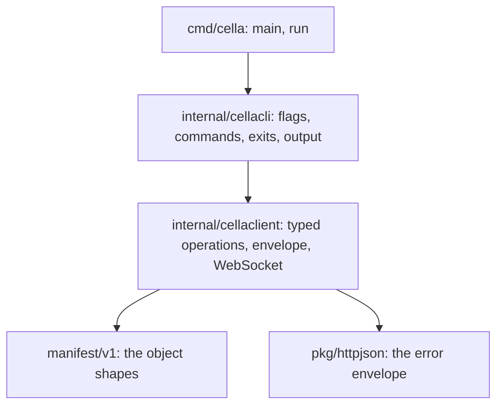

# Cella command

## Overview

`cella` is the second binary of [[001-architecture]]: one command that
speaks the `/v1` API of [[008-api]] from a shell and from an agent
inside a sandbox. This slice of [[031-hosted-sandbox-consolidation]]
builds the command, the client package under it, and the release
archives that carry it, for the routes the API serves today: sandboxes
with their verbs and their streams, files whole and granular, logs,
secrets, and the egress records.

It is the reference client for the dependent legs of
[[031-hosted-sandbox-consolidation]]: `latere-cli` and `topos` switch
to `/v1`, and what they must send is what this command sends.

## Current state

`internal/api` serves the routes of the table below. No `cmd/cella`
exists; the release pipeline of [[014-release-and-installation]]
carries four `cellad` archives and names the missing `cella_*` archives
as its one open row.

The retired hosted client is `latere-cli`'s `cella` command group. Its
verbs are the hosted product's (policy, tiers, credential catalog,
one-shot runs, convert, resize, extend) and none of them is carried:
what is carried is the shape of the file transfers and the
`--json` rule that every command answers machine-readably.

## Design

### What this slice builds and what it does not

[[011-agent-client]]'s table is written for the whole API. A command
whose route no handler serves would be a refusal a reader cannot tell
from a bug, so this slice builds the rows whose routes exist and leaves
the rest to the slice that adds the route.

| Row of [[011-agent-client]] | State here | Owner |
|---|---|---|
| `apply`, `get`, `delete`, `start`, `stop`, `exec`, `attach`, `logs`, `cp`, `egress`, `version` | built | this slice |
| `files` (granular) | built, and added to 011's table | this slice, over [[033-file-operations]]'s routes |
| `port-forward`, `token`, `events` | not built: no `dial`, `token` or `events` route in the mux | [[022-mesh-and-spawn]], [[009-events]] |
| `screenshot`, `screen`, `input`, `display` | not built: no route | [[023-computer-use-operations]] |
| `snapshot`, `env key`, and the `volume`, `set`, `environment` kinds | not built: no route, no kind | [[019-volumes]], [[020-scheduling-and-sets]], [[021-data-plane-workers]] |

### Reaching the control plane

```mermaid
flowchart LR
  A[agent or shell] --> C[cella]
  C -->|CELLA_URL, bearer per request| API[/v1 on cellad]
  subgraph inside [inside a sandbox]
    W[workload] --> C2[cella]
    F[(CELLA_TOKEN_FILE\n/run/cella/token)] --> C2
  end
  C2 -->|no flag, no login| API
```

The address is `CELLA_URL` or `--url`. The bearer is resolved per
request, in this order, so a workload inside a sandbox authenticates
with no flag at all:

1. `--token`,
2. `CELLA_TOKEN`,
3. the file at `--token-file`, else `CELLA_TOKEN_FILE`, else
   `/run/cella/token` ([[045-workload-tokens]]'s projection).

The file is read per request and never once at start, because the
controller re-projects it before expiry and a `logs -f` outlives one
token. No token at all is a usage error naming the two variables. The
transport is built with `Proxy: nil` and reads no proxy variable, so a
run inside a sandbox reaches `CELLA_URL` through the driver's rule and
not through the gateway, whose map has no entry for the control plane
([[018-egress-and-secrets]]). Trust is the system roots plus `--ca`.

### The commands

`<ref>` is a name or a prefixed id, resolved by the API's alias rule.
`<kind>` is `sandbox` or `secret`, singular or plural. Every command
takes `--json`; `get` also takes `-o`.

| Command | Route | Notes |
|---|---|---|
| `cella apply -f <file>` | `POST /v1/sandboxes`, `PUT /v1/secrets/{name}` | dispatches on `kind`; `-f -` reads stdin |
| `cella get <kind> [<ref>] [-o json\|wide\|name] [-l k=v]... [--phase p] [--owner o] [--environment e] [--limit n]` | `GET /v1/<kinds>[/{ref}]` | one object or a list; a list follows `next` to the end unless `--limit` stops it |
| `cella delete <kind> <ref>` | `DELETE /v1/<kinds>/{ref}` | 202 or 200 is exit 0 |
| `cella start <ref>`, `cella stop <ref>` | `POST /v1/sandboxes/{ref}/start`, `/stop` | |
| `cella exec <ref> [-i] [-t] [--timeout d] [--workdir w] [--env K=V]... -- <cmd>...` | `POST .../exec?wait=1`, or the exec WebSocket with `-i` or `-t` | the child's exit code is the command's |
| `cella attach <ref> [-- <cmd>...]` | the attach WebSocket | raw terminal, `SIGWINCH` resizes, restored on every exit path |
| `cella logs <ref> [-f] [--since t] [--tail n]` | `GET .../logs` | each line as it arrives |
| `cella cp <ref>:<src> <dest>`, `cella cp <src> <ref>:<dest>` | `GET .../files?path=`, `PUT .../files?dest=` | tar streamed both ways, no temporary file |
| `cella files ls <ref>:<path>` | `GET .../files/list` | |
| `cella files stat <ref>:<path>` | `GET .../files/stat` | |
| `cella files get <ref>:<path> [<dest>]` | `GET .../files/content` | stdout when no destination |
| `cella files put <src> <ref>:<path> [--mode 0644]` | `PUT .../files?path=` | `-` reads stdin |
| `cella files mkdir <ref>:<path>` | `POST .../files/mkdir` | |
| `cella files rm <ref>:<path>` | `DELETE .../files?path=` | |
| `cella files mv <ref>:<from> <ref>:<to>` | `POST .../files/move` | |
| `cella egress <ref> [--limit n]` | `GET .../egress` | the gateway's records, newest first |
| `cella version` | `GET /version` | the client's identity, and the server's when it answers |

Two decisions the API's shape forces:

- **JSON only on apply.** `manifest.Decode` and `manifest.DecodeSecret`
  accept `application/json` and nothing else, so `apply` reads
  `apiVersion`, `kind` and `metadata.name` with `encoding/json` and
  sends the file's bytes unchanged under that media type. A document
  that is not one JSON object is exit 2 naming the three fields. YAML
  input and `-o yaml` wait on the server: [[008-api]] names three YAML
  types and no handler reads `Accept` or parses one.
- **`exec` without `-i` or `-t` is `?wait=1`.** [[008-api]] gives the
  synchronous route two answers, the framed stream and the JSON result,
  and this server serves the JSON result. Its 1 MiB caps and its
  `truncated` flag are what the command prints. The framed stream, and
  with it 011's unbuffered criterion, waits on the handler.

`apply` of a `Secret` takes `--value-from-env <NAME>` or `--value-file
<path>`: the document is decoded, `spec.value` is set, and the document
is re-encoded. No path prints the value.

### Exit codes

[[011-agent-client]]'s scheme, by status class with named exceptions, so
a code the client does not know still has an exit.

| Exit | Outside `exec` | Under `exec` |
|---|---|---|
| 0 | success | the child exited 0 |
| 1 | a 5xx, including every `*_unavailable`; a stream that dropped | the same |
| 2 | usage: a flag, a reference, a document that does not parse | the same |
| 3 | refused: 400, 401, 403, 413, 415, 422, 429 | as 125 |
| 4 | 404 | as 125 |
| 5 | 409, `version_conflict` and `phase_conflict` included | as 125 |
| 7 | unreachable: dial, TLS, or timeout before a status | as 127 |
| 124 | | the server ended the command on its timeout |
| 125 | | any client-side failure that outside `exec` would be 1, 3, 4 or 5 |
| 126 | | the command could not start: `capability_unsupported` for `-i` or `-t`, or an error frame before the first byte |
| 127 | | the server unreachable |

`124` is the exit code the server reports for its own timeout and
travels through as the child's code. A refusal prints the API's
`message` on stderr as one line; with `-v` the code, the paths and the
response's request id follow on their own lines. A 429 prints
`Retry-After` in the line. No token and no secret value reaches stdout
or stderr, `-v` included.

### Output

| Kind | Default columns | `wide` adds |
|---|---|---|
| Sandbox | `NAME`, `PHASE`, `READY`, `IMAGE`, `AGE`, `OWNER` | `ID`, `ENVIRONMENT`, `DRIVER` |
| Secret | `NAME`, `KIND`, `HOSTS`, `VERSION`, `MOUNTED`, `OWNER` | `ID`, `UPDATED` |

`READY` is the `Ready` condition's status. `-o name` prints
`<kind>/<name>` per line. For one object `-o json` writes the response
body as received, never decoded and re-encoded. For a list that spanned
pages, the pages' `items` are concatenated into one envelope with
`next` empty and each item's bytes unchanged. `--json` is `-o json` for
every other command: `apply`, `get`, `delete`, `start` and `stop` write
the API's body; `exec` writes `{"exitCode","stdout","stderr",
"truncated","durationMs"}` as received; `files` and `cp` write the
route's own shape, and a route that answers 204, which carries nothing
to render, writes the path it acted on.

### Streams

`exec` with `-i` or `-t` opens the exec WebSocket, `attach` the attach
WebSocket, both `cella.exec.v1`: the first text frame is the JSON
request, binary frames are bytes both ways, `{"resize":{"cols","rows"}}`
goes up on `SIGWINCH`, and `{"exit": n}` or `{"error": {...}}` comes
down before the close. `-t`, or stdin being a terminal with `-i`,
sends `cols` and `rows`, puts the terminal in raw mode and restores it
on every exit path. The client answers the server's pings, masks every
frame it sends, and serialises its writers.

`logs -f` writes each line as it arrives. `cp` streams tar from `GET`
to disk and from disk to `PUT` without a temporary file. Progress is
off; nothing is buffered beyond one frame.

### Client policy

No retry, ever: a caller that wants one has the exit code. A 10 second
deadline to the first response byte and none on a stream, which is
`Transport.ResponseHeaderTimeout`: it starts once the request body is
written, so a 1 GiB upload is not cut off by it. Every request carries
a fresh `X-Request-Id` and `User-Agent: cella/<version>`. The id `-v`
prints is the response's, because the API stamps its own.
`RateLimit-Remaining` is not read; `Retry-After` is reported. A
response carrying fields the client does not know is rendered without
them, so a newer server is usable from an older client.

### The packages



`internal/cellaclient` is one method per route, the streams typed:
`Session` carries `Stdin`, output, `Resize(cols, rows)` and
`Wait(ctx)`. The WebSocket client is the package's own RFC 6455
implementation over a dialled connection, because the standard library
has none and the build list admits no other module.

The build list of `./cmd/cella` is the standard library, `pkg/httpjson`
for the envelope, and `github.com/google/uuid`, which `httpjson`
reaches. `manifest/v1` is this module's own package and adds no module
to the list: it is the shapes the API's bodies already are, and
decoding into thin copies of them would be a second definition of the
same contract. That is the `depcheck` row of [[001-architecture]].

### The skill and the document

`skills/cella/SKILL.md` teaches an agent the command: the two variables
and the in-sandbox default, a minimal manifest, `apply`, `get`, `exec`,
`files`, `logs`, `delete`, the exit table and how to read a refusal.
Its `name` and `description` frontmatter is at most 256 bytes together.
`docs/cli.md` is the command table in the user register and carries the
binary's own `--help` text, which a test holds it to.

### The release

[[014-release-and-installation]]'s archive matrix gains four rows.
`tools/release/build.sh` builds `cella` for the same four platform
pairs from the same checkout with the same `-ldflags`, and writes
`cella_<tag>_<os>_<arch>.tar.gz`. Only `cellad` is left unarchived
under `dist/` for `Dockerfile.ci`: the image carries the server and not
the client. `release-verify` asserts the four new assets and nine
checksum lines, and `install-release` runs `./cella version` from the
published archive. No job is added, so the pipeline's shape is
unchanged.

## Not in this spec

The routes' semantics ([[008-api]]). The distribution walk
([[014-release-and-installation]]). The conformance scenario that an
agent completes with the skill alone ([[015-conformance-suite]]). Every
command whose route this API does not serve, which the table above
assigns.

## Acceptance criteria

| Criterion | Test that proves it | State |
|---|---|---|
| Every command in the table calls the route in its row with the method, addressing and flags named; `apply` dispatches on `kind` | `TestEveryCommandCallsTheRouteOfItsRow`, `TestApplyReadsTheDocumentAndSendsItUnchanged` against an `httptest` server | passing, as `TestEveryCommandCallsTheRouteOfItsRow` and `TestApplyReadsTheDocumentAndSendsItUnchanged` |
| Every error code of [[008-api]] and every status class maps to the exit in the table, outside and under `exec`; an unknown code maps by class | `TestEveryErrorCodeBecomesItsExit`, `TestTheExitsThatAreNotARefusal`, table-driven over every code | passing, as `TestEveryErrorCodeBecomesItsExit` over 36 codes and two a newer server might send, and `TestTheExitsThatAreNotARefusal` |
| The token is `--token`, then `CELLA_TOKEN`, then the file, and the file is read per request; no token is exit 2 | `TestTheAddressAndTheBearerComeFromTheEnvironment`, `TestTheTokenFileIsReadPerRequest`, `TestNoBearerIsNamedByItsVariables` | passing, as `TestTheAddressAndTheBearerComeFromTheEnvironment`, `TestTheTokenFileIsReadPerRequest` and `TestNoBearerIsNamedByItsVariables` |
| With `HTTPS_PROXY` set to a refusing address the client still reaches `CELLA_URL` | `TestTheClientIgnoresProxyVariables` | passing, as `TestTheClientIgnoresProxyVariables` |
| A token, a token file's bytes and a secret's value reach no stdout or stderr byte, `-v` included | `TestNoTokenReachesAnOutput`, `TestASecretValueIsPlacedInTheDocumentAndPrintedNowhere`, canaries through every command | passing, as `TestNoTokenReachesAnOutput` and `TestASecretValueIsPlacedInTheDocumentAndPrintedNowhere`, and over a real node in `TestTheWalkOfARefusalAndASession` |
| `-o json` for one object is byte-identical to the response; a two-page list is one envelope with every item's bytes unchanged and `next` empty | `TestOneObjectUnderJSONIsTheAPIsOwnBytes`, `TestAListThatSpannedPagesIsOneEnvelope` | passing, as `TestOneObjectUnderJSONIsTheAPIsOwnBytes` and `TestAListThatSpannedPagesIsOneEnvelope` |
| Each column renders as the table states for both kinds; `-o name` and `-o wide` do | `TestTheOutputsAreWhatTheGoldenFilesHold`, `TestTheAgeColumnReadsAtEveryScale` with golden files | passing, as `TestTheOutputsAreWhatTheGoldenFilesHold` over 24 golden files, with `TestTheAgeColumnReadsAtEveryScale` |
| `--json` answers the shape the table states for every command | `TestTheOutputsAreWhatTheGoldenFilesHold` with golden files, one per command | passing, in the same golden files, one per command |
| `exec` with `-i` pumps stdin over the WebSocket and exits with the exit frame; `attach` sends a resize; a PTY makes the terminal raw and restores it | `TestExecWithInputIsTheSocket`, `TestATerminalSessionSetsRawModeAndRestoresIt`, `TestAttachIsATerminalAndCarriesACommand` over a real pseudo-terminal | passing, as `TestExecWithInputIsTheSocket`, `TestATerminalSessionSetsRawModeAndRestoresIt`, `TestAttachIsATerminalAndCarriesACommand` and, over a pseudo-terminal opened as the native driver opens one, `TestTheCallersTerminalIsReadSetRawAndRestored` and `TestAWindowChangeReachesTheWatch` |
| A list follows `next` to the end, stops at `--limit`, and asks for at most 200 a page; every selector becomes its query parameter | `TestAListFollowsTheCursorAndCarriesTheSelectors`, `TestALimitStopsTheListAndNeverAsksPastTheCeiling`, `TestAPageThatRepeatsItselfEndsTheList` | passing, as `TestAListFollowsTheCursorAndCarriesTheSelectors`, `TestALimitStopsTheListAndNeverAsksPastTheCeiling` and `TestAPageThatRepeatsItselfEndsTheList` |
| `cp` and `files put` stream a tree both ways and a granular write reaches the file | `TestCopyCarriesATreeOutOfASandbox`, `TestCopyCarriesATreeIntoASandbox`, `TestFilesGetAndPutReachDisk`, `TestAnArchiveThatWouldLeaveTheDestinationIsRefused` | passing, as `TestCopyCarriesATreeOutOfASandbox`, `TestCopyCarriesATreeIntoASandbox`, `TestFilesGetAndPutReachDisk` and `TestAnArchiveThatWouldLeaveTheDestinationIsRefused` |
| The four `cella_<tag>_<os>_<arch>.tar.gz` archives are built, listed in the checksums and asserted by `release-verify`, and no job is added | `TestTheReleaseNamesEveryArtifactItBuilds`, `TestTheReleaseRunsSpec014sJobsInOrder` | passing; `tools/release/build.sh v0.0.0-test` was run and wrote eight archives and the two unarchived Linux server binaries the image copies |
| `docs/cli.md` carries the binary's `--help` for every command | `TestTheDocumentCarriesTheCommandsHelp` | passing, as `TestTheDocumentCarriesTheCommandsHelp` |
| The skill's frontmatter is under 256 bytes | `TestTheSkillIsSmallEnoughToBeResident` | passing, as `TestTheSkillIsSmallEnoughToBeResident`, which also holds the body to the two variables, the verbs and the exit table |
| The build list of `./cmd/cella` is the standard library, `pkg/httpjson` and what it reaches | the `depcheck` gate | passing: two packages outside this module, `latere.ai/x/pkg/httpjson` and `github.com/google/uuid` |
| A `cellad serve` on the native runtime answers `apply`, `get`, `exec`, `files put` and `get`, `logs`, `stop`, `start` and `delete` from the command's own entry point, with the exit codes the table states | `TestTheCommandDrivesARunningNode`, `TestTheWalkOfARefusalAndASession` in `cmd/cella` | passing, as `TestTheCommandDrivesARunningNode` and `TestTheWalkOfARefusalAndASession` |

## Outcome

Built as designed, less the rows whose routes this API does not serve.

`internal/cellaclient` is the typed client: the objects and their verbs,
the two file halves, logs, secrets, the egress records, the synchronous
exec and the exec and attach sockets over the package's own RFC 6455
implementation. One transport with `Proxy: nil`, one deadline
(`ResponseHeaderTimeout`, ten seconds to the first byte and none on a
stream), no retry, the bearer resolved per request, and the error envelope
of [[008-api]] decoded into one `Error` with the code, the sentence, the
paths and the server's own request id. `internal/cellacli` is the command
table with the exit scheme of [[011-agent-client]], columns and `--json`
for every command, and the terminal seam behind two ioctl files.
`cmd/cella` is the entry point and nothing else.

| Package | Coverage |
|---|---|
| `cmd/cella` | 100.0% |
| `internal/cellacli` | 90.1% |
| `internal/cellaclient` | 90.8% |

The end-to-end walk is `TestTheCommandDrivesARunningNode` and
`TestTheWalkOfARefusalAndASession` in `cmd/cella`: `go build ./cmd/cellad`,
the server started on loopback over the native runtime with a stub issuer
and a sealing key, and the command driven through its own `run` for
`apply -w`, `get` in three forms, `exec` with and without input, `files
put`, `get` and `ls`, `cp` out, `logs`, `stop`, `start`, `delete`,
`version`, a `Secret` applied by name and read back without its value, and
the exit codes each leaves behind, 4 for an object that is gone and 3 for a
manifest the server refuses. `go test -race` passes, and the hermetic and
tempdir gates are green: every address is loopback and the only process
started is the server this test built.

What the API's shape decided, recorded here so a reader of
[[011-agent-client]] is not surprised:

- **A manifest is JSON.** `manifest.Decode` and `manifest.DecodeSecret`
  accept `application/json` and nothing else, so `apply` reads the header
  with `encoding/json`, sends the bytes unchanged, and refuses a document
  it cannot read with exit 2. YAML input waits on the server.
- **`-o yaml` is not built.** No handler reads `Accept`, so the form would
  answer JSON under another name.
- **`exec` without `-i` or `-t` is `?wait=1`.** The handler serves that
  answer and refuses the framed stream, so the two 1 MiB caps and the
  `truncated` flag are what the command prints. The 64 MiB criterion of
  [[011-agent-client]] waits on the framed stream.
- **`apply` of a Sandbox is `POST /v1/sandboxes`.** There is no `PUT
  /v1/sandboxes/{name}` in the mux, so `--if-match` has no route to carry
  and is not built. Applying a `Secret` is the `PUT` its route serves.
- **The socket has no half close.** [[008-api]]'s frames carry no end of
  input, so `exec -i` reaching the end of its own input lets the command
  inside end on its own; a client that closed the connection would end the
  command instead.
- **`cella files` joins the table of [[011-agent-client]]**, which predates
  the granular routes of [[033-file-operations]].

The egress record is the client's own thin type rather than
`latere.ai/x/cella/egress`'s: that package reaches
`latere.ai/x/pkg/egress/placeholder`, and the build list this spec fixes is
the standard library and the envelope. `manifest/v1` is imported, because
it is this module's own package, adds no module to the list, and is the
shape the API's bodies already are.
