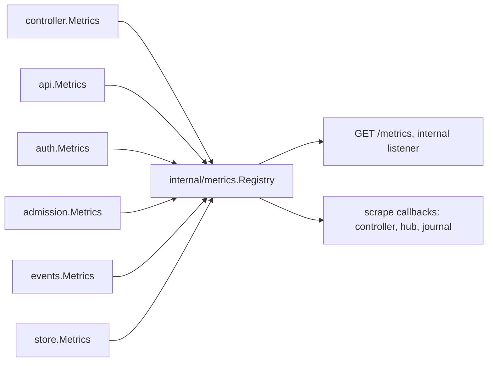

# Observability

## Overview

[[017-observability]] fixes one metric table, the spans a request draws,
the redaction every log line passes through, and the alerts an
installation starts with. Nothing of it is built: the scrape surface
does not exist, `pkg/otel` is reached only by the outbound clients of
[[006-identity]] and [[007-admission]], and
`deploy/base/prometheusrule.yaml` carries [[048-release-and-check]]'s
placeholders over metric names no binary emits.

This slice builds the registry, the seams that feed it, the handler that
redacts, and the rules that read it. It emits the rows of 017's table
whose owning spec has landed and declares the rest as awaiting their
slice, so the table in code and the table in 017 are one document and
drift in either direction is a test failure.

The hosted source ([[031-hosted-sandbox-consolidation]], the row for
`internal/platform/metrics` and `internal/platform/traffic`) pushed
dotted OTel instruments and served no scrape surface. What ports is the
behaviour, not the shape: the counts an operator read (sandboxes by
state, warm pool depth, create time cold against warm, idle stops, cap
hits) become 017's rows, and the route taxonomy that bounded the
hosted `path` label becomes 017's `route`, which is the `http.ServeMux`
pattern and needs no taxonomy of its own.

## Current state

| Piece | State |
|---|---|
| `internal/metrics` | does not exist |
| `/metrics` on the internal listener | not served; the listener answers the probes of [[002-repository-scaffold]] alone |
| `pkg/otel.Bootstrap` | never called; `cellad` logs through the default `slog` handler and exports nothing |
| spans | the outbound transports of `internal/auth` and `internal/admission` draw client spans; no server span exists to parent them |
| redaction | none |
| `deploy/base/prometheusrule.yaml` | five alerts over `cella_ready`, `cella_authorizer_calls_total` and `cella_sandbox_phase_total`, none of which is in 017's table |

## Design

### Where the registry lives and who may reach it

`internal/metrics` holds one `*Registry`, built over
`latere.ai/x/pkg/metrics`: labelled counters, histograms with declared
bounds and a `+Inf` bucket, and scrape-time gauge callbacks, written in
the Prometheus text exposition format. It is the one package that
registers, and `cmd/cellad` builds it once.

`arch_test.go` holds `./controller` and `./egress` to the contract types
and forbids every import under `internal/`. The seam is therefore the
consumer's own interface: each package declares the narrow method set it
calls, over standard-library types alone, and defaults to an unexported
no-op when its option is nil. `*metrics.Registry` satisfies all of them
structurally and is named in none of them.

A counter or a histogram is pushed: the code path that owns the number
calls one method with one line. A gauge is pulled: `cmd/cellad` hands the
registry a closure over the index that already holds the answer, so no
loop exists to keep a gauge current and no driver `List` runs at scrape
time. `cella_lease_held` is the one exception: a lease is held or not at
the moment a loop takes its tick, and nothing outside the loop knows, so
the loop pushes it.

### The table as emitted

Twenty-one of 017's twenty-nine rows have an owning spec that has
landed. Each is registered at start-up, so a series exists before the
first observation, and every labelled histogram is initialised over its
closed vocabulary.

| Metric | Type | Labels | Buckets | Recorded at |
|---|---|---|---|---|
| `cella_requests_total` | counter | `route`, `status`, `code` | | the route wrapper in `internal/api`, on return |
| `cella_request_duration_seconds` | histogram | `route` | latency | the same wrapper, excluding a hijacked stream |
| `cella_sandboxes` | gauge | `phase`, `environment`, `driver` | | scrape callback over `Controller.List` |
| `cella_sandbox_create_duration_seconds` | histogram | `driver`, `pool` | create | `Controller.createLocked`, on the reply |
| `cella_reaper_actions_total` | counter | `rule`, `action` | | `Controller.Reap`, per enforced rule |
| `cella_recovery_attempts_total` | counter | `outcome` | | `Controller.recoverLocked` and `graceLocked` |
| `cella_tokens_reminted_total` | counter | none | | `Controller.rotateLocked` |
| `cella_decisions_total` | counter | `endpoint`, `outcome` | | `auth.Authorizer.decide`, `admission.Client.admit` |
| `cella_webhook_duration_seconds` | histogram | `endpoint` | latency | the same two calls |
| `cella_events_pending` | gauge | none | | scrape callback over the journal |
| `cella_events_delivered_total` | counter | `outcome` | | `events.Deliverer`, beside each count it already keeps |
| `cella_event_delivery_duration_seconds` | histogram | none | latency | around one delivery attempt |
| `cella_store_query_duration_seconds` | histogram | `op` | store | the methods of `store.Controlled` |
| `cella_lease_held` | gauge | `name` | | pushed by the reaper tick, the pool tick and one delivery pass |
| `cella_exec_total` | counter | `exit` | | the exec socket, at the exit frame |
| `cella_egress_connections_total` | counter | `decision`, `door` | | `EgressHub.onRecord` |
| `cella_egress_bytes_total` | counter | `direction`, `door` | | the same record |
| `cella_gateways_connected` | gauge | `environment` | | scrape callback over `EgressHub.Connected` |
| `cella_gateway_snapshots_total` | counter | none | | `EgressHub.join`, per gateway seeded |
| `cella_pool_size` | gauge | `environment`, `state` | | scrape callback over the pool index |
| `cella_pool_adoptions_total` | counter | `outcome` | | the create path, on hit and on miss |

Bucket sets, each twelve bounds, named once and shared:

| Name | Bounds |
|---|---|
| latency, 5ms to 10s | 0.005, 0.01, 0.025, 0.05, 0.1, 0.25, 0.5, 1, 2, 3, 5, 10 |
| create, 0.5s to 300s | 0.5, 1, 2, 5, 10, 20, 30, 60, 90, 120, 180, 300 |
| store, 1ms to 5s | 0.001, 0.0025, 0.005, 0.01, 0.025, 0.05, 0.1, 0.25, 0.5, 1, 2.5, 5 |

Closed vocabularies, initialised at start so a scrape before the first
event carries the series:

| Label | Values |
|---|---|
| `endpoint` | `authorizer`, `admission` |
| `outcome`, on a decision | `allow`, `deny`, `unavailable`, `cached` |
| `outcome`, on delivery | `acknowledged`, `deferred`, `dropped` |
| `outcome`, on recovery | `recovered`, `exhausted`, `volume_missing` |
| `outcome`, on adoption | `adopted`, `miss` |
| `pool` | `hit`, `miss` |
| `op` | `load`, `save`, `write`, `remove`, `rebuild`, `events`, `acquire` |
| `name` | `reaper`, `journal`, `pool` |
| `door` | `proxy`, `reverse` |
| `decision` | `allowed`, `denied`, `unknown`, `passthrough` |
| `direction` | `in`, `out` |
| `exit` | `0`, `nonzero`, `failed` |
| `state`, on the pool | `ready`, `filling` |

`name` carries the lease's kind and not its key: the refill loop's lease
is `pool:<environment>`, and an environment per series would make the
label unbounded. 017's `scheduler` and `environments` arrive with their
loops.

The eight rows awaiting their owner, declared in the same table in code
and registered by none:

| Metric | Waits on |
|---|---|
| `cella_rate_limited_total` | the limiter of [[008-api]] |
| `cella_environments` | the Environment kind of [[021-data-plane-workers]] |
| `cella_workers_connected` | the worker role of [[021-data-plane-workers]] |
| `cella_operations_redelivered_total` | the operation queue of [[021-data-plane-workers]] |
| `cella_queue_depth` | the scheduler of [[020-scheduling-and-sets]] |
| `cella_capacity` | the same |
| `cella_preemptions_total` | the same |
| `cella_set_replicas` | the sets of the same |

### One scrape surface, three roles

`cellad serve` is the only role with an internal listener, so it is the
only role that serves `/metrics`. The listener becomes a mux: `GET
/metrics` writes the registry, and every other path is the probe handler
it was. `cellad egress` opens its two doors and its one outbound stream
and nothing else; its process telemetry, spans and logs leave over OTLP
and its connection counts are the control plane's, recorded where the
`record` frames of [[018-egress-and-secrets]] arrive. The worker role of
[[021-data-plane-workers]] takes the same seam: it declares the methods
it calls, and a control plane that drives no worker registers no worker
series.

### Traces

`pkg/otel.Bootstrap` runs first in both roles, before the store, the
identity and the driver are opened, because a collaborator built earlier
captures the `slog` default as it stands. `otel.Handler` wraps `/v1/`
alone: the probes, the key set and the version line draw no span.

The server span is named by the route once the mux has matched, which is
also when `route` is known: the wrapper behind the mux reads
`http.Request.Pattern`, writes it into the slot the outer handler put in
the context, and renames the span. Attributes are the subject, the
sandbox the route names, the request id and the trace id. The authorizer call and the
admission call are child spans on the request's own path, drawn by the
instrumented transports the two clients already dial with, so a
decision's latency has one span and one histogram from one place.
Delivery to the sink runs on a loop of its own and draws its own trace:
it is on no request's path. The driver call and the store call of 017
draw no child span in this slice.
The gateway's sync stream is one span per accepted stream and not per
frame; a `record` frame carries no trace and correlates by principal.

A hijacked route (exec, attach, the screen stream, the sync stream)
counts one request and observes no duration: its lifetime is the
stream's and not the request's, and mixing the two makes the latency
histogram unreadable.

### Logs

`Bootstrap` returns the logger over its tee. This slice wraps that
logger's handler once and sets the default again, so both paths of the
tee, the local JSON handler and the OTLP bridge, pass through one
redacting handler. It applies 017's two rules to every attribute, to
attributes carried on the handler by `WithAttrs`, to attributes inside a
group, and to the message:

1. a key in the denylist, or a key containing a denylisted word, case
   insensitive, has its value replaced by `[redacted]`. The list is
   `env`, `value`, `token`, `credential`, `secret`, `Authorization`,
   `Proxy-Authorization`, `Cella-Egress-Credential`.
2. a value holding `cph_` followed by 32 characters of `[a-z2-7]`, the
   placeholder of [[018-egress-and-secrets]], has the placeholder
   replaced.

The rule at the call site stands: no handler passes a secret value, a
credential or a token as an attribute at all. This handler is the second
line, and a canary written through every log path this slice touches
proves it holds on both paths of the tee.

The volume is one line per request, written where the count is written:
the deferred observation the API handler already makes, at `INFO`, with
the route, the status class, the code, the duration, the subject, the
sandbox the route names and the request id. It is emitted under the
request's own context, so the trace id and the span id reach both paths
and a line read out of the container's output joins its trace. A stream
is one request and so one line; nothing is written per frame.

### Alerts

`deploy/base/prometheusrule.yaml` keeps 048's shape and its alert names
where a name still describes what is measured, and its expressions
become expressions over the table. `CelladNotReady` reads
`kube_pod_status_ready` from kube-state-metrics as 017 states, since no
`cella_` metric reports readiness. Each alert carries the runbook
sentence 017 gives it.

| Alert | Expression over | Fires when |
|---|---|---|
| `CelladDown` | `up{job="cellad"}` | the scrape fails for 5 minutes |
| `CelladNotReady` | `kube_pod_status_ready` | a `cellad` Pod is not ready for 5 minutes |
| `CelladSlowCreates` | `cella_sandbox_create_duration_seconds_bucket` | p95 above 30 seconds for 10 minutes |
| `CelladDecisionEndpointUnavailable` | `cella_decisions_total{outcome="unavailable"}` | increasing over 5 minutes |
| `CelladEventsUndelivered` | `cella_events_pending` | above 1000 for 10 minutes |
| `CelladEventsDropped` | `cella_events_delivered_total{outcome="dropped"}` | increasing over 10 minutes |
| `CelladSandboxesLost` | `cella_sandboxes{phase="Lost"}` | above zero for 15 minutes |
| `CelladLeaseNotHeld` | `cella_lease_held` | zero for a name for 2 minutes |
| `CelladEnvironmentOffline` | `cella_environments{phase="Offline"}` | above zero for 5 minutes |
| `CelladOperationsRedelivered` | `cella_operations_redelivered_total` | increasing over 10 minutes |

The last two read rows [[021-data-plane-workers]] owns. They ship now
and evaluate over an empty series until that slice emits them, which is
the state 017's own alert table describes; the rule test holds every
`cella_` name in the file to the declared table rather than to the
registered subset, so a name that is neither is still a failure.

### Configuration

This slice reads no variable of its own. The exporter is the `OTEL_*`
set `pkg/otel` reads: `OTEL_EXPORTER_OTLP_ENDPOINT` turns export on,
`OTEL_EXPORTER_OTLP_HEADERS` authenticates it, `OTEL_SDK_DISABLED` turns
every signal off, `OTEL_TRACES_SAMPLER_ARG` is the head-sampling ratio
which `cellad` does not override, and `LATERE_ENV` and `POD_NAME` label
the resource. The deployment sets them and this project ships no value
for any. The start-up line gains one token, `telemetry=otlp` or
`telemetry=off`, so an operator reads from the first line whether
anything is leaving.

## Not in this spec

Dashboards. `tools/rules` and the `promtool check rules` job of 017:
the rules document is held to the table by a Go test in this repository,
and the external validator is a workflow change this slice does not
carry. The worker and scheduler rows of the table, which land with their
loops.

## Acceptance criteria

| Criterion | Test that proves it | State |
|---|---|---|
| The registered metrics match 017's table row for row in name, type, labels and buckets, and the unregistered rows are exactly the declared awaiting set | `TestMetricsTable` reading `017-observability.md` through `runtime.Caller`, `TestAwaitingRowsAreRegisteredByNobody` | built |
| Every labelled histogram has a series before its first observation, and no label value is a sandbox id, a subject, a name or a path | `TestSeriesExistAtStart`, `TestLabelValuesAreBounded`, and the scrape the end-to-end run reads | built |
| Each counter and histogram is moved by the code path that owns it | one test per owner package against a fake recorder, and `TestCountersRecordWhatTheyOwn` over the registry | built |
| `/metrics` on the internal listener serves the exposition and the public listener does not | `TestScrapeSurfaceIsTheInternalListener` | built |
| The egress role opens no listener beyond its doors | `TestEgressRoleServesNoScrapeSurface` | built |
| A request draws one server span named by the route with the subject, the request id and the sandbox, and the probes draw none | `TestRequestSpans` over an in-memory exporter, `TestTheAPIDrawsAServerSpan` against a collector with a stub authorizer | built; the parent link between the server span and the authorizer's client span is in the span context and is not decoded |
| One canary per kind (env value, secret value, placeholder, credential, token, `Authorization`, `Proxy-Authorization`, `Cella-Egress-Credential`) appears on neither path of the tee | `TestLogsRedact`, `TestCanaryNeverReachesALogLine`, `TestTelemetryExportsOverOTLP` | built |
| One line per request and per stream, none per frame, carrying the route, the code, the subject, the sandbox and the request id | `TestOneLogLinePerRequest`, `TestOneLogLinePerStreamAndNonePerFrame` | built |
| Every `cella_` metric and label the rules file names is in the declared table, and the document parses | `TestAlertsNameKnownMetrics`, `TestAlertsAggregateOnLabelsThatExist`, `TestEveryAlertCarriesItsRunbookSentence` | built |
| A serve, create, exec, stop and delete moves the counters an operator reads | `TestObservabilityEndToEnd` in `cmd/cellad` | built |

## Outcome

Built on 2026-09-20. `internal/metrics` is the one registry, at 100%
statement coverage over 199 statements, and every package the gate
measures clears 90%: the packages this slice touched read `cmd/cellad`
90.9%, `internal/api` 91.5%, `controller` 94.1%, `internal/auth` 95.3%,
`internal/admission` 95.4%, `internal/events` 95.3%, `internal/store`
92.0%.

`go tool lateregate` passes: fmt-check, modernize, cgo-free, otel-client,
license, spec-lint, depcheck, identity, postgres, lint, vuln, test, race,
hermetic, tempdir and cover. No new module joined a build list, so
`depcheck` gained no row: the OpenTelemetry SDK was already admitted
through the outbound clients of [[006-identity]], and `pkg/metrics` is
part of `latere.ai/x/pkg`.

The end-to-end run is `TestObservabilityEndToEnd` in `cmd/cellad`: the
serve role on the native driver, a create, a read, two exec sessions, a
stop, a delete and a read that is refused, then a scrape of the internal
listener that reads each counter the run owns, the route label holding
the mux pattern and never a sandbox id, and the hijacked streams counted
without being timed. `TestTheAPIDrawsAServerSpan` runs the same role
against an in-process collector and reads back the span named by the
route, and `TestTelemetryExportsOverOTLP` reads a canary back off the
bridge to prove the redaction is on both paths and not one.

What the slice built beyond the table, because the numbers could not be
right without it: the journal gained `Undelivered`, a count of the
records the sink has not taken. `Pending` answers what one pass may take
now, which loses every record inside a backoff window, so a gauge built
on it would read zero on a queue that is not empty. Both store adapters
implement it and the store contract suite holds them to it.

Twenty-one of 017's twenty-nine rows are emitted. Eight wait on the
limiter of [[008-api]], the scheduler and sets of
[[020-scheduling-and-sets]] and the workers of
[[021-data-plane-workers]]; each is declared in the table in code, named
by `TestMetricsTable`, and registered by nothing. Two alert rules read
the last of those and ship quiet.

Two things 017 names are not built and are named in Not in this spec:
`tools/rules` with the `promtool check rules` job, which is a workflow
change, and the trace continuation across the worker seam, which has no
seam to cross until [[021-data-plane-workers]] lands. The `cached`
outcome of `cella_decisions_total` is never emitted: the cache lives
inside `pkg/authz`'s client and the decision seam cannot see a hit.
