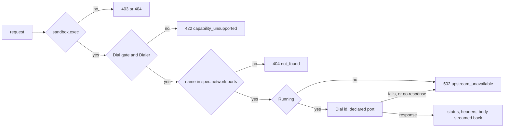

# Dial and the port proxy

## Overview

A sandbox runs servers: a development server, a browser's automation
endpoint, a database a test suite starts. [[023-computer-use-operations]]
names three ways to reach a declared port, and the first, for a port
exposed `none`, is the control plane itself: an HTTP proxy at
`/v1/sandboxes/{id}/ports/{name}/{path...}` and a raw byte socket at
`/v1/sandboxes/{id}/dial/{port}` that `cella port-forward` opens per
local connection. Both reach the port through the driver's `Dial`, the
optional interface of [[004-runtime-contract]] that no driver implements
today.

This slice implements `Dial` on the `native` and `podman` drivers, adds
the `DialReachesAPort` case to the driver conformance suite, serves the
byte pump behind the dial route's gate, serves the port proxy with the
confinement [[013-security-and-threat-model]] requires of it, and adds
`cella port-forward`.

## Current state

| Piece | Where it is | What is missing |
|---|---|---|
| `runtime.Dialer` and `Capabilities.Dial` | `runtime/display.go`, `manifest/v1/runtime.go` | no driver implements or declares it; `runtimetest` reports `Dial` under `DeclaredWithoutCase` |
| The dial route | `internal/api/dial.go`, [[055-api-contract-gaps]] | authorizes and answers the capability gate; with the capability declared it still answers 422, because no stream is served |
| The port proxy | [[008-api]]'s route table, [[023-computer-use-operations]]'s Ports section | not registered; `upstream_unavailable` is in the error table of the spec and not in the server's |
| Declared ports | `spec.network.ports`, validated in `manifest/network.go`, passed to the driver as `CreateSpec.Ports` | `native` stores none and reports no `State.Ports`; `podman` records them and publishes none |
| `cella port-forward` | [[011-agent-client]]'s command table | not in the command |
| `TestPortProxyIsConfined` | [[013-security-and-threat-model]]'s control table | waived in `pendingControls` of `specs_test.go` |

## Design

### Dial on the native driver

`Dial(ctx, id, port)` connects to `127.0.0.1:<port>` once the record
says the sandbox is `Running`: `ErrNotFound` for no record,
`ErrNotRunning` for any other phase, `ErrInvalid` for a port outside 1
to 65535. The port is any port: the native driver confines nothing, its
processes are host processes on the host's own loopback, and a caller
holding `sandbox.exec` already runs any command there. The capability
is declared, and the driver's package documentation keeps saying that it
isolates nothing.

The declared ports are kept in the record at create, and `Inspect`
reports each as `listening` when a connection to it on loopback succeeds
within 250 ms and `closed` otherwise, outside the driver's lock. The
probe runs only for a `Running` sandbox, which is the rule podman's
probe follows.

### Dial on the podman driver

A container's ports live in its own network namespace, which the libpod
API gives no way to enter. [[004-runtime-contract]] names the route in:
the engine's port publishing on loopback. At create, every declared port
is published on `127.0.0.1` at a host port the engine picks. `Dial`
reads the mapping from the container's inspect and connects to it, so a
second driver over the same engine dials what the first created, which
is what `Detach` promises. An undeclared port is `ErrNotFound`, because
it was never published; a container that is not running is
`ErrNotRunning`.

A user-space port forwarder in front of the engine (the rootless port
proxy, or the forwarder of a machine the engine runs in) accepts the
host side of a connection and closes it when nothing listens inside, so
on those engines a closed port reads as a connection the far end closes
at once rather than as a refused dial. The proxy reads either as 502,
and the dial socket as a close.

A published port is fixed when the container is created, so a manifest
that declares ports is not adopted into a pool entry ([[020-scheduling-and-sets]]):
the entry was created without them.

### The conformance case

`DialReachesAPort` runs where the driver declares `Dial` and the suite's
options name `Echo`, the main command that serves one port and writes
back every byte it reads. It creates a sandbox running it with the port
declared, dials until the round trip of one line succeeds within the
poll window, dials a second connection while the first is open, and
holds `Dial` on a stopped sandbox to `ErrNotRunning` and on an absent one
to `ErrNotFound`. `Dial` leaves `DeclaredWithoutCase`.

`native` runs the case with the test binary itself as the echo server,
which needs no tool on the host; `podman` with the conformance image's
`nc`. `native` also passes `Listen` now that it probes its ports, so
`PortsReportListening` runs there too.

### The controller

`Controller.Dialer(id)` returns the driver's `Dialer` for the sandbox's
environment, or `ErrUnsupported` where the driver has none. It returns
the interface and not a connection, because the API needs to know the
answer before it upgrades a socket or starts a response.

### The dial socket

`GET /v1/sandboxes/{id}/dial/{port}`, subprotocol `cella.dial.v1`:

1. read and authorize `sandbox.exec`; 404 and 403 as every route;
2. the `Dial` gate on the sandbox's own environment, else 422
   `capability_unsupported`;
3. the port, 1 to 65535, else 400 `invalid_field`;
4. the stored phase, `Running`, else 409 `phase_conflict`;
5. the driver's `Dialer`, else 422 `capability_unsupported` naming the
   driver whose declaration and methods disagree;
6. upgrade, then `Dial` with a 10 second bound.

A dial that fails after the upgrade closes the socket with 1011 and the
error's code as the reason: the upgrade has already answered 101, and
the stream's grammar ([[008-api]]) has no frame but bytes. Binary frames
carry bytes both ways. The inside closing its end closes the socket with
1000; the caller closing the socket, or a frame that cannot be
delivered, closes the connection inside. Every client frame stamps
activity, and the session writes one `sandbox.dial` record
`{durationMs, bytesIn, bytesOut}` when it ends ([[009-events]]).

The dial happens after the upgrade rather than before it so that a
caller can tell a port that is closed now from a route the environment
does not serve: the first is a socket that closes with 1011
`upstream_unavailable`, the second a refusal with its status.

### The port proxy

`/v1/sandboxes/{id}/ports/{name}/{path...}`, every method:

The name is resolved against the sandbox's own declared ports and
nothing else, and the transport's dial ignores the address it is handed
and calls `Dial(ctx, id, port)` with the sandbox's id and the declared
port, so no host, port, path or header a caller writes reaches the
dialer. One transport per request with keep-alives off: a connection is
never pooled, so no request can ride a connection another sandbox's
request opened.

The outbound request carries the method, the path suffix with its
escaping kept, the query, and the headers but the hop-by-hop set and
`Authorization`, which is the caller's bearer to this server and never
the workload's to read. `Host` is `localhost:<port>`, which is what the
port is inside the sandbox, and `X-Forwarded-Host`, `X-Forwarded-Proto`,
`X-Forwarded-For` and `X-Forwarded-Prefix` say how the caller reached it.
A WebSocket upgrade passes through. Bodies stream both ways and a
response flushes as it arrives. The response headers are awaited 60
seconds. Each request stamps activity.

### cella port-forward

`cella port-forward <ref> <local>:<port>` binds `127.0.0.1:<local>`,
writes one line naming the two ends, and for each accepted connection
opens one dial socket and pumps both ways until either end closes. A
refusal before the first connection is read by opening one socket at
start, so a sandbox that is missing, not running or on an environment
without `Dial` exits with the exit scheme's code rather than listening
for connections it cannot serve. It runs until interrupted. `<local>`
may be `0`, and the line then names the port the kernel chose.

## Not in this slice

The `sandbox.port` record and `CELLA_EVENTS_PORTS`, which need a
variable in the configuration package another slice owns. `Dial` on the
`remote` driver, which is a relay over the worker stream's byte
sub-stream and belongs with the worker stream; until it lands, an
environment a worker serves reports the worker's `Dial` with no
`Dialer` behind it, and both routes answer 422 there. `Dial` on `k8s`,
through the port forwarding subresource. `expose: public` and the
`Exposer`, and `expose: mesh` reachability, which are [[022-mesh-and-spawn]]'s
and [[004-runtime-contract]]'s. A half close on the dial socket, which
[[008-api]]'s grammar does not have.

## Acceptance criteria

| Criterion | Test that proves it | State |
|---|---|---|
| A driver that declares `Dial` reaches an echo server inside a sandbox with bytes both ways and two connections at once, refuses a stopped sandbox with `ErrNotRunning` and an absent one with `ErrNotFound`; `Dial` is no longer declared without a case | `TestNativeConformance`, `TestPodmanConformance`, `TestDialCase` | built |
| `native` declares `Dial` and implements `Dialer`, dials loopback only for a running sandbox, and probes its declared ports at inspect | `TestNativeDial`, `TestNativeProbesDeclaredPorts`, `TestNativeConformance` | built |
| `podman` publishes every declared port on loopback at create, dials the published port read from the engine, and refuses an undeclared port and a stopped container | `TestPodmanPublishesDeclaredPorts`, `TestPodmanDial`, `TestPublishedPortsHostDefault`, `TestPodmanConformance` | built |
| A manifest that declares ports is not adopted into a pool entry | `TestPoolSkipsDeclaredPorts` | built |
| The dial socket carries bytes both ways, closes 1000 when the inside closes and 1011 with the code when the dial fails, refuses a bad port and a stopped sandbox before the upgrade, and journals `sandbox.dial` | `TestDialSocket`, `TestDialGate`, `TestUpstreamErrorKeepsTheContractsRefusals`, `TestOperationRecordsCarryNoContent` | built |
| The proxy forwards every method, the path suffix with its escaping, the query and the body, drops the hop-by-hop headers and the bearer, passes a WebSocket upgrade, answers `not_found` for an undeclared name and 502 `upstream_unavailable` for a closed port or a stopped sandbox | `TestPortProxy`, `TestPortProxyGates`, `TestProxyPath` | built |
| The proxy dials only the sandbox's own id and declared port, whatever host, port, path or header the caller writes, and two sandboxes declaring one port each reach their own | `TestPortProxyIsConfined` | built |
| The API document names the proxy's operations and the mux serves each | `TestTheDocumentAndTheMuxAgree` | built |
| `cellad serve` on the native driver: a sandbox listening on a declared port is reached through the dial socket and through the proxy, and the proxy answers 502 once it stops | `TestDialAndPortProxy` | built |
| The contract's own suite runs its dial cases against this server with `dial` declared, and the declaration of gaps stays empty | `TestTheConformanceSuiteHoldsAgainstThisServer` | built |
| `cella port-forward` carries bytes both ways per accepted connection and exits with the refusal's code where the dial is refused; the usage table and `docs/cli.md` agree | `TestPortForward`, `TestPortForwardRefusals`, `TestPortForwardReportsAConnectionItCouldNotCarry`, `TestADialStreamCarriesBytesBothWays`, `TestADialStreamNamesTheCodeItClosedWith`, `TestTheDocumentCarriesTheCommandsHelp` | built |
| No file this slice adds names a Latere host, image, pool or namespace | `TestNoLatereCoordinates`, `TestNoLatereCoordinatesInReleasedArtifacts` | built |

## Outcome

`Dial` is implemented on the native and podman drivers, the dial route
serves its byte stream, the port proxy serves every method confined to the
sandbox's declared ports, and `cella port-forward` carries a loopback port
to a port inside.

| Piece | Where |
|---|---|
| `DialReachesAPort` and the `Echo` option; `Dial` off the unchecked list | `runtime/runtimetest/dialcases.go`, `runtime/runtimetest/runtimetest.go` |
| Native `Dial` on loopback, the declared ports kept in the record and probed at inspect | `runtime/native/dial.go`, `runtime/native/native.go` |
| Podman's publication of each declared port on `127.0.0.1` and `Dial` through the mapping the engine reports | `runtime/podman/dial.go`, `runtime/podman/podman.go` |
| `Controller.Dialer`, and the pool rule that a manifest with ports is created for real | `controller/operations.go`, `controller/pool.go` |
| The dial socket, the shared gate, `upstream_unavailable` in the error table | `internal/api/dial.go`, `internal/api/api.go` |
| The port proxy | `internal/api/portproxy.go`, `api/openapi.yaml` |
| `sandbox.dial` | `internal/events/record.go`, `internal/events/build.go` |
| The client's dial stream and `cella port-forward` | `internal/cellaclient/dial.go`, `internal/cellacli/portforward.go`, `docs/cli.md` |
| The dial case reads the status and closes; `dial` declared to the suite | `test/conformance/cases_streams.go`, `cmd/cellad/conformance_test.go` |
| The end to end on a running node | `cmd/cellad/dial_test.go` |
| The operator's pages | `docs/native.md`, `docs/cli.md`, `SECURITY.md`, `CHANGELOG.md` |

Coverage on `go test -race -cover`: `runtime/runtimetest` 98.0%,
`runtime/native` 90.5%, `runtime/podman` 93.4% over the fake engine,
`controller` 90.9%, `internal/api` 92.2%, `internal/events` 95.7%,
`internal/cellaclient` 92.4%, `internal/cellacli` 90.2%, `cmd/cellad`
90.4%. `test/conformance` is at 88.1%, where it was before this slice:
its fake serves no socket by design, and the socket cases are proven
against the real server by `TestTheConformanceSuiteHoldsAgainstThisServer`.
`TestPodmanConformance` ran whole against a real engine (podman 6.0.2 in a
machine on macOS, through its API socket), the dial and port cases
included; the display cases skip for want of a desktop image.

### What diverges from the specs above

| Spec | What it said | What was built | Why |
|---|---|---|---|
| [[004-runtime-contract]] | podman's `Dial` is "yes", with no word on which ports | a declared port only, published at create | the engine's publication is the one route into the container's network namespace the libpod API offers, and it is fixed when the container is made; native reaches any port because it confines nothing |
| [[004-runtime-contract]] | `remote` passes the whole suite through a native worker | it does, with `Dial` withheld from the worker's declaration | the remote driver relays no dial, and the merge of this slice made it declare only what the worker stream carries (`TestTheSeamDeclaresWhatItCarries`); `runtime/remote` was outside this slice |
| [[023-computer-use-operations]] | the proxy forwards headers but the hop-by-hop set | `Authorization` is dropped too; `Host` is `localhost:<port>`, and the `X-Forwarded-*` set with a prefix says how the caller reached it | the bearer is the caller's to the control plane and never the workload's; a server inside that checks its host expects the one it listens on |
| [[020-scheduling-and-sets]] | the pool's match rule reads image, resources, desktop, command, user, workspace and workdir | a declared port refuses the match too | a published port is fixed at the entry's create |
| [[008-api]] | the proxy is `any` method | one pattern with no method, documented as the eight operations OpenAPI has | the document has no word for every method, and the mux test reads a method-less pattern as those eight |

### What this leaves open

| Open | Why |
|---|---|
| `Dial` on the `remote` driver, over the worker stream's byte sub-stream | `runtime/remote` belongs to the worker stream's own slice; until it lands the driver withholds `Dial`, and on a worker environment both routes answer 422 |
| The `sandbox.port` record and `CELLA_EVENTS_PORTS` | the variable belongs to the configuration package another slice owns |
| `Dial` on `k8s`, through the port forwarding subresource | the k8s driver's own slice |
| `expose: public`, the `Exposer`, and mesh reachability | [[022-mesh-and-spawn]] and [[004-runtime-contract]] |
| A half close on the dial socket | [[008-api]]'s stream grammar has none; the end of either direction ends the connection |
| A closed port on an engine behind a user-space forwarder reads as a connection closed at once | the forwarder accepts the host side before it knows; the proxy answers 502 either way |
