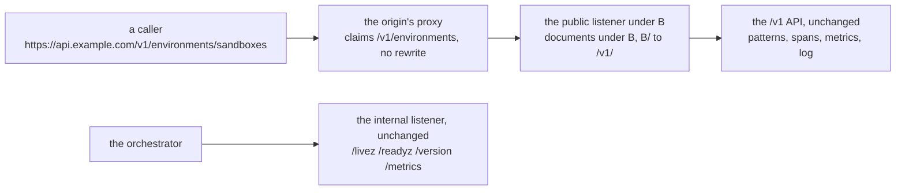

# Serving under a base path

## Overview

An installation that serves several services under one API origin
partitions the origin's `/v1` by capability, one prefix per service, so
a resource one service adds cannot collide with another's. Under such an
origin this core's prefix is `environments`, and a sandbox is
`https://api.example.com/v1/environments/sandboxes/{id}`.

`cellad` cannot answer there today. Its public listener registers `/v1/`
and the three public documents at the root, the paths it writes into a
`Location` header or a body are rooted, and every client of it, the
exported client, the worker, the gateway and the conformance suite,
composes a route by appending `/v1/...` to the address it was given.

This slice adds one variable, `CELLA_BASE_PATH`, empty by default, and
makes the path of `CELLA_PUBLIC_URL` the prefix of every path the core
writes. An installation that sets neither is unchanged.

| At the root | Under `/v1/environments` |
|---|---|
| `/v1/sandboxes` | `/v1/environments/sandboxes` |
| `/v1/secrets/{key}` | `/v1/environments/secrets/{key}` |
| `/v1/events` | `/v1/environments/events` |
| `/v1/environments/{id}` | `/v1/environments/environments/{id}` |
| `/.well-known/jwks.json` | `/v1/environments/.well-known/jwks.json` |
| `/openapi.yaml` | `/v1/environments/openapi.yaml` |
| `/version` | `/v1/environments/version` |
| `/livez`, `/readyz` | not served on the public listener; the internal listener's probes are unchanged |

### Why the base replaces `/v1`

The base stands where the core's own `/v1` stands, so the public path
carries one version segment. Arca serves at `/v1/storage/...` and Origo
at `/v1/repos`, and a Cella route under the same origin reads the same
way: `/v1/environments/sandboxes`, not `/v1/environments/v1/sandboxes`.

Lux keeps both segments, `/v1/models/v1/keys`, and is right to. Its
public listener is four doors whose inner version segments are the
dialects' own (`/openai/v1`, `/gemini/v1beta`), beside a control plane at
`/v1`, so its surface is not one versioned tree and the inner `/v1` is a
fact about Lux that a mount must not erase. Cella's public listener is one
versioned surface and three documents: every route but the documents is
under `/v1`, and that `/v1` names the same thing the origin's `/v1` names,
the version of the `/v1` API ([[008-api]]). A second `/v1` would state
the same version twice.

### Why `/v1/environments/environments`

The first `environments` is the capability's prefix on the origin: this
core provides execution environments, and the origin names it by that.
The second is the collection of the `Environment` kind ([[021-data-plane-workers]]),
one of the kinds this core serves. The rule is the same for every kind,
so a client composes every route one way, and the `Environment` kind is
not the one kind whose path depends on where the core is mounted.

## Current state

| Fact | Where |
|---|---|
| The public mux registers `/v1/`, `/livez`, `/readyz`, `/version`, `/.well-known/jwks.json`, `/openapi.yaml` and `/` at the root | `serve` in `cmd/cellad/main.go` |
| The internal listener answers the probes and `/metrics`, and the deploy tree probes it | `serve` in `cmd/cellad/main.go`, `deploy/base/` |
| `CELLA_PUBLIC_URL` is the `iss` of every token `cellad` mints and the local issuer its verifier accepts; its path is never read | `loadIdentity` in `internal/config/identity.go`, `Start` in `internal/auth/startup.go` |
| The `Location` of a create or an apply is a rooted path | `create` in `internal/api/api.go`, `createSecret` and `applySecret` in `internal/api/secrets.go`, `environmentCreate` and `environmentApply` in `internal/api/environments.go` |
| The port redirect is relative | `portRedirect` in `internal/api/portproxy.go` ([[067-environment-list-ports-redirect-keys]]) |
| `X-Forwarded-Prefix` names this server's rooted path | `proxyTo` in `internal/api/portproxy.go` |
| The exported client appends the route to the path of its URL | `request` and `ServerVersion` in `client/client.go` and `client/sandboxes.go`; `docs/client.md` says a path on the URL prefixes every route |
| The worker and the gateway append `/v1/environments/...` to `CELLA_URL` | `register` and `streamURL` in `internal/worker/worker.go`, `streamURL` in `internal/egressd/sync.go` |
| The conformance suite concatenates its URL and each route | `build` in `test/conformance/env.go` |
| The served API document lists rooted paths under `servers: [{url: /}]` | `api/openapi.yaml` |

## Design

### The route rule

One function, `client.Route(base, route)`, is where a route is reached
under a base path. A route is written as a control plane at the root
serves it: `/v1/...` for the API, and `/version`, `/openapi.yaml` and
`/.well-known/jwks.json` for the documents beside it.

| `base` | `route` | `Route(base, route)` |
|---|---|---|
| empty | any | `route` |
| `/v1/environments` | `/v1/sandboxes` | `/v1/environments/sandboxes` |
| `/v1/environments` | `/v1` | `/v1/environments` |
| `/v1/environments` | `/.well-known/jwks.json` | `/v1/environments/.well-known/jwks.json` |

```
Route(b, r) = r                 when b is empty
            = b + s             when r = /v1 + s and s is empty or starts with /
            = b + r             otherwise
```

Every place that composes a route calls it: the listener's patterns, the
paths the core writes, the exported client, the worker, the gateway and
the conformance suite. No kind is named `version`, `openapi.yaml` or
`.well-known`, so a document and a collection never meet under a base.

### Where the listener answers, and what the core writes

Two values, one per question:

| Value | From | Decides |
|---|---|---|
| the base, `B` | `CELLA_BASE_PATH` | where the public listener answers |
| the public path, `P` | the path of `CELLA_PUBLIC_URL` | the prefix of every path and URL the core writes |

The platform rule this serves names two ways a core sits under its
prefix: it mounts itself under a configured base, or the proxy in front
rewrites the prefix away. Both are the same `P`; they differ in `B`.

| Mode | `B` | `P` | The proxy in front |
|---|---|---|---|
| at the root | empty | empty | none, or one that forwards paths unchanged |
| mounted | `/v1/environments` | `/v1/environments` | claims the prefix and forwards unchanged |
| behind a rewrite | empty | `/v1/environments` | rewrites `P/x` to `/v1/x`, and the three documents to the root |

So a `B` that is set and differs from `P` is a start-up problem naming
both variables: the listener would answer at one address and write
another. An empty `B` with a `P` is the rewrite mode and is accepted, the
one reason the two may differ. The rewrite mode costs the proxy a second
rule, because the documents sit beside `/v1` at the root and a single
rule of the form `P/(.*)` to `/v1/$1` sends them into the API; the
mounted mode needs no rule beyond the prefix claim, which is why the
install guide describes it.

### The configuration rules

| Rule | Reason |
|---|---|
| An empty `CELLA_BASE_PATH` is the root, the default | An installation on its own host sets nothing |
| A set value begins with `/`, has no trailing slash, is a clean path, and each segment is letters, digits, `-`, `.`, `_` or `~` | One spelling of one prefix, carried literally by the proxy's claim, the mux pattern and every path the core writes; a request path is cleaned before it is routed, and a segment that needs escaping would have two spellings |
| A set value equals the path of `CELLA_PUBLIC_URL` | The mode table above |
| The path of `CELLA_PUBLIC_URL` obeys the same shape, and the URL carries no query and no fragment | It is now a prefix the core writes, and an issuer is an address |

### The listener

With `B` empty the public listener is what it is today. With `B` set it
registers:

| Pattern | Serves |
|---|---|
| `GET B/.well-known/jwks.json` | the key set |
| `GET B/openapi.yaml` | the API document |
| `GET B/version` | the build identity, the probes handler with `B` stripped |
| `GET B/{$}` | the build line `GET /` answers at the root |
| `B/` | the API: `B` is stripped from the path and its escaped form, and `/v1` is put in its place |

A path outside `B` reaches no pattern and takes the mux's bare 404. The
probes are the internal listener's, which the deploy tree already
points the orchestrator at, so `/livez` and `/readyz` are not public
under a base; under the base they are two more paths inside `/v1`, which
the API refuses like any other.



Inside the API nothing learns `B`. The handlers, the route templates on
spans and metrics, the request log and the authorizer's envelope see the
rooted path, so a recorded value has one shape whether an installation
is mounted or not.

The start-up line carries `base=`, the base or `/`, so an operator reads
the mount from the first line.

### What the core writes

Every path the core writes is `Route(P, rooted path)`, and every URL is
`CELLA_PUBLIC_URL` itself.

| Place | At the root | Under `P` |
|---|---|---|
| `iss` of a workload token and of an environment key | `CELLA_PUBLIC_URL` | unchanged in rule: `CELLA_PUBLIC_URL`, which now carries `P` |
| the key set's address | not written; a verifier reads `iss` and fetches `/.well-known/jwks.json` under it | `iss` + `/.well-known/jwks.json`, which is where the listener serves it |
| `Location` of a sandbox create and apply | `/v1/sandboxes/{id}` | `P/sandboxes/{id}` |
| `Location` of a secret create and apply | `/v1/secrets/{id}` | `P/secrets/{id}` |
| `Location` of an environment create and apply | `/v1/environments/{name}` | `P/environments/{name}` |
| the port redirect | relative, `{name}/` | unchanged; it resolves against the path the caller asked for |
| `X-Forwarded-Prefix` to the server inside a sandbox | `/v1/sandboxes/{id}/ports/{name}` | `P/sandboxes/{id}/ports/{name}` |
| the served API document's paths | the committed document, byte for byte | each path key `Route(P, key)`, `servers` left at `/` |
| a port's `status.url` | set by a driver's exposer, never by the core | unchanged; no driver in this tree sets it |
| list cursors, event cursors, event records | opaque values and ids, no path | unchanged |

A `Location` stays a path and does not become an absolute URL: a caller
that reached the control plane at another address, an in-cluster
Service, is sent back to the address it used.

The served document is rewritten once at start, so `servers[0].url`
plus a path is the address a route is reached at, and the document a
client generator reads through the origin describes the origin. With an
empty `P` no rewrite runs, and `TestTheDocumentAndTheMuxAgree` keeps
holding the committed document to the rooted mux.

### Tokens

The signer's issuer and the verifier's local issuer are both
`CELLA_PUBLIC_URL`, so a token minted under a public path verifies with
no code change. What changes is operational: a token names the issuer it
was minted under, and moving an installation under a prefix changes that
issuer. Environment keys minted before the move are refused after it and
are minted again; a running sandbox's workload token is re-minted at the
next rotation and refused until then. This is what any change of
`CELLA_PUBLIC_URL` already does, and the install guide says so.

### The clients

`CELLA_URL`, the address the worker, the gateway and `cella` read, is
the control plane's public URL, path included. Each composes with
`Route(path of the URL, route)`:

| Client | Where |
|---|---|
| the exported client, every call and the sockets | `request` and `ServerVersion` |
| the worker, its registration and its operations stream | `register` and `streamURL` in `internal/worker` |
| the gateway, its one stream | `streamURL` in `internal/egressd` |
| the conformance suite, every case | `build` in `test/conformance`, so no case file changes |

This changes the meaning of a path on the URL, which used to prefix
`/v1`. A client behind a proxy that strips a prefix of its own before
the core names the core's `/v1` in its URL, `https://host/prefix/v1`,
and reaches every `/v1` route as before.

### The conformance suite

`-url` with a path is the base the suite composes under. The suite is
run once in process against `cellad serve` with `CELLA_BASE_PATH` and
the path of `CELLA_PUBLIC_URL` both `/v1/environments`, with the worker
environment registered through a worker whose `CELLA_URL` carries the
base and the agent case running the built `cella` against the same URL,
so the whole contract is exercised under a base.

## Not in this slice

- The routing object that claims the prefix at an origin, and any overlay
  of a particular installation. Those belong to the installation.
- The caller's address behind a proxy. The authorizer's envelope carries
  the peer address, which behind a proxy is the proxy's; no
  trusted-proxy rule exists in this core yet.
- The audience list: `CELLA_OIDC_AUDIENCE` already reads one
  ([[027-configured-audience-set]]).
- A redirect from the root to the base. Outside the base the public
  listener answers nothing.

## Acceptance criteria

| Criterion | Test that proves it | State |
|---|---|---|
| `Route` replaces the leading `/v1` of an API route with the base, puts a document under it, and is the identity with no base | `TestRouteReplacesTheVersionSegment` | built |
| `CELLA_BASE_PATH` is empty by default; a set value that does not begin with `/`, ends with `/`, is not clean, or holds a segment character outside the rule is a problem naming it; a set value that differs from the path of `CELLA_PUBLIC_URL` is a problem naming both; an empty base with a public path is accepted; a public URL with a query or a fragment is refused | `TestBasePathRules` | built |
| With a base, the public listener answers the API, the key set, the API document, the build identity and the build line under it and nothing at the root, the internal listener's probes are unchanged, and the start-up line names the base | `TestThePublicListenerMountsUnderTheBasePath` | built |
| With no base the public listener serves every route at the root as before | `TestAnEmptyBasePathIsTheRoot` | built |
| Behind a rewrite the listener stays at the root and the paths it writes carry the public path | `TestBehindARewriteTheListenerStaysAtTheRoot` | built |
| Every `Location` the API writes and the `X-Forwarded-Prefix` it sends carry the public path, and are rooted with none | `TestWrittenPathsCarryThePublicPath` | built |
| The served document under a public path names each path under it and is otherwise the committed document | `TestTheDocumentUnderAPublicPath` | built |
| Under a base, a sandbox's workload token and an environment key carry `CELLA_PUBLIC_URL` with its path as `iss` and are accepted; a create answers a `Location` under the base; the port path without its slash redirects relatively and the followed proxy reaches the server inside with the base in `X-Forwarded-Prefix`; the exec and dial sockets open under the base | `TestServingUnderABasePathEndToEnd` | built |
| A worker and a gateway whose `CELLA_URL` carries the base register, claim and run a sandbox, and hold their stream | `TestWorkerAndGatewayUnderABasePath`, `TestTheWorkerComposesUnderABasePath`, `TestTheGatewayComposesUnderABasePath` | built |
| The exported client composes every call, the sockets and the build identity under a URL with a path | `TestEveryCallComposesUnderABaseURL` | built |
| The conformance suite composes every request under a URL with a path, and the whole suite holds against `cellad serve` under `/v1/environments`, the agent case running `cella` against the same URL | `TestTheSuiteComposesUnderABasePath`, `TestTheConformanceSuiteHoldsUnderABasePath` | built |
| The configuration page names `CELLA_BASE_PATH` | `TestTheConfigurationPageNamesEveryVariable` | built |

## Outcome

Built on 2026-09-24. Every criterion holds, each by the test its row
names, and the whole contract runs under a base: the conformance suite
passes 48 cases against `cellad serve` mounted under
`/v1/environments`, with a worker environment registered through a
worker whose `CELLA_URL` carries the base and the agent case running the
built `cella` against the same URL, the same count and the same skips
as the rooted run.

| Piece | Where |
|---|---|
| `client.Route`, the one rule every place composes a route with | `client/route.go` |
| The client's calls, sockets and build identity under a URL with a path | `request` in `client/client.go`, `ServerVersion` in `client/sandboxes.go` |
| `CELLA_BASE_PATH`, the public path, and their rules | `internal/config/basepath.go`, `publicPath` in `internal/config/identity.go` |
| The public listener at the root or under a base | `publicHandler` and `underVersion` in `cmd/cellad/public.go`, the `base=` token of the start-up line in `cmd/cellad/main.go` |
| Every `Location` and the port proxy's `X-Forwarded-Prefix` under the public path | `Options.PublicPath` and `public` in `internal/api/api.go`, `internal/api/secrets.go`, `internal/api/environments.go`, `internal/api/portproxy.go` |
| The served document placed under the public path | `Under` and `HandlerUnder` in `api/api.go` |
| The worker's registration and stream, and the gateway's stream, under the path of `CELLA_URL` | `register` and `StreamURL` in `internal/worker/worker.go`, `streamURL` in `internal/egressd/sync.go` |
| The suite's requests under the path of `-url` | `newClient` and `build` in `test/conformance/env.go` |

The URL-writing places this slice changed: the `Location` of a sandbox
create and apply, of a secret create and apply, and of an environment
create and apply; the `X-Forwarded-Prefix` the port proxy sends; the
paths of the served API document. The `iss` of a workload token and of
an environment key needed no change: it was `CELLA_PUBLIC_URL` already,
and the verifier's local issuer is the same value. The port redirect
needed none either: it is relative since
[[067-environment-list-ports-redirect-keys]]. No other place in the core
writes a path or a URL: a port's `status.url` is set only by a driver's
exposer and no driver sets it, and list and event cursors are opaque.

The base-path cases fail on the tree before this slice:
`TestWorkerAndGatewayUnderABasePath` fails at the gateway, whose stream
went to `/v1/environments/v1/environments/default/egress`, and with the
gateway fixed and the worker not, at the worker, which never registers;
`TestTheWorkerComposesUnderABasePath` and
`TestTheGatewayComposesUnderABasePath` name the doubled path.

### What diverges from the specs above

| Spec | What it said | What was built | Why |
|---|---|---|---|
| [[069-client-package]], `docs/client.md` | a path on the client's URL prefixes every route | a path on the URL takes the place of `/v1` in the client, the worker, the gateway and the suite | the one rule the server mounts and writes by; a client behind a proxy that strips a path of its own names the control plane's `/v1` in its URL |
| This slice's overview | `CELLA_BASE_PATH` must match the path of `CELLA_PUBLIC_URL` | a set base must; an empty base beside a public path is accepted | a proxy that rewrites the prefix away is the second mode the platform rule names, and the core still writes every path under the public one there |
| [[008-api]] | the public listener answers the probes | under a base it answers none | the orchestrator reads them on the internal listener, and the public listener answers nothing outside the base |

Found on the way and fixed: the gateway's stream URL escaped an
environment name twice, since the escaped segment was set as the
decoded path; it is composed in both forms now, and
`TestTheGatewayComposesUnderABasePath` holds a name that needs escaping.

### What this leaves open

| Open | Why |
|---|---|
| The caller's address behind a proxy: the authorizer's envelope carries the proxy's address | the core has no trusted-proxy rule yet; it is a variable of its own |
| A move under a base changes the issuer, so environment keys are minted again and a running sandbox's token is refused until its next rotation | any change of `CELLA_PUBLIC_URL` does this; accepting a second issuer across a move is a migration rule this slice does not add |
| The routing object that claims the prefix at an origin | it belongs to the installation that runs the origin |
