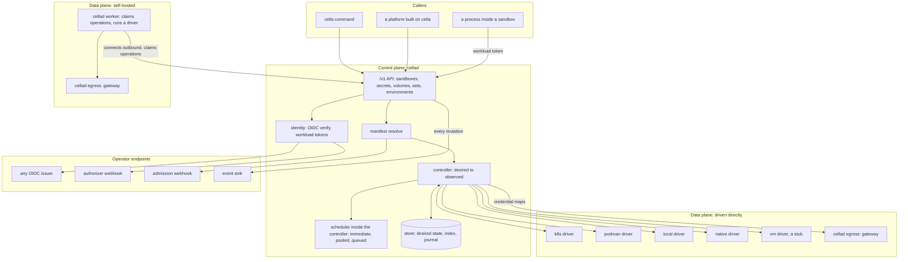
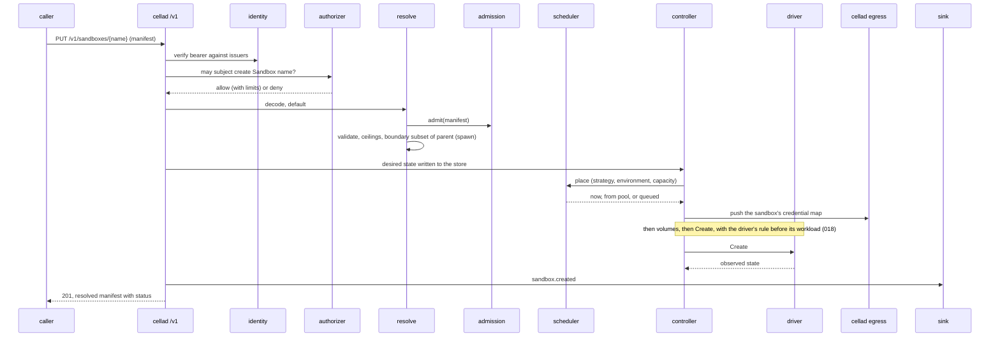

# Architecture

## Overview

Cella is an open source control plane for sandboxes: the environments
agents and workloads run in. It owns a declarative contract for such an
environment, a manifest in the shape of a Kubernetes object under the
API group `cella.latere.ai/v1`, the API that creates, drives, and
observes it, the scheduling that decides when and where it runs, and
the boundary the environment lives inside: what it may reach, what
credentials it may use, what it may spawn. It does not own the
environment itself. The data plane, the machines and clusters where
sandboxes run, is either a driver the control plane runs in-process
or a self-hosted environment whose worker connects to the control
plane and executes its operations. The same drivers run in both.

The design follows the Kubernetes API server in one respect and Origo
in another. Like an API server, `cellad` owns the schema, the
validation, the defaulting, the desired state, and the reconciliation
of desired into observed, and pushes every question of who may do what
to endpoints an operator writes. Like Origo, the whole component is
public, one installation of it is Latere's, and nothing in the tree
names that installation except as a default, an example, or the API
group.

This spec fixes what every other spec assumes: the two planes, the
components, the package boundary, the extension points, the flows, and
the invariants. Read it first.

## Current state

Nothing of the design is built. The repository holds the scaffold of
[[002-repository-scaffold]]: the binary serving its probes, typed
configuration, and the gate. The hosted platform this control plane
was extracted from runs today as one closed binary with its own copies
of the manifest, the k8s driver, an egress gateway, and the identity,
billing, and product surfaces this spec names as a platform's; its
migration onto this control plane is that platform's own work and out
of scope here, except that the boundary this spec draws must make it
possible.

## Design

### Two planes

The control plane never dials into a self-hosted data plane. A worker
there connects outbound, registers its environment, claims operations,
executes them with a driver, and posts results, the shape a managed
agent service uses for customer-hosted execution. A directly driven
data plane is the same driver called in-process. A caller cannot tell
which kind of environment its sandbox landed on except by reading
`status.environment`, `status.driver`, and `status.isolation`.

### Components

Two binaries ship to users. `cellad` is the server side, one image, one
role per process selected by subcommand; `cella` is the client, small
and dependency-light because it runs where agents run. A third,
`cella-stubs`, ships only as the test image the release pipeline's
conformance job runs ([[014-release-and-installation]]).

| Binary and role | Runs where | Owns |
|---|---|---|
| `cellad serve` | the control plane | the API, resolve, identity, scheduling, the controller, the store, the webhook clients, the event delivery |
| `cellad worker` | a self-hosted data plane | one registered environment: claims operations for it and executes them with the driver its host has (k8s, podman, local, native) |
| `cellad egress` | beside sandboxes in either data plane | the credential-substituting egress gateway: the only path from a sandbox to the network, with a per-sandbox map the control plane pushes |
| `cellad check` | wherever an installation is verified | one line per requirement, exit 1 on any failure |
| `cella` | a shell or an agent | the client of the API |
| `cella-stubs` | tests, `make run`, and the release pipeline's conformance job; never an installation | the stub issuer, authorizer, admission endpoint, and sink |

Each role is its own package under `internal/` (`internal/serve`,
`internal/worker`, `internal/egressd`, `internal/check`), so the
dependency gate holds one allow list per role even though one binary
carries them: the egress role's build list reaches `pkg/egress` and the
standard library and never the Postgres driver or the Kubernetes
client. Splitting a role into a binary of its own later is a new
`main` over an existing package.

### Packages

The module is `latere.ai/x/cella`. Four package trees at the root,
`manifest`, `runtime`, `controller`, and `egress`, with their
subpackages, are imported by others; everything else is `internal/`.
The word for what turns a manifest into a running environment is
`driver`, in every spec and every identifier; `backend` is not used.

| Package | Owns | Promise to an importer | Spec |
|---|---|---|---|
| `manifest`, `manifest/v1` | the `cella.latere.ai/v1` kinds, strict decoding, validation, defaulting, resolve, the boundary-subset check | a manifest the schema accepts today is accepted by every later `v1` build; new fields are optional; Go API additive within a module major | [[003-manifest-contract]] |
| `runtime` | the `Driver` interface a data plane implements, its capabilities, the shared types | changes only with a module major | [[004-runtime-contract]] |
| `runtime/k8s`, `runtime/podman`, `runtime/vm`, `runtime/local`, `runtime/native`, `runtime/remote`, `runtime/runtimetest` | the six drivers, `vm` a stub until [[024-vm-driver]] decides, and the conformance suite a driver passes | a driver that passes `runtimetest` works under `controller` and under `cellad worker` | [[004-runtime-contract]], [[021-data-plane-workers]] |
| `controller` | desired-to-observed reconciliation, the phase machine, the reaper, recovery, the scheduler and its strategies, sets | drives any conforming driver; owns no HTTP, no identity, no store implementation | [[005-lifecycle-controller]], [[020-scheduling-and-sets]] |
| `egress` | compiling a sandbox's secrets and egress rules into the map the gateway consumes | none beyond the wire shape it shares with the `egress` role | [[018-egress-and-secrets]] |
| `internal/api` | the `/v1` handlers, streams, the OpenAPI document | none | [[008-api]], [[023-computer-use-operations]] |
| `internal/auth` | the OIDC verifier, workload and environment tokens, the authorizer client, the owner policy | none | [[006-identity]] |
| `internal/serve`, `internal/worker`, `internal/egressd`, `internal/check` | the four roles of `cellad`, one package each with its own dependency allow list | none | [[002-repository-scaffold]], [[021-data-plane-workers]], [[018-egress-and-secrets]], [[014-release-and-installation]] |
| `internal/admission`, `internal/events`, `internal/store`, `internal/config`, `internal/version`, `internal/cellacli`, `internal/cellaclient` | as their specs say | none | [[007-admission]], [[009-events]], [[010-state]], [[002-repository-scaffold]], [[011-agent-client]] |

The rule for the root packages: they compute, validate, and drive.
`manifest`, `runtime`, `controller`, and `egress` themselves import
nothing under `internal/`, no HTTP client, no database driver, and no
identity library; a driver subpackage dials its own substrate (the
Kubernetes API, the Podman socket, a worker's stream) and nothing else.
None of them dials an identity provider, a database, a billing system,
or a webhook. A platform imports them to get the contract, the drivers,
and the controller with its own identity and policy around them, or
runs `cellad` and gets the same through the webhooks. Both paths reach
one `Resolve` and one `Driver`, so a manifest means the same thing on
both.

### Kinds

| Kind | Is | Spec |
|---|---|---|
| `Sandbox` | one environment: image, resources, volumes, secrets, network boundary, mesh and spawn rights, scheduling, lifecycle; `status` written by the server | [[003-manifest-contract]] |
| `Secret` | a credential the control plane holds encrypted and never returns, with its own destination scope and injection rule; a sandbox receives a placeholder | [[018-egress-and-secrets]] |
| `Volume` | persistent storage with a life of its own, attached to sandboxes by mount; how an application an agent built keeps its state, and how tools and configuration reach a run | [[019-volumes]] |
| `SandboxSet` | many sandboxes from one template with per-replica variants and a completion policy; the unit an RL rollout or an evaluation asks for | [[020-scheduling-and-sets]] |
| `Environment` | a registered data plane: driven directly or by a worker; capacity, capabilities, labels | [[021-data-plane-workers]] |

Every kind is one object under `apiVersion: cella.latere.ai/v1` with
`metadata`, `spec`, and `status`, decoded and resolved by the same
package and served by the same API grammar.

### The control plane and a platform

| The control plane owns | A platform supplies |
|---|---|
| the kinds and their evolution | accounts, organizations, teams |
| one resolve pipeline, the seven stages of [[003-manifest-contract]] | the permission model, as an authorizer |
| scheduling: when and where a sandbox runs, pools, queues, sets | quotas, plans, billing, as authorizer limits and admission ceilings |
| lifecycle: desired state, phases, reaper, recovery | catalogs of images and policies, as admission mutation |
| the boundary: egress rules, secrets as placeholders, mesh and spawn subsetting | the secrets' values' provenance, and what else its runtime adds through decorators |
| exec, attach, files, ports, display, input | a dashboard, a console, a marketplace |
| caller identity from listed issuers; workload and environment tokens | the issuer |
| the events of every mutation, signed, to a sink | the sink, and what it does with them |
| the `cella` command, the worker, the gateway, the stubs | multi-region routing, fleet views, activity feeds |

A platform never needs a fork. Everything in the right column reaches
the control plane through an extension point or the exported packages.

### Extension points

| Point | Reached | Contract | Default when absent |
|---|---|---|---|
| OIDC issuers | on every request | standard OpenID Connect; audience `cella` unless configured | none: `cellad` refuses to start without an issuer |
| Authorizer webhook | on every request that names a subject and an action | [[006-identity]]; unavailability is a refusal | the built-in owner policy |
| Admission webhook | on every apply, at stage 3 of [[003-manifest-contract]]'s resolve | [[007-admission]]; unavailability is a refusal | the built-in defaults and ceilings |
| Event sink | after every mutation and every operation | [[009-events]]: signed `POST`, at-least-once, ordered per object | off |
| Environments | registered by an operator; a worker connects | [[021-data-plane-workers]] | the one environment the in-process driver of `CELLA_RUNTIME` provides |
| Driver decorators | at import time, by a platform that constructs a driver itself | [[004-runtime-contract]] | none |
| Scheduling strategies | in `controller.Options` | [[020-scheduling-and-sets]] | `immediate`, `pooled`, `queued` |

### Flows

Apply:

Operations (exec, attach, files, ports, screenshot, input) follow the
first three steps, then reach the driver, in-process or through a
worker's claim, and stream back through the API. Each emits one event
naming the operation and never its content.

Spawn: a process inside a sandbox applies a manifest with the workload
token. Identity sees `workload` set; the authorizer decides as for any
subject; resolve takes the parent's resolved manifest as the ceiling
and refuses any field that widens the boundary; the controller debits
the parent's spawn budget in the same act that creates the child, and
the child inherits the parent's mesh. The boundary declared at the
root of a spawn tree bounds every descendant.

### State

Two states, two truths. Desired state is the resolved manifest, the
thing a caller applied; it is the control plane's and lives in the
store. Observed state is what the data plane reports: phase, timestamps,
the resource shape granted, the labels the driver stamped; it is the
driver's and is rebuilt from it at start and after a lost watch. The
controller's job is to make observed match desired. With `CELLA_DB_URL`
set, desired state survives a control plane restart and a data plane
that lost the object: a sandbox whose driver reports `Lost` is
recreated from its desired state with its volumes reattached, rather
than forgotten. Without Postgres, desired state lives with the process,
and a lost object is reported and reaped, which the start-up log says.

### Naming

`cella.latere.ai/v1` is the API group and version. Kubernetes asks only
that a group be a DNS subdomain and validates nothing about who owns
it; every project outside the core groups uses its own domain, and
this is Latere's open source project. The group is therefore the one
place a Latere name appears in the public contract, and the invariant
below says so.

Every object has a stable id, a ULID with a kind prefix: `sbx_` for a
sandbox, `sec_` a secret, `vol_` a volume, `set_` a set, `env_` an
environment, `msh_` a mesh, `evt_` an event, `op_` a worker operation,
`req_` a request.
The id is the key of every `/v1/<kind>/{id}` path, the value after the
colon in a token subject (`sandbox:sbx_...`), and the `cella.latere.ai/id`
label; a name may be reused after delete, an id never.

Reserved prefixes: labels and annotations under `cella.latere.ai/` are
the control plane's and a manifest that sets one is refused; a platform
picks its own prefix. Paths under `/run/cella/` inside a sandbox are
the control plane's projections. Environment variables under `CELLA_`
inside a sandbox are the control plane's; variables the server reads
are `CELLA_*`.

### Dependencies

The build list of `./cmd/cellad` reaches the standard library,
`latere.ai/x/pkg`, the Kubernetes client for the k8s driver, the Podman
API client for the podman driver, the Postgres driver for the store,
and the OpenTelemetry SDK, and nothing else: no cloud SDK, no web
framework, no ORM. `./internal/egressd` reaches `latere.ai/x/pkg/egress` and the standard
library; `./internal/worker` reaches the drivers and never the Postgres
driver; `./cmd/cella` reaches the standard library and the error
envelope. The `depcheck` gate holds each list, and a
new entry is a row with a reason.

### Invariants

1. One schema, one resolver, one meaning. The manifest is the only way
   to create an object; every surface, the API, the command, and an
   importer, goes through one `Resolve`; two surfaces never accept
   different subsets of a kind; and the resolved manifest a caller
   reads back is what the data plane was asked for, every default
   included and visible.
2. Desired state is the control plane's; observed state is the data
   plane's. The observed index in the store is a cache rebuilt from the
   driver and never authoritative: a lifecycle decision that reads it
   acts on what the driver last reported, and no observed state
   overwrites desired state.
3. `cellad` verifies identity and issues none for people. The tokens it
   mints identify sandboxes and environments.
4. Permission is a decision from outside. An unavailable decision is a
   refusal. The built-in owner policy is a policy, not an allow-all.
5. No Latere hostname, namespace, or value in a released artifact, a
   deploy manifest, a default that a fork would inherit, or the
   documentation, except as an example or the API group. A fork's tag
   publishes under the fork's namespace. The module path, its
   `latere.ai/x/*` dependencies, and the shared CI pipeline are the
   project's own coordinates and are not what this forbids.
6. `manifest`, `runtime`, `controller`, and `egress` own no policy and
   dial nothing; a driver subpackage dials only its substrate.
7. Every mutation and every operation emits one event; the payload
   names the subject, the object, the action, and never the content.
8. A secret's value never enters a sandbox. A sandbox holds a
   placeholder; the gateway substitutes it only toward a host in the
   secret's own scope, and scope lives on the secret.
9. The boundary declared when a sandbox is created, the fields the
   boundary check of [[003-manifest-contract]] holds, is never widened
   by the workload. A child's boundary is a subset of its parent's.
10. The control plane never dials into a self-hosted data plane; the
    worker connects outbound and claims.

## Not in this spec

The schema fields ([[003-manifest-contract]]), the driver interface
([[004-runtime-contract]]), the webhook payloads
([[006-identity]], [[007-admission]], [[009-events]]), the endpoint
table ([[008-api]]), egress and secrets ([[018-egress-and-secrets]]),
volumes ([[019-volumes]]), scheduling and sets
([[020-scheduling-and-sets]]), workers ([[021-data-plane-workers]]),
mesh and spawn ([[022-mesh-and-spawn]]), the threat model
([[013-security-and-threat-model]]), and how a platform migrates onto
the packages ([[016-building-a-plane]]).

## Acceptance criteria

| Criterion | Test that proves it | State |
|---|---|---|
| `manifest`, `runtime`, `controller`, and `egress` import nothing under `internal/`, no HTTP client, no database driver, and no identity library; each driver subpackage reaches only its own substrate's client | `TestRootPackagesDialNothing` over `go list -deps`, one allow list per package | not built |
| Each role package's and each binary's build list matches its `depcheck` allow list | the `depcheck` gate | passing for the scaffold's list |
| No released artifact, deploy manifest, inherited default, or documentation page names a Latere hostname or namespace outside an example or the API group | `TestNoLatereCoordinatesInReleasedArtifacts` over `deploy/`, `docs/`, the workflows' image references, and every default in `internal/config`; [[014-release-and-installation]]'s `TestReleasePublishesUnderTheOwnersNamespace` | not built |
| A manifest applied through the API and one handed to `manifest.Resolve` by an importer with the same options produce byte-identical resolved manifests | `TestAPIAndImporterResolveAgree`, comparing the `PUT` response body with `Resolve`'s output | not built |
| A sandbox created on a directly driven environment and one on a worker's environment are indistinguishable through the API except by `status.environment`, `status.driver`, and `status.isolation` | conformance case run against both | not built, [[021-data-plane-workers]] |
| The control plane opens no connection toward a worker's host during the whole e2e tier | [[021-data-plane-workers]]'s `TestNoInboundToTheDataPlane` | not built |
| `cellad` refuses to start with no issuer configured | `TestServeRefusesToStartWithoutAnIssuer` | not built, [[006-identity]] |
| With the authorizer URL set and the endpoint down, every request is refused with `authorizer_unavailable` | conformance case | not built, [[006-identity]] |
| After `cellad` restarts with Postgres and the data plane has lost one of three sandboxes, `GET /v1/sandboxes` lists three and the lost one returns to `Running` with its volume | e2e tier of [[012-test-stubs-and-tiers]] | not built, [[010-state]] |
| A canary secret value appears in no sandbox environment, file, event, or log across the e2e tier | `TestSecretValuesNeverEnterASandbox` | not built, [[018-egress-and-secrets]] |
| A child spawned with one more allowed host than its parent is refused with `boundary_exceeded` | [[022-mesh-and-spawn]]'s `TestSpawnBoundary` | not built |
