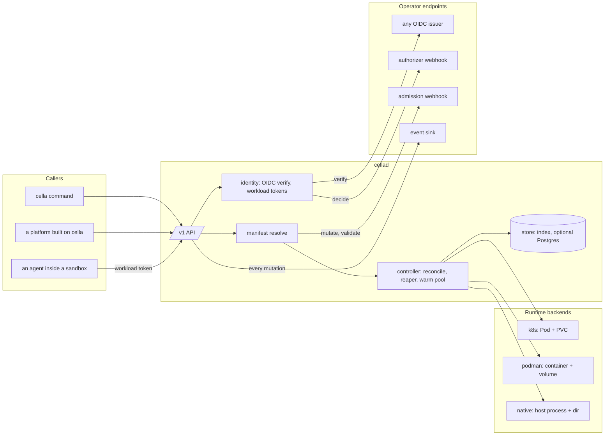
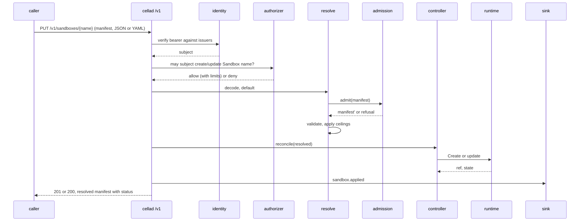

# Architecture

## Overview

Cella is the open core of a sandbox platform: a declarative contract for
an agent or workload environment, the server that makes such an
environment exist on a runtime backend and keeps it alive for as long as
the contract says, and the packages a platform imports to build a
hosted product on top. The contract is a manifest in the shape of a
Kubernetes object, `apiVersion: cella/v1`, `kind: Sandbox`. The server
is `cellad`. The packages are `manifest`, `runtime`, and `controller`.

The design follows the Kubernetes API server in one respect and Origo
in another. Like an API server, `cellad` owns the schema, the
validation, the defaulting, and the reconciliation of desired state
into a backend, and pushes every question of who may do what to
endpoints an operator writes. Like Origo, the whole component is
public, one installation of it is Latere's, and nothing in the tree
names that installation except as a default or an example.

This spec fixes what every other spec assumes: the components, the
package boundary, what the core owns and what a plane built on it
supplies, the extension points, the flows, and the invariants. Read it
first.

## Current state

Nothing of the design is built. The repository holds the scaffold of
[[002-repository-scaffold]]: the binary serving its probes, typed
configuration, and the gate. The specs after this one each take one
component. The hosted plane this core was extracted from runs today as
one closed binary with the identity, billing, and product surfaces
this spec names as a plane's; its migration onto the packages is that
plane's own work and is out of scope here, except that the boundary
this spec draws must make it possible.

## Design

### Components

One binary, three kinds of neighbour. Callers speak the `/v1` API of
[[008-api]]. Operator endpoints are HTTP contracts the operator or the
plane implements; each has a default when absent, listed under
Extension points. Backends are Go implementations of one interface,
[[004-runtime-backend-contract]], selected by `CELLA_RUNTIME`.

### Packages

The module is `latere.ai/x/cella`. Three packages at the root are
imported by others; everything else is `internal/`.

| Package | Owns | Promise to an importer | Spec |
|---|---|---|---|
| `manifest`, `manifest/v1` | the `cella/v1` types, strict decoding from JSON and YAML, structural validation, defaulting, the resolved form | a manifest the schema accepts today is accepted by every later `v1` build; new fields are optional; Go API changes are additive within a module major | [[003-manifest-contract]] |
| `runtime`, `runtime/k8s`, `runtime/podman`, `runtime/native`, `runtime/runtimetest` | the `Runtime` interface, its optional capabilities, the three backends, and the conformance suite a fourth must pass | the interface changes only with a module major; a backend that passes `runtimetest` works under `controller` | [[004-runtime-backend-contract]] |
| `controller` | reconciliation of a resolved manifest into backend calls, the reaper, the warm pool | drives any conforming `Runtime`; owns no HTTP, no identity, no store | [[005-lifecycle-controller]] |
| `internal/api` | the `/v1` handlers, streams, the OpenAPI document | none | [[008-api]] |
| `internal/auth` | the OIDC verifier over the issuers, the workload token signer and its key set, the authorizer client, the built-in owner policy | none | [[006-identity]] |
| `internal/admission` | the admission client and the built-in defaults and ceilings | none | [[007-admission]] |
| `internal/events` | the signed event sink client and the journal | none | [[009-events]] |
| `internal/store` | the sandbox index, token revocation, and the journal, in memory or in Postgres | none | [[010-state]] |
| `internal/config`, `internal/version` | typed configuration, build identity | none | [[002-repository-scaffold]] |
| `internal/cellacli` | the `cella` command | none | [[011-agent-client]] |

The rule for the root packages: they compute, validate, and drive. They
never dial an identity provider, a database, a billing system, or a
webhook. A platform imports them to get the contract and the backends
with its own identity and policy around them, or runs `cellad` and gets
the same through the webhooks. Both paths reach one `Resolve` and one
`Runtime`, so a manifest means the same thing on both.

### The core and a plane

| The core owns | A plane supplies |
|---|---|
| the manifest schema and its evolution | accounts, organizations, teams |
| one resolve pipeline: decode, default, admit, validate | the permission model, as an authorizer |
| the runtime backends and their conformance | quotas, plans, and billing, as authorizer limits and admission ceilings |
| lifecycle: create, start, stop, delete, auto-stop, TTL, deadline, warm pool | catalogs of images and policies, as admission mutation |
| exec, attach, file transfer, logs | secret brokering and egress substitution, as a runtime decorator or a sidecar the admission step adds |
| verification of caller identity against listed OIDC issuers | the issuer itself |
| workload identity: one token per sandbox, the key set that verifies it | what a plane grants that identity beyond the core's own API |
| the events of every mutation, signed, to a sink | the sink, and what it does with them |
| the `cella` command and its skill | a dashboard, a console, a marketplace |
| a single-node index, optionally durable in Postgres | multi-region routing, fleet views, activity feeds |

A plane never needs a fork. Everything in the right column reaches the
core through an extension point below or through the exported packages.

### Extension points

| Point | Reached | Contract | Default when absent |
|---|---|---|---|
| OIDC issuers | on every request, by discovery and key set | standard OpenID Connect; audience `cella` unless configured | none: `cellad` refuses to start without an issuer, because an API with no identity is not a sandbox service |
| Authorizer webhook | on every request that names a subject and an action | [[006-identity]]: `POST` one decision per request; unavailability is a refusal | the built-in owner policy: a subject acts on the sandboxes it created; `CELLA_ADMIN_SUBJECTS` act on all |
| Admission webhook | on every apply, after defaulting and before validation | [[007-admission]]: `POST` the manifest, receive the manifest or a refusal; unavailability is a refusal | the built-in defaults and the ceilings of the configuration |
| Event sink | after every mutation and every exec | [[009-events]]: signed `POST`, at-least-once, ordered per sandbox | off |
| Runtime decorators | at import time, by a plane that constructs a backend itself | [[004-runtime-backend-contract]]: a Go hook over the backend's object before it is created | none |

The four HTTP points are the same shape: one URL, one bearer or one HMAC
secret, one request per decision, fail closed. A stub of each is part
of the tree ([[012-test-stubs-and-tiers]]) so `make run` and the
end-to-end tiers exercise the real client against a real endpoint.

### Flows

Apply:

Exec follows the same first three steps, then streams through the
backend's `Exec` with the request body as stdin and the response as
stdout, stderr, and exit code, and emits one event with the command,
the subject, and the exit code and never the output.

Workload identity: at create the controller asks identity for a token
whose subject is the sandbox and whose audience is `cella`, and the
backend projects it at `/run/cella/token`. A process inside the sandbox
calls `/v1` with it. The authorizer sees the sandbox as the subject and
decides as for any other; the built-in policy lets a sandbox read and
exec itself and nothing else. The token dies with the sandbox: a
deleted sandbox's token is refused because the index no longer holds
its id, whether or not a store is on.

### State

The backend holds the truth about a sandbox: its phase, its labels, its
timestamps, its resource shape, in the labels and annotations of the
Pod, the container, or the native record. `cellad` rebuilds its index
from the backend at start and after a lost watch, so a restart loses
nothing a backend still knows. The store of [[010-state]] is an index
and a journal: it makes lists fast, keeps revocations and events across
restarts, and is optional. With `CELLA_DB_URL` unset the index is in
memory and the journal is the sink's problem; set, both are in
Postgres. No decision of the controller reads the store as truth.

### Naming

`cella/v1` is the API group and version of the schema. It carries no
domain because the project is the authority of its own schema, the way
`apps/v1` is Kubernetes's own. A platform that accepted an older group
name maps it to `cella/v1` at its own edge; the core never sees it.

Reserved prefixes: labels and annotations under `cella/` are the core's
and a manifest that sets one is refused; a plane picks its own prefix.
Paths under `/run/cella/` inside a sandbox are the core's projections.
Variables the server reads are `CELLA_*`.

### Dependencies

The build list of `./cmd/cellad` reaches the standard library,
`latere.ai/x/pkg`, the Kubernetes client for the k8s backend, the
Podman API client for the podman backend, the Postgres driver for the
store, and the OpenTelemetry SDK, and nothing else: no cloud SDK, no
web framework, no ORM. The `depcheck` gate holds the list, and a new
entry is a row with a reason.

### Invariants

1. The manifest is the only way to create a sandbox. Every surface,
   the API, the command, and an importer, goes through one `Resolve`,
   and the resolved manifest a caller reads back is what the backend
   was asked for, defaults included.
2. Runtime truth lives in the backend. A store is an index and a
   journal, never consulted for a lifecycle decision.
3. `cellad` verifies identity and issues none for people. The only
   tokens it mints identify sandboxes.
4. Permission is a decision from outside, and no decision is a
   refusal. The built-in owner policy is a policy, not an allow-all.
5. Every default is visible. Nothing the backend receives is absent
   from the resolved manifest.
6. No Latere hostname, namespace, or value anywhere but as a default
   or an example. A fork's tag publishes under the fork's namespace.
7. The root packages own no policy and dial nothing.
8. Every mutation and every exec emits one event; the payload names
   the subject, the sandbox, the action, and never the content.
9. A sandbox reaches the hosts its manifest names and no other, where
   the backend can enforce it; a backend that cannot says so in its
   capabilities and the resolved manifest carries the warning.
10. One schema, one resolver, one meaning: two surfaces never accept
    different subsets of `cella/v1`.

## Not in this spec

The schema fields ([[003-manifest-contract]]), the backend interface
([[004-runtime-backend-contract]]), the webhook payloads
([[006-identity]], [[007-admission]], [[009-events]]), the endpoint
table ([[008-api]]), the threat model
([[013-security-and-threat-model]]), and how a plane migrates onto the
packages ([[016-building-a-plane]]).

## Acceptance criteria

| Criterion | Test that proves it | State |
|---|---|---|
| The root packages import nothing under `internal/` and no package that dials: no `net/http` client, no database driver, no OIDC library | `TestRootPackagesDialNothing` over `go list -deps` of `./manifest/...`, `./runtime/...`, `./controller/...` | not built |
| `./cmd/cellad`'s build list matches the `depcheck` allow list | the `depcheck` gate | passing for the scaffold's list |
| No file in the tree names a Latere hostname outside a default or an example | `TestNoLatereHostnameOutsideDefaults` over `git ls-files` | not built |
| A manifest applied through the API and one applied through an importer's call to `Resolve` produce byte-identical resolved manifests | conformance case of [[015-conformance-suite]] | not built |
| `cellad` refuses to start with no issuer configured | `TestServeRefusesToStartWithoutAnIssuer` | not built, [[006-identity]] |
| With the authorizer URL set and the endpoint down, every request is refused with `authorizer_unavailable` | conformance case | not built, [[006-identity]] |
| After `cellad` restarts against a backend holding three sandboxes, `GET /v1/sandboxes` lists three before any apply | e2e tier of [[012-test-stubs-and-tiers]] | not built, [[010-state]] |
