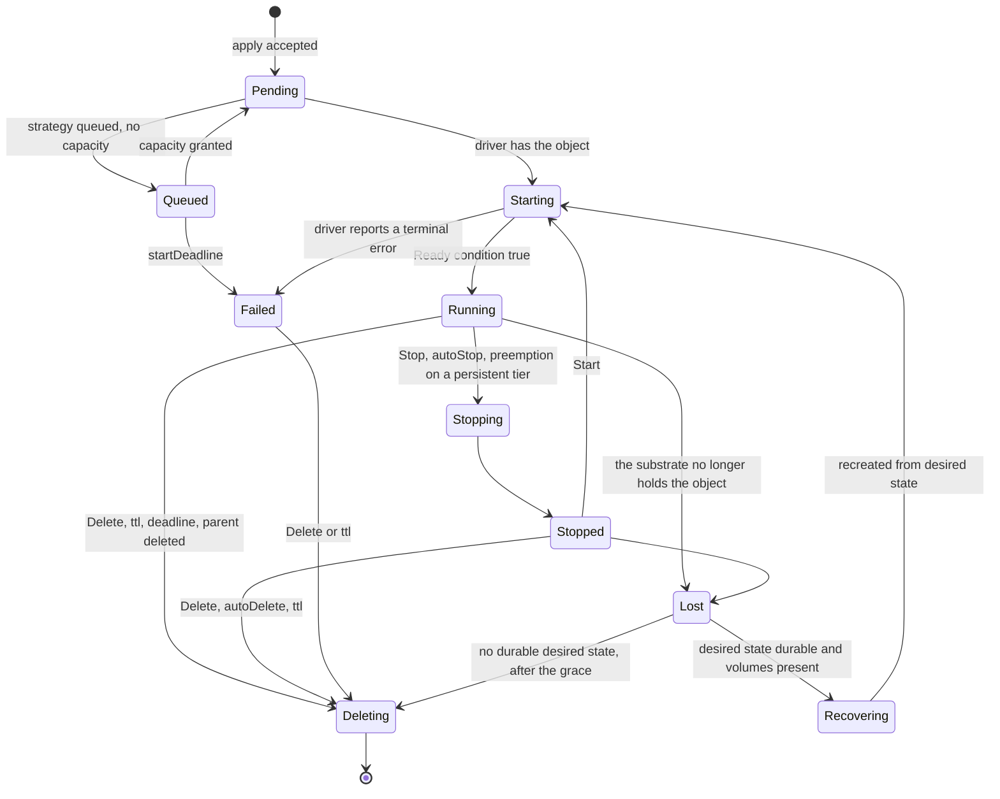

# Lifecycle controller

## Overview

The controller makes observed state match desired state: it turns a
resolved manifest into calls on a `Driver` and keeps the sandbox in the
state the manifest asks for until the manifest says it should end. It
owns the phase machine, the derivation of a `CreateSpec`, the reaper
that stops idle sandboxes and deletes expired ones, recovery of a
sandbox the data plane lost, and the cascade over a spawn tree. It is
an exported package: a platform importing it gets the same lifecycle
`cellad` runs, against any conforming driver. Placement, pools, queues,
and sets are the scheduler's, in [[020-scheduling-and-sets]].

## Current state

Not built. The reaper's rules come from the hosted platform, where
they have run for months; the phase machine, recovery from desired
state, and the cascade are written down here for the first time.

## Design

### Phases

A transition the driver does not support for the sandbox's tier is a
refusal at the API: `Stop` on `ephemeral` is `Delete` in effect and the
API says so with `tier_ephemeral`; `Start` on `Failed` is
`phase_conflict`. `Queued` and `Recovering` are the controller's
phases; a driver never reports them.

### Reconcile

`Reconcile(ctx, desired, observed)` is the one entry point. Desired
state is the resolved manifest in the store; observed is what the
driver reports. On create it derives the `CreateSpec`, asks identity for
the workload token, pushes the egress map, attaches volumes, calls
`Create`, and records `Pending`, in the fail-closed order of
[[018-egress-and-secrets]]. On update it computes the `Change` from the
diff of mutable fields and calls `Update`. Every call is idempotent
against the driver's labels: a `Create` that finds `cella.latere.ai/id`
already stamped adopts the object rather than making a second one, so a
crash between the driver call and the store write is repaired by the
next reconcile.

### Recovery

When the driver reports `Lost` and the store holds the sandbox's
desired state (Postgres on, [[010-state]]), the controller moves it to
`Recovering` and recreates it from that state: the same id, name,
labels, token, egress map, and volumes, on the same environment. A
persistent workspace or a `Volume` that still exists is reattached and
the work is intact; an ephemeral workspace is empty again and
`conditions[WorkspaceReady]` says `Recreated`. Recovery emits
`sandbox.recovered` with what was kept. This is what keeps a tenant's
environment from vanishing when a node is drained, a Pod is evicted, or
a worker host is replaced: the data plane can lose the object; the
control plane still knows what should exist. Without a durable store a
lost sandbox is reaped after `CELLA_LOST_GRACE`, and the start-up log
says the control plane runs without recovery.

### Cascade

Deleting a sandbox deletes its descendants breadth first
([[022-mesh-and-spawn]]), each with `reason: parent`. Deleting a set
deletes its replicas ([[020-scheduling-and-sets]]). The controller
never deletes a `Volume` with `retain: true`.

The `CreateSpec` derivation is a pure function with a table test per
field of [[003-manifest-contract]], and the one place the manifest's
vocabulary meets the backend's.

### The reaper

One loop, one tick per `CELLA_REAP_INTERVAL` (default `30s`), reads
`List` from the driver and applies, in order, for every sandbox:

| Rule | Condition | Action |
|---|---|---|
| deadline | `now >= deadline` | Delete |
| ttl | `now >= createdAt + ttl` | Delete |
| autoDelete | `Stopped` and `now >= stoppedAt + autoDelete` | Delete |
| autoStop | `Running` and `now >= lastActivityAt + autoStop` | Stop on `persistent`, Delete on `ephemeral` |
| lost | `Lost` for longer than `CELLA_LOST_GRACE` (default `10m`) | Recover when desired state is durable; otherwise delete the record |

Activity is any exec, attach byte, input event, or file transfer,
stamped by the driver as `cella.latere.ai/last-activity-at` with a write
coalesced to once per minute so a busy terminal does not write the
substrate per keystroke.
Every reaper action emits the event of [[009-events]] with the rule as
the reason. The reaper is the only writer of terminal transitions
besides an explicit request, so a sandbox that ended has one event
saying why.

### Watching

The controller consumes `Watch` from the driver to keep the observed
state of [[010-state]] current and to move phases without polling. A watch that
ends is resumed after a full `List`, so no transition is missed for
longer than one relist.

### Limits

`controller.Options` carries the reap interval, the lost grace, the
scheduler and its strategies, and a `Clock`, so the whole package runs
under a fake clock in the unit suite and the reaper's rules are tested
to the second.

## Not in this spec

The HTTP handlers that call `Reconcile` ([[008-api]]); the store
([[010-state]]); the token the controller asks for ([[006-identity]]);
placement, pools, queues, and sets ([[020-scheduling-and-sets]]).

## Acceptance criteria

| Criterion | Test that proves it | State |
|---|---|---|
| Every field of the manifest maps to the `CreateSpec` field the table names | `TestCreateSpecDerivation`, table-driven | not built |
| A `Create` that crashes before the store write is adopted, not duplicated, on the next reconcile | `TestReconcileAdoptsAStampedObject` with a failing fake store | not built |
| The create order is map, volumes, driver, and a driver applies the rule before the workload; a failure at each step leaves no running workload and no dangling attachment | `TestCreateOrderFailsClosed` | not built |
| Each reaper rule fires at its second and not one before, under a fake clock | `TestReaperRules`, one case per rule | not built |
| `autoStop` on `ephemeral` deletes and on `persistent` stops | `TestAutoStopHonoursTier` | not built |
| A sandbox whose driver reports `Lost` with Postgres on returns to `Running` with the same id and its persistent volume's files intact; with Postgres off it is reaped after the grace | `TestRecoveryFromDesiredState`, `TestLostWithoutAStoreIsReaped` | not built |
| Deleting a root deletes every descendant with `reason: parent` | `TestCascade` | not built |
| A watch that ends is resumed after a relist and no transition is lost | `TestWatchResumesAfterRelist` | not built |
| The phase diagram above and the code's transition table agree | `TestPhaseTableMatchesSpec` reading this file's mermaid block | not built |
