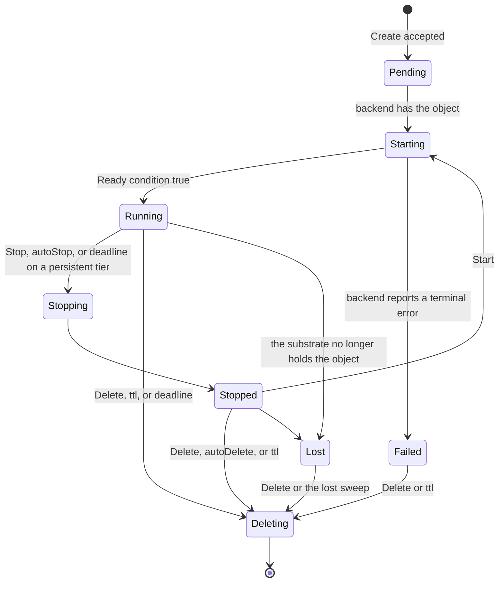

# Lifecycle controller

## Overview

The controller turns a resolved manifest into calls on a `Runtime` and
keeps the sandbox in the state the manifest asks for until the manifest
says it should end. It owns the phase machine, the derivation of a
`CreateSpec`, the reaper that stops idle sandboxes and deletes expired
ones, and the warm pool that makes a default create fast. It is an
exported package: a platform importing it gets the same lifecycle
`cellad` runs, against any conforming backend.

## Current state

Not built. The reaper's rules and the warm pool's acquire-and-adopt
shape come from the hosted plane, where they have run for months; the
phase machine is written down here for the first time.

## Design

### Phases

A transition the backend does not support for the sandbox's tier is a
refusal at the API: `Stop` on `ephemeral` is `Delete` in effect and the
API says so with `tier_ephemeral`; `Start` on `Failed` is
`phase_conflict`.

### Reconcile

`Reconcile(ctx, resolved, existing)` is the one entry point. On create it
derives the `CreateSpec`, asks identity for the workload token, calls
`Create`, and records `Pending`. On update it computes the `Change` from
the diff of mutable fields and calls `Update`. Every call is idempotent
against the backend's labels: a `Create` that finds `cella/id` already
stamped adopts the object rather than making a second one, so a crash
between the backend call and the index write is repaired by the next
reconcile.

The `CreateSpec` derivation is a pure function with a table test per
field of [[003-manifest-contract]], and the one place the manifest's
vocabulary meets the backend's.

### The reaper

One loop, one tick per `CELLA_REAP_INTERVAL` (default `30s`), reads
`List` from the backend and applies, in order, for every sandbox:

| Rule | Condition | Action |
|---|---|---|
| deadline | `now >= deadline` | Delete |
| ttl | `now >= createdAt + ttl` | Delete |
| autoDelete | `Stopped` and `now >= stoppedAt + autoDelete` | Delete |
| autoStop | `Running` and `now >= lastActivityAt + autoStop` | Stop on `persistent`, Delete on `ephemeral` |
| lost | `Lost` for longer than `CELLA_LOST_GRACE` (default `10m`) | Delete the record |

Activity is any exec, attach byte, or file transfer, stamped by the
backend as `cella/last-activity-at` with a write coalesced to once per
minute so a busy terminal does not write the substrate per keystroke.
Every reaper action emits the event of [[009-events]] with the rule as
the reason. The reaper is the only writer of terminal transitions
besides an explicit request, so a sandbox that ended has one event
saying why.

### The warm pool

With `CELLA_POOL_SIZE` above zero on a backend with `WarmPool`, the
controller keeps that many sandboxes created from the operator's
default image with the default resources and no owner, in `Running`,
labelled `cella/pool: "true"`. A create whose resolved spec matches a
pool entry's shape (image, resources, tier, network rule, display) is
served by adopting the entry: the backend applies the caller's labels,
env, workspace source, and token through `Update` and the adopted entry
becomes the caller's sandbox, while the pool refills in the background.
A create that matches nothing goes the slow path. Adoption is atomic
in the backend: two callers cannot adopt one entry, proved by the
conformance case `AdoptIsExclusive`.

The pool does not apply to `workspace.source: git` with a token, since
the clone runs after adoption anyway, and it never serves a sandbox to a
subject the authorizer would have refused: the authorizer decides before
the pool is asked.

### Watching

The controller consumes `Watch` from the backend to keep the index of
[[010-state]] current and to move phases without polling. A watch that
ends is resumed after a full `List`, so no transition is missed for
longer than one relist.

### Limits

`controller.Options` carries the reap interval, the lost grace, the pool
size and shape, and a `Clock`, so the whole package runs under a fake
clock in the unit suite and the reaper's rules are tested to the second.

## Not in this spec

The HTTP handlers that call `Reconcile` ([[008-api]]); the index the
watch feeds ([[010-state]]); the token the controller asks for
([[006-identity]]).

## Acceptance criteria

| Criterion | Test that proves it | State |
|---|---|---|
| Every field of the manifest maps to the `CreateSpec` field the table names | `TestCreateSpecDerivation`, table-driven | not built |
| A `Create` that crashes before the index write is adopted, not duplicated, on the next reconcile | `TestReconcileAdoptsAStampedObject` with a failing fake store | not built |
| Each reaper rule fires at its second and not one before, under a fake clock | `TestReaperRules`, one case per rule | not built |
| `autoStop` on `ephemeral` deletes and on `persistent` stops | `TestAutoStopHonoursTier` | not built |
| Two concurrent creates matching one pool entry yield one adoption and one slow-path create | `TestAdoptIsExclusive` against the native backend | not built |
| A pool never serves a create the authorizer refused | `TestPoolIsBehindTheAuthorizer` | not built |
| A watch that ends is resumed after a relist and no transition is lost | `TestWatchResumesAfterRelist` | not built |
| The phase diagram above and the code's transition table agree | `TestPhaseTableMatchesSpec` reading this file's mermaid block | not built |
