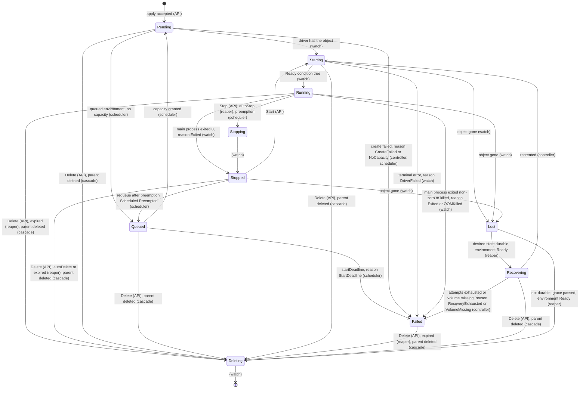

# Lifecycle controller

## Overview

The controller makes observed state match desired state: it turns a
resolved manifest into calls on a `Driver` and keeps the sandbox in
the state the manifest asks for until the manifest says it should end.
It owns the phase machine, the ordered create with its undo, the
update path that keeps the boundary from widening mid-change, the
reaper that stops idle sandboxes and deletes expired ones, recovery
of a sandbox the data plane lost, the workload token's re-mint, and
the cascade over a spawn tree. Placement, pools, queues, and sets are
the scheduler's, in [[020-scheduling-and-sets]], which lives in the
same package. `controller` is exported: a platform importing it gets
the same lifecycle `cellad` runs, against any conforming driver, and
supplies the collaborators through interfaces `controller` declares,
since it imports nothing under `internal/` ([[001-architecture]]).

## Current state

[[026-direct-control-plane]] implements synchronous native create, inspect, list, start, stop, and delete with durable intent. Reconciliation, lifecycle timers, recovery, updates, and cascade below remain to build.

Design provenance: The reaper's rules come from the hosted platform, where
they have run for months; the phase machine, the ordered create with
undo, recovery from desired state, and the cascade are written down
here for the first time.

## Design

### Phases



Every edge names its trigger and its owner. `Delete` is accepted in
every phase and moves the sandbox to `Deleting` at once, which is
what [[008-api]] returns. `Start` on `Failed` is `phase_conflict`.
`Stop` keeps the managed workspace and every attached volume; nothing
is lost until `Delete`. `Queued` and `Recovering` are the
controller's; a driver never reports them. Every terminal transition
emits one event of [[009-events]] with a reason from that spec's one
enum, whoever wrote it.

### The contract

```go
// Reconcile brings one sandbox's observed state to its desired state
// and returns the status the API stores and serves. It is idempotent:
// a call that finds its work done returns the current status.
func (c *Controller) Reconcile(ctx context.Context, desired *v1.Sandbox) (*v1.SandboxStatus, error)

type Options struct {
	Store     Store      // desired and observed state, the ledger, leases; controller's own interface over 010
	Drivers   Drivers    // the Driver for an environment id, and the environment's phase (021)
	Tokens    Tokens     // Mint(ctx, sandbox) (token, jti, exp, error); Revoke(ctx, jti) (006)
	Egress    Egress     // Compile; Send(ctx, environment, Map) waits for an acknowledgement; Purge(ctx, environment, principal) (018)
	Secrets   Secrets    // Secret objects by id for Compile, values included, from the store (010)
	Events    Events     // Emit(ctx, Event) (009)
	Scheduler Scheduler  // Place(ctx, desired) (Placement, error); Release(ctx, id) (020)
	Clock     Clock      // Now and a ticker, so the suite runs under a fake clock
	Lease     Lease      // Acquire(ctx, name, ttl) (held bool, error); the memory store's is always held (010)

	ReapInterval     time.Duration // CELLA_REAP_INTERVAL, default 30s
	LostGrace        time.Duration // CELLA_LOST_GRACE, default 10m
	RecoveryAttempts int           // CELLA_RECOVERY_ATTEMPTS, default 5
	TouchInterval    time.Duration // how often one sandbox's activity reaches the driver, default 1m
}
```

Every interface is declared in `controller` and implemented in
`internal/`; the suite implements each with a fake.

### Create

On a `desired` with no observed counterpart and no create in flight,
in this order, each step undone in reverse when a later one fails, so
a failed create leaves no map, no attachment, no live token, and no
running workload:

1. Write desired state; when `Parent` is set, debit the parent's spawn
   budget in the same store transaction ([[022-mesh-and-spawn]]), and
   refuse with `spawn_budget_exhausted` when it is spent. Undo: the
   desired state is marked `Failed` with the reason; the debit is
   credited back.
2. `Scheduler.Place`: now, from a pool entry, or `Queued`
   ([[020-scheduling-and-sets]]). A queued sandbox stops here and
   resumes at step 3 when capacity is granted.
3. `Egress.Compile` over the manifest and its `Secret` objects: mints
   the placeholders and produces the map ([[018-egress-and-secrets]]).
   `Egress.Send` puts the map on the environment's sync stream and
   waits for one gateway's acknowledgement ([[018-egress-and-secrets]]).
   Undo: `Purge`, a purge message on the same stream.
4. Attach every volume, the workspace volume first
   ([[019-volumes]]). Undo: detach in reverse.
5. `Tokens.Mint`. Undo: `Revoke` the `jti`.
6. Derive the `CreateSpec`: a total function of the resolved manifest,
   the compiled map's placeholders (into `Env`), the gateway address
   and CA, the token, the mesh id, the parent, and the volume ids. The
   derivation has a table test per field of [[003-manifest-contract]]
   and is the one place the manifest's vocabulary meets the driver's.
7. `Driver.Create`, or `Update` with `Adopt` for a pool entry. The
   driver applies the network rule before it starts the workload
   ([[004-runtime-contract]]). Undo: `Delete` the object if it exists.

Every step is idempotent against the driver's stamped identity: a
`Create` that finds `cella.latere.ai/id` already stamped adopts the
object rather than making a second one, so a crash between step 7 and
the observed write is repaired by the next reconcile. `Pending` is
written at step 1 and `Failed` with `CreateFailed` when the undo runs.

### Update

On a `desired` that differs from the last applied desired state, the
controller computes the `Change` from the diff of mutable fields and
applies it so that at no instant is the effective boundary wider than
both the old and the new manifest. The boundary is enforced twice, by
the gateway's map and by the driver's rule, and the effective boundary
is their intersection, so any order keeps the property; the order
used is map then driver: `Egress.Compile` and `Send`, then
`Driver.Update` with `Change.Egress`, `Change.Labels`,
`Change.Annotations`, `Change.Lifecycle`, `Change.Tier`,
`Change.Resources`. `Change.Volumes` carries the full desired list and
is sent only while the sandbox is `Stopped` ([[019-volumes]]); an
update that changes volumes on a `Running` sandbox is refused at the
API with `phase_conflict`. A secret's value update re-pushes the map
without a driver call; a secret's delete re-pushes without the entry
and writes the name into `status.secrets.notInjectable`
([[018-egress-and-secrets]]).

### The reaper

One loop on one replica, under `Lease` named `reaper` with a 15 second
TTL where the store provides one ([[010-state]]), one tick per
`ReapInterval`. On each tick, for every environment whose phase is
`Ready` ([[021-data-plane-workers]]), it reads `List` from the driver
and, treating an error as no list rather than an empty one, feeds it
to `Store.Observed.Rebuild` for that environment and applies the
rules, first match wins, for every sandbox. Every input is read from
the driver's stamped identity ([[004-runtime-contract]]), so the loop
runs from the substrate alone after a restart without a durable store;
a value of `never` disables its rule.

| Rule | Condition | Action |
|---|---|---|
| expired | `now >= expiresAt` | Delete, reason `Expired` |
| autoDelete | `Stopped` and `now >= stoppedAt + autoDelete` | Delete, reason `AutoDelete` |
| autoStop | `Running` and `now >= lastActivityAt + autoStop` | Stop, reason `AutoStop` |
| lost | `Lost` | when desired state is durable, `Recovering`; otherwise, after `LostGrace`, `Deleting` with reason `Lost` |
| token | a live sandbox whose token has passed two thirds of its lifetime | `Tokens.Mint`, `Driver.Update` with `Change.Token`, `Tokens.Revoke` of the previous `jti`, in one act ([[006-identity]]) |

For an environment that is not `Ready`, nothing is rebuilt and no rule
runs: its sandboxes hold whatever phase they had, `Lost` included, and
the grace does not count, so a merely unreachable worker never has its
intent deleted. When the environment returns to `Ready`, the next tick
rebuilds, and every desired sandbox with no observed counterpart is
`Lost` and enters the lost rule from that tick.

Activity: the API's exec, attach, input, and file handlers call
`Controller.Touch(id)`, which coalesces per sandbox and calls
`Driver.Touch` at most once per `TouchInterval`, so a busy terminal
does not write the substrate per keystroke.

### Recovery

`Recovering` is the controller's: the desired state exists, the
observed does not, and the environment is `Ready`. The controller
recreates the sandbox by the create order from step 3, with the same
id, name, labels, and annotations, a newly minted token with the
previous `jti` revoked, the map re-pushed, and every volume
reattached. The managed workspace and every `Volume` that still exists keep their
files; where the driver could not keep the managed workspace of a lost
object, it is empty again and `WorkspaceReady` says `Recreated`. A volume that no longer exists ends
recovery in `Failed` with `VolumesAttached: False` naming it and
reason `VolumeMissing`. Attempts back off from 30 seconds doubling to
8 minutes; after `RecoveryAttempts` the sandbox is `Failed` with
reason `RecoveryExhausted`. Success emits `sandbox.recovered` with
what was kept. Without a durable store, desired state dies with the
process, and a lost sandbox passes through `Deleting` after the grace
with reason `Lost`; the start-up log says the control plane runs
without recovery.

### Cascade

Deleting a sandbox deletes its descendants first, deepest generation
first, then the sandbox, each with reason `Parent` on the descendants
and the request's reason on the root, so no descendant outlives its
parent and no parent is gone while a child still runs. A child is
always on the parent's environment ([[003-manifest-contract]], rule
8). Deleting a set deletes its replicas ([[020-scheduling-and-sets]]).
Every delete detaches the sandbox's volumes; a volume with `retain:
false` and no other attachment is deleted with its last sandbox, and
a volume with `retain: true` is never deleted by the controller
([[019-volumes]]). The map is purged and the token's `jti` revoked at
`Deleting`, before the driver's `Delete` returns.

### Watching

The controller consumes `Watch` from every `Ready` environment's
driver. `added` and `modified` update the observed state and move the
phase as the diagram says; `deleted` completes `Deleting` or, for a
sandbox the controller did not delete, marks it `Lost`; `lost` marks
`Lost`; `relist`, and a closed channel, trigger a `List` and
`Store.Observed.Rebuild` for that environment and then a new `Watch`,
so no transition is missed for longer than one relist.

## Not in this spec

The HTTP handlers that call `Reconcile` and `Touch` ([[008-api]]); the
store behind `Store` ([[010-state]]); the token's shape
([[006-identity]]); placement, pools, queues, preemption, and sets
([[020-scheduling-and-sets]]); the environment's phase
([[021-data-plane-workers]]).

## Acceptance criteria

| Criterion | Test that proves it | State |
|---|---|---|
| Every edge of the diagram is exercised by its named trigger and owner; every phase of [[003-manifest-contract]] is reachable; every non-terminal phase has a `Delete` edge | `TestPhaseMachine`, table-driven from the diagram, and `TestEveryPhaseHasADeleteEdge` | not built |
| Every field of the manifest maps to the `CreateSpec` field the derivation table names, placeholders included | `TestCreateSpecDerivation`, table-driven | not built |
| Each of the seven create steps failing in turn leaves no map, no attachment, no unrevoked `jti`, and no object, and the sandbox `Failed` with `CreateFailed` | `TestCreateOrderFailsClosed`, one case per step, asserting the purge, the detach, and the revocation | not built |
| A `Create` that crashes before the observed write is adopted, not duplicated, on the next reconcile | `TestReconcileAdoptsAStampedObject` | not built |
| A spawn debits the budget in the same transaction as the desired write; two concurrent spawns against a budget of one yield one child and one `spawn_budget_exhausted` | `TestSpawnDebitIsAtomic` | not built |
| A narrowing update and an owner's widening update each keep the effective boundary within both manifests at every instant, observed through fake gateway and driver | `TestUpdateNeverWidensMidChange` | not built |
| `Change.Volumes` is sent only while `Stopped`; a secret update re-pushes; a secret delete re-pushes and writes `notInjectable` | `TestUpdatePaths` | not built |
| Each reaper rule fires at its second and not one before under a fake clock; `never` disables it; a sandbox matching two rules gets the first | `TestReaperRules`, one case per rule and one per tie | not built |
| The reaper does not run on a replica without the lease | `TestReaperNeedsTheLease` | not built |
| For an environment that is `Offline`, nothing is rebuilt, no rule runs, and `Lost` does not count the grace; when it returns, lost sandboxes recover | `TestOfflineEnvironmentHoldsState` | not built |
| An errored `List` rebuilds nothing | `TestListErrorIsNotEmpty` | not built |
| A token past two thirds of its life is re-minted, re-projected, and the old `jti` revoked in one act | `TestTokenReprojection` under a fake clock | not built |
| `Touch` reaches the driver at most once per interval per sandbox | `TestTouchCoalesces` | not built |
| A `Lost` sandbox with Postgres recovers with the same id, a new token, the old `jti` revoked, and its volumes' files; a managed workspace the driver lost is `Recreated`; a missing volume is `Failed VolumeMissing`; exhausted attempts are `Failed RecoveryExhausted` with the stated backoff | `TestRecovery`, four cases | not built |
| Without a durable store a lost sandbox is `Deleting` after the grace with reason `Lost` | `TestLostWithoutAStoreIsReaped` | not built |
| Deleting a root deletes descendants deepest first with reason `Parent`, then the root; volumes are detached, `retain: false` volumes with no other attachment deleted, `retain: true` kept; the map is purged and the `jti` revoked | `TestCascade` | not built |
| Each `Event` type has its phase effect; `relist` and a closed channel rebuild the environment's observed state and resume | `TestWatchEvents`, `TestWatchResumesAfterRelist` | not built |
| `controller` imports nothing under `internal/` | `TestControllerImports` | not built |
