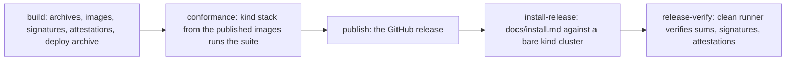

# Release and installation

## Overview

A `v*` tag is a release: two binaries for four platforms, three images,
checksums, signatures, bills of materials, provenance, a deploy
archive, and a GitHub release whose notes are the CHANGELOG section for
that version. Installation is one document that `verify.yml` walks on
every push, so it is never stale. `cellad check` tells an operator
whether an installation meets the requirements before the first
manifest.

## Current state

Not built. `verify.yml` runs the gate; there is no `release.yml`, no
`deploy/`, and no install document. The CHANGELOG rule is already in
force through the gate.

## Design

### Artifacts

| Artifact | Name |
|---|---|
| binaries | `cellad_<tag>_<os>_<arch>.tar.gz`, `cella_<tag>_<os>_<arch>.tar.gz` for linux and darwin, amd64 and arm64, plus `checksums.txt` |
| images | `ghcr.io/<owner>/cellad:<tag>`, `ghcr.io/<owner>/cella-stubs:<tag>`, `ghcr.io/<owner>/cella-display:<tag>` (the desktop of [[023-computer-use-operations]]: an X server, a window manager, the capture tool), multi-arch, digest-pinned in the release notes |
| attestations | cosign signatures over the images and the checksums; per-image SBOM and build-provenance attestations (`actions/attest-sbom`, `actions/attest-build-provenance`); an SPDX SBOM per image and one for the module graph, so `gh attestation verify oci://<image> --repo <owner>/<repo>` answers for an image before it runs |
| deploy archive | `deploy-<tag>.tar.gz`, the kustomize base and examples with the image references rewritten to the release |

The image namespace derives from the repository owner running the
workflow, overridable by the build-time variable `RELEASE_IMAGE_NAMESPACE`
(not a `CELLA_*` runtime setting, so it is absent from
[[002-repository-scaffold]]'s table), so a fork's tag publishes under the
fork's namespace; a test refuses a fixed `latere-ai` anywhere in the
workflow or the archive.

### Pipeline

`release.yml` runs on `v*`:

build produces the archives, images, signatures, attestations, and the
deploy archive; conformance brings up the kind stack of
[[012-test-stubs-and-tiers]] from the published images and runs
[[015-conformance-suite]]; publish cuts the GitHub release; install-release
walks `docs/install.md` against a bare kind cluster using the published
artifacts; release-verify, on a clean runner, downloads the archives,
verifies the checksum signature with `cosign verify-blob`, the image
signatures with `cosign verify`, and each image's attestations with
`gh attestation verify`. A deploy to an operator's own cluster is not
part of the public pipeline; the archive is the hand-off.

The every-push install walk is a separate `install` job in `verify.yml`,
not in `release.yml`: no tag exists at push time, so it renders the
`deploy/examples/kind` overlay with the image references overridden to
the branch's development image built earlier in the same run. On a tag,
`install-release` supersedes it against the published artifacts.

`Dockerfile.ci` copies the binary the pipeline built; its runtime stage
is byte-identical to `Dockerfile`'s between the markers, checked by a
test.

### Deploy manifests

`deploy/base` pins no namespace, so an overlay sets it: a Deployment, a
Service, a ServiceAccount with a Role and a RoleBinding limited to the
driver's own verb table, which is `get`, `list`, `create`, `delete` and
`patch` on Pods and PVCs, `create` and `get` on `pods/exec` (the exec's
WebSocket is a `GET`, its SPDY fallback a `POST`, [[063-k8s-attach]]),
`get` on `pods/log`, `create`, `get`, `update` and `delete` on Secrets,
and `create` and `delete` on Services and NetworkPolicies, in the
namespace the overlay set and the Deployment reads
from the downward API, a NetworkPolicy for `cellad` itself, and a
PodDisruptionBudget of `maxUnavailable: 1`, since `minAvailable: 1` over
one replica refuses every node drain. The Deployment runs one replica; a durable store
([[010-state]]) permits more, and when `CELLA_DB_URL` is set the strategy
is `Recreate` so a rolling update does not double the replica count
against the connection ceiling `CELLA_DB_MAX_CONNS` shares
([[010-state]]). cellad's own Pod carries a securityContext distinct from
the sandbox baseline of [[013-security-and-threat-model]]: `runAsNonRoot`,
every capability dropped, `seccomp: RuntimeDefault`, no privilege
escalation, and a read-only root filesystem with `CELLA_DATA_DIR`
writable. Unlike a sandbox Pod it mounts its ServiceAccount token, which
is how it reaches the API server with the Role's grants under
[[002-repository-scaffold]]'s in-cluster default. Beside the
kustomization but outside it, `prometheusrule.yaml` carries the alerts of
[[017-observability]] for a cluster that has the operator's CRD.
`deploy/bootstrap`: the Namespace and Secret templates for
`CELLA_TOKEN_KEY` and the webhook secrets, applied by hand once.
`deploy/examples/kind`, `deploy/examples/generic`: overlays an operator
starts from. Every overlay renders in CI.

### cellad check

Reads the whole configuration and prints one line per requirement.
Mandatory in every configuration: issuer discovery reachable, token key
parses, the authorizer denies the reserved probe id ([[006-identity]]) so
an allow fails the line as an endpoint that does not read the request,
backend reachable with the permissions the Role grants, and the data
directory writable.

Two corrections, made when slice 048 built the command. The probe id is
the shared contract's `authz.ProbeID` and not the Cella-shaped string
this spec first named, as [[006-identity]] records. The backend line is
the driver's own `Preflight` and not a dry run of four creates:
`Preflight` runs one `SelfSubjectAccessReview` per entry of the driver's
verb table, which is the list the Role is written from, and it writes
nothing. The set is smaller than this spec first named, too. The driver
of [[036-k8s-driver]] writes no NetworkPolicy, because the
boundary is the gateway's ([[018-egress-and-secrets]]), and no Secret,
because a secret value is sealed in the store under `CELLA_SECRET_KEY`,
so granting either would be access nothing uses. The
authorizer probe holds even under the built-in owner policy, which denies
the probe too ([[006-identity]]). Each optional dependency is checked
only when its configuration is set and reported as not configured
otherwise: admission answers a probe when `CELLA_ADMISSION_URL` is set,
the sink when `CELLA_EVENTS_URL` is set, and Postgres is reachable and at
the binary's schema when `CELLA_DB_URL` is set. Exit 1 on any failure.
The install document ends with it.

### Versioning

Semantic versions. Before `v1.0.0` a minor may change the schema or
the exported packages with a CHANGELOG entry; from `v1.0.0` the
manifest contract's rules ([[003-manifest-contract]]) and the
packages' promises ([[001-architecture]]) bind. `docs/upgrades/` says
what to verify, how to roll back, and that a downgrade across a schema
migration is refused.

### Backups

State lives only in Postgres when `CELLA_DB_URL` is set; an in-memory
install has nothing to back up and `docs/upgrades/` says so. When it is
set, a backup is a `pg_dump` of the tables [[010-state]] owns
(`objects`, `observed`, `secret_values`, `revocations`, `ledger`,
`events`, `egress_records`, `queue`, `operations`, `workers`, `leases`);
`secret_values` is ciphertext under `CELLA_SECRET_KEY`
([[018-egress-and-secrets]]), so a dump is safe only while that key is
held apart. A restore runs against a binary at or above the dumped
schema: a binary below it refuses to start, naming both versions, by the
same `schema_migrations` guard that refuses a downgrade
([[010-state]]).

## Not in this spec

The tiers themselves ([[012-test-stubs-and-tiers]]); the suite the
conformance job runs ([[015-conformance-suite]]).

Slice 048 ([[048-release-and-check]]) built this spec against
the tree of 2026-09-20, and its Outcome records which jobs run for real
and which wait on [[012-test-stubs-and-tiers]] and
[[015-conformance-suite]]. Both have since arrived: the conformance job
brings the kind stack up from the published images and runs the suite over
it, and nothing in the pipeline is a placeholder any more
([[052-conformance-suite]]).

## Acceptance criteria

| Criterion | Test that proves it | State |
|---|---|---|
| Every artifact in the table is attached to the release of a tag | the `release-verify` job | built for the two binaries of [[001-architecture]]: `tools/release/build.sh` writes the four `cellad_*` and the four `cella_*` archives from one checkout, `release-verify` asserts all eight by name and counts nine checksum lines with the deploy archive, and `install-release` runs `./cella version` from the published archive ([[050-cella-command]]). The stub and display images wait on their specs |
| The workflow and the archive fix no image namespace | `TestReleasePublishesUnderTheOwnersNamespace` | passing |
| `Dockerfile` and `Dockerfile.ci` share the runtime stage byte for byte | `TestRuntimeStagesMatch` | passing |
| Every overlay renders and the base carries every Pod security field | `TestOverlaysRender`, `TestBaseIsConfined` | passing |
| `docs/install.md` walks green against a bare kind cluster on every push | the `install` job | passing: slice 049 built the stub issuer, so the job creates one cluster, applies `deploy/examples/kind-stubs`, walks the document and then runs the kind tier against the same cluster. `install-release` walks the published artifacts and the published images on every tag, with no repository variable in the way |
| `cellad check` fails on each mandatory requirement removed one at a time and reports each optional dependency as not configured when its variable is unset | `TestCheckNamesEachFailure`, `TestEveryOptionalLineNamesItsVariableWhenUnset` | passing |
| A backup restores into a binary at or above the dumped schema and a lower binary refuses to start | `TestRestoreSchemaGuard` against [[010-state]]'s guard | open: the guard is built, and `cellad check` reports the schema against the binary's; the restore walk waits on `docs/upgrades/` |
| `docs/upgrades/` rollback steps walk green and a downgrade across a migration is refused | `TestUpgradeDocRollback` | open: there is one tag to roll back to, so the document is written with the second release |
| A tag without a CHANGELOG section is refused at pre-push and in the pipeline | the gate's `release` command | passing; `build` reads the section before it compiles and `publish` writes it as the body |
