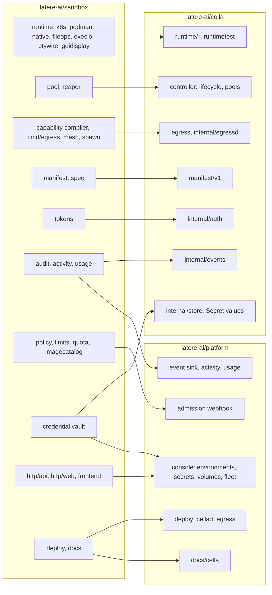
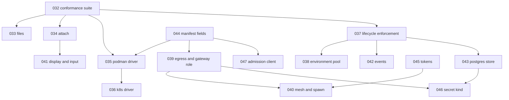

# Hosted sandbox consolidation

## Overview

`latere-ai/sandbox` is the hosted sandbox product: one closed binary,
`sandboxd`, with its own manifest, its own k8s, podman and native
runtimes, a warm pool, an egress gateway, a policy engine, a credential
vault, usage caps, an audit pipeline, an image catalog, a Vue dashboard,
and the identity and tenancy of `cella.latere.ai`. Cella is the open
control plane the hosted product is being rebuilt on, and the platform
repository is the hosted plane that composes it. This spec is the plan
that empties the sandbox repository: every package is assigned to
cella, to the platform, or to nothing, in slices small enough that one
agent completes one in one run, and the repository is archived when the
table has no open row.

The decisions are made. [[001-architecture]] fixes the target; slices
025 to 030 fixed the porting pattern; the platform's specs 47 and 48
fixed that the hosted plane speaks cella's HTTP contract and never
imports the sandbox module. There is no compatibility period: the
hosted API, its token formats, its URLs and its data are not carried
over. Consumers switch to `/v1` and the sandbox deployment is turned
off, not migrated.

## Current state

| Repository | State on 2026-09-19 |
|---|---|
| sandbox | 102k lines of Go under `internal/`, `cmd/sandboxd`, `cmd/egress`, plus a Vue SPA; 19 open specs, 118 archived; production at `cella.latere.ai` |
| cella | 10.7k lines: `manifest/v1` with six spec fields, `runtime.Driver` with the native driver, a file-store controller, `/v1/sandboxes` with exec, files, logs, stop, start, delete; OIDC verification, workload tokens, the authorizer webhook client |
| platform | the Cella authorizer at `/internal/authz/cella`, the `/api/environments` proxy, the Environments console over create, inspect, exec, start, stop, delete |

Three stale worktrees live under `sandbox/.claude/worktrees/`. They are
copies of older trees and are never a source; every port reads the
main tree only.

## Design

### The two destinations

The rule that assigns a package: if it turns a manifest into a running
environment, keeps it inside its boundary, or drives it, it is cella's
and lands under the spec of [[001-architecture]] that names it. If it
decides who may do what, how much, with which catalog, and what to show
a person, it is the platform's and reaches cella through an extension
point of [[001-architecture]]. If it exists only because the hosted
product was one binary (its dashboard server, its own OIDC session
handling, its own Postgres for product state), it is dropped and
rebuilt where the platform already has the equivalent.

### Porting, not lifting

A slice ports behaviour into the contract the cella spec states and
strips what the contract does not have: hosted labels, DOKS pool names,
image registry defaults, billing fields, tenancy assumptions. It never
copies a package and then refactors. The three prior ports (025, 028,
029) are the pattern: read the source, restate it in the target's
types, port the regression tests that name real defects, add the tests
the target's acceptance criteria name. The sandbox Vue SPA is not
ported at all: the platform console is React and rebuilds each screen
over cella's API.

### The map

Every package of the sandbox main tree, its destination, and the slice
that carries it. `drop` means no code moves: the behaviour exists in
the destination already or is not wanted.

| Sandbox package | Lines | Destination | Slice | Spec it lands under |
|---|---|---|---|---|
| `internal/runtime` (interface, reaper, filesystem) | 2.4k | cella `runtime`, `controller` | 032, 037 | [[004-runtime-contract]], [[005-lifecycle-controller]] |
| `internal/runtime/runtimetest` | 0.1k | cella `runtime/runtimetest` | 032 | [[004-runtime-contract]] |
| `internal/runtime/fileops` | 1.9k | cella `runtime` file operations | 033 | [[004-runtime-contract]], [[008-api]] |
| `internal/runtime/execio`, `internal/pkg/ptywire`, `internal/pkg/streamcast` | 1.3k | cella attach stream | 034 | [[004-runtime-contract]], [[008-api]] |
| `internal/runtime/podman` | 5.0k | cella `runtime/podman` | 035 | [[004-runtime-contract]] |
| `internal/runtime/k8s`, `labelsnap`, `resources`, `spec` | 12.4k | cella `runtime/k8s` | 036 | [[004-runtime-contract]] |
| `internal/runtime/native` | 4.4k | drop: ported in 025, 029, 030; OS confinement is the `local` driver over `pkg/hostsandbox` | - | [[004-runtime-contract]] |
| `internal/sandbox/pool` | 1.9k | cella `controller` pools, redesigned as an environment pool | 038 | [[020-scheduling-and-sets]] |
| `internal/kernel/capability`, `cmd/egress`, `internal/kernel/egresstoken` | 2.1k | cella `egress`, `internal/egressd` | 039 | [[018-egress-and-secrets]] |
| `internal/sandbox/mesh`, `internal/sandbox/spawn`, `internal/sandbox/token` | 3.1k | cella `controller`, `internal/auth` | 040 | [[022-mesh-and-spawn]] |
| `internal/runtime/guidisplay`, `internal/kernel/inputaction` | 1.2k | cella display and input operations | 041 | [[023-computer-use-operations]] |
| `internal/platform/audit`, `audit/schema`, `internal/pkg/auditscan` | 1.4k | cella `internal/events` (the record and the delivery); platform (the sink) | 042 | [[009-events]] |
| `internal/platform/postgres`, `pgxpoolx`, `migrations` | 0.5k | cella `internal/store` Postgres adapter | 043 | [[010-state]] |
| `internal/sandbox/manifest`, `internal/sandbox/create` | 1.6k | cella `manifest`: the fields 003 names that 026 did not admit | 044 | [[003-manifest-contract]] |
| `internal/tokens`, `internal/auth` | 3.3k | cella `internal/auth` where the shape is a workload or environment token; drop where it is hosted session handling | 045 | [[006-identity]] |
| `internal/credential/vault`, `credential/project` | 1.3k | cella `internal/store` Secret values and the `Secret` kind; platform for the screens | 046 | [[018-egress-and-secrets]] |
| `internal/policy`, `policy/admin`, `internal/sandbox/limits`, `quota`, `internal/platform/imagecatalog` | 4.8k | platform admission webhook and authorizer limits | platform 58 | [[007-admission]] |
| `internal/platform/activity`, `usage`, `traffic`, `metrics` | 2.5k | platform event sink and usage views; cella metrics per 017 | platform 59 | [[009-events]], [[017-observability]] |
| `internal/sandbox/fleetview`, `names` | 0.3k | platform console | platform 61 | - |
| `internal/http/api` | 24k | drop: cella `internal/api` serves `/v1`; the hosted routes are not carried | - | [[008-api]] |
| `internal/http/web`, `frontend/` | 20k + SPA | drop: platform console rebuilds each screen | platform 57, 61 | - |
| `internal/platform/leader`, `redisx`, `objectstore`, `platformflags` | 0.7k | drop: single-writer controller per 005; no Redis; object store is the platform's | - | - |
| `internal/pkg/{activitytouch,cryptoutil,execcmd,httputil,timeutil}` | 0.7k | drop: `latere.ai/x/pkg` has each or the target has no use | - | - |
| `deploy/`, `tools/deploy`, `tools/smoke` | - | platform deploy of `cellad serve` and `cellad egress` | platform 60 | [[014-release-and-installation]] |
| `docs/internal`, user docs | - | platform docs where user facing; cella `docs/` where operator facing | platform 62 | - |
| `test/cellae2e` | 0.6k | drop: [[015-conformance-suite]] is the executable contract | - | - |
| (no source: the admission client of 007, which the platform's webhook of slice 58 answers) | - | cella `manifest` `AdmitFunc` over HTTP, `CELLA_ADMISSION_URL`, fail closed, no retry | 047 | [[007-admission]] |

### Slice order

The suite comes first because every later driver port proves itself
against it. The manifest fields come early because the container
drivers need `resources` and `lifecycle` to mean anything. Egress waits
on a `pkg/egress` check: the open question of [[018-egress-and-secrets]]
lists additions the gateway role needs; slice 039 starts by diffing what
`cmd/egress` uses against what `latere.ai/x/pkg/egress` v0.76.0 exports,
and if the gap is real the gap is a `pkg` release before this slice.

### Cutover critical path

The hosted platform switches when cella serves what the hosted binary
serves today for a tenant: a manifest with resources and lifecycle
(044), the k8s data plane (036), the reaper (037), durable desired
state (043), the egress gateway with secrets (039, 046), events to the
platform's sink (042), admission from the platform's webhook (047), and
workload tokens (045). Those slices run first and in parallel where the
graph allows. Pools (038), mesh and spawn (040), display and input
(041), sets, workers and the vm driver are built alongside and never
hold the cutover.

Every slice reaches `complete` on its own tests, above 90% with an e2e.
The parent specs 003 to 023 stay `in-progress` or `testing` until the
platform runs on `cellad` in production and the conformance suite of
[[015-conformance-suite]] passes against it; that day their status and
Outcome move in one act. The evidence is per slice; only the bookkeeping
is bulk.

### What the platform's webhook found (for 047)

The platform built its admission endpoint (platform slice 58) against
[[007-admission]] before cella's client existed. What 047 must match:

1. The wire body flattens `Actor` into `subject`, `issuer`, `sub` and
   carries `request.id`; the Go type in 007 is not the JSON shape. 047
   sends the JSON shape and 007 is amended to say so.
2. `spec.image` is required at stage 1, so no webhook can default it.
   047 adds `CELLA_DEFAULT_IMAGE` (an operator default, no Latere value)
   or moves the required check after admission; the spec records which.
3. `max_sandboxes` has two definitions: `authorizer/limits.go` counts
   live sandboxes one subject holds; 007 counts every desired Sandbox
   not `Deleting`. 047 picks 007's and amends the authorizer package.
4. Stage 2 runs before admission, so a hosted `cellad` runs with every
   `CELLA_DEFAULT_*` unset and only `CELLA_MAX_*` set; the webhook
   supplies defaults. 047 documents this in 002's table.
5. A policy refusal is a 200 with `allow: false` and a code; only a bad
   bearer (401) or an unparseable envelope (400) is `admission_unavailable`.

### What a slice does

1. Writes its own spec file `specs/0NN-name.md` from its row here and
   the parent spec it lands under: source paths, the target types, the
   acceptance criteria as tests. Frontmatter per `.lateregate.yaml`.
2. Ports into the target types. Extends `manifest/v1` and
   `runtime.Driver` only with fields the parent spec names, additive.
3. Adds the tests its acceptance criteria name and ports the regression
   tests of the source that pin real defects.
4. Extends the no-Latere-coordinates check over its new files: no
   `cella.latere.ai` host, `sandbox-base` image, DOKS pool or namespace
   name outside an example.
5. Adds a `depcheck` row with a reason for every new module the role's
   build list reaches.
6. Writes the Outcome with the coverage figure and the e2e that ran,
   sets `status: complete`, moves the file to `.archive/`, and adds the
   row to the consolidation table of `specs/README.md`.
7. Commits one logical change at a time, `scope: lowercase summary`, and
   never pushes; the session pushes once.

### Cutover and sunset

The sandbox repository is archived when every row above is settled and
the platform's checklist (platform spec 62) has run. That checklist,
not this spec, turns off the production deployment. Nothing in this
spec's slices touches `sandbox/deploy` or the live cluster.

Dependent legs outside both repositories, not carried by any slice
here: `topos/sandbox/cella` and `latere-cli`'s cella commands switch to
`/v1` on the platform's origin; `managed-agents` drops its hosted
client; the sandbox user docs move under the platform's `docs/cella`.

## Not in this spec

The content of each slice. The platform half, which the platform's
specs 56 to 62 carry. The `vm` driver ([[024-vm-driver]]). The
worker role ([[021-data-plane-workers]]), which has no source in the
sandbox tree and is built from its spec.

## Acceptance criteria

| Criterion | Test that proves it | State |
|---|---|---|
| Every row of the map names a slice, `drop`, or a platform spec | review of this table | done |
| Every cella slice is archived with an Outcome naming its coverage and e2e | `go tool lateregate spec` over `.archive/` | open |
| No file under `runtime/`, `controller/`, `egress/`, or `manifest/` names a Latere host, image, pool, or namespace outside an example | `TestNoLatereCoordinates` in each slice | open |
| The sandbox repository's `internal/` has no package without a settled row | the map, on archive | open |
