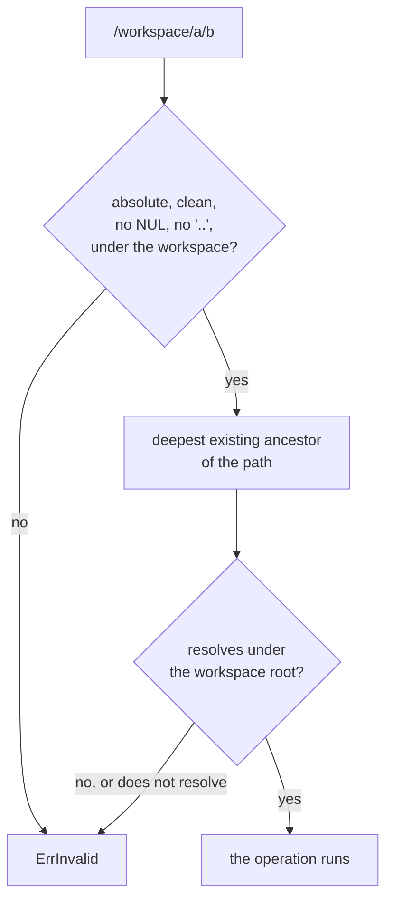

# File operations

## Overview

Slice 033 of [[031-hosted-sandbox-consolidation]] ports
`internal/runtime/fileops` of the hosted sandbox into the optional
`FileStore` interface of [[004-runtime-contract]] and the file routes of
[[008-api]]. Today the whole file surface is one archive in and one
archive out: a caller who wants one file packs a tar, and a caller who
wants a directory listing has no route at all. After this slice a
sandbox's workspace answers stat, list, read, write, mkdir, remove and
move, each one operation with one path.

The hosted source is `internal/runtime/fileops`: containment, the
filename rules, the mutations, and the transfers. What is ported: the
shell programs that carry an operation into a container, the NUL-framed
stat record that survives a filename holding a newline or a pipe, the
staged write that leaves the previous file intact when an upload is cut
short, and the exact-destination move. What is not: the three allowed
roots (`/workspace`, `/tmp`, `/home/sandbox`), which in this contract is
the managed workspace alone; the multipart upload, whose folder-preserving
field names exist because a browser form is the client, while here the
path is one query parameter; and the base64 JSON read body, which is a
stream.

## Current state

`runtime.Driver` carries `ExportTar` and `ImportTar`, and
`Capabilities.Files` declares that the two work while the sandbox is
`Stopped`. [[004-runtime-contract]] lists `Files` among the capabilities
with no interface of their own. Three drivers declare it: `native` over
`os.Root`, `podman` over the compatibility archive endpoint, `k8s` over
`tar` in the container with a helper Pod for a stopped sandbox.
`internal/api` serves `GET` and `PUT /v1/sandboxes/{id}/files` for those
two archives, gates them on the capability, stamps activity, and emits
`sandbox.files` per [[009-events]]. Nothing reads or writes one file.

## Design

### The interface

`Files` gains the interface the rest of [[004-runtime-contract]]'s
optional capabilities have. A driver implements `runtime.FileStore` if
and only if it declares `Capabilities.Files`, and `runtimetest` checks
the rule both ways, as it does for `Attacher`.

```go
// FileInfo is one entry of the workspace.
type FileInfo struct {
	Name    string      // the base name, exactly as the filesystem holds it
	Path    string      // the absolute path inside the sandbox
	Size    int64       // bytes, zero for a directory
	Mode    fs.FileMode // the permission bits and the directory bit
	ModTime time.Time   // UTC
	IsDir   bool
}

// WriteRequest is one file's body, its mode, and the bound the write refuses
// to pass.
type WriteRequest struct {
	Path     string
	Mode     fs.FileMode // zero means 0644
	MaxBytes int64       // zero means no bound
	Body     io.Reader
}

// FileStore is implemented by a driver if and only if it declares
// Capabilities.Files.
type FileStore interface {
	Stat(ctx context.Context, id, path string) (FileInfo, error)
	List(ctx context.Context, id, path string) ([]FileInfo, error)
	Open(ctx context.Context, id, path string) (io.ReadCloser, FileInfo, error)
	Write(ctx context.Context, id string, req WriteRequest) (int64, error)
	Mkdir(ctx context.Context, id, path string) error
	Remove(ctx context.Context, id, path string) error
	Move(ctx context.Context, id, from, to string) error
}
```

Every path is absolute and inside the workspace. `List` returns the
immediate entries of a directory sorted by name. `Open` hands back a
stream the caller closes and the entry it describes. `Write` returns the
bytes written. `Mkdir` creates the missing parents. `Remove` deletes a
file or a directory tree. `Move` renames to the exact destination and
creates the destination's parents.

Four failures are typed, because the API answers each with a different
status:

| Failure | Error | API |
|---|---|---|
| A path outside the workspace, a link out of it, a destination that is a directory, the workspace root itself under `Remove` or `Move` | `ErrInvalid` | 400 `invalid_field` |
| No such file or directory | `ErrNotFound` | 404 `not_found` |
| A body past `MaxBytes` | `ErrTooLarge` | 413 `body_too_large` |
| The driver's transport needs a running sandbox and the sandbox is stopped | `ErrNotRunning` | 409 `phase_conflict` |

`ErrTooLarge` is new in `runtime`; the other three are the package's own.

### The containment rule

One rule, stated once, carried by each transport:

> A path is inside the workspace when it is absolute, clean, free of NUL
> and of a `..` component, lexically under the workspace root, and its
> deepest existing ancestor resolves, with every symbolic link followed,
> to the workspace root or below it.

The first half is lexical and runs in the control plane before any call
leaves it. The second half runs where the filesystem is, because a
workload can plant a symbolic link in its own workspace at any moment:
the control plane's copy of the tree is never the authority.



The deepest existing ancestor, not the path itself: a write names a file
that does not exist yet, and a `mkdir` names a directory whose parents do
not exist either. A dangling symbolic link counts as existing, so a write
through one is refused rather than creating the target outside.

`Remove` and `Move` refuse the workspace root itself. Its contents go, it
does not.

### The transports

Each driver keeps the transport it already uses for archives.

| Driver | Transport | While `Stopped` |
|---|---|---|
| `native` | `os.Root` over the sandbox's workspace directory | every operation |
| `k8s` | one `sh` program per operation through the exec subresource, in the sandbox's container or, when it is not running, in the helper Pod that mounts the same claim | every operation |
| `podman` | one `sh` program per operation through the libpod exec API | none: `ErrNotRunning` |

The rule the conformance suite holds every driver to: while the sandbox
is `Stopped` an operation either does what it does while `Running` or
returns `ErrNotRunning`, and nothing else. A driver whose transport
reaches the workspace without the sandbox running is not held back to the
weakest one, and a caller reads 409 rather than a driver's private error.

`runtime/internal/fileshell` holds what the two container drivers share:
the shell programs, their exit codes, and the parser of the stat record.
It is internal to `runtime`, so only a driver reaches it.

Three properties make the programs safe to run on a filename the caller
chose:

1. Every name reaches the program as a positional parameter and is never
   interpolated into the program text.
2. A record is `mode|type|size|mtime|name` terminated by NUL, not by a
   newline, because a filename may hold a newline, a pipe or a carriage
   return and may not hold NUL.
3. Every exit code is fixed: `10` a path outside the workspace, `11` no
   such path, `12` a destination that is a directory, `13` a body past
   the bound. Anything else is the operation's own failure.

The write is one program, so the bound and the commit are one act:

```sh
head -c "$max1" > "$tmp" && [ "$(wc -c < "$tmp")" -le "$max" ] \
  && chmod -- "$mode" "$tmp" && mv -f -- "$tmp" "$dst"
```

with `$max1` one byte past the bound. A body at the bound commits; one
byte more leaves the previous file where it was. `native` does the same
with a temporary file opened `O_EXCL` in the destination's directory and
a rename onto the name, which is the rule the archive import already
follows.

The move is the exact destination, which is the hosted regression:
`mv dir/ other/` moves `dir` *into* `other` when `other` is a directory,
so a caller who meant to replace `other` silently nests instead. The
program refuses a destination that is an existing directory
(`[ -d "$dst" ] && exit 12`) rather than relying on `mv -T`, which
BusyBox does not carry; `native` stats the destination and refuses the
same case.

### The routes

`/v1/sandboxes/{id}/files` stays the archive collection. The granular
operations are four more paths under it, and the two methods the archive
collection does not use.

| Method | Path | Body | Answers | Action |
|---|---|---|---|---|
| `GET` | `/v1/sandboxes/{id}/files?path=` (repeated) | – | the tar of the paths | `sandbox.exec` |
| `PUT` | `/v1/sandboxes/{id}/files?dest=`, `Content-Type: application/x-tar` | the archive | 204 | `sandbox.exec` |
| `PUT` | `/v1/sandboxes/{id}/files?path=[&mode=]`, any other `Content-Type` | one file | 204 | `sandbox.exec` |
| `DELETE` | `/v1/sandboxes/{id}/files?path=` | – | 204 | `sandbox.exec` |
| `GET` | `/v1/sandboxes/{id}/files/content?path=` | – | the file, `application/octet-stream` | `sandbox.exec` |
| `GET` | `/v1/sandboxes/{id}/files/stat?path=` | – | one entry | `sandbox.exec` |
| `GET` | `/v1/sandboxes/{id}/files/list?path=` | – | `{"items": [entry...], "next": ""}` | `sandbox.exec` |
| `POST` | `/v1/sandboxes/{id}/files/mkdir` | `{"path": "..."}` | 204 | `sandbox.exec` |
| `POST` | `/v1/sandboxes/{id}/files/move` | `{"from": "...", "to": "..."}` | 204 | `sandbox.exec` |

A single file cannot ride `GET .../files?path=`: that is the archive of
one or more paths, and a route may not mean two things by the same
request. `PUT` carries both because the content type already separates
them, which is the rule [[008-api]] states for every body, and because
one file is what a client that cannot write a tar has. A request that
names `path` more than once on a single-path route is `invalid_field`, as
is a `PUT` that names neither `path` nor `dest`.

An entry is rendered
`{"name", "path", "size", "mode": "0644", "modTime", "isDir"}`; the mode
is octal text, because a JSON number for a permission set reads as
decimal and is misread. `?mode=` on the write is octal text as well, at
most `0777`, and `0644` when absent.

The write is bounded by `CELLA_MAX_UPLOAD_BYTES`, the bound the archive
import already takes, and the body is streamed to the driver rather than
spooled: the archive spools because a tar reader stops at its terminator
and leaves the rest of the body unread, and one file has no terminator.

Every route stamps activity and writes one `sandbox.files` record naming
the operation, the paths and the byte count, never a body. `events.Files`
gains `operation`, and [[009-events]]'s row for `sandbox.files` is
amended to `{operation, direction, paths, bytes}` with `direction` on a
transfer only.

## Not in this spec

Paging a directory: a listing is one answer, and a workspace directory
large enough to need a cursor is a tar. Recursive listing, copy, chmod
and chown: no caller of [[008-api]] has them. The multipart upload and
the `path_encoding=percent` option of the hosted dashboard: the console
of the platform sends one file per request to a percent-encoded query,
which the HTTP layer decodes once and nothing decodes again. Volumes
other than the managed workspace ([[019-volumes]]).

## Acceptance criteria

| Criterion | Test that proves it | State |
|---|---|---|
| A driver implements `FileStore` if and only if it declares `Files`, and a driver that lies about either fails | `NameIsolationCapabilities`, `TestConformanceCatchesAFalseCapability` | open |
| One file round trips: written, stat'd, listed, read back with its mode and its exact name | `FilesRoundTrip` in `runtimetest`, per driver | open |
| A listing is sorted by name and carries the size, the mode, the modification time and the directory bit of each entry | `FilesListOrder` | open |
| `Mkdir` creates the missing parents, `Remove` deletes a tree, `Move` renames inside the workspace | `FilesMutate` | open |
| Traversal, an absolute path outside the workspace, and a symbolic link out of it are refused with `ErrInvalid`, and the workspace root is not removable or movable | `FilesContainment` | open |
| A move onto an existing directory is refused and the directory is untouched | `FilesMutate` | open |
| A write past `MaxBytes` returns `ErrTooLarge` and the previous file is intact | `FilesWriteBound` | open |
| A name with spaces, unicode, a percent sign, a pipe or a newline round trips exactly through write, list, stat and read | `FilesExactNames` | open |
| While `Stopped` every operation either works or returns `ErrNotRunning` | `FilesWhileStopped` | open |
| Each route answers its shape over real HTTP under a signed bearer, and each refusal its code | `TestFilesRoutes` in `internal/api` | open |
| A route on an environment without `Files` is 422 before any driver call | `TestFilesCapabilityGate` | open |
| Every call stamps activity and writes one `sandbox.files` record naming the operation and the bytes, and no record holds a body | `TestFilesRecords` | open |

## Outcome

Pending.
