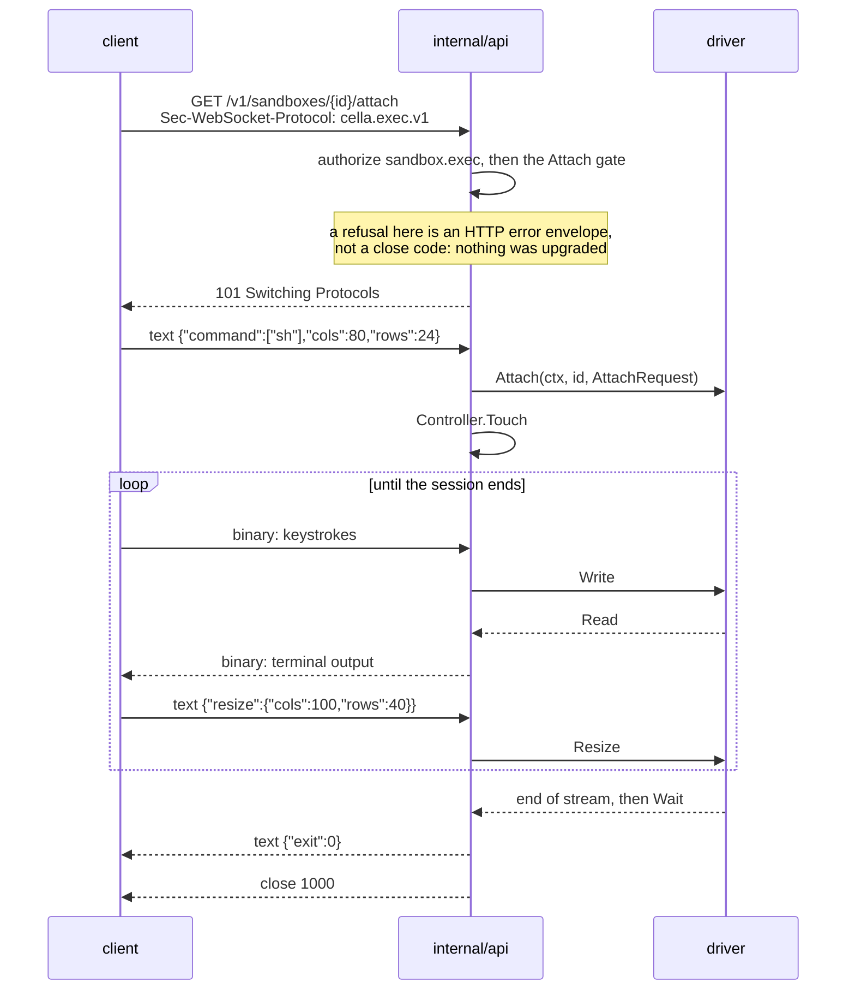

# Terminal attach

## Overview

Slice 034 of [[031-hosted-sandbox-consolidation]]. It ports
`sandbox/internal/runtime/execio`, `sandbox/internal/pkg/ptywire` and
`sandbox/internal/runtime/podman/attach.go` into the `Attacher` optional
interface of [[004-runtime-contract]] and the two WebSocket routes of
[[008-api]]. After it, a person holds a shell inside a sandbox: bytes
both ways, a window size the process inside reads, an exit code, and a
disconnect that ends the session.

Three things cross from the source: the attach loop's shape (one reader
goroutine for the session's output, one for the client's frames, one
writer mutex because a WebSocket admits one writer at a time), the
distinction between the session ending and the client going away, and
the hijacked libpod exec. Three do not: the 1-byte binary frame format
of `ptywire`, which [[008-api]] replaces with its own; the replay buffer
and the dashboard's tee, which belong to the fan-out of
[[023-computer-use-operations]] and slice 041; and `CELLA_HOST`, the
hosted base image's prompt variable, which is an image concern and not
the control plane's.

`sandbox/internal/pkg/streamcast` is not ported here. It fans one
session's output out to several viewers, which neither [[008-api]] nor
[[023-computer-use-operations]] asks for today: two attaches to one
sandbox are two sessions, each with its own process. It stays with slice
041.

## Current state

`runtime.Driver` has `Exec` with `Stdin` and `TTY` fields that every
driver refuses with `ErrUnsupported`. No driver declares `Attach`.
`runtime/native` runs a command with two pipes; `runtime/podman` creates
a libpod exec session, reads its multiplexed stream and polls the exit
code. `internal/api` serves `POST /v1/sandboxes/{id}/exec?wait=1` and
nothing else on exec. The controller stamps activity through `Touch`,
coalesced per sandbox ([[005-lifecycle-controller]]).

## Design

### The optional interface

Additive, in `runtime`; `Driver` is unchanged, so a driver that does not
declare `Attach` compiles and passes the suite as before.

```go
// AttachRequest is what a session runs. An empty Command runs the
// image's shell. Cols and Rows are the window at open; zero is the
// driver's default.
type AttachRequest struct {
	Command []string
	Env     map[string]string
	Workdir string
	Cols    int
	Rows    int
}

// Session is one PTY inside a sandbox: Read is what the terminal
// writes, Write is what a person types, Close ends it.
type Session interface {
	io.ReadWriteCloser
	Resize(cols, rows int) error
	Wait(ctx context.Context) (exitCode int, err error)
}

// Attacher is implemented if and only if Capabilities.Attach is
// declared. runtimetest checks both directions.
type Attacher interface {
	Attach(ctx context.Context, id string, req AttachRequest) (Session, error)
}
```

`ExecRequest.Stdin` and `ExecRequest.TTY` stop being refusals on a
driver that declares `Attach`. With `TTY` the process runs under a PTY
and everything it writes arrives on `Exec.Stdout`; `Exec.Stderr` is at
its end from the first read, because a terminal has one stream. Without
`TTY`, `Stdin` is copied into the process and the two output streams
stay separate.

### The native PTY

The driver opens the pair with the ioctls the two supported systems
name, through `syscall` alone. No module is added: a PTY is four ioctls
and an open, and `runtime/native` reaches nothing outside the standard
library, which `arch_test.go` holds it to.

| Step | Linux | Darwin |
|---|---|---|
| open the controlling end | `/dev/ptmx`, `O_RDWR｜O_NOCTTY` | `/dev/ptmx`, `O_RDWR` |
| unlock | `TIOCSPTLCK` with 0 | `TIOCPTYGRANT`, then `TIOCPTYUNLK` |
| name the other end | `TIOCGPTN`, then `/dev/pts/<n>` | `TIOCPTYGNAME` |
| window size | `TIOCSWINSZ` on the controlling end | the same |

The process gets the other end as its three standard descriptors, a new
session (`Setsid`), and that terminal as its controlling one
(`Setctty`). `Setpgid` is not set with `Setsid`: a session leader
refuses `setpgid`, and after `setsid` the process group id equals the
pid, so the group kill on `Close` reaches the whole tree either way. The
parent closes its copy of the other end once the process has started, or
the controlling end never reports the end of the stream. Linux reports a
finished terminal as `EIO` and darwin as end of file; the session maps
both to `io.EOF`, so one shape reaches the caller.

`Resize` is `TIOCSWINSZ` on the controlling end and reaches the process
as `SIGWINCH`. `Close` kills the process group, closes the controlling
end, and returns; `Wait` returns the exit code, or the reason the
process produced none.

The file that opens the pair is built for `linux` and `darwin` only,
which is where `runtime/native` already builds: its group kill and its
`Setpgid` are POSIX calls the standard library does not offer elsewhere.

### The podman attach

An exec session created with `AttachStdin`, `AttachStdout` and `Tty`,
started over a hijacked `POST /exec/{id}/start`, resized with `POST
/exec/{id}/resize?h=&w=`, and its exit code read from `GET
/exec/{id}/json` as the rest of the driver reads it. Under a TTY the
hijacked stream is raw; with stdin and no TTY it keeps podman's 8-byte
framing and the driver's existing demultiplexer reads it.

The engine has no exec kill and the pid it reports is its own, so
`Close` drops the connection and the process inside keeps running until
the sandbox stops or is deleted. That is the engine's behaviour, stated
here so the conformance case asserts what holds on every driver and the
stronger claim is made where it is true.

### The wire

Both routes speak the frame protocol [[008-api]] states, under the
subprotocol `cella.exec.v1`.



| Direction | Frame | Meaning |
|---|---|---|
| in | the first text frame | the JSON request: `command`, `env`, `workdir`, `cols`, `rows`, `timeout` |
| in | binary | bytes for the process |
| in | text after the first | `{"resize":{"cols":n,"rows":n}}`; anything else is ignored |
| out | binary | bytes from the process |
| out | text, last | `{"exit":n}` then close 1000, or `{"error":{...}}` then close 1011 |

The error frame carries the envelope of [[008-api]], the same object the
HTTP routes write, so a client reads one error shape whether it failed
before or after the upgrade.

| Condition | Answer |
|---|---|
| no bearer, a deny, an unknown sandbox | the HTTP envelope, before the upgrade |
| the environment does not declare `Attach` | 422 `capability_unsupported`, before the upgrade and before any driver call |
| the first frame is not text, or is not the JSON request | close 1008 |
| the first frame is larger than `CELLA_MAX_BODY_BYTES` | close 1009, which is the frame limit's own code |
| the driver refuses the session | `{"error":{...}}`, close 1011 |
| the process ended | `{"exit":n}`, close 1000 |
| the client went away | the session is closed; nothing is written |

Two attaches to one sandbox are two sessions with two processes. The
route holds no registry.

`/attach` is always a PTY. `/exec` is one or the other, and the request
says which: `cols` and `rows` both above zero asks for a PTY, and the
route runs `Attach`; either at zero asks for a command with stdin, and
the route runs `Exec` with `Stdin` and no TTY, interleaving the two
output streams into binary frames, ignoring a later resize. Both need
`Attach` declared, which is what [[008-api]] asks of the route. The
protocol has no frame for the end of stdin, so a command that reads to
end of file does not see one; it is the gap that the byte stream of
[[008-api]] leaves and is not invented here.

### Liveness and activity

Neither [[008-api]] nor [[002-repository-scaffold]] names an idle
window, so no variable is added. The connection carries a keepalive
instead: the server pings on an interval, a client's pong or any frame
extends the read deadline, and a peer that answers neither is dropped.
A dead peer is therefore reaped without a policy about how long a person
may think between keystrokes.

`Controller.Touch` runs when the session opens and on each batch of
client frames. The controller coalesces it per sandbox
([[005-lifecycle-controller]]), so a person typing reaches the driver
once an interval and a session holds its sandbox away from the auto-stop
rule for as long as it is used.

### The suite

`runtimetest` gains the cases below, each skipped on a driver that does
not declare `Attach`, and `NameIsolationCapabilities` gains the check
that `Attach` is declared if and only if `Attacher` is implemented.

| Case | Proves |
|---|---|
| `AttachRoundTrip` | a shell echoes what is typed, and its exit code reaches `Wait` |
| `AttachResize` | `stty size` inside reports the size a `Resize` set |
| `AttachCloseEndsTheStream` | after `Close` the stream is over for its caller: it ends, and a read or a write on it fails. Whether the process inside also ends is the driver's, because an engine with no exec kill keeps it |
| `ExecStdin` | a command with `Stdin` and no TTY reads what was written, and the two output streams stay separate |
| `ExecTTY` | a command with `TTY` reports a terminal on its standard output and `Exec.Stderr` is at its end |

## Not in this spec

The fan-out of one session to several viewers and the replay buffer
(slice 041, [[023-computer-use-operations]]). `Dial` and the port proxy
of [[008-api]]. The k8s driver's attach over SPDY, which lands with the
driver itself (slice 036). The rate limit and the request id of
[[008-api]], which no route implements yet.

## Acceptance criteria

| Criterion | Test that proves it | State |
|---|---|---|
| `native` declares `Attach` and passes the five suite cases on darwin and linux | `TestNativeConformance` | open |
| A native session's window reaches the process, and `Close` leaves no process in the group | `TestAttachResizeReachesTheProcess`, `TestAttachCloseKillsTheProcessGroup` | open |
| Stopping a sandbox ends every session in it | `TestStopEndsEverySession` | open |
| `podman` declares `Attach`, passes the cases against the fake engine, and passes them against a real engine where a socket answers | `TestAttachRoundTripOverTheFakeEngine`, `TestPodmanConformance` | open |
| A driver that declares `Attach` without implementing `Attacher`, or the reverse, fails the suite | `TestConformanceCatchesAFalseCapability` | open |
| The attach WebSocket carries bytes both ways, a resize reaches the PTY, and the exit arrives as a text frame before close 1000 | `TestAttachRoundTrip` | open |
| A client that disconnects ends the process inside | `TestAttachClientDisconnectEndsTheProcess` | open |
| Two attaches to one sandbox are independent sessions | `TestAttachSessionsAreIndependent` | open |
| A first frame that is not the JSON request closes 1008; one past the body limit closes 1009 | `TestAttachBadFirstFrame` | open |
| A session the driver refuses, and a request frame the table refuses, reach the client as the error frame and close 1011 | `TestAttachRefusedByTheDriver`, `TestAttachInvalidRequestFrame` | open |
| The exec WebSocket runs a command with stdin and no TTY, and with a PTY when both `cols` and `rows` are given | `TestExecSocketStdin`, `TestExecSocketTTY` | open |
| An environment without `Attach` answers 422 `capability_unsupported` before the upgrade, on both routes | `TestAttachCapabilityGate` | open |
| Both sockets read, authorize and only then upgrade | `TestAttachAuthorization` | open |
| A session stamps activity when it opens and on what is typed | `TestAttachStampsActivity` | open |
| No file this slice adds names a Latere host, image, pool or namespace | `TestNoLatereCoordinates` | open |
