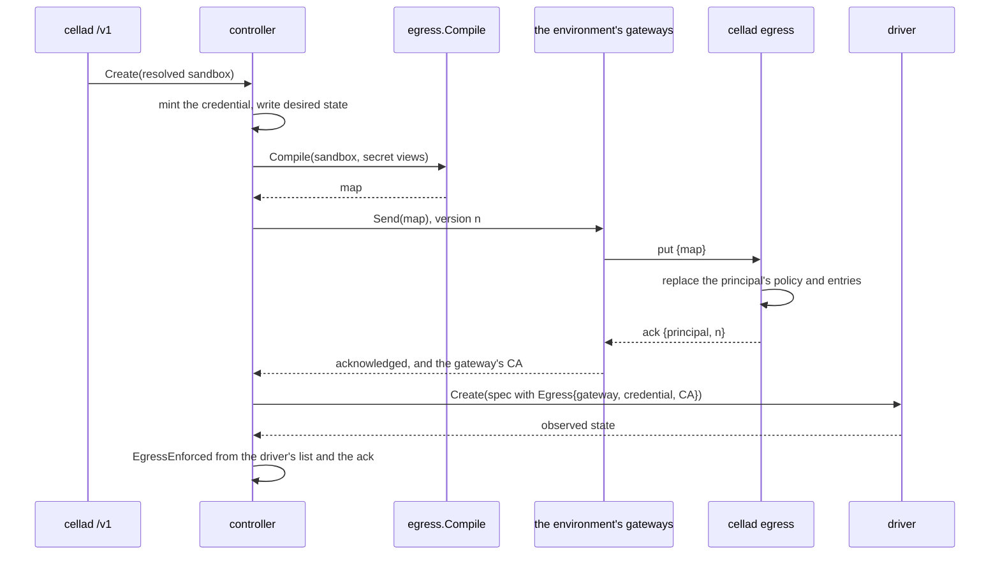

# Egress and the gateway role

## Overview

This slice of [[031-hosted-sandbox-consolidation]] ports the hosted
sandbox's capability compiler (`internal/kernel/capability`) and its
egress gateway (`cmd/egress`) into the contract [[018-egress-and-secrets]]
states. It builds the network boundary end to end for a sandbox that
mounts no secret: the manifest fields that declare the boundary, the
compiler that turns a resolved manifest into the map a gateway holds,
the `cellad egress` role with its policy gate and two doors, the
outbound sync stream that fills the gateway, the connection records
that come back, and the create order that puts a map in a gateway
before a sandbox exists.

The `Secret` kind, its values and their injection are slice 046. This
slice fixes every seam 046 needs and carries no value anywhere: the
compiler takes placeholders and scopes, the gateway registers an entry
for substitution only when a value is present, and the canary test is
written in its placeholder-only form.

## Current state

[[044-manifest-fields]] left the manifest with `metadata`, `env`,
`resources`, `workspace.path`, `user` and `lifecycle`, and a staged
`Resolve` with no `narrow` field in it. `runtime.CreateSpec` carries no
network. The controller creates through one driver with no boundary
step. `internal/api` serves `/v1/sandboxes` and refuses every
environment-key caller. `latere.ai/x/pkg/egress` v0.79.0 holds the
substitution engine, `Registry`, `Gateway`, `CA`, `TokenAuth`, the
ingest API and, new in this release, the dependency-free
`egress/placeholder` subpackage [[018-egress-and-secrets]] asked for.

The other four additions the index's Open table lists (the policy gate,
inject placement, `Registry` replace-all, the reverse door and the sync
client) land in `internal/egressd` rather than in `pkg`: cella is their
only consumer today, and `pkg` holds small client primitives.

## Design

### The manifest fields

`spec.network.egress` per [[003-manifest-contract]]:

| Field | Type | Default | Mutable |
|---|---|---|---|
| `mode` | `none`, `allowlist`, `open` | inferred, below | narrow |
| `allowedHosts` | []string | empty | narrow |
| `deniedHosts` | []string | empty | narrow |

The host rule is shared with the gateway: a pattern is an exact fully
qualified name or one leading `*.` wildcard, normalized by lowercasing,
trimming a trailing dot and refusing a port, validated by
`latere.ai/x/pkg/hostmatch.ValidPattern`. An IP literal, a single label,
and any name whose syntax names loopback, link-local or a private range
are `invalid_field`.

Inference at stage 2 reads the two lists rather than "any host", which
[[003-manifest-contract]] says in the short form. A manifest with only
`deniedHosts` and no `mode` would infer `allowlist` under the short
reading and then fail `exclusive_fields` against its own default, so
the rule this slice implements is:

| `allowedHosts` | `deniedHosts` | Inferred `mode` |
|---|---|---|
| empty | empty | `open` |
| set | empty | `allowlist` |
| empty | set | `open` |
| set | set | `exclusive_fields`, because no single mode serves both |

`allowedHosts` with any mode but `allowlist`, and `deniedHosts` with any
mode but `open`, stay `exclusive_fields`. Narrowing order is
`open` > `allowlist` > `none`: a workload actor may move down it,
remove an allowed host, or add a denied host, and any widening is
`boundary_widened` naming every path. Containment is directional under
the host rule, so replacing `api.example.com` with `*.example.com`
widens and is refused.

Stage 7 holds the mode against the environment's
`status.capabilities.egress`: a mode the list omits is
`capability_unsupported`, and an empty list is the warning that
`EgressEnforced` will be false. `status.conditions` gains the condition
type set of [[003-manifest-contract]], of which this slice writes
`EgressEnforced`.

### The map

`egress` at the module root imports `manifest/v1`,
`latere.ai/x/pkg/egress/placeholder` and the standard library, and
dials nothing ([[001-architecture]] invariant 6).

```go
func Compile(sb v1.Sandbox, secrets []SecretView) (Map, error)
```

`Compile` is pure and deterministic: the same sandbox and the same
views produce the same map, byte for byte. The two random values
[[018-egress-and-secrets]] puts inside `Compile` are minted by their
own functions, `MintCredential` and `MintPlaceholder`, so that the
compiler stays testable without a clock or a source of entropy and so
that a recompile of a running sandbox never rotates a credential the
sandbox already holds in its environment.

```go
type Map struct {
	Principal     string        // "sandbox:<sbx_ id>"
	Version       int64         // the generation; a gateway applies a map above the one it holds
	Credential    string        // what both doors authenticate
	Mode          v1.EgressMode
	Allow         []string      // allowlist: allowedHosts plus every injectable secret's hosts
	Deny          []string      // open: deniedHosts; a denied host wins
	Entries       []Entry       // one per injectable secret
	NotInjectable []string      // control plane only, never on the wire
}
```

`Entry` carries the placeholder, the secret's name, its hosts and ports
and its injection placement (`header` or `query`, the scheme, the body
flag), and never a value. `SecretView` is what the control plane knows
of a `Secret` at compile: the same fields. 046 adds `Value` to the view
and `Secret` to the entry and changes nothing else.

The reach rule is the hosted compiler's, ported: reachability is the
hard bound and a credential never widens it. Under `allowlist` every
injectable secret's hosts join `Allow`, so a mounted secret is inside
the bound by construction; under `open` a secret every one of whose
hosts is denied gets no entry and is named in `NotInjectable`; under
`none` no secret is injectable. The regressions the hosted tree pinned
travel with it: a credential outside the reach bound, directional
wildcard coverage (an exact reach never covers a wildcard credential,
`*.example.com` never covers `example.com`), case and trailing dot,
multiple violations sorted by name then host, and wildcard subsumption.

Two entries scoping one host is `secret_host_conflict`, refused rather
than silently collapsed, which is the first of the two defects
[[018-egress-and-secrets]] names. The second, a placeholder derived
from a name a neighbour could guess, is answered by minting per sandbox
per secret from `placeholder.Mint`.

### The create order



The map is acknowledged before `Create`, so a sandbox never starts
before a gateway knows it. Volumes sit between the two steps and arrive
with [[019-volumes]].

A sandbox whose boundary needs no gateway does not wait for one: mode
`open`, no denied host and no secret leaves nothing to enforce and
nothing to substitute, and the create proceeds with no map pushed. Any
other boundary waits `CELLA_EGRESS_ACK_TIMEOUT` (default `5s`) for one
gateway of the environment to acknowledge, and fails
`driver_unavailable` with the sentence "The environment is
unavailable" when none does. [[018-egress-and-secrets]] states the wait
unconditionally; the carve-out is what keeps the inferred default
boundary, `open` with no host, usable on an installation that runs no
gateway, and it withholds nothing, because such a sandbox's map admits
every host the driver's own rule admits.

A delete purges the principal from every gateway of the environment in
the same act that deletes the sandbox, so a gateway holds no map for an
object that is gone before its next snapshot.

`EgressEnforced` is the conjunction of the two enforcement points: the
driver's declared `Capabilities.Egress` contains the sandbox's mode,
and a gateway acknowledged the map. Either one missing is `False` with
reason `NotEnforcedByDriver` or `NoGateway`.

### The gateway role

`cellad egress` reads `CELLA_URL`, `CELLA_ENVIRONMENT_KEY`,
`CELLA_EGRESS_PROXY_ADDR` (`:3128`), `CELLA_EGRESS_REVERSE_ADDR`
(`:8080`), `CELLA_EGRESS_CA_KEY`, `CELLA_EGRESS_CA_BUNDLE` and
`CELLA_INSECURE_CONTROL_PLANE`, every one of them already in
[[002-repository-scaffold]]'s table. The CA key is generated at first
start when absent. The role holds one registry the sync client fills
and serves two doors over it.

The policy gate decides before any dial. The caller is the principal
whose credential matches: `Proxy-Authorization: Basic` with the URL's
userinfo on the proxy door, `Cella-Egress-Credential` on the reverse
door. The decision table, in order, first match wins:

| Condition | Proxy door | Reverse door | Record |
|---|---|---|---|
| no credential matches a principal | 407 | 401 | none: there is no principal to file it under |
| the destination is loopback or the control plane's own address | 403 | 403 | `denied` |
| the principal has no map | 403 | 403 | `unknown` |
| `mode: none` | 403 | 403 | `denied` |
| `mode: allowlist` and the host is on neither `Allow` nor a mounted secret's scope | 403 | 403 | `denied` |
| `mode: open` and the host is on `Deny` | 403 | 403 | `denied` |
| otherwise, the host has an entry with a value | terminate, substitute, forward | terminate, substitute, forward | `allowed` |
| otherwise | tunnel untouched | forward | `passthrough` on the proxy door, `allowed` on the reverse door |

A denied host wins over a mounted secret's scope, so a secret cannot
buy reach its sandbox does not have.

The gate owns the proxy door's tunnel rather than wrapping
`pkg/egress.Gateway` whole, and hands a destination that has a
substitution entry to that `Gateway` for termination. Two reasons: a
decision taken before any dial cannot be taken by a handler that dials
inside itself, and a record per connection needs the byte counts and
the outcome of the tunnel the decision admitted. The dialer is an
option (`DialContext`), which is also what a gateway behind an upstream
proxy needs.

### Sync

The gateway opens one outbound stream per environment and the control
plane never dials it, which is [[001-architecture]] invariant 10. The
message vocabulary is [[018-egress-and-secrets]]'s
(`hello`, `snapshot`, `put`, `purge`, `ack`, `heartbeat`, `record`),
carried as one JSON object per line over two routes rather than one
WebSocket:

| Route | Direction | Carries |
|---|---|---|
| `GET /v1/environments/{id}/egress` | down, held open | `snapshot` on connect, then `put`, `purge` and `heartbeat` |
| `POST /v1/environments/{id}/egress` | up, one request per batch | `hello`, `ack`, `record` |

Both are authenticated by the environment key and by nothing else, and
the key's environment must be the one the path names. The framing is
the same vocabulary a WebSocket would carry, so the upgrade to one is a
transport change with no protocol change; the reason for the pair today
is that the module's dependency list holds no WebSocket library and
[[001-architecture]] admits none for this role.

`hello` carries the gateway's id, the versions it holds and its CA
certificate, which is what the control plane projects into a sandbox as
`/run/cella/egress-ca.pem`. The `snapshot` is authoritative: the
gateway replaces its whole registry and drops every principal absent
from it. A `put` applies when its version is above the held one, and is
acknowledged either way. A connection that drops is forgotten and its
replacement's `hello` and `snapshot` make it whole.

### What the sandbox sees

`CreateSpec.Egress` carries the mode, the two lists, the gateway URL
(`CELLA_GATEWAY`, the environment's `spec.gateway` of
[[021-data-plane-workers]]), the per-sandbox credential and the CA PEM.
A driver that receives one sets, read-only to the workload:

| Key | Value |
|---|---|
| `HTTPS_PROXY`, `HTTP_PROXY` and their lowercase forms | `http://sandbox:<credential>@<gateway>` |
| `NO_PROXY`, `no_proxy` | loopback |
| `SSL_CERT_FILE`, `NODE_EXTRA_CA_CERTS`, `REQUESTS_CA_BUNDLE`, `GIT_SSL_CAINFO`, `CURL_CA_BUNDLE` | the projected CA path |
| `CELLA_GATEWAY_URL`, `CELLA_GATEWAY_CREDENTIAL` | the reverse door and the credential |

`egress.ReservedEnv` is the list, and a test holds it equal to the set
`manifest.ReservedEnv` refuses in `spec.env`. The native driver
projects the CA beside the sandbox's own directory, since it has no
mount namespace to put `/run/cella` in; the podman driver writes it
into the container at `/run/cella/egress-ca.pem`.

### Records

One record per connection decision, never content:

```json
{"type": "record", "principal": "sandbox:sbx_...", "at": "...", "door": "proxy",
 "host": "api.example.com", "port": 443, "decision": "allowed",
 "bytesOut": 812, "bytesIn": 40213, "durationMs": 231}
```

`decision` is `allowed`, `denied`, `unknown` or `passthrough`. No
record carries a header, a body, a value, a placeholder or the
credential. The control plane keeps a ring of
`CELLA_EGRESS_RECORDS_CAP` (default `1000`) per sandbox and serves
`GET /v1/sandboxes/{id}/egress` newest first. The Postgres surface, the
retention, the metrics and the `CELLA_EVENTS_EGRESS` journal path are
[[010-state]]'s, [[017-observability]]'s and [[009-events]]'s, and none
of them is in this slice.

### Package layout

| Package | Holds |
|---|---|
| `manifest`, `manifest/v1` | the fields, the host rule, the narrowing rule, the shared pattern algebra |
| `egress` | `Compile`, `Map`, `Entry`, `SecretView`, `ReservedEnv`, the frames, `Record` |
| `internal/egressd` | the role: the gate, the two doors, the CA, the sync client, the record emitter |
| `internal/api` | the two sync routes, the records route, and the hub the controller pushes through |
| `controller` | the create-order hook and the `EgressEnforced` condition |
| `runtime`, `runtime/native`, `runtime/podman` | `CreateSpec.Egress` and its projection |

## Not in this spec

The `Secret` kind, its store, its values and their substitution
(046). The k8s NetworkPolicy that enforces the same map at the pod
(036). The `Environment` kind and its keys route
([[021-data-plane-workers]]). The Postgres record surface
([[010-state]]). The metrics table ([[017-observability]]). The
`oauth_client_credentials` kind, which has no value to resolve until
046.

## Acceptance criteria

| Criterion | Test that proves it | State |
|---|---|---|
| The host rule refuses an IP, a single label, a port and a private range with `invalid_field`, and accepts an exact name and one leading wildcard | `TestHostRule` | not built |
| `allowedHosts` without `allowlist`, `deniedHosts` without `open`, and both lists with no mode are `exclusive_fields`; the inferred mode follows the table | `TestEgressExclusiveFields`, `TestModeInference` | not built |
| A workload actor that loosens the mode, adds an allowed host, widens one to a wildcard, or removes a denied host is `boundary_widened` naming every path; the same change by the owner is accepted; narrowing by either is accepted | `TestNarrowingIsForWorkloads` | not built |
| An environment whose `capabilities.egress` omits the mode is `capability_unsupported`; an empty list warns and leaves `EgressEnforced` false | `TestEgressCapability` | not built |
| `Compile` is deterministic, puts every injectable secret's hosts on `Allow`, drops a secret every host of which is denied into `NotInjectable`, refuses two entries scoping one host, and refuses a placeholder that is not one | `TestCompile`, `TestCompileRefusals` | not built |
| The ported coverage rule: an exact reach never covers a wildcard credential, a wildcard never covers its own apex, case and a trailing dot do not matter, and violations are sorted | `TestCovers`, `TestCompileViolationsAreSorted` | not built |
| The gate matrix over mode, allow, deny, a secret's host, loopback and the control plane's own address refuses before any dial on both doors, and a denied host beats a secret's scope | `TestGateMatrix`, `TestGateRefusesBeforeDial` | not built |
| A request on either door without the sandbox's credential is refused, and a credential that belongs to another principal never admits | `TestCredentialOnBothDoors` | not built |
| A snapshot replaces the whole registry and drops a principal absent from it; a put at or below the held version is acknowledged and not applied; a higher one lands | `TestSnapshotIsAuthoritative`, `TestMapVersions` | not built |
| A create pushes the map and waits for one acknowledgement before the driver's `Create`; with no gateway and a boundary that needs one it fails `driver_unavailable`; with `open` and nothing to enforce it proceeds | `TestCreatePushesBeforeCreate`, `TestCreateWaitsForTheGateway`, `TestOpenBoundaryNeedsNoGateway` | not built |
| A delete purges the principal from the gateway | `TestDeletePurges` | not built |
| The driver projects the proxy, trust and gateway variables and the CA file when the spec carries them, and nothing when it does not | `TestNativeProjectsTheGateway`, `TestPodmanProjectsTheGateway` | not built |
| The reserved key list in `egress` equals the set `manifest` refuses | `TestReservedKeysMatchTheGateway` | not built |
| `egress` reaches `manifest/v1`, `pkg/egress/placeholder` and the standard library and nothing else | `TestRootPackagesDialNothing` | not built |
| End to end: `cellad serve` on the native driver with a stub issuer, `cellad egress` connected with an environment key, a sandbox with `allowlist` and one allowed host; the workload's own `HTTPS_PROXY` reaches the allowed host, another host is refused before any dial, `none` refuses every host, and the records reach `GET /v1/sandboxes/{id}/egress` | `TestEgressEndToEnd` | not built |
| No file under `egress/` names a Latere host, image, pool or namespace outside an example | `TestNoLatereCoordinates` | not built |
