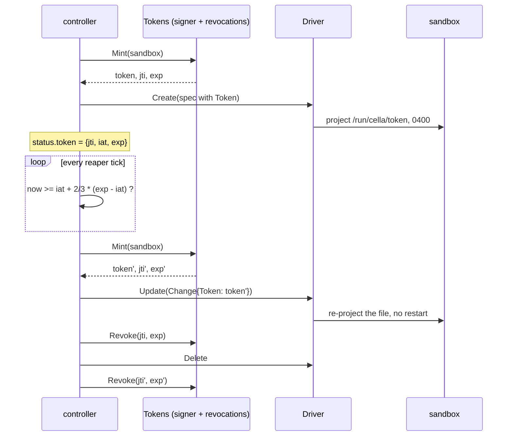

# Workload tokens

## Overview

Slice 045 of [[031-hosted-sandbox-consolidation]]. It ports the mint,
the rotation and the revocation list of `sandbox/internal/tokens` into
the shape [[006-identity]] states, and it closes the four acceptance
rows that three specs left waiting on each other: the mint is
[[006-identity]]'s, the re-mint at two thirds of a lifetime is
[[005-lifecycle-controller]]'s, the projection at `/run/cella/token` is
[[004-runtime-contract]]'s, and the revocation list is [[010-state]]'s.

A process inside a sandbox calls the control plane back with an identity
that dies with the sandbox. The control plane mints it at create, the
driver projects it into the sandbox as a file, the reaper re-mints and
re-projects it before it expires, and every token the control plane
replaces or ends is refused from that moment by its `jti`.

What the hosted product carried and this slice drops: operator tokens
for people, the token catalog and its scope filter, the hosted session
handling of `sandbox/internal/auth`, and `NeedsIdentityToken`, the
hosted rule that gave a token only to a sandbox whose policy or
credential class asked for one. [[004-runtime-contract]] states that
every driver projects the workload token, so every sandbox gets one.

## Current state

`internal/auth/mint.go` signs both tokens [[006-identity]] names, with
the claims of its table, the `jti`, the reserved subjects and the key
set at `/.well-known/jwks.json`. Nothing calls `MintWorkload` outside
its own test: the controller has no `Tokens`, `runtime.CreateSpec` has
no `Token`, no driver projects one, and the verifier checks no
revocation, because the list is the seam [[043-postgres-store]] left at
`store.Revocations`, with its table in the schema and no accessor on
`Tx`.

The reaper of [[037-lifecycle-enforcement]] holds three of the five
rules of [[005-lifecycle-controller]]'s table and [[043-postgres-store]]
holds the fourth; the `token` row is the empty slot. Recovery recreates
a lost sandbox with the same id, name, labels and lifecycle and mints no
token, which is the one thing its comment says slice 045 owes it.

## Design

### The claims

What `Signer.MintWorkload` signs, unchanged by this slice except that a
caller now exists:

| Claim | Value |
|---|---|
| `iss` | `CELLA_PUBLIC_URL` |
| `sub` | `sandbox:<sbx_ id>` |
| `aud` | `[CELLA_OIDC_AUDIENCE]` |
| `exp` | the sandbox's `expiresAt` or `WorkloadTokenLifetime` (24 hours) from the mint, whichever is sooner |
| `iat` | the mint |
| `jti` | a ULID, the key of a revocation |
| `environment` | the `env_` id the sandbox runs in |
| `spawn` | absent until [[022-mesh-and-spawn]] fills the budget from desired state |

`kid` is the RFC 7638 thumbprint of the signing key, so the token
verifies against the key set with any conforming library and without
asking `cellad`.

### The act



The rotation instant, where `iat` is the mint of the token the sandbox
holds and `exp` its expiry:

$$t_{\text{rotate}} = iat + \tfrac{2}{3}\,(exp - iat)$$

A token whose `exp` is already the sandbox's own `expiresAt` is not
rotated: a re-mint cannot extend it, so the rule would fire on every
tick until the sandbox is reaped. The sandbox and the identity it
carries end at the same instant, which is what the cap in the `exp` row
above is for.

### The seam the controller declares

```go
// In controller, implemented in internal/auth over the signer and the
// store's revocation list.
type Tokens interface {
	Mint(ctx context.Context, obj v1.Sandbox) (token, jti string, exp time.Time, err error)
	Revoke(ctx context.Context, jti string, exp time.Time) error
}

// TokenSweeper is the optional half: a list that forgets a row whose
// exp has passed, swept on the reaper's tick.
type TokenSweeper interface {
	Forget(ctx context.Context, before time.Time) (int, error)
}
```

`Options.Tokens` unset is a control plane that mints nothing: every
sandbox is created with no `Token`, every driver projects no file, and
the rule never fires. That is the hosted regression "no token when the
sandbox needs none" restated in the contract that replaced the hosted
rule.

What the control plane keeps per sandbox is `status.token`, three fields
beside `status.egressState` and read the same way: the `jti` a
revocation is keyed by, the `iat` the two thirds is measured from, and
the `exp`. The value is never one of them. It is desired state and not
something a caller reads, so the API strips it from every response, and
it survives a restart with the object it belongs to, which is what lets
a control plane that restarted revoke the token a sandbox still holds.

### Where the mint sits in the create order

Step 5 of [[005-lifecycle-controller]]'s create order, after the
boundary is in a gateway and before the driver is called, undone by a
`Revoke` of the `jti` when a later step fails. Recovery mints at the
same point in the same order, and revokes the token the lost sandbox
held once the recreated object exists: a `Create` that reports
`ErrAlreadyExists` adopted a running sandbox that still holds the old
token, so the new one is projected with `Update` before the old `jti` is
revoked, and a `Create` that failed for any other reason revokes the
`jti` it just minted and leaves the sandbox's own alone.

A delete revokes at `Deleting`, before the driver's `Delete` returns,
which is what makes a deleted sandbox's token refused at once
([[006-identity]]) without the verifier reading a phase.

### The projection

`runtime.CreateSpec.Token` and `runtime.Change.Token`, both `[]byte` and
both additive. `runtime.TokenPath` is `/run/cella/token` and
`runtime.TokenFileEnv` is `CELLA_TOKEN_FILE`, which every driver sets to
where it actually put the file, as the trust variables of
[[018-egress-and-secrets]] name the authority's path. A sandbox reads
one variable and finds its identity whichever driver runs it, and the
conformance case is capability-neutral because of it.

`CreateSpec.Token` is not serialized: the k8s driver keeps the create
spec in a claim annotation so a `Start` re-renders the Pod it first
rendered, and a credential does not belong in an annotation.

| Driver | Where | How a re-projection lands |
|---|---|---|
| native | `<sandbox dir>/run/cella/token`, mode 0400, in the directory the driver owns rather than the workspace, which is the user's | the file is rewritten in place |
| podman | `/run/cella/token` in the container, mode 0400, owned by `spec.user` where one is set | a second archive PUT over the same path |
| k8s | a Secret `cella-token-<object name>` projected read-only at `/run/cella`, `defaultMode` 0400 | the Secret's data is patched and kubelet re-syncs the file, so the workload keeps running |

The k8s mount is a directory and a `projected` volume with one `secret`
source, for two reasons. A `subPath` mount of a Secret key does not
re-sync when the Secret changes, so a rotation would need a restart; and
[[018-egress-and-secrets]] puts the gateway's authority in the same
`/run/cella` directory, which is a second source of the same projection
rather than a second mount. The mode is 0400 and the Pod's `fsGroup`
makes the file readable by the sandbox's own group and by nobody else.
A claim annotation records that a token was projected, so a `Start`
renders the mount the create rendered without holding the value.

### The revocation list

`store.Tx.Revocations()` on both adapters, over the table and the `exp`
index [[043-postgres-store]] left: `Revoke` is idempotent, because a
retried rotation or recovery revokes a `jti` it already revoked;
`Revoked` is the verifier's question; `Forget` drops the rows whose
`exp` has passed and runs on the reaper's tick, so the list is bounded
by the longest lifetime any live token has and not by the number of
sandboxes that ever ran.

The verifier refuses a revoked `jti` on the minted path only, where the
token is one `cellad` signed; a listed issuer's token is its issuer's to
revoke. A minted token that carries no `jti` is refused for the same
reason: a credential that cannot be revoked is not one this control
plane issued.

### What emits no event

[[009-events]]'s type set is closed and names one token event,
`sandbox.token`, for a mint outside the projection, which is
[[008-api]]'s `POST /v1/sandboxes/{id}/token` and not this slice. A mint
at create rides in the `sandbox.created` record that step already
writes; a rotation writes `status.token` under `MutationStatus`, which
[[042-events]] journals and never delivers, because the workload's
identity changing is not a change a reader of the feed acts on.

## Not in this spec

The `POST /v1/sandboxes/{id}/token` route and the environment key routes
([[008-api]], [[021-data-plane-workers]]); the spawn budget the claim
carries ([[022-mesh-and-spawn]]); the gateway's own credential, which is
not a token and never rotates under a running process
([[018-egress-and-secrets]]); `CELLA_TOKEN_FILE` as a reserved
environment key, which belongs with the rest of the reserved set in
`egress` and `manifest`.

## Acceptance criteria

| Criterion | Test that proves it | State |
|---|---|---|
| A minted workload token carries every claim of the table above, with `exp` capped by the sandbox's own expiry | `TestMintedClaims`, golden over the decoded payload; `TestWorkloadTokenLifetimeIsCapped` | |
| A revoked `jti` is refused by the verifier, an unrevoked one is accepted, and a minted token with no `jti` is refused | `TestRevokedTokenIsRefused` | |
| `Forget` drops a row whose `exp` passed and keeps one whose has not, on both store adapters | the revocations case of `internal/store/storetest` | |
| A sandbox is created with a token, the driver projects it, and the control plane records the `jti` and never the value | `TestCreateMintsAndProjects`; `TestStatusCarriesNoTokenValue` | |
| A create whose driver call fails revokes the `jti` it minted | `TestCreateFailureRevokes` | |
| A token past two thirds of its life is re-minted, re-projected and the old `jti` revoked in one act, and a token already capped by the sandbox's expiry is not rotated | `TestTokenReprojection` under the fake clock; `TestCappedTokenIsNotRotated` | |
| A recovered sandbox carries a new token and the previous `jti` is revoked | `TestRecoveryMintsAndRevokes` | |
| A delete revokes the sandbox's `jti` | `TestDeleteRevokes` | |
| A control plane with no `Tokens` creates a sandbox with no token and projects no file | `TestNoTokensNoProjection` | |
| Every driver projects the token at the path its row names, mode 0400, and an `Update` with a new token is what the next read returns | the `TokenProjection` case of `runtime/runtimetest`, run by native, podman and k8s | |
| A workload token reads its own sandbox and execs into it, and is refused on another sandbox's routes | `TestWorkloadReachesItsOwnSandbox` | |
| A sandbox created by `cellad serve` reads its token out of the projection, calls the API with it, and is refused on another sandbox | `TestWorkloadTokenEndToEnd` in `cmd/cellad` | |

## Outcome
