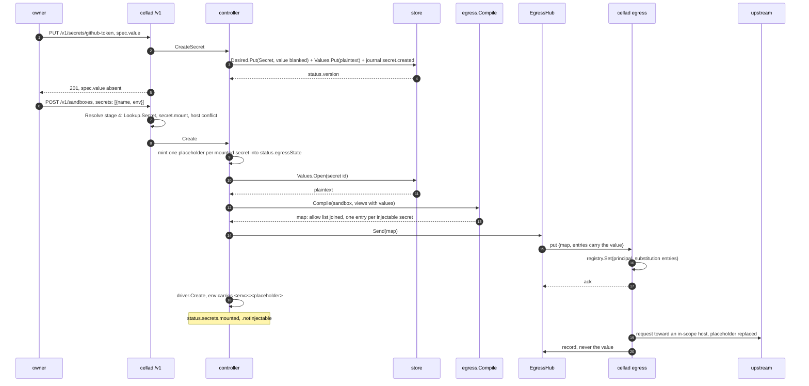
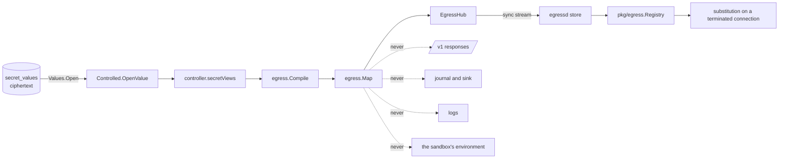

# The Secret kind

## Overview

This slice of [[031-hosted-sandbox-consolidation]] ports the hosted
sandbox's credential vault (`internal/credential/vault`,
`internal/credential/project`) into the `Secret` kind
[[018-egress-and-secrets]] fixes, and closes the one gap
[[039-egress-gateway]] left open: the boundary is built and enforced, and
nothing is substituted inside it.

After this slice a sandbox holds no credential. Its environment carries an
opaque placeholder per mounted secret, the value lives encrypted in the
store under [[010-state]]'s envelope, the control plane decrypts it only to
put it in the map it pushes to the environment's gateways, and the gateway
swaps the placeholder for the value on the way out toward a host the
secret's own owner named, and nowhere else. A request to any other host
carries the placeholder verbatim, so an exfiltration attempt leaks an
opaque token.

## Current state

[[039-egress-gateway]] left four named seams and this slice fills every
one: `egress.SecretView` and `egress.Entry` carry no value,
`internal/egressd.valueOf` returns nil, `Controller.compileEgress` compiles
`nil` secrets, and `v1.EgressState.Placeholders` is empty. Beside them,
[[043-postgres-store]] built `store.Values` (`Put`, `Open`, `Delete` over
the envelope, the `secret_values` table, `CELLA_SECRET_KEY`) with no
caller, and [[042-events]] built the journal's delivery half with a
vocabulary that has no `Secret` row yet.

What does not exist: the `Secret` kind in `manifest/v1`, `spec.secrets[]`
on a Sandbox, `status.secrets`, `manifest.Lookup.Secret`, any desired-state
collection beside sandboxes, any route under `/v1/secrets`, and
`store.Values.Rewrap`.

## Design

### The Secret kind

`manifest/v1.Secret`, as [[018-egress-and-secrets]] states it:

```yaml
apiVersion: cella.latere.ai/v1beta1
kind: Secret
metadata:
  name: github-token
spec:
  kind: static                     # static | oauth_client_credentials
  scope:
    hosts: ["api.github.com", "*.githubusercontent.com"]
    ports: [443]                   # default [443]
  inject:
    header: Authorization          # default; exclusive with query
    scheme: bearer                 # bearer | basic | raw
    query: ""                      # a query parameter instead of a header
    body: false
  oauth:                           # oauth_client_credentials only
    tokenUrl: https://login.example.com/oauth2/token
    scope: "read:repo"
    audience: ""
  value: ghp_...                   # write-only; never returned
status:
  id: sec_01J9...
  owner: https://login.example.com|alice
  version: 3
  createdAt: ...
  updatedAt: ...
  mountedBy: 2
```

The rules, each with the code it is refused under:

| Rule | Refusal |
|---|---|
| `spec.kind` is `static` or `oauth_client_credentials` | `invalid_field` |
| `scope.hosts` is non-empty | `missing_field` |
| each host passes the host rule of [[003-manifest-contract]]: an exact name or one leading `*.`, no IP literal, no single label, no loopback, link-local or private range | `invalid_field` |
| `scope.ports` are 1 to 65535, defaulted to `[443]` | `invalid_field` |
| `inject` names exactly one place: `header` or `query`, never both, never neither after defaulting | `exclusive_fields` |
| `inject.header` is a valid header name, `inject.query` a valid parameter name | `invalid_field` |
| `inject.scheme` is `bearer`, `basic` or `raw`; the default is `bearer` on `Authorization` and `raw` elsewhere | `invalid_field` |
| `oauth` is set if and only if `spec.kind` is `oauth_client_credentials`, and carries an `https://` `tokenUrl` | `exclusive_fields`, `missing_field`, `invalid_field` |
| `value` is required on create, optional on update, at most 64 KiB, and carries no CR or LF | `missing_field`, `invalid_field` |
| a `basic` or `oauth_client_credentials` value splits on a colon into two non-empty halves | `invalid_field` |
| `status` on apply is ignored | — |

`value` is write-only. Every read, single and list, returns the object
with `spec.value` absent; no event, record or log carries it. The
authorizer decides `secret.create`, `.read`, `.update`, `.delete`, `.list`
on the route and `secret.mount` at resolve ([[006-identity]]).

### What a Sandbox declares

`SandboxSpec.Secrets []SecretMount{Name, Env}` and
`SandboxStatus.Secrets{Mounted, NotInjectable}`. `Name` is a `Secret` the
caller may mount, by name among its own or by `sec_` id; `Env` is the
environment key the placeholder arrives under.

Resolve stage 4 asks `Lookup.Secret` for each entry. A secret that does not
exist, and one the authorizer refuses `secret.mount` on, are both
`not_found`, so existence does not leak. Two mounted secrets whose scopes
can match one concrete host are `secret_host_conflict`, refused rather than
silently collapsed. The `env` rules of [[003-manifest-contract]]: a POSIX
name, not in `spec.env`, not reserved, not another entry's `env`, and not
equal to any entry's `<env>_HEADER` or `<env>_QUERY`.

Mode inference at stage 2 reads the manifest's own fields, extending
[[039-egress-gateway]]'s table with the row [[003-manifest-contract]] names:

| `allowedHosts` | `deniedHosts` | `secrets[]` | Inferred `mode` |
|---|---|---|---|
| set | empty | any | `allowlist` |
| empty | set | any | `open` |
| empty | empty | non-empty | `allowlist` |
| empty | empty | empty | `open` |
| set | set | any | `exclusive_fields` |

A mounted secret's hosts are not written into `spec.network.egress.allowedHosts`.
They join the effective allow list in `egress.Compile`, which is where
[[039-egress-gateway]] put the join, so the manifest a caller reads back is
the manifest it wrote and the narrowing rule compares like with like.

For a workload actor, adding a `secrets[]` entry is `boundary_widened` at
`spec.secrets`; removing one is narrowing and is accepted.

### The value's path



Values travel **in the map**, on the sync stream, inside the `put` and
`snapshot` frames. [[018-egress-and-secrets]] puts them there: `Entries` is
"one per injectable secret: placeholder, kind, hosts, ports, inject, body
flag, value or oauth", and `Compile` "is pure and runs in the control
plane; the value is decrypted only here, through `Values.Open`, only to be
sent". There is no second channel: a gateway that connects holding nothing
receives every value it needs in its snapshot, and a value update is a map
at a higher version. The consequence is stated rather than hidden: the
control plane holds decrypted values in memory in `EgressHub.maps`, for as
long as the sandboxes that mount them live, and nothing may log a `Map` or
an `Entry`.

### Where the value is confined



`store.Values.Open` has exactly one caller in the tree,
`store.Controlled.OpenValue`, which has exactly one caller,
`controller.secretViews`, which `compileEgress` calls and nothing else
does. `TestValuesAreConfined` asserts both edges by parsing every
non-test file of the module with `go/parser` rather than by grep, so a
second caller is a test failure and not a review note.

### The store

`internal/store` gains the `Secret` collection beside sandboxes and the
callers `store.Values` was built for:

| Seam | What it does |
|---|---|
| `Controlled.LoadSecrets` | every live `Secret` row, with its version remembered for the next conditional write |
| `Controlled.WriteSecret` | one conditional `Desired.Put` with `spec.value` blanked, the journal row, and, when a plaintext is given, `Values.Put`, all in one transaction |
| `Controlled.RemoveSecret` | `Desired.Delete`, `Values.Delete` and the journal row in one transaction |
| `Controlled.OpenValue` | the one decrypting call |
| `Values.Rewrap` | rewrites every wrapped data key under a new key and leaves every value's ciphertext byte untouched ([[010-state]]) |

The provisional single-process snapshot of [[026-direct-control-plane]]
serves secrets too, because the canary end-to-end test runs `cellad serve`
the way an operator runs it and an installation without a database is a
supported one. It holds the same ciphertext under the same envelope: the
controller takes a `Sealer` seam (`Seal`, `Open`), which
`store.Envelope` satisfies as it stands, so the crypto has one
implementation and the snapshot has no key of its own. A snapshot store
opened without `CELLA_SECRET_KEY` refuses a value with
`ErrNoSecretKey`, which the API answers `capability_unsupported` naming
the variable.

Journal rows are `secret.created`, `secret.updated` and `secret.deleted`,
with the data [[009-events]]'s table names, `{version, hosts}`, and never
the value. On the durable store they are written inside the transaction
that writes the state; on the snapshot store the controller's emission seam
takes them, which is the split [[042-events]] built.

### The controller

`compileEgress` is the one place a value is read:

1. For each `spec.secrets[]` entry, find the mounted secret in the
   controller's own collection by the id recorded in
   `status.egressState.secrets`, or by name or id on the first compile.
   Binding is by id: a secret deleted and recreated under one name is a
   different secret, and a running sandbox is not silently re-bound to it.
2. Mint a placeholder for an entry that has none, keep the one an entry
   already has, and record `{name, id, env, placeholder}` in
   `status.egressState.secrets`, which survives a restart with the object.
3. Open the value through the store seam, build the `egress.SecretView`
   with it, and call `egress.Compile`.
4. Write `Map.NotInjectable` plus every mounted secret whose Secret is gone
   into `status.secrets.notInjectable`, and every mounted name into
   `status.secrets.mounted`.

The placeholder reaches the workload through `specOf`, not through
`Create`, so a recovery of a lost sandbox projects the same environment the
create did. `CreateSpec.Env` gains `<env>=<placeholder>`, plus
`<env>_HEADER=<name>` where the secret injects into a header other than
`Authorization` and `<env>_QUERY=<name>` where it injects into a query
parameter. The manifest's own `spec.env` is untouched: the placeholder is a
projection and not a field the caller wrote.

A value update bumps `status.version` and re-pushes the map of every
sandbox that mounts the secret, at a higher `EgressState.Version`, without
restarting any of them. A delete purges the value, marks every mounting
sandbox `notInjectable` and re-pushes, so the next request leaves
unauthenticated rather than with a stale value. Neither fails on a gateway
that does not acknowledge: the sandbox already exists, so the act stands
and the gateway is made whole by its next snapshot.

### The gateway

`internal/egressd.valueOf` returns the entry's value, so `substitutions`
fills `pkg/egress.Registry` and both doors substitute:

| Entry kind and scheme | What the gateway substitutes |
|---|---|
| `static`, `bearer` or `raw` | the value verbatim; the client wrote the surrounding `Bearer ` |
| `static`, `basic` | the base64 of `user:pass`, split on the first colon |
| `oauth_client_credentials` | a `pkg/egress.OAuthClientCredentials` resolver over `tokenUrl`, with `clientId:clientSecret` from the value; the token is cached until its expiry and the client secret never leaves the gateway |

One resolver instance is kept per principal and secret, keyed by a
fingerprint of the token URL, the client id and the value, so a map re-push
at a higher version does not throw away a cached token. The resolver's HTTP
client dials through the gate's own upstream transport, so
`CELLA_EGRESS_CA_BUNDLE` and the `Dial` seam reach the token endpoint too.

Body substitution happens only for an entry whose `inject.body` is true,
which is `pkg/egress.Entry.SubstituteBody`, under the package's own body
rule: a known `Content-Length` at most 64 KiB and a JSON, form or text
content type.

### Package layout

| Package | What this slice adds |
|---|---|
| `manifest/v1` | `Secret`, `SecretSpec`, `SecretScope`, `SecretInject`, `SecretOAuth`, `SecretStatus`; `SandboxSpec.Secrets`, `SandboxStatus.Secrets`, `EgressState.Secrets` |
| `manifest` | `DecodeSecret`, `ResolveSecret`, `Lookup.Secret`, stage 4 for `secrets[]`, the companion-name rules, the secrets row of the mode inference and of `narrowing` |
| `egress` | `SecretView.Kind/Value/OAuth`, `Entry.Kind/Value/OAuth` |
| `internal/store` | the `Secret` collection, `WriteSecret`, `RemoveSecret`, `LoadSecrets`, `OpenValue`, `Values.Rewrap` in both adapters |
| `internal/events` | `secret.created`, `.updated`, `.deleted`, `OfSecret`, the `{version, hosts}` data, and `Created.Secrets` as names |
| `controller` | `Secrets` seam, the kind's create, get, list, update and delete, the snapshot store's secrets, `secretViews`, the placeholder projection in `specOf` |
| `internal/egressd` | `valueOf`, the scheme encodings, the oauth resolvers, placement on the reverse door |
| `internal/api` | `/v1/secrets`, `sandbox.secrets` in the status, the new rows of the error table |

## Not in this spec

`workspace.git.secret` and with it the one producer of
`secret_out_of_scope`, because this manifest carries no `workspace.git`
([[003-manifest-contract]] owns the field and
[[044-manifest-fields]] did not add it); the code and its sentence are
registered here and the check lands with the field. The platform's screens
for the kind (the platform's slice 61). The k8s NetworkPolicy
([[036-k8s-driver]]). The `Volume` kind ([[019-volumes]]). A KMS behind
`CELLA_SECRET_KEY` ([[010-state]]).

## Acceptance criteria

| Criterion | Test that proves it | State |
|---|---|---|
| Every rule of the Secret table refuses with its code, and an accepted Secret defaults `ports`, `scheme` and `inject.header` | `TestSecretRefusals`, `TestSecretDefaults` | open |
| `GET` and list never return `spec.value`; `value` is required on create and optional on update; an update of the value bumps `status.version` | `TestSecretValueIsWriteOnly`, `TestSecretVersionBumps` | open |
| Resolve mounts a secret, refuses two secrets scoping one host with `secret_host_conflict`, answers `not_found` for one that does not exist and one the authorizer refuses, and refuses each `env` collision including `<env>_HEADER` and `<env>_QUERY` | `TestSecretReferences` | open |
| The mode is inferred `allowlist` from a mounted secret with no host list; a workload that adds a secret is `boundary_widened` at `spec.secrets` | `TestModeInference`, `TestNarrowingIsForWorkloads` | open |
| A value round-trips through `Values` on both adapters; `Rewrap` under a new key leaves every value's ciphertext unchanged and `Open` still works | `TestStoreSuite`, `TestRewrap` | open |
| `store.Values.Open` has one caller and `Controlled.OpenValue` has one caller, both found by parsing every non-test file of the module | `TestValuesAreConfined` | open |
| A Secret's create, update and delete journal `secret.created`, `.updated` and `.deleted` with `{version, hosts}` and no value, on the durable store and on the snapshot store alike | `TestSecretEvents` | open |
| The gateway substitutes a static bearer, a basic pair and a query parameter toward an in-scope host, and passes the placeholder verbatim toward every other host, port and principal | `TestSubstitutionIsScopedAndPlaced` | open |
| An `oauth_client_credentials` secret mints a token at a stub token endpoint, caches it across a re-push, and the client secret never leaves the gateway | `TestOAuthKind` | open |
| Updating a value reaches a connected gateway without a sandbox restart; deleting the secret marks the sandbox `notInjectable` and the next request leaves unauthenticated | `TestLiveUpdateAndRevoke` | open |
| `/v1/secrets` serves create, read, list, update and delete under the `secret.*` actions, scoped to the actor, with `spec.value` absent from every answer and the error table's codes and sentences | `TestSecretRoutes`, `TestErrorTable` | open |
| The canary: one `cellad serve`, one `cellad egress`, one native sandbox with one mounted secret; the value appears in no environment, no file under the data directory, no journal row, no record and no log line of either process, while a request through the proxy door to the in-scope upstream carries it | `TestSecretValuesNeverEnterASandbox` | open |
| No file this slice adds names a Latere host, image, pool or namespace outside an example | `TestNoLatereCoordinates` | open |
