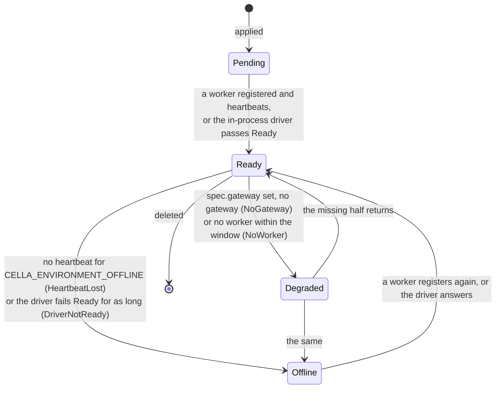

# Environments and workers

## Overview

Until this slice a `cellad` drives one environment: the driver
`CELLA_RUNTIME` names, held in `controller.Options.Driver`, with the
`Environment` kind a name and an isolation class and nothing else. This
slice makes the environment an object. An operator applies one, mints it
a key, and a `cellad worker` on the operator's own infrastructure
connects outbound with that key, reports what its driver provides, and
claims operations. The control plane never dials in, which is invariant
10 of [[001-architecture]].

Three consumers wait on parts of it. The hosted plane's deploy needs
`POST /v1/environments/{id}/keys`, because the gateway of
[[039-egress-gateway]] authenticates with an environment key and no
route minted one: its end-to-end test signed one with the control
plane's own signer. [[004-runtime-contract]] names `runtime/remote` as
the driver of a worker's environment and `TestWorkerConformance` as its
proof. [[021-data-plane-workers]] is the whole contract this slice
implements.

## Current state

| Piece | Where it is | What is missing |
|---|---|---|
| The `Environment` kind | `manifest/v1/environment.go`: isolation, `spec.scheduling`, `spec.pool`, `status.driver/isolation/capabilities` | `spec.mode`, `spec.capacity`, `spec.gateway`, `spec.workspaceClass`, `status.phase/reason/workers/used`, every validation rule |
| Environments in the resolver | `manifest.FixedEnvironment`, one object built from the driver | a registry answering the environments the control plane holds |
| Environment keys | `auth.Signer.MintEnvironmentKey`, `Caller.Environment()`, the revocation list | the mint and revoke routes |
| The gateway stream | `internal/api/egress.go`, `ErrEgressEnvironment` | the same shape for the worker stream |
| The operations queue | `store.Operations` declared, the `operations` and `workers` tables in migration `000001` | no `Tx` accessor and no adapter |
| The worker | nothing | the role, its stream client, and the driver behind it |

The brief this slice was dispatched under named `spec.driver` and a
phase `Unreachable`. [[021-data-plane-workers]] is the validated parent
and states `spec.mode` with `status.driver` recorded from the first
registration, and the phase `Offline` with the reason `HeartbeatLost`.
Rule 2 of [[031-hosted-sandbox-consolidation]] extends `manifest/v1`
only with fields a parent spec names, so this slice follows 021 and the
brief's two names map onto 021's.

## Design

### The kind

`v1.EnvironmentSpec` gains the fields of 021's table.
`spec.mode` is `inprocess` or `worker`; it is immutable, and
`inprocess` is the control plane's own object, which no caller
applies. `spec.capacity` is a quantity triple and a sandbox count, the
ceiling placement admits against. `spec.gateway` is the host a sandbox
of the environment reaches the gateway at, required where the driver
enforces egress. `spec.workspaceClass` is the storage class of every
managed workspace.

`v1.EnvironmentStatus` gains `phase`, `reason`, `workers`, `gateways`,
`lastHeartbeat` and `used`. The phase machine:



`Ready` places, reaps and watches. `Degraded` and `Offline` refuse a
create with `driver_unavailable` and leave running sandboxes alone.
`Offline` additionally holds every sandbox with no observed counterpart
`Lost` rather than reaping it, which is [[005-lifecycle-controller]]'s
rule read through the environment.

Validation is `manifest.ValidateEnvironment`, a table of refusals:
`invalid_field` for a mode, isolation, capacity quantity, scheduling
mode, queue name or pool size outside its rule; `missing_field` for an
absent isolation, capacity, or a gateway an enforcing driver needs;
`capability_unsupported` for a pool on a driver with no `Pool`.
`metadata.name` is a DNS-1123 label.

### Environments as desired state

The control plane holds a registry: the environments it has, the driver
serving each, and the phase loop that writes each one's status.

At start, when `CELLA_RUNTIME` is not `none` and no environment bears
the name `CELLA_DEFAULT_ENVIRONMENT`, the control plane creates one from
the variables: `mode: inprocess`, the isolation and capabilities the
in-process driver reports, `spec.capacity` from `CELLA_CAPACITY`,
`spec.scheduling` from `CELLA_SCHEDULING_MODE`, `spec.pool` from
`CELLA_POOL_*`, `spec.gateway` from `CELLA_GATEWAY`. The variables seed
it once. Afterwards the stored object is authoritative, so a changed
variable never overrides an operator's edit, and the default is not
deletable.

`POST /v1/environments` and `PUT /v1/environments/{name}` register a
self-hosted one, whose `spec.mode` is `worker` and whose driver is
`runtime/remote`. `GET`, list and `DELETE` follow the grammar of
[[008-api]]; a delete while the environment holds a sandbox is
`phase_conflict`.

`manifest.Lookup.Environment` answers from the registry, so a manifest
that names an environment resolves against that environment's declared
isolation and observed capabilities, and one that names an absent
environment is `not_found` at `spec.environment`. The `environment.use`
decision of [[006-identity]] still gates it and a deny is `not_found`.

The controller keeps one driver per environment rather than one driver.
`Controller.driverFor(environment)` is the single seam; every method
that reached `c.driver` reaches it through the sandbox's own
environment, which is the field the object already carries.

### Keys

```
POST /v1/environments/{id}/keys      environment.key
  201 {"token": "...", "jti": "...", "exp": "..."}     shown once

DELETE /v1/environments/{id}/keys/{jti}      environment.key
  204
```

The token is an environment key of [[006-identity]]: `sub:
environment:<env_ id>`, `exp` at `CELLA_ENVIRONMENT_KEY_TTL`, a ULID
`jti`. The delete writes that `jti` to the revocation list of
[[010-state]], which the verifier already reads for every token
`cellad` signed, so a revoked key is refused on the next frame of every
stream and on the next request of every route.

An environment holds several keys, so a worker and a gateway of one
environment each carry their own. A key reaches the worker routes and
the gateway stream of its own environment and nothing else: the verifier
answers an environment rather than a subject, and every route that
decides on a subject is refused with `forbidden`.

### The worker stream

```mermaid
sequenceDiagram
    participant Op as operator
    participant CP as cellad serve
    participant W as cellad worker
    participant D as the worker's driver

    Op->>CP: PUT /v1/environments/eu-gpu (mode worker)
    Op->>CP: POST /v1/environments/{id}/keys
    CP-->>Op: the key, once
    Op->>W: CELLA_URL, CELLA_ENVIRONMENT_KEY, CELLA_RUNTIME
    W->>D: Preflight
    W->>CP: POST /v1/environments/{id}/workers<br/>driver, isolation, capabilities, capacity
    CP-->>W: wrk_ id, heartbeat interval, lease
    W->>CP: GET /v1/environments/{id}/operations (WebSocket)
    W->>CP: hello {worker}
    CP-->>W: the environment is Ready

    loop while connected
        CP->>W: operation {id, type, payload}
        W->>D: the driver call the type names
        D-->>W: the return, or the driver's error
        W-->>CP: result {id, ok, value, error}
        W-->>CP: heartbeat, and the observed state of the sandbox
    end

    Note over CP,W: the stream drops
    CP->>CP: no heartbeat for CELLA_ENVIRONMENT_OFFLINE
    CP->>CP: phase Offline, reason HeartbeatLost
    CP->>CP: the claims lapse; the rows redeliver
    W->>CP: reconnect with backoff, register again
    CP->>CP: phase Ready
```

The stream is one WebSocket the worker opens, subprotocol
`cella.worker.v1`. Every frame is a 26-byte operation id, one byte of
sub-stream, and the payload: `0` control as JSON, `1` stdin, `2`
stdout, `3` stderr, `4` bytes. A sub-stream ends with a zero-length
frame. The control messages are 021's: `hello`, `heartbeat`,
`operation`, `result`, `cancel`, `resize`, `state`. Frames are at most
1 MiB.

An operation's type is a `Driver` or optional-interface method name and
its payload is the method's arguments less the context, JSON-encoded,
with every `io.Reader` and `io.Writer` argument replaced by a
sub-stream. The exceptions are 021's table: `Exec` carries stdin down
and both outputs up with the exit code in `result`; `Attach` carries
one stream each way with `resize` as a control message; `Logs` and
`ExportTar` carry bytes up; `ImportTar` carries them down; `Create`
carries the workload token, which the worker never mints.

### The queue and redelivery

The `operations` table is the record, not the transport. The control
plane writes a row per operation, sends the frame on the connection a
worker opened, and acknowledges the row with the answer. `Claim` is the
redelivery of [[010-state]]: it takes rows nobody holds and rows whose
holder stopped heartbeating, in one statement with the rows locked, so a
row is claimed once however many replicas claim at the same instant.

An operation with a live sub-stream is not redeliverable: a caller's
exec that was halfway through a worker that vanished has lost output
nobody can reconstruct, and re-running the command would run it twice.
Such an operation fails on the connection that carried it and the caller
retries. Only an operation with no open sub-stream, which is every
lifecycle call, is a candidate for redelivery.

### The remote driver

`runtime/remote.Driver` implements `runtime.Driver`, `runtime.Attacher`
and `runtime.FileStore`, each method one operation. It is never selected
by `CELLA_RUNTIME`; it is what an environment with `spec.mode: worker`
gets.

- `Name` is `remote`; `Isolation` and `Capabilities` are what the worker
  reported at registration.
- `Preflight` succeeds when the environment has a registration and
  `Ready` when a worker has heartbeat inside the offline window.
- `Inspect` and `List` answer from the observed state the worker
  reported, so the control plane reads a sandbox without waking the
  worker, and fall through to an operation when the observed index has
  no row.
- Every other method is one operation, awaited under the caller's own
  context; a cancelled context sends `cancel`.

### Identity across the seam

The worker authenticates with its environment key and mints nothing. A
sandbox on a worker's environment carries the workload token the control
plane minted, projected by the worker's own driver out of the `Create`
payload, and reaches `CELLA_URL` directly. The gateway beside those
sandboxes is `cellad egress` with its own key on its own stream. Nothing
dials into the worker.

### Events

Per [[009-events]]'s table: `environment.created`, `.updated`,
`.registered` with `{workers}`, `.offline`, `.keyed` and
`.key_revoked` with `{jti}`, `.deleted`. They travel through the
emitter of [[042-events]].

## Not in this slice

Environments as desired state: a registered `Environment` object, the
per-environment driver map in the controller, the phase loop that writes
`status.phase`, and the routing of a sandbox's `spec.environment` to the
driver of that environment. The controller drives one environment
through one driver, so a worker registers on the control plane's own
environment and the remote driver is exercised through its own
transport rather than through a sandbox's create. The seam is the same
either way: what remains is `Controller.driverFor`, which touches every
call site of `c.driver` and is the half of this spec that collides with
[[022-mesh-and-spawn]]'s controller work.

The queued scheduling mode and the capacity admission of
[[020-scheduling-and-sets]], which stays `capability_unsupported`. The
`credit` control message of 021's flow control: the framing reserves
the message and this slice bounds a sub-stream by the 1 MiB frame and
the connection's write deadline instead, which is additive to add.
`Watch` as a long-lived operation, since no driver implements `Watch`
yet. The mesh and spawn objects of [[022-mesh-and-spawn]].

## Acceptance criteria

| Criterion | Test that proves it | State |
|---|---|---|
| Every field rule of 021's table has a refusing case, and a valid environment round-trips through decode, validate and default | `TestEnvironmentFieldRules`, `TestEnvironmentAccepts`, `TestEnvironmentDefaults`, `TestDecodeEnvironment`, `TestCapacityRoundTrips` | built |
| `POST /v1/environments/{id}/keys` mints an environment key under `environment.key`, shows it once, and `DELETE .../keys/{jti}` revokes it | `TestEnvironmentKeyRoutes`, `TestEnvironmentKeyRefusals` | built |
| A revoked key is refused on the data plane routes, and a key of another environment is refused with the shape `ErrEgressEnvironment` has | `TestRevokedKeyIsRefusedOnTheWorkerRoutes`, `TestEnvironmentKeyReachesItsOwnEnvironmentOnly`, `TestWorkerRefusesARevokedKey` | built |
| The gateway of [[039-egress-gateway]] authenticates with a key minted through the route rather than one signed by hand | the `plane.environmentKey` of `cmd/cellad`'s egress suite | built |
| A worker with a valid key registers and receives a `wrk_` id; a mismatched driver or isolation class is refused with `environment_mismatch`; a failed `Preflight` never registers | `TestWorkerRegistrationRoute`, `TestRegistrationMismatch`, `TestWorkerRefusals` | built |
| `Operations.Claim` redelivers an operation whose claimer's heartbeat lapsed, exactly once to a live worker | `storetest`'s `Operations`, `Redelivery` and `Workers` cases over both adapters | built |
| `runtime/remote` passes the conformance suite of [[004-runtime-contract]] against an in-process worker running the native driver | `TestWorkerConformance` | built |
| The stream's framing holds, every driver sentinel crosses the seam, and a caller's cancel reaches the worker | `TestStreamFraming`, `TestControlMessages`, `TestErrorCrossesTheSeam`, `TestCancelCrossesTheSeam`, `TestExecStreamsAcrossTheSeam` | built |
| A worker that drops its stream registers again and the environment is placeable once more, with nothing having dialed it | `TestWorkerReconnects`, `TestWorkerRetriesARefusedRegistration` | built |
| `cellad serve` and `cellad worker` in one process over loopback: a key minted through the route, a worker that registers and connects, an environment that reports it, and one that reports none when it stops and one again when it returns | `TestWorkerEndToEnd` | built |
| Capabilities are the intersection of the live workers' reports | `TestRegistrationMismatch` | built |
| The remote driver reads a sandbox from what the workers reported rather than waking one | `TestObservedStateAnswersWithoutTheWorker` | built |
| Neither `runtime/remote` nor the worker role reaches a client this repository does not admit, and neither reaches the Postgres driver | `TestRootPackagesDialNothing` | built |
| Every phase transition of the machine above fires on its trigger and gates what the table says | `TestEnvironmentPhases` under a fake clock | not built: the phase loop is the desired-state half |
| The default environment is created from the variables at first start and the stored object is authoritative afterwards; it is not deletable | `TestDefaultEnvironment` | not built: the same half |
| A registered worker environment routes its sandboxes to the remote driver and the default's to the in-process one | `TestControllerRoutesByEnvironment` | not built: `Controller.driverFor` is the same half |
| A sandbox on the default environment and one on a worker's differ only by `status.environment`, `status.driver` and `status.isolation` | `case001Indistinguishable` | not built: it needs the routing above |
| No file this slice adds names a Latere host, image, pool or namespace | `TestNoLatereCoordinates` | built |

## Outcome, so far

The seam of [[021-data-plane-workers]] is built and proved; the desired
state half of it is not. What landed:

| Piece | Where |
|---|---|
| The `Environment` kind, its decode, its defaults and its field table | `manifest/v1/environment.go`, `manifest/environment.go` |
| The environment key's mint and revocation | `internal/auth/environmentkeys.go` |
| `POST`/`DELETE /v1/environments/{id}/keys/{jti}`, `GET /v1/environments`, `GET /v1/environments/{id}` | `internal/api/environments.go` |
| `POST /v1/environments/{id}/workers` and `GET /v1/environments/{id}/operations` | `internal/api/workers.go` |
| The operations queue and the worker registrations, on both adapters | `internal/store/{store,memory,postgres,storetest}` |
| The wire, the driver, the executor, the link and the hub | `runtime/remote/` |
| The worker role, its socket and its configuration | `internal/worker/`, `internal/config/worker.go` |
| `cellad worker` | `cmd/cellad/main.go` |
| The `Environment` event vocabulary of [[009-events]] | `internal/events/environment.go` |

Coverage on the packages this slice added or extended, on
`go test -cover`: `manifest` 97.5%, `internal/config` 91.4%,
`internal/store` 91.6% with memory 93.8% and postgres 90.0%,
`internal/api` 90.6%, `runtime/remote` 90.8%, `internal/worker` 90.8%.
`go test -race` is clean over all of them.

The end-to-end that ran is `TestWorkerEndToEnd` in `cmd/cellad`: one
process running `cellad serve` on the native driver and `cellad worker`
on its own native driver, joined over loopback by a key minted through
`POST /v1/environments/default/keys`; the environment reports the worker,
reports none when it stops, and reports one again when it returns.
`TestWorkerConformance` runs the whole suite of
[[004-runtime-contract]] through `runtime/remote` against a worker
running `native`, and the egress suite of [[039-egress-gateway]] now
mints its key through the route rather than with the control plane's
signer.

### What this leaves open

| Open | Why |
|---|---|
| Environments as desired state: the stored object, the default seeded from the variables, `PUT`/`POST`/`DELETE /v1/environments` | It needs `Controller.driverFor` below it, and a registry the resolver's `Lookup` reads |
| `Controller.driverFor`: the per-environment driver map, the reaper and the pool per environment | 44 call sites of `c.driver` across the reaper, the pool, recovery, egress and display, some under the controller's lock and some not. It is the half of this spec that collides with the controller work of [[022-mesh-and-spawn]], and half-applied it delivers nothing |
| The phase loop writing `status.phase` and `status.reason` under the environments lease | It writes to the stored object, which is the item above |
| `environment.registered` and `.offline` emitted from the phase loop | The same. `.keyed` and `.key_revoked` are emitted from the key routes and the vocabulary is declared |
| The `credit` control message of 021's flow control | The framing reserves it; a sub-stream is bounded by the 1 MiB frame and the write deadline instead, and adding the window is additive |
| The `workers` and `operations` rows read back by the hub for redelivery | `Claim`, `Register`, `Heartbeat`, `Forget` and `Workers` are built and proved at the store; the hub writes the row and the answer and keeps the live registrations in memory, which is one replica's view. A fleet reads them from the table |
