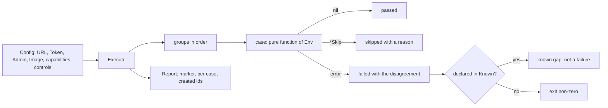

# Conformance suite

## Overview

[[015-conformance-suite]] states the contract as a suite: given a URL, a
way to mint tokens and what the environment declares, it runs one case
per acceptance row the specs mark and reports which held, which failed
with the request and the response that disagreed, and which skipped and
why. This slice builds that suite over the API this repository serves
today, wires it into the two pipelines where [[048-release-and-check]]
and [[049-stubs-and-tiers]] left a placeholder, and writes down,
as declared gaps rather than as green cases, every row of [[008-api]]
this server does not yet answer.

The suite is the cutover gate of [[031-hosted-sandbox-consolidation]]:
the parent specs move to complete the day it passes against the hosted
`cellad`. It is therefore written against the specs and never against the
handlers. A case that fails here is a gap in the server or a gap in the
spec, recorded in the Outcome, and it is never closed by weakening the
case.

## Current state

The suite is not built. `verify.yml`'s `install` job and `release.yml`'s
`conformance` job bring the kind stack up and drive one lifecycle through
it; both carry a comment naming this slice as what joins them.
`internal/cellaclient` ([[050-cella-command]]) is a typed client
over the routes this server serves, including the exec and attach
sockets, and is what the suite speaks where a case is about behaviour
rather than about the wire.

## Design

### Shape

The package is `test/conformance`, which is where [[015-conformance-suite]]
and [[012-test-stubs-and-tiers]]'s tier row put it. It holds no `main`:
the external form is the tier's command, `go test -run '^TestContract$'
./test/conformance -args -url ...`, and a report on standard output with
a non-zero exit on a failed case is what `go test` already is.

```go
// Execute runs every case the inputs allow. It takes no testing.T, so a
// case is a pure function of the configuration and the server.
func Execute(ctx context.Context, cfg Config) Report

// Run is Execute with each result mirrored onto a subtest <NNN>/<Name>.
func Run(t *testing.T, cfg Config) Report
```

A case is `func(ctx context.Context, e *Env) error`, named
`case<NNN><Name>` after the spec whose criterion it proves. `Env` carries
the clients the case needs (the caller's, a second subject's, the
administrator's), the configuration, and the object recorder. A case
returns nil for a pass, a `*Skip` for a capability or an input the
configuration does not carry, and any other error for a disagreement.
`*Disagreement` is the error a case builds from one exchange: the method,
the path, what the spec says, and what arrived. The report prints it, so
a failed case reads as the request and the response side by side.



`Config` is [[015-conformance-suite]]'s, with what this slice's tiers
need added:

| Field | Meaning | Empty means |
|---|---|---|
| `URL` | the server under test | the run refuses to start |
| `Token` | mints a token for a subject, from the stub issuer or a caller's own | `Caller` alone, and the two-subject cases skip |
| `Caller`, `Admin` | a caller token and an administrator's | minted through `Token` |
| `Image` | the image every case creates from | the manifest carries a command and no image, which is the native environment |
| `Capabilities` | what the environment declares (`attach`, `files`, `display`, `input`, `dial`, `snapshots`) | read from an environment when that route answers, otherwise every capability case skips |
| `AuthorizerControl` | the authorizer's control URL, `POST /fail {"mode":...}` | the unavailability cases skip |
| `AdmissionControl` | the admission endpoint's control URL, same shape | the admission cases skip |
| `SinkControl` | the sink's records, `GET /events` | the delivery cases skip |
| `Cella` | the built `cella` binary | the agent case skips |
| `DisplayImage`, `Upstream`, `QueuedEnvironment`, `WorkerEnvironment` | [[015-conformance-suite]]'s inputs for the groups this server does not serve | those groups skip |
| `Known` | the cases this server declares it fails, with the reason | every failure is a failure |
| `Skip` | group or case names to skip by request | nothing is skipped by request |

The control contract is one route: `POST <control>/fail` with
`{"mode": "<mode>"}` puts the stub into that failure mode and an empty
mode clears it. `cella-stubs` takes its modes as start-up flags today
([[012-test-stubs-and-tiers]]'s table), so the control URL is served by
the tier that owns the stub; adding it to `cella-stubs` is 012's.

### Isolation

Every object a case creates is named `conformance-<run>-<case>`, where
`<run>` is eight random characters. The recorder holds every id the run
made; the run deletes those ids and only those, never by prefix and
never by list, so two runs against one server and a run against a live
installation touch nothing they did not make. Each case runs under a two
minute deadline. No case sleeps for a state: a phase is polled until the
deadline.

### Groups

One row per group of [[015-conformance-suite]], the cases this slice
writes into it, and what the group skips on. A group with no case that
can run reports one skip with its reason and never nothing.

| Group | Cases | Skips when |
|---|---|---|
| decode | 8: `case003ContentTypes`, `case008UnsupportedMediaType`, `case008NotAcceptable`, `case008BodyTooLarge`, `case003MultiDocument`, `case003UnsupportedVersion`, `case003UnsupportedKind`, `case003UnknownField` | never |
| resolve | 6: `case003DefaultsAreReturned`, `case008GeneratedName`, `case008NameTaken`, `case008NameOnPathAndBody`, `case007AdmissionRefused`, `case007AdmissionUnavailable` | the admission cases without `AdmissionControl` |
| lifecycle | 4: `case005CreateReachesRunning`, `case005StopAndStart`, `case005PhaseConflict`, `case005DeleteInEveryPhase` | never |
| identity | 5: `case006Unauthenticated`, `case006Forbidden`, `case006NotFound`, `case006WorkloadTokenScope`, `case006AuthorizerUnavailable` | the last without `AuthorizerControl` |
| list | 3: `case008ListEnvelope`, `case008ListSelectors`, `case008ListLimitCeiling` | never |
| streams | 8: `case008ExecWait`, `case008ExecStream`, `case008ExecSocket`, `case008AttachSocket`, `case008FilesTar`, `case008FileRoutes`, `case008Logs`, `case008Dial` | the sockets without `attach`, the files without `files`, the dial without `dial` |
| errors | 2: `case008ErrorEnvelope`, `case008PublicDocuments` | never |
| events | 3: `case009ObjectFeed`, `case009DeliveredInOrder`, `case018CanarySecret` | the delivery without `SinkControl` |
| secrets | 3: `case018SecretWriteOnly`, `case018SecretRotates`, `case018SecretDelete` | never |
| volumes | 1: `case019VolumeLifecycle` | the kind is not served |
| sets | 1: `case020SetRunsToCompletion` | without `QueuedEnvironment` |
| environments | 1: `case021EnvironmentRead` | the kind is not served |
| egress | 1: `case018EgressRecords` | never; the substitution half needs `Upstream` |
| spawn | 1: `case022SpawnBoundary` | a workload token cannot apply |
| agent | 1: `case011AgentScenario` | without `Cella` |
| computer use | 1: `case023BrowserReady` | without `DisplayImage` |
| indistinguishability | 1: `case001Indistinguishable` | without `WorkerEnvironment` |
| capability | 1: `case004CapabilityGates` | without a declared capability set |

51 cases. The `NNN` of a case is the spec whose criterion it proves, not
this slice: a case is the spec's, and this slice only writes it.

### What of 008 is a case and what is not

Every acceptance row of [[008-api]] maps to a case or to a reason it is
not black box. The rows with no case:

| Row | Why it is not a case |
|---|---|
| The committed OpenAPI document equals the generated one | a property of the tree, not of a server |
| The rate limit's 601st request | a shared bucket across replicas, which [[015-conformance-suite]] names as what the suite does not prove |
| The route table asks the authorizer exactly the action in its row | read through the authorizer's recorded requests, which is the tier's assertion and not one a caller can make |
| The exec stream carries 64 MiB | bounded by the two minute deadline; `case008ExecStream` proves the framing and the exit frame over a smaller stream |

### The marker

A criterion is a case when its test column holds the literal form
conformance case `caseNNNName`. `TestEveryCriterionHasACase` reads every
file under `specs/` and `specs/.archive/`, collects every such name, and
fails on a marker with no function and on a function with no marker. A
criterion citing `runtimetest` is the driver suite's
([[004-runtime-contract]]) and is not collected. The markers for the
cases this slice writes live in this spec's acceptance table, because the
parent specs of the groups are worked on in parallel and a marker in them
would be a conflict; a marker moves to its parent spec when that spec is
next touched.

### The declared gaps

A server may declare the cases it fails, with the reason, and the report
counts them apart from a failure. This is what makes the suite usable
against a server that is honest about an unbuilt route: the run is green,
the report names every declared gap, and a declared case that passes is
itself a failure, so a declaration cannot outlive the gap it describes.
`test/conformance/known.json` is this repository's declaration and the
Outcome's gap table is its content.

This is not [[015-conformance-suite]]'s drift seam.
`CELLA_TEST_DRIFT_DEFAULT`, which makes a server resolve one default one
unit off so a test can prove the suite notices, is a server change and
belongs to `internal/config`; this slice does not build it and
`TestSuiteCatchesADriftedDefault` stays open. The suite proves the same
property against a fake server that answers one field wrong, which needs
no server change.

### Where it runs

| Tier | What it runs against | Where |
|---|---|---|
| unit | an in-process node: `internal/auth`'s identity over the stub issuer and the stub authorizer, `internal/admission` over the stub admission endpoint, the events emitter over the stub sink, `internal/api` over the controller with the native driver | every push, untagged, in the gate |
| make run | the development stack of [[049-stubs-and-tiers]], brought up by `tools/run/up.sh` | `test/run`, behind the `e2e` tag, in `verify.yml`'s `install` job |
| kind | the stack of `deploy/examples/kind-stubs`, with tokens minted at the stub issuer's node port | `TestContract` in `verify.yml`'s `install` job |
| release | the same stack from the published images | `release.yml`'s `conformance` job, before `publish` |

The unit tier is what makes the suite a gate on this repository rather
than a document: it runs on every push, against the components `cellad
serve` wires, and it asserts that the declared gap list is exact.

## Not in this spec

The groups whose kinds this server does not serve are written as one
skipping case each and are filled by the slice that builds the kind. The
control endpoint of `cella-stubs` ([[012-test-stubs-and-tiers]]). The
drift default of `internal/config` ([[015-conformance-suite]]). Any
change to a server package: a case that fails is recorded here.

## Acceptance criteria

| Criterion | Test that proves it | State |
|---|---|---|
| The decode group holds the two content types and every refusal of the manifest's envelope: conformance cases `case003ContentTypes`, `case008UnsupportedMediaType`, `case008NotAcceptable`, `case008BodyTooLarge`, `case003MultiDocument`, `case003UnsupportedVersion`, `case003UnsupportedKind`, `case003UnknownField` | `TestSuiteAgainstThisServer` | not built |
| The resolve group holds the defaults, the names and the admission step: conformance cases `case003DefaultsAreReturned`, `case008GeneratedName`, `case008NameTaken`, `case008NameOnPathAndBody`, `case007AdmissionRefused`, `case007AdmissionUnavailable` | `TestSuiteAgainstThisServer` | not built |
| The lifecycle group holds the transitions and their refusals: conformance cases `case005CreateReachesRunning`, `case005StopAndStart`, `case005PhaseConflict`, `case005DeleteInEveryPhase` | `TestSuiteAgainstThisServer` | not built |
| The identity group holds every refusal class of a caller and the authorizer's outage: conformance cases `case006Unauthenticated`, `case006Forbidden`, `case006NotFound`, `case006WorkloadTokenScope`, `case006AuthorizerUnavailable` | `TestSuiteAgainstThisServer` | not built |
| The list group holds the envelope, the selectors and the ceiling: conformance cases `case008ListEnvelope`, `case008ListSelectors`, `case008ListLimitCeiling` | `TestSuiteAgainstThisServer` | not built |
| The streams group holds every stream of the table with its framing: conformance cases `case008ExecWait`, `case008ExecStream`, `case008ExecSocket`, `case008AttachSocket`, `case008FilesTar`, `case008FileRoutes`, `case008Logs`, `case008Dial` | `TestSuiteAgainstThisServer` | not built |
| The errors group holds the envelope and the two public documents: conformance cases `case008ErrorEnvelope`, `case008PublicDocuments` | `TestSuiteAgainstThisServer` | not built |
| The events group holds the feed, the delivery and the canary: conformance cases `case009ObjectFeed`, `case009DeliveredInOrder`, `case018CanarySecret` | `TestSuiteAgainstThisServer` | not built |
| The secrets group holds the value's write-only rule: conformance cases `case018SecretWriteOnly`, `case018SecretRotates`, `case018SecretDelete` | `TestSuiteAgainstThisServer` | not built |
| The egress and capability groups hold the records route and the gates: conformance cases `case018EgressRecords`, `case004CapabilityGates` | `TestSuiteAgainstThisServer` | not built |
| The groups whose kind or input this server does not serve each report one skip with its reason: conformance cases `case019VolumeLifecycle`, `case020SetRunsToCompletion`, `case021EnvironmentRead`, `case022SpawnBoundary`, `case011AgentScenario`, `case023BrowserReady`, `case001Indistinguishable` | `TestGroupsAndSkips` | not built |
| Every marker in the specs has a case and every case a marker | `TestEveryCriterionHasACase` reading `specs/` and `specs/.archive/` | not built |
| A case run against a server that answers one field wrong is reported failed with the request and the response that disagreed | `TestAWrongServerIsReportedFailed` | not built |
| A capability the environment does not declare is reported skipped with the capability named, and a case the configuration has no input for is reported skipped with the input named | `TestGroupsAndSkips` | not built |
| A declared gap is reported apart from a failure and does not fail the run; a declared case that passes fails the run | `TestADeclaredGapIsNotAFailure` | not built |
| A run against this repository's own server passes every case it does not declare, and the declaration is exact | `TestSuiteAgainstThisServer` | not built |
| A run creates objects under its own prefix, deletes every id it made, and leaves the ids of a concurrent run alone | `TestRunCleansUp` | not built |
| The report carries the version the server reports and the suite's own | `TestTheReportCarriesTheMarker` | not built |
| `verify.yml` runs the suite against the development stack and against the kind stack, and `release.yml` runs it against the stack from the published images | `TestTheInstallJobWalksTheDocument`, `TestTheReleaseRunsTheStubsAndTheStack` | not built |
