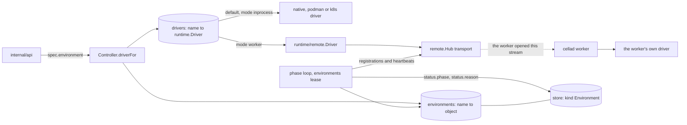
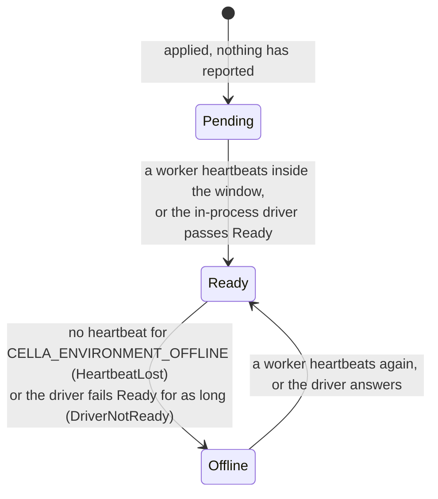

# Environments as desired state

## Overview

[[051-environments-and-workers]] built the seam: the `Environment` kind,
the key routes, the worker transport and the operations queue. It left
the environment itself synthesized. `GET /v1/environments` answers one
object assembled per request from `CELLA_RUNTIME` and the hub, no route
applies a second one, and `Controller` holds one driver, so a sandbox
cannot be placed anywhere but the process that serves it.

This slice makes the environment an object and the driver a lookup. An
administrator applies an `Environment`, the control plane stores it,
keys it, and routes every sandbox whose `spec.environment` names it to
the driver that environment declares. A loop under the `environments`
lease writes each one's phase from what its data plane reports.

## Current state

| Piece | Where it is | What is missing |
|---|---|---|
| The `Environment` kind, its decode, defaults and field table | `manifest/environment.go`, `manifest/v1/environment.go` | nothing this slice needs but a row version for the ETag |
| The read routes | `internal/api/environments.go`, synthesized per request | the stored object, `PUT`, `POST`, `DELETE` |
| `manifest.Lookup.Environment` | `manifest.FixedEnvironment`, one object | a registry answering every environment the control plane holds |
| The driver | `Controller.driver`, one, from `CELLA_RUNTIME` | one per environment, chosen by the sandbox's own |
| The phase | `v1.EnvironmentReady` written at every read | a loop computing it from registrations and heartbeats |
| `case001Indistinguishable` | skips: the suite is given no second environment | a worker environment beside the default in the suite's own stack |

## Design

### Routing



Nothing in the picture points into the worker. The hub answers from the
connection the worker opened, which is invariant 10 of
[[001-architecture]].

### The stored object

An `Environment` is a row of the store under `store.KindEnvironment`.
Its id is its `metadata.name`. An environment's name is global rather
than scoped to an owner, and [[021-data-plane-workers]] fixes it at
create, so the name is already the identity: one string is the row's
key, the driver registry's key, the `sub` of every key minted for it,
the path a worker and a gateway open their stream at, and the value of
a sandbox's `spec.environment`. A second identifier would have to be
mapped back to the name at each of those seams and would name nothing
the name does not.

`v1.EnvironmentStatus` gains `version`, the store row's version, which
[[008-api]]'s `ETag` carries and `If-Match` is compared against.

Routes, under the grammar of [[008-api]]:

```
PUT    /v1/environments/{name}     apply; 201 on create, 200 on update
POST   /v1/environments            create; 201; the body names it
GET    /v1/environments            list
GET    /v1/environments/{name}     read
DELETE /v1/environments/{name}     204
```

Every response carries `ETag: "<version>"`. A `PUT` with `If-Match`
writes at that version and a row that moved is `version_conflict`; a
`PUT` without one is a read-modify-write retried up to three times.
The refusals:

| Condition | Code |
|---|---|
| `metadata.name` differs from the path | `invalid_field` at `metadata.name` |
| a `POST` of a name another environment holds | `name_taken` |
| `spec.mode: inprocess` from a caller, or a delete of the default | `reserved_prefix` |
| a delete while a sandbox is placed on it | `phase_conflict` |
| a stale `If-Match` | `version_conflict` |
| every field rule of [[021-data-plane-workers]]'s table | as `manifest.ValidateEnvironmentSpec` states |

The actions are [[006-identity]]'s. `environment.create`, `.update` and
`.delete` are admin-only under the built-in owner policy, which already
refuses every environment action but `environment.use` on the default;
`environment.use` is decided on the sandbox's own environment at create,
with that environment's isolation class in the resource rather than the
default's.

### The default environment

At start, when no stored environment bears the name
`CELLA_DEFAULT_ENVIRONMENT`, the control plane writes one from the
variables that describe the driver it opened for itself:

| Field | From |
|---|---|
| `spec.mode` | `inprocess`, fixed |
| `spec.isolation` | the driver's `Isolation()` |
| `spec.capacity` | `CELLA_CAPACITY_CPU`, `_MEMORY`, `_DISK`, `_SANDBOXES`; `auto` where none is set |
| `spec.scheduling.mode` | `CELLA_SCHEDULING_MODE` |
| `spec.pool` | `CELLA_POOL_SIZE`, `_IMAGE`, `_CPU`, `_MEMORY`, `_DISK` |
| `spec.gateway` | `CELLA_GATEWAY` |
| `status.owner` | `controller` |

`auto` is [[021-data-plane-workers]]'s word for a ceiling the driver
reads from the cluster or the host it drives rather than one the object
declares. Nothing in this slice enumerates a host's, so an in-process
environment whose operator declared no figures carries `auto` and
`CELLA_CAPACITY_*` is how figures are declared. On `mode: worker` `auto`
stays `invalid_field`.

The variables seed the object once. Afterwards the stored object is
authoritative: a changed variable never overwrites an administrator's
edit. `spec.mode` and `spec.isolation` are immutable on every
environment, which is what fixes the default's two seeded facts, and the
default is not deletable.

### The driver registry

`Controller` holds `environments map[string]v1.Environment` and
`drivers map[string]runtime.Driver` behind their own mutex, and
`driverFor(name)` is the one seam every call site reaches the driver
through. The default's entry is the in-process driver `CELLA_RUNTIME`
opened; a `mode: worker` environment's is built by `Options.NewDriver`,
which `cellad` fills with `runtime/remote` over the hub's transport for
that environment. The controller names no transport and imports nothing
under `internal/`, which `TestRootPackagesDialNothing` holds.

Every call site reads the environment off the object it is acting on:
`spec.environment` at create, `status.environment` afterwards. An
environment the registry does not hold is `ErrNoEnvironment`, answered
`not_found` at `spec.environment`.

Locking: `driverFor` takes the registry's read lock and never `c.mu`, so
a call site under `c.mu` and one outside it reach the same lookup.
Where both are needed the order is `c.mu` then the registry's, which is
the order a delete takes when it counts the sandboxes placed on an
environment before it drops it.

The reaper runs one pass per `Ready` environment, rebuilding that
environment's observed rows; the pool runs per environment under the
lease `pool:<environment>` with the shape `spec.pool` declares.

### The phase loop

Under the `environments` lease of [[010-state]], every 5 seconds:



The loop writes `status.phase`, `status.reason`, `status.workers`,
`status.lastHeartbeat`, `status.driver`, `status.isolation` and
`status.capabilities`, and emits `environment.registered` on the
transition into `Ready` with `{workers}` and `environment.offline` on the
transition into `Offline` with `{reason}`. A phase that did not move
writes no record.

`Ready` places. `Pending` and `Offline` refuse a create with
`driver_unavailable` and leave running sandboxes alone: the refusal is
the controller's own sentinel rather than the driver's `ErrNoWorker`,
which wraps `runtime.ErrNotRunning` and would reach a caller as
`phase_conflict`.

### The resolver

`Controller` answers `manifest.Lookup.Environment`, so a manifest
naming an environment resolves against that environment's declared
isolation class and observed capabilities, and one naming an absent
environment is `not_found` at `spec.environment`. The API composes it
with the caller's secret half, replacing `manifest.DriverOptions`,
which describes one environment and stays for the callers that have
exactly one.

## Not in this slice

The `credit` control message of [[021-data-plane-workers]]'s flow
control. The `Degraded` phase and its two reasons, which need the
gateway half: `api.EgressHub` serves one environment, so a gateway of a
worker's environment has no stream to open. `spec.capacity` as an
admission ceiling and the queued scheduling mode, which are
[[020-scheduling-and-sets]]'s. The `local` driver and the `vm` driver.

## Acceptance criteria

| Criterion | Test that proves it | State |
|---|---|---|
| An `Environment` applied through `PUT` is stored, read back, listed and deleted, and the id is the name | `TestEnvironmentRoutes` | open |
| `If-Match` at the version the read returned writes, a stale one is `version_conflict`, and a `PUT` without one retries | `TestEnvironmentConcurrency` | open |
| A caller applying `mode: inprocess`, and a delete of the default, are `reserved_prefix`; a delete while a sandbox is placed is `phase_conflict` | `TestEnvironmentRefusals` | open |
| Every environment mutation is admin-only and `environment.use` is decided on the sandbox's own environment | `TestEnvironmentAuthorization` | open |
| The default is seeded from the variables at first start, the stored object is authoritative afterwards, and its mode and isolation are immutable | `TestDefaultEnvironment` | open |
| A sandbox on a worker environment reaches the remote driver and one on the default reaches the in-process driver, through every call site | `TestControllerRoutesByEnvironment` | open |
| A create on an environment that is not `Ready` is `driver_unavailable`, and the sandboxes already on it are left alone | `TestCreateOnAnOfflineEnvironment` | open |
| The reaper and the pool run per environment, each against that environment's driver | `TestReaperPerEnvironment`, `TestPoolPerEnvironment` | open |
| Each phase transition fires on its trigger under a fake clock and emits its record once | `TestEnvironmentPhases` | open |
| `manifest.Lookup.Environment` resolves against the stored object, and an absent environment is `not_found` at `spec.environment` | `TestResolveAgainstTheRegistry` | open |
| `cellad serve` and `cellad worker` over loopback: an environment applied and keyed, a sandbox created on it with `spec.environment`, an exec that runs on the worker, the environment Offline when the worker stops and Ready when it returns | `TestWorkerEnvironmentEndToEnd` | open |
| A sandbox on the default and one on a worker's differ only by environment, driver and isolation | `case001Indistinguishable`, run from `TestTheConformanceSuiteHoldsAgainstThisServer` | open |
| No file this slice adds names a Latere host, image, pool or namespace | `TestNoLatereCoordinates` | open |
