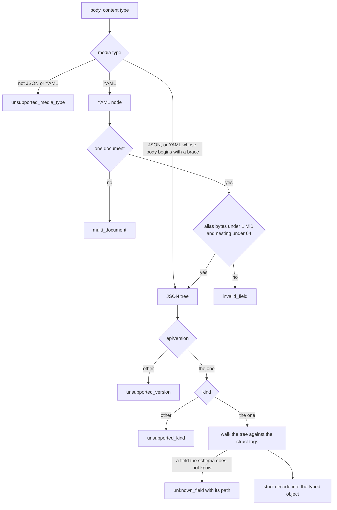
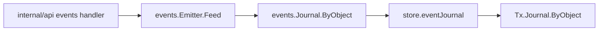

# API contract gaps

## Overview

[[052-conformance-suite]] wrote the `/v1` contract as executable cases
and recorded, in `test/conformance/known.json`, the seven cases this
server fails. The declaration is bidirectional: an undeclared case that
fails fails the run, and a declared case that starts passing fails it
too, so a line there cannot outlive its gap. This slice closes the seven
and deletes their lines.

Each gap is a rule [[008-api]], [[003-manifest-contract]] or
[[009-events]] already states. Nothing here is a new design decision;
where the suite and a spec disagreed, the spec won and the case was
corrected. What the slice adds is the code that makes the rules true of
this server: a decoder that takes YAML, a handler that reads `Accept`,
the apply route every kind's grammar promises, the framed exec stream,
the API document beside the key set, the per-object event feed, and the
dial route's capability gate.

## Current state

| Case | What the server does today |
|---|---|
| `case003ContentTypes` | `manifest.Decode` takes `application/json` only; a YAML body is `unsupported_media_type` |
| `case008NotAcceptable` | no handler reads `Accept`; a request that excludes JSON is answered in JSON |
| `case008NameOnPathAndBody` | `PUT /v1/sandboxes/{name}` is not registered; `POST /v1/sandboxes` is the only create |
| `case008ExecStream` | `POST .../exec` without `?wait=1` is `capability_unsupported` |
| `case008PublicDocuments` | `/.well-known/jwks.json` answers; `/openapi.yaml` is neither carried nor served |
| `case009ObjectFeed` | the journal reaches the operator's sink and `Controlled.Events`; no route reads it |
| `case004CapabilityGates` | `/v1/sandboxes/{id}/dial/{port}` is unregistered, so the mux answers 404 where the gate owes 422 |

Beside the seven, [[031-hosted-sandbox-consolidation]] lists the request
id as a follow-up: `ServeHTTP` stamps `crypto/rand.Text()`, where
[[008-api]] states `req_` plus a ULID and a client's own
`X-Request-Id` accepted as is.

## Design

### Decoding: one function, two syntaxes

[[003-manifest-contract]] fixes one `Decode` shared by every kind. The
implementation becomes one staged decoder, `manifest.decode`, that
`Decode`, `DecodeSecret` and `DecodeEnvironment` each call with their own
kind name and target:



The version and the kind are read off the tree, before any field, which
is the order [[003-manifest-contract]] states and the order a JSON
decoder cannot give: `encoding/json` reports the first unknown field it
meets and never the document's version.

The unknown-field walk is over the target's own `json` tags, so the path
it names is the caller's path and not the Go field name. The alias budget
is the bytes a document's aliases would expand to:

$$\text{expansion}(n) = \begin{cases}
\text{len}(n.\text{Value}) & n \text{ is a scalar} \\
\text{expansion}(n.\text{Alias}) & n \text{ is an alias} \\
\sum_{c \in n.\text{Content}} \text{expansion}(c) & \text{otherwise}
\end{cases}$$

evaluated with a running budget of 1 MiB, so a billion-laughs document
is refused at the budget rather than at the allocation. Depth is the
tree's own, bounded at 64.

`manifest/testdata/v1/` holds the corpus [[003-manifest-contract]] asks
for: each row is a manifest in YAML, the same manifest in JSON, and the
resolved golden output under fixed options. The first row is the example
of [[003-manifest-contract]]'s own Overview.

### Content negotiation

[[008-api]] gives every object response JSON in the Go struct order, or
YAML when `Accept` names one of the three YAML types, and 406
`not_acceptable` for an `Accept` that excludes both. Negotiation happens
once, in `ServeHTTP`, before the mux chooses an endpoint, so a create
whose `Accept` the server cannot satisfy is refused before the object
exists rather than after. The verdict rides the response writer, which is
where `noteCode` already keeps per-request state.

Routes whose answer is a stream, an archive, a file body, an image or an
upgrade negotiate nothing: their content type is the route's, not the
caller's. They are named at registration, so the exemption is a property
of the route table and not a string test inside a handler.

A YAML answer is the JSON answer converted through a YAML node, which
keeps the struct order the document records; a converter that marshals a
Go map would sort the keys and lose it. Errors are always JSON: an
envelope a client cannot parse is worse than an envelope in the wrong
syntax.

`cella get -o yaml` then asks the server with `Accept` and writes the
bytes it receives, which is the row [[011-agent-client]] holds for one
object and one page.

### Apply by name

`PUT /v1/sandboxes/{name}` is the grammar `PUT /v1/secrets/{name}`
already follows. The handler resolves the name among the caller's own
objects:

| The name | The apply |
|---|---|
| free | a create at the path's name; 201 with `Location` |
| held by the caller | an update resolved against `Existing`; 200 |
| named differently in the body | `invalid_field` at `metadata.name`, nothing written |

A body with no `metadata.name` takes the path's. The update path is
[[003-manifest-contract]]'s resolve with `Existing` set, which is what
refuses an immutable field and holds a workload to its boundary; the
accepted result is written as desired state and journaled
`sandbox.updated`.

`If-Match` and the `ETag` [[008-api]] states are not in this slice. The
store's row version is private to `internal/store` and reaches neither
`controller.Controller` nor the snapshot store, and a conditional apply
without a version is a header that lies. [[008-api]]'s `TestApplyConcurrency`
row stays open.

### The framed exec stream

`POST /v1/sandboxes/{id}/exec` without `?wait=1` answers
`Content-Type: application/vnd.cella.exec-stream` and the frames of
[[008-api]]:

```
+--------+------------------+------------------+
| 1 byte | 4 bytes          | length bytes     |
| channel| length, big end. | payload          |
+--------+------------------+------------------+

channel 1 stdout   2 stderr   3 exit   4 error
```

Both output channels are copied by one writer under a mutex, in pieces
of at most 1 MiB, each frame flushed as it is written, so a caller reads
output as it is produced and no frame interleaves with another. The exit
frame carries the code as decimal text and ends the stream; a timeout is
exit 124, as the bounded form reports it. A failure after the first byte
is an error frame carrying the envelope as JSON, because the status code
is already sent and can no longer carry it.

The two forms share one request reader: the body, the exec validation and
the timeout rule are parsed once and the branch on `?wait=1` follows.

### The API document

`api/openapi.yaml` is the document [[008-api]] names, carried in the
repository and served at `GET /openapi.yaml` on the public listener
beside `GET /.well-known/jwks.json`, under no bearer. The generator of
[[008-api]] (`tools/apidoc`) is not in this slice; the document is
written and held to the mux by a test rather than by a generator.

That test is the contract between the two: `internal/api` records every
pattern it registers, and the test walks the record and the document in
both directions. A route with no operation and an operation with no route
each fail it, so the document cannot drift from the server while the
generator is still owed.

### The object feed

`GET /v1/events?object=<id>` serves [[009-events]]'s records for one
object, newest first, paged by `seq`. The journal already answers
`ByObject`; what is missing is a path from the API to it. The seam is the
one the emitter already holds:



The row's columns are authoritative over its payload, so a record is
rebuilt with `events.Rebuild` before it goes on the wire; a record read
straight from the payload would carry `seq: 0`, because `events.Payload`
clears the four columns by design.

The handler reads the object by id, derives its kind and authorizes that
kind's read, which is what [[009-events]] states. `follow=1` is refused
rather than ignored: a caller that asked to follow and was handed one
page would read the absence of later records as their absence.

### The dial gate

`GET /v1/sandboxes/{id}/dial/{port}` is registered, authorizes
`sandbox.exec`, and answers 422 `capability_unsupported` where the
environment declares no `Dial`. Where it declares `Dial` and the driver
implements no `runtime.Dialer`, the same code answers with a developer
detail naming the driver: [[004-runtime-contract]] says `Dialer` is
declared and implemented by none, so that is every driver today. The byte
pump behind the gate is not in this slice, and no driver gains `Dial`.

### The request id

`req_` and a ULID, from the generator [[009-events]] already uses for an
event id, split so one implementation serves both prefixes. A client's
`X-Request-Id` of 1 to 128 printable ASCII characters is taken as is and
anything else is replaced, which is [[008-api]]'s rule. Everything that
reads the id, the envelope's `request_id`, the event actor, the resolve
options and the log line, reads the response header and follows with no
change of its own.

## Not in this spec

`tools/apidoc` and the generated-document gate ([[008-api]]); `If-Match`
and `ETag`; the dial byte pump and any driver's `Dial`
([[004-runtime-contract]]); `follow=1` on the object feed; the rate limit
and its headers.

## Acceptance criteria

| Criterion | Test that proves it | State |
|---|---|---|
| A manifest is accepted as `application/yaml`, `application/x-yaml` and `text/yaml`; YAML and its JSON form decode to equal objects; a second YAML document is `multi_document`; an unknown field at depth is `unknown_field` naming its path; the version is read before the kind and both before any field | `TestDecodeTakesYAMLAndJSON`, `TestDecodeYAMLAndJSONAgree`, `TestUnknownFieldNamesThePath`, `TestDecodeRefusals` | built |
| An alias chain past 1 MiB and nesting past 64 levels are each `invalid_field`, in under 100 ms | `TestYAMLLimits` | built |
| Every manifest in `manifest/testdata/v1/` decodes from both syntaxes and resolves to its golden output | `TestGoldenCorpus` | built |
| `Accept: application/json`, `*/*` and an absent header answer JSON; a YAML type answers YAML in the document's field order; anything else is 406 `not_acceptable` with the table's sentence, before the request acts | `TestAcceptNegotiation`, `TestNotAcceptableIsRefusedBeforeTheAct` | built |
| A stream, an archive, a file body and an image negotiate nothing, so a caller that asked for YAML still receives the route's own type | `TestStreamRoutesNegotiateNothing` | built |
| `PUT /v1/sandboxes/{name}` creates at the path's name, updates the caller's object of that name, and refuses a body naming another with `invalid_field` and `details.paths` naming `metadata.name` | `TestApplyByName` | built |
| `POST .../exec` without `?wait=1` answers the framed stream: the channel byte, the big-endian length, both output channels and an exit frame carrying the code as decimal text; a timeout ends it at 124 | `TestExecStreamFrames`, `TestExecStreamTimeout` | built |
| A failure after the first byte is an error frame on channel 4 carrying the envelope, and the status is not rewritten | `TestExecStreamErrorFrame` | built |
| `GET /openapi.yaml` answers the carried document under no bearer, and the document and the mux name the same routes in both directions | `TestOpenAPIIsServed`, `TestTheDocumentAndTheMuxAgree` | built |
| `GET /v1/events?object=` answers the object's records newest first with `seq` on each, pages by cursor, authorizes the object's kind read, and refuses `follow=1` | `TestObjectFeed`, `TestObjectFeedAuthorizes`, `TestObjectFeedRefusesFollow` | built |
| `GET /v1/sandboxes/{id}/dial/{port}` answers 422 `capability_unsupported` where the environment declares no `Dial`, and where it declares one that no driver implements | `TestDialGate` | built |
| A request carries `req_` and a ULID; a client's `X-Request-Id` within the rule is echoed everywhere and one outside it is replaced | `TestRequestID` | built |
| `cella get -o yaml` asks the server with `Accept` and writes the bytes it received | `TestOneObjectUnderYAMLIsTheAPIsOwnBytes` | built |
| The seven declared cases pass against this server and `known.json` declares none | `TestTheConformanceSuiteHoldsAgainstThisServer` | built |
