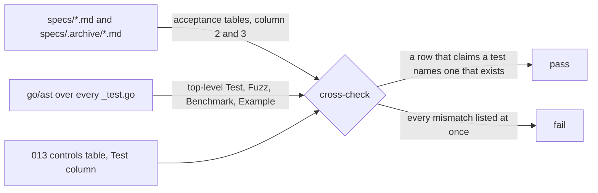

# Contract evidence

## Overview

Three design specs state a promise whose evidence is missing. [[003-manifest-contract]]
promises a golden corpus under `manifest/testdata/v1/` and a quantity
parser that agrees with the Kubernetes one, and has neither.
[[013-security-and-threat-model]] promises that every control names a
test that exists and that `SECURITY.md` carries the model's
commitments, and the root file points at the spec instead of carrying
them. [[016-building-a-plane]] promises a guide and an example a
platform composes the exported packages from, and neither exists.

This slice builds the evidence. It adds no field to any kind, no route,
and no behaviour: every change is a test, a fixture, a document, or a
spec cell corrected to name the test that really exists.

## Current state

| Promise | Spec | Evidence today |
|---|---|---|
| a corpus of manifests with golden resolved output | 003 | `manifest/testdata/` does not exist |
| the quantity parser agrees with Kubernetes | 003 | `TestParseQuantity` holds a hand-written table; no differential test |
| every control names a test that exists | 013 | no test reads the table; a sweep of the acceptance tables on 2026-09-20 found about a hundred rows naming a test that landed under another name |
| `SECURITY.md` carries the model's commitments | 013 | the file carries the four commitments as one paragraph and links the spec for the rest |
| a canary token is followed the way a canary value is | 013 | `TestSecretValuesNeverEnterASandbox` follows a secret value only |
| a platform builds a plane from the packages | 016 | no guide, no example |

## Design

### The corpus

`manifest/testdata/v1/` holds one directory per outcome:

```
manifest/testdata/v1/
  valid/<name>.json          a manifest Resolve accepts
  valid/<name>.golden.json   the Resolved value, canonically encoded
  invalid/<name>.json        a manifest Resolve refuses
  invalid/<name>.golden.json the code and the paths the refusal carries
```

`TestGoldenCorpus` walks both directories, decodes each input with
`Decode`, resolves it under one fixed set of options, and compares the
encoded result to the golden file. The options are a constant: a fixed
clock, a fixed name generator, fixed `Defaults` and `Ceilings`, an
actor that is not a workload, and a `Lookup` answering one environment
that declares every capability and a fixed set of secrets. A resolve
that depends on a parent, an update, or an admission step is a unit
test and not a corpus entry, because the corpus is the schema's
snapshot and those inputs are the caller's state.

Inputs are JSON. `Decode` accepts the JSON content type on this
branch; the YAML half is [[003-manifest-contract]]'s remaining decode
work, and the corpus reads the same documents through it once that
lands, with no change to the goldens: the acceptance row those two
forms belong to is the decode row, not this one.

A golden file is regenerated with `go test ./manifest -run
TestGoldenCorpus -update`. The flag is off by default, so a change in
resolved output fails the run rather than rewriting the record of what
the schema was. An invalid entry's golden holds the error code and the
paths and not the developer detail, which is wording and not contract.

### The quantity differential

`FuzzQuantity` runs `ParseQuantity` and `resource.ParseQuantity` from
`k8s.io/apimachinery/pkg/api/resource` over the same input and holds
the agreement the contract states: every input this parser accepts,
the Kubernetes parser accepts with the same value in milli-units. The
converse is not an equality. This parser is a deliberate subset: it
refuses a precision finer than a milli-unit and a value whose
milli-unit form overflows an int64, both of which the Kubernetes
parser accepts and neither of which a cgroup or a volume size can
carry. The test names each narrowing and asserts nothing else about a
refusal.

The Kubernetes dependency is test-only. It reaches no build list of a
role package: `go list -deps` without `-test` is what
`TestRootPackagesDialNothing` and the `depcheck` gate read, and
neither sees it.

### The control cross-check



`TestAcceptanceCriteriaNameRealTests` parses every `_test.go` in the
module with `go/ast` and collects the top-level test declarations,
which is the set `go test -list` prints, and reads the acceptance
table of every spec under `specs/` and `specs/.archive/`. A row whose
State cell begins `not built`, `open`, or `not implemented` names a
test the tree does not have yet and is skipped. Every other row must
name tests that exist, in the Test cell and in the State cell both: a
row that claims evidence names the evidence. Names that are not Go
test functions, a conformance case such as `case008ExecStream` or a
store suite case such as `OptimisticConcurrency`, are outside the rule
by their shape, and the prose around them says which function runs
them.

`TestThreatModelControlsHaveTests` reads the Controls table of
[[013-security-and-threat-model]], which has no State column, so the
rule is the same one written the other way round: the test carries the
list of control rows whose test is not built yet, and asserts the list
is exact in both directions. A name on the list that exists is a stale
waiver and fails; a name missing from the tree and from the list fails.
The list shrinks as the controls land and cannot silently grow.

The fix for a mismatch is the spec cell, never the test name: a spec
names what the tree calls the test, because the tree is what runs.

### The token canary

`TestWorkloadTokenNeverLeavesItsSandbox` follows a workload token
through the same tier `TestSecretValuesNeverEnterASandbox` follows a
secret value through, reusing its harness: one `cellad serve`, one
`cellad egress`, one sink, one upstream, one native sandbox. The token
differs from a secret value in where it is allowed to be. Its one home
is the sandbox's own projection, the file at `runtime.TokenPath`, and
its absence is asserted everywhere else: the sandbox's environment,
which carries the path and not the bytes; every delivered event; every
connection record; every API answer, including the sandbox's own
`status`; both processes' logs; and every file under the control
plane's data directory, which keeps the token's id and never the token.

### The security policy

`SECURITY.md` carries what a reader of a public repository needs and
nothing that is written for a contributor: where to report, what the
answer times are, what is protected and by what, the commitments, and
what is out of scope. The asset table names, per asset, the control
and the test that proves it, so the claim is checkable from the file
itself.

`TestSecurityPolicyMatchesTheModel` holds the file to the model: every
test the policy names exists in the tree and appears in the Controls
table of [[013-security-and-threat-model]], and every commitment in
the policy maps to a control row, with the count of commitments fixed
so one added or removed fails the run.

### The plane guide

`docs/plane.md` is [[016-building-a-plane]] in the user register: the
two doors, what each gives, an authorizer and an admission endpoint
short enough to read, the event sink, the migration recipe, and the
conformance command. `examples/plane/` is the second door as a
compiling program: `main` composes `manifest`, `runtime`, `controller`
and `egress` into a server, and imports nothing under `internal/`,
because an example that reaches inside is not an example of what a
platform can build.

`TestExamplePlaneBuilds` compiles the example into a temporary
directory, so the check is a compile and not a binary left in the
tree, and asserts the import rule over its source. Running the
conformance suite against the example is [[016-building-a-plane]]'s
remaining work: the suite needs an issuer, an authorizer and a driver
tier beside the server, which is the tier of
[[012-test-stubs-and-tiers]] and not a unit test.

## Not in this spec

The decode half of [[003-manifest-contract]]: the YAML content types,
the unknown-field paths, the second-document and alias and nesting
refusals. `TestYAMLLimits` is a decode test and belongs there. The
unbuilt controls of [[013-security-and-threat-model]], which their own
specs own. The conformance run of [[016-building-a-plane]]'s example.

## Acceptance criteria

| Criterion | Test that proves it | State |
|---|---|---|
| Every manifest in `manifest/testdata/v1/valid/` resolves to its golden output and every one in `invalid/` is refused with the code and paths its golden names | `TestGoldenCorpus` | built |
| The corpus covers every field of the `Sandbox` spec that resolves without a parent or an update, and every refusal code the corpus names is one of the error table's | `TestCorpusCoversTheSchema` | built |
| The quantity parser agrees with the Kubernetes parser on every input it accepts, and each narrowing it makes is named | `FuzzQuantity` | built |
| Every acceptance row of every spec whose State is not `not built` names test functions that exist in the module | `TestAcceptanceCriteriaNameRealTests` | built |
| Every control row of [[013-security-and-threat-model]] names a test that exists or stands on an exact, non-stale pending list | `TestThreatModelControlsHaveTests` | built |
| A workload token appears in no event, record, log, API answer or control plane file, and is read only from its own projection | `TestWorkloadTokenNeverLeavesItsSandbox` | built |
| Every test `SECURITY.md` names exists and is a control of the model, and every commitment maps to a control row | `TestSecurityPolicyMatchesTheModel` | built |
| The example plane compiles and imports nothing under `internal/` | `TestExamplePlaneBuilds` | built |
| Every row of [[016-building-a-plane]]'s concerns table names a mechanism that exists in the tree | `TestConcernsTableIsGrounded` | built |
