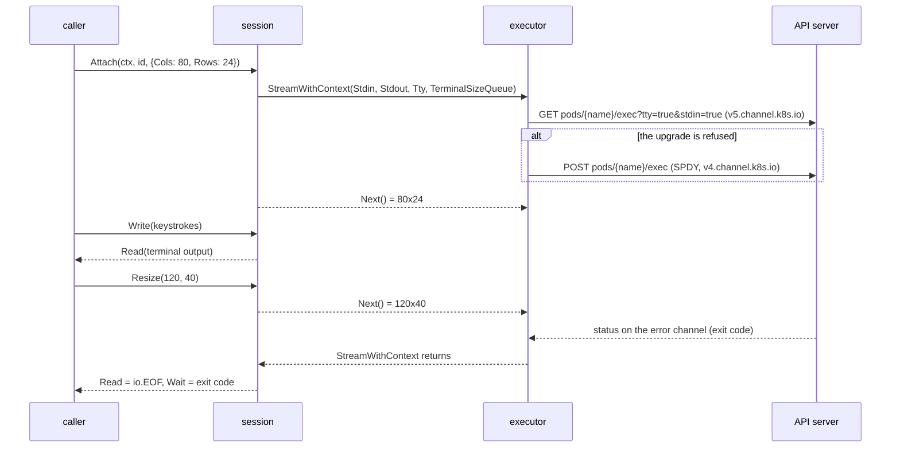

# Kubernetes attach

## Overview

The Kubernetes driver is the driver a hosted deployment runs, and it
declares no `Attach`. `GET /v1/sandboxes/{id}/attach` and the exec socket
of [[008-api]] are therefore refused with `capability_unsupported` on every
sandbox it holds, and an `Exec` with `Stdin` or `TTY` is refused with
`ErrUnsupported`. The native and podman drivers implement the terminal
([[034-terminal-attach]]); this slice brings `runtime/k8s` to the same
contract of [[004-runtime-contract]], over the `pods/exec` subresource the
driver already opens for its commands, archives and file operations
([[036-k8s-driver]]).

## Current state

| Piece | Where it is | What is missing |
|---|---|---|
| The exec stream | `runtime/k8s/exec.go`: the fallback executor, WebSocket first and SPDY on an upgrade failure | no `TTY`, no terminal size queue; `Exec` refuses `Stdin` and `TTY` with "stdin and a tty need Attach" |
| The declaration | `Capabilities()` in `runtime/k8s/k8s.go` | `Files`, `Pool`, `Mesh`, and `Display` and `Input` with a display image; no `Attach` |
| The verb table and the Role | `verbs` in `runtime/k8s/k8s.go`, `deploy/base/rbac.yaml`, `driverVerbs` in `deploy_test.go` | `create` on `pods/exec` only, while the WebSocket executor upgrades with `GET` |
| The kind stack's conformance run | `-capabilities files,pool,mesh` in `verify.yml`'s install job and `release.yml`'s conformance job | `attach` is not declared, so `case008ExecSocket` and `case008AttachSocket` skip and the capability case holds the server to refusing both sockets |

## Design

### The terminal on the exec subresource

`Attach(ctx, id, req)` reads the sandbox the way `Exec` does (the claim,
a Pod that exists, is not terminating and has not terminated) and opens
one exec in the workload's container with `stdin`, `stdout` and `tty`
set and `stderr` unset: a terminal has one output stream, and the
kubelet drops `stderr` under a TTY in any case. The command is wrapped
with the sandbox's environment, the request's environment over it, and
the working directory, as `Exec` wraps it, because the subresource
carries neither. An empty command runs `sh`, which the wrapper's
`exec "$@"` resolves on the image's `PATH`.

A window with a negative side or a side above 65535 is `ErrInvalid`, a
command whose first word is blank is `ErrInvalid`, a sandbox with no
running Pod is `ErrNotRunning`, an unknown one `ErrNotFound`, and a
driver built without a cluster connection refuses with `ErrUnsupported`.

### The session

| Method | Behavior |
|---|---|
| `Read` | what the terminal wrote; `io.EOF` once the exec has ended and every byte was read |
| `Write` | into a pipe the executor copies to the exec's stdin; an error once the session has ended or been closed |
| `Resize(cols, rows)` | the newest window replaces one the executor has not read yet; a side outside 1 to 65535 is `ErrInvalid`; after the session ended it is `ErrNotRunning`, which the API's frame loop and the remote driver read as moot |
| `Wait(ctx)` | the exit code from the status the API server sends on the error channel; a session the caller closed or whose context ended answers with the context's error; a transport failure answers with it |
| `Close` | cancels the exec's context, which closes the connection, and closes both pipes, so a pending `Read` and every later `Read` and `Write` fail; a second `Close` is nil |

The session's context derives from the one `Attach` was given, as the
native driver's does. The terminal size queue ends when the session
ends, so the executor's resize loop does not outlive it, and the stdin
pipe is closed then too, so the executor's stdin copy returns instead of
waiting for a keystroke that will never be delivered.

Closing the connection ends the exec's stdin and its terminal. What the
process inside does then is the container runtime's: a shell reading a
closed terminal exits, a process that ignores it runs until the sandbox
stops. The contract asks that the stream be over for its caller
([[034-terminal-attach]]), and that holds here whatever the runtime does.
`Stop` deletes the Pod, which ends every exec in it.

### Exec with stdin or a TTY

The refusal goes. `Stdin` is handed to the executor, which copies it to
the exec's stdin and closes that stream at the reader's end (the
close signal of `v5.channel.k8s.io`, or the SPDY stream's close), so a
command reading to the end of its input sees it. Without `TTY` the two
output streams stay apart. With `TTY` the exec runs under a terminal,
everything reaches `Stdout`, and `Stderr` is at its end from the first
read.

### The verbs the terminal needs

The executor tries a WebSocket first and falls back to SPDY when the
upgrade fails. The API server resolves the verb of a request from its
HTTP method: `GET`, which the WebSocket upgrade uses, is `get`, and
`POST`, which SPDY uses, is `create`. From Kubernetes 1.35 the pod
registry also requires `create` on the WebSocket upgrade, behind the
`AuthorizePodWebsocketUpgradeCreatePermission` gate, which is on by
default. A Role therefore grants both `get` and `create` on `pods/exec`,
the verb table `Preflight` reviews names both, and `deploy/base/rbac.yaml`
and the table `deploy_test.go` holds it to follow.

A Role that grants `create` alone still works against a cluster before
1.35, because the refused upgrade falls back to SPDY, but every exec pays
a refused round trip first, and `Preflight` names the missing `get` so an
operator sees it at start rather than in latency.

### Declaring it

`Capabilities()` adds `Attach: true`. The kind stack's conformance run
declares `attach` in both workflows, so `case008ExecSocket` and
`case008AttachSocket` run against `cellad` in a cluster, through the Role
the deploy tree ships, and `case004CapabilityGates` holds both sockets to
answering rather than refusing. The driver-level suite's `ExecStdin`,
`ExecTTY`, `AttachRoundTrip`, `AttachResize` and
`AttachCloseEndsTheStream` run in `TestClusterConformance` wherever a
cluster is configured for it.

## Not in this spec

`Dial` on this driver, through port forwarding. Wiring
`TestClusterConformance` into a workflow, which runs every driver case
against the kind cluster and not the terminal alone. A replay buffer or
a fan-out of one session to several viewers, which [[034-terminal-attach]]
leaves to [[023-computer-use-operations]].

## Acceptance criteria

| Criterion | Test that proves it | State |
|---|---|---|
| `Attach` opens an exec with `stdin` and `tty` and no `stderr`, wraps the command with the sandbox's and the request's environment and the directory, runs `sh` when the request names no command, carries bytes both ways, and ends its stream with the exit code readable from `Wait` | `TestAttachRoundTripOverTheExecStream` | open |
| The window the request names is the first the executor reads, a resize replaces one not yet read, a resize after the end is `ErrNotRunning`, and the size queue ends with the session | `TestAttachResizeReachesTheQueue` | open |
| `Close` ends the stream for its caller: `Read` and `Write` fail, `Wait` answers with the cancellation, and the exec's context is cancelled | `TestAttachCloseEndsTheSession` | open |
| A bad window, a blank command, a stopped sandbox, an unknown one, a cancelled context and a driver with no cluster connection are each refused before an exec is opened | `TestAttachRefusals` | open |
| `Exec` with `Stdin` delivers it and keeps the two streams apart; with `TTY` it runs under a terminal with `Stderr` at its end | `TestExecStdinKeepsTheStreamsApart`, `TestExecTTYHasOneStream`, `TestExecRefusals` | open |
| Over a served exec endpoint speaking `v5.channel.k8s.io`, the real executor sends `tty` and `stdin`, delivers stdin, carries a resize on the resize channel, and reads the exit code from the error channel | `TestTheExecSubresourceCarriesATerminal` | open |
| An endpoint that refuses the WebSocket upgrade is reached over SPDY with the terminal intact, and each HTTP method the two transports use maps to a verb the table reviews | `TestTheExecStreamFallsBackToSPDY` | open |
| `Preflight` reviews `get` and `create` on `pods/exec`, and the Role grants exactly the table | `TestPreflightNamesWhatIsMissing`, `TestRoleMatchesTheDriversVerbs` | open |
| The driver declares `Attach` and implements `Attacher` | `TestDeclarations` | open |
| The driver passes the attach and stdin cases of the conformance suite against a real cluster | `TestClusterConformance` | open |
| The kind stack's conformance run declares `attach`, so the exec and attach sockets run against `cellad` in a cluster | `TestContract` in `verify.yml`'s install job and `release.yml`'s conformance job | open |
| No file this slice adds names a Latere host, image, pool or namespace | `TestNoLatereCoordinates` | open |
