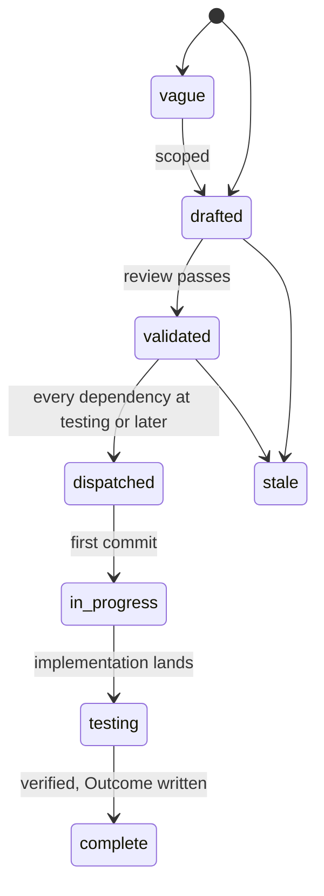
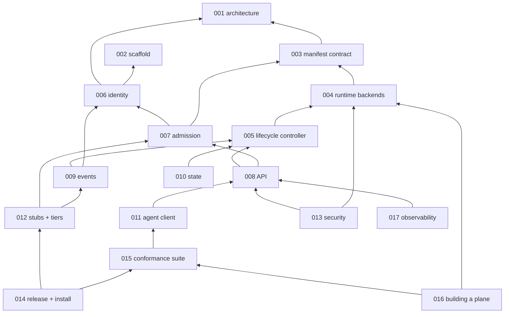

# Specs

Design specs for Cella, the open core of a sandbox platform: a
declarative contract for an agent or workload environment, the server
that makes it exist on a runtime backend, and the packages a platform
builds on. One spec covers one component. Each states the problem, the
design with enough precision to build from, and acceptance criteria
that are testable sentences. Spec 001 fixes the architecture every
other spec assumes; read it first. Spec 003 is the contract a caller
codes against, and spec 015 is the suite that proves a server serves
it. Spec 002 is the configuration reference: every `CELLA_*` variable
is in its table, owned by it or listed with its owner.

## Layout

Flat files `specs/NNN-name.md` in one number space with `track: core`
in the frontmatter. Numbers are stable identifiers and are never
reused. Open specs sit here and are the work queue. A terminal spec
moves to `specs/.archive/` keeping its number so `depends_on` paths
keep resolving.

## Lifecycle

`in_progress` is written `in-progress` in the frontmatter. A spec at
`testing` moves to `complete` when every acceptance criterion has a
passing test in the tree and the Outcome records every divergence. The
dispatch gate is on the dependencies' state: a validated spec is
dispatched when every spec in its `depends_on` is at `testing` or
later.

## Index

| # | Spec | Effort | Status | Builds on |
|---|---|---|---|---|
| [001](001-architecture.md) | Architecture: components, packages, planes, extension points, invariants | medium | drafted | - |
| [002](002-repository-scaffold.md) | Repository scaffold: module, binary, configuration, gate, images, workflows | small | testing | - |
| [003](003-manifest-contract.md) | Manifest contract: the cella/v1 Sandbox schema, decoding, validation, defaulting, resolve | medium | drafted | 001 |
| [004](004-runtime-backend-contract.md) | Runtime backend contract: the Runtime interface, capabilities, k8s, podman, native, conformance | large | drafted | 001, 003 |
| [005](005-lifecycle-controller.md) | Lifecycle controller: reconciliation, phases, the reaper, the warm pool | medium | drafted | 003, 004 |
| [006](006-identity.md) | Identity: OIDC issuers, workload tokens, the authorizer webhook, the owner policy | medium | drafted | 001, 002 |
| [007](007-admission.md) | Admission: defaults, ceilings, named policies, the admission webhook | small | drafted | 003, 006 |
| [008](008-api.md) | API: the /v1 resources, streams, error envelope, OpenAPI document | large | drafted | 003, 005, 006, 007 |
| [009](009-events.md) | Events: one signed record per mutation and exec, to the operator's sink | small | drafted | 005, 006 |
| [010](010-state.md) | State: backend truth, the index, revocations, the journal, optional Postgres | medium | drafted | 004, 005 |
| [011](011-agent-client.md) | Agent client: the cella command and the skill | medium | drafted | 003, 008 |
| [012](012-test-stubs-and-tiers.md) | Test stubs and tiers: the stubs, make run, the backend tiers, CI jobs | medium | drafted | 002, 006, 007, 009 |
| [013](013-security-and-threat-model.md) | Security and threat model: what Cella protects, against whom, and how | medium | drafted | 001, 004, 006, 008 |
| [014](014-release-and-installation.md) | Release and installation: images, binaries, attestations, deploy manifests, cellad check, upgrades | medium | drafted | 002, 012, 015 |
| [015](015-conformance-suite.md) | Conformance suite: the contract and the API as executable tests, against any server | large | drafted | 003, 008, 011 |
| [016](016-building-a-plane.md) | Building a plane: how a platform composes the packages and the webhooks without a fork | small | drafted | 001, 004, 006, 007, 015 |
| [017](017-observability.md) | Observability: metrics, traces, logs, alerts | small | drafted | 002, 005, 008 |

## Dependency graph

Arrows point from a spec to the specs it builds on. The picture is the
transitive reduction of the `depends_on` edges: an arrow is drawn only
where no other path already carries it. The Builds on column above
carries each spec's literal `depends_on`.

## Build order

| Phase | Specs | Delivers |
|---|---|---|
| 0 | 001, 002 | the design and a repository that passes its gate |
| 1 | 003, 004 | the contract as code and the three backends, each passing the conformance suite of 004 |
| 2 | 005, 006, 007 | a sandbox's lifecycle, identity in and out, admission |
| 3 | 008, 009, 010 | the API, the events, the store: `cellad` creates a sandbox from a manifest |
| 4 | 011, 012, 017 | the command, the stubs, `make run`, the tiers, the metrics |
| 5 | 013, 015 | the threat model's controls tested, the contract as a suite |
| 6 | 014, 016 | a release, an install document that CI executes, the plane guide; the point at which a platform builds on it |

## Decisions across specs

| Decision | Where | Why |
|---|---|---|
| `cella/v1` with no domain | 001, 003 | the project is the authority of its own schema; a domain would name a company inside a public contract |
| the whole core is public and one installation is Latere's | 001 | Origo showed the shape; policy leaves through webhooks, not through a private directory |
| exported packages and a binary | 001 | a platform migrates by import first and by process split later, without a rewrite between |
| backend labels are truth, the store is an index | 001, 004, 010 | a store that forgets a sandbox a cluster still runs is the failure mode to design out |
| fail closed on every webhook | 006, 007, 009 | an unavailable decision that allowed would make an outage a privilege escalation |
| the owner policy exists | 006 | a laptop and a small team need no authorizer, and "no authorizer" must still be a policy with tests |
| Postgres optional | 010 | one binary from a laptop to a replicated service; the difference is one variable |
| Apache-2.0 | LICENSE | a contract others implement wants the patent grant; the sibling open cores carry the same licence |
| no alias for an older group name in the core | 016 | an alias is a platform's edge concern; the core accepting two names would be two schemas |

## Open source readiness

The repository is public from its first commit. The conditions the
tree keeps to, checked by tests where a test can: the gate passes on
every push; every spec has acceptance criteria that name tests; no
Latere hostname or value anywhere but as a default or an example; a
fork's tag publishes under the fork's namespace; the install document
is executed by CI; the threat model is written down and each control
names its test.

## Conventions

Frontmatter fields: `title`, `status`, `track`, `depends_on`,
`affects`, `effort`, `created`, `updated`, `author`. Sections:
Overview, Current state, Design, Not in this spec, Acceptance criteria,
and Outcome once complete. Acceptance criteria are a table of
criterion, the test that proves it, and its state. Names in a spec are
the names the code uses. Cross-references are `[[NNN-name]]`
wikilinks. No em dashes; the technical register throughout.
