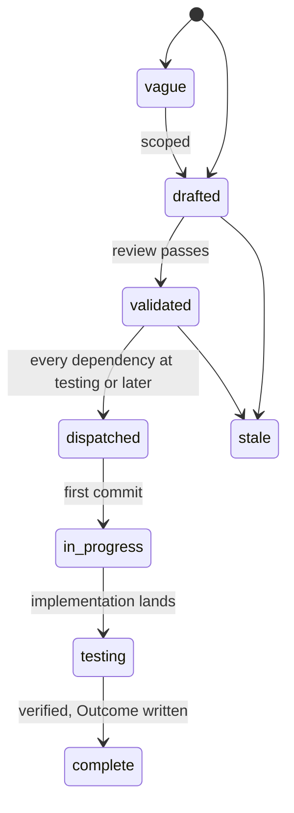
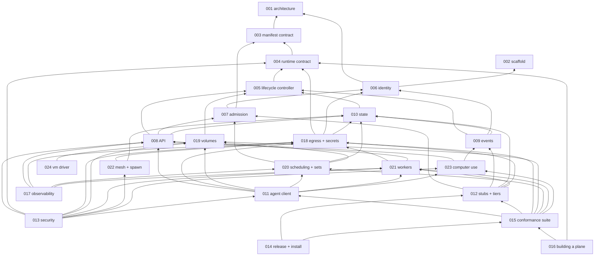

# Specs

Design specs for Cella, an open source control plane for sandboxes: a
declarative contract for an agent or workload environment, the API
that creates, drives, and observes it, the scheduling that decides
when and where it runs, and the boundary it lives inside. One spec
covers one component. Each states the problem, the design with enough
precision to build from, and acceptance criteria that are testable
statements. Spec 001 fixes the architecture every other spec assumes;
read it first. Spec 003 is the contract a caller codes against, and
spec 015 is the suite that proves a server serves it. Spec 002 is the
configuration reference: every `CELLA_*` variable is in its table,
owned by it or listed with its owner.

## Layout

Flat files `specs/NNN-name.md` in one number space with `track: core`
in the frontmatter. Numbers are stable identifiers and are never
reused. Open specs sit here and are the work queue. A terminal spec
moves to `specs/.archive/` keeping its number so `depends_on` paths
keep resolving.

## Lifecycle

`in_progress` is written `in-progress` in the frontmatter. A spec at
`testing` moves to `complete` when every acceptance criterion has a
passing test in the tree and the Outcome records every divergence. The
dispatch gate is on the dependencies' state: a validated spec is
dispatched when every spec in its `depends_on` is at `testing` or
later.

## Index

| # | Spec | Effort | Status | Builds on |
|---|---|---|---|---|
| [001](001-architecture.md) | Architecture: control plane and data plane, packages, extension points, invariants | medium | in-progress | - |
| [002](.archive/002-repository-scaffold.md) | Repository scaffold: module, binary, configuration, gate, images, workflows | small | complete | - |
| [003](003-manifest-contract.md) | Manifest contract: the Sandbox kind, decoding, validation, defaulting, resolve, the boundary check | large | in-progress | 001 |
| [004](004-runtime-contract.md) | Runtime contract: the Driver interface, optional interfaces, isolation classes, capabilities, the six drivers, conformance | large | in-progress | 001, 003 |
| [005](005-lifecycle-controller.md) | Lifecycle controller: desired to observed, the phase machine, create and update, the reaper, recovery, cascade | large | in-progress | 003, 004 |
| [006](006-identity.md) | Identity: OIDC issuers, workload and environment tokens, the authorizer webhook, the owner policy | medium | in-progress | 001, 002 |
| [007](007-admission.md) | Admission: AdmitFunc, defaults and ceilings, the admission webhook, the count ceiling | small | in-progress | 003, 006 |
| [008](008-api.md) | API: the /v1 kinds, addressing and concurrency, streams, the error table, OpenAPI | large | in-progress | 003, 005, 006, 007, 010 |
| [009](009-events.md) | Events: one signed record per mutation and operation, typed, ordered per object, to the operator's sink | small | in-progress | 005, 006, 010 |
| [010](010-state.md) | State: desired and observed, the store contract, transactions, secret values, the journal, queues and operations, optional Postgres | large | in-progress | 003, 004, 005 |
| [011](011-agent-client.md) | Agent client: the cella command, its client package, exit codes, output, the skill | medium | in-progress | 002, 003, 006, 008, 018, 019, 020, 021, 023 |
| [012](012-test-stubs-and-tiers.md) | Test stubs and tiers: the stubs, the bootstrap of make run, the driver tiers, the kind overlay, CI jobs | medium | in-progress | 002, 004, 006, 007, 009, 010, 018, 021 |
| [013](013-security-and-threat-model.md) | Security and threat model: assets, adversaries, every control with its test, what is out of scope | medium | in-progress | 001, 003, 004, 006, 007, 008, 009, 010, 011, 018, 019, 021, 022, 023 |
| [014](014-release-and-installation.md) | Release and installation: images, binaries, attestations, deploy manifests, cellad check, upgrades | medium | in-progress | 002, 012, 015 |
| [015](015-conformance-suite.md) | Conformance suite: the API contract as executable cases against any server, with a report | large | in-progress | 003, 004, 005, 006, 008, 009, 011, 012, 018, 019, 020, 021, 023 |
| [016](016-building-a-plane.md) | Building a plane: how a platform composes the packages and the webhooks without a fork | small | validated | 001, 004, 006, 007, 015 |
| [017](017-observability.md) | Observability: one metric table across three roles, traces across the seam, redacted logs, alert rules | small | in-progress | 002, 005, 006, 008, 009, 010, 018, 020, 021 |
| [018](018-egress-and-secrets.md) | Egress and secrets: the Secret kind, placeholders, the gateway as a data plane component, sync and telemetry, the boundary a workload cannot widen | large | in-progress | 003, 004, 006, 010 |
| [019](019-volumes.md) | Volumes: the Volume kind, access and attachment, sources and fill, snapshots, the managed workspace | medium | validated | 003, 004, 005 |
| [020](020-scheduling-and-sets.md) | Scheduling and sets: environment modes, capacity, the queue, preemption, pools, the SandboxSet kind for rollouts | large | in-progress | 003, 004, 005, 007, 010, 019 |
| [021](021-data-plane-workers.md) | Data plane workers: the Environment kind, the default environment, registration, the worker stream and its operations | large | in-progress | 004, 006, 008, 018 |
| [022](022-mesh-and-spawn.md) | Mesh and spawn: peers that reach each other, sandboxes that create sandboxes, a boundary that never moves | medium | in-progress | 003, 005, 006, 010, 018 |
| [023](023-computer-use-operations.md) | Computer use operations: the desktop, screenshot, screen, input, ports and the proxy, browser-ready sandboxes | medium | in-progress | 003, 004, 005, 008, 009 |
| [024](024-vm-driver.md) | VM driver: a hardware-isolated sandbox per environment; the design held open | large | vague | 004, 019 |
| [031](031-hosted-sandbox-consolidation.md) | Hosted sandbox consolidation: every package of latere-ai/sandbox lands in cella, in the platform, or is dropped | large | in-progress | 001 |
| [050](.archive/050-cella-command.md) | Cella command: the agent client over /v1, its client package, exit codes and the skill | medium | complete | 008, 011, 031, 048 |
| [051](.archive/051-environments-and-workers.md) | Environments and workers: the Environment kind, its keys, the worker stream, the remote driver and the worker role | large | complete | 004, 006, 010, 021, 031, 039, 045 |
| [052](.archive/052-conformance-suite.md) | Conformance suite: the /v1 contract as executable cases, the report, the declared gaps, the pipeline job | large | complete | 008, 015, 031, 049, 050 |
| [054](.archive/054-environments-desired-state.md) | Environments as desired state: the stored Environment object, the per-environment driver registry, and the phase loop | large | complete | 004, 005, 008, 021, 031, 051 |
| [055](.archive/055-api-contract-gaps.md) | API contract gaps: YAML bodies, content negotiation, apply by name, the framed exec stream, the API document, the object feed, the dial gate | large | complete | 003, 008, 009, 031, 052 |
| [056](.archive/056-contract-evidence.md) | Contract evidence: the manifest corpus, the control cross-check, the security policy, the plane guide | medium | complete | 003, 013, 016, 031 |
| [057](.archive/057-scheduling-queue.md) | Scheduling queue: the queued mode, capacity by resource, the queue and its loop, the scheduling fields | large | complete | 003, 005, 010, 017, 020, 021, 031, 038, 054 |
| [058](.archive/058-preemption.md) | Preemption: a higher head stops preemptible sandboxes, a victim waits again in its place, and the bound on how often | medium | complete | 003, 005, 009, 017, 020, 031, 038, 057 |
| [059](.archive/059-conformance-closure.md) | Conformance closure: the drift seam, the external run on dispatch, the agent scenario against this server | medium | complete | 003, 011, 012, 015, 031, 052 |
| [060](.archive/060-dial-and-port-proxy.md) | Dial and the port proxy: Dialer on native and podman, the dial socket, the port proxy, cella port-forward | medium | complete | 004, 008, 011, 013, 023, 031, 034, 041, 055 |
| [061](.archive/061-worker-stream-credit.md) | Worker stream credit: the per sub-stream window, its negotiation in the hello, and Watch across the seam | medium | complete | 004, 021, 031, 051 |
| [062](.archive/062-journal-retention.md) | Journal retention: the reaper prunes finished records and answered operations, and the memory journal keeps a ring per object | small | complete | 005, 009, 010, 031, 042, 043 |
| [063](.archive/063-k8s-attach.md) | Kubernetes attach: a terminal and exec with stdin over the pods/exec subresource | medium | complete | 004, 008, 012, 014, 015, 031, 034, 036 |
| [064](.archive/064-k8s-display.md) | The desktop on k8s: CELLA_K8S_DISPLAY_IMAGE, the published cella-display image, and the kind tier's computer-use run | small | complete | 004, 014, 015, 023, 031, 036, 041 |
| [065](.archive/065-k8s-dial.md) | Dial on the k8s driver: the port forwarding subresource, the declared-port rule, the Role, and the kind tier | medium | complete | 004, 008, 012, 013, 015, 023, 031, 036, 060 |
| [066](.archive/066-events-follow.md) | Following the events feed: one object's records from a cursor and then live, and every readable record from now | medium | complete | 008, 009, 010, 031, 055, 062 |
| [067](.archive/067-environment-list-ports-redirect-keys.md) | The environment list applies the authorizer's filter, a port path without its slash redirects relatively, and an environment's keys are listed | medium | complete | 006, 008, 010, 021, 023, 031, 051, 054, 060, 066 |
| [068](.archive/068-reaper-end-to-end-observation.md) | Reaper end-to-end observation: the native reaper test reads the stop from the act record instead of polling for a state the next rule ends | small | complete | 005, 009, 031, 037 |
| [069](.archive/069-client-package.md) | Client package: the typed /v1 client exported as latere.ai/x/cella/client, with the calls a consumer outside this module needs | medium | complete | 008, 009, 011, 021, 031, 050, 055, 066 |
| [071](071-serving-under-a-base-path.md) | Serving under a base path: `CELLA_BASE_PATH`, the paths the core writes under its public URL, and every client composing under it | medium | in-progress | 002, 006, 008, 011, 015, 018, 021, 067, 069 |

## Dependency graph

Arrows point from a spec to the specs it builds on. The picture is the
transitive reduction of the `depends_on` edges: an arrow is drawn only
where no other path already carries it. The Builds on column above
carries each spec's literal `depends_on`.

## Build order

| Phase | Specs | Delivers |
|---|---|---|
| 0 | 001, 002 | the design and a repository that passes its gate |
| 1 | 003, 004 | every kind as code, the driver contract, the `native` and `local` drivers passing the conformance suite of 004 |
| 2 | 005, 006, 007, 010 | a sandbox's lifecycle with desired and observed state, identity in and out, admission, recovery |
| 3 | 008, 009, 018, 019 | the API, the events, the gateway with secrets, volumes: `cellad` creates a bounded sandbox from a manifest |
| 4 | 021, 012, 017 | workers and self-hosted environments, the stubs, `make run`, the tiers, the metrics |
| 5 | 020, 022, 023, 013, 011 | the scheduler and sets, mesh and spawn, computer use, the threat model's controls tested, the command |
| 6 | 015, 014, 016 | the contract as a suite, a release, an install document CI executes, the plane guide; the point at which a platform builds on it |

The `k8s` and `podman` drivers land during phase 3 once the tiers
exist. The `vm` driver is [[024-vm-driver]], held at `vague` until a
consumer names a need; it is not in any phase.

## Decisions across specs

| Decision | Where | Why |
|---|---|---|
| a control plane, not a sandbox: the data plane is a driver in-process or a worker that connects outbound | 001, 021 | the open component is the contract and the decisions; where sandboxes run is the operator's, including their own infrastructure |
| `cella.latere.ai/v1beta1` as the API group and version | 001, 003 | Kubernetes asks only that a group be a DNS subdomain and every non-core project uses its own; this is Latere's open source project, and the group is the one place the name appears |
| the whole control plane is public and one installation is Latere's | 001 | Origo showed the shape; policy leaves through webhooks, not through a private directory |
| exported packages and a binary | 001 | a platform migrates by import first and by process split later, without a rewrite between |
| desired state in the store, observed state in the driver | 001, 005, 010 | a durable store recovers a sandbox the data plane lost; a rebuildable index survives a store the operator lost; neither failure takes a tenant's environment |
| scope lives on the secret; a manifest chooses secrets and narrows hosts, never widens | 018 | a boundary the workload negotiates with is not a boundary |
| two secrets on one host are refused, placeholders are random per sandbox | 018 | the two defects the reference designs collapsed into silence or made guessable |
| the boundary declared at the root bounds every descendant, as a subset check at resolve | 003, 022 | spawn and sets are safe only if a child cannot ask for one more host |
| volumes are a kind, not a mount of a file plane | 019 | an application's state and a run's tools need storage with a life of its own; a remote mount under every run is a sync layer forever |
| scheduling is the environment's: `direct` or `queued`, an optional pool; a manifest never chooses | 020, 021 | when and where to run is an operator's capacity decision; a pool is a transparent acceleration, and diverse environments cannot be kept warm economically |
| `v1beta1` until the schema settles | 003 | the kinds may still change field by field before a `v1` promise binds importers |
| one way per thing: no `tier` beside `Volume`, no `deadline` beside `ttl`, no `policy` beside labels and admission, no `OpenEgress` beside the egress mode list | 003, 004, 007, 019 | an overlapping pair is two rules to keep consistent and two ways for a reader to be wrong |
| isolation is a class the environment declares: container, vm, process, none | 004 | a caller that needs a floor names it; the control plane never downgrades silently |
| the `local` driver builds on `latere.ai/x/pkg/hostsandbox` (v0.60.1), extracted from its first consumer on 2026-09-12 | 004 | one srt renderer, deny table, preflight, and detached handle for both consumers; a fix lands once |
| the egress gateway is a data plane component that connects outbound with an environment key, like a worker | 018, 021 | maps down and records up on one stream: restart-safe, no inbound route, one mechanism for both plane kinds, monitoring included |
| two shipped binaries: `cellad` with `serve`, `worker`, `egress`, `check` as roles, and a small `cella` client; stubs test-only | 001, 002 | one image for the server side, a dependency-light client where agents run, one allow list per role package so the merge loosens nothing |
| fail closed on every webhook and in the provisioning order | 006, 007, 009, 018 | an unavailable decision that allowed, or a half-provisioned sandbox with egress, would make an outage a privilege escalation |
| the owner policy exists | 006 | a laptop and a small team need no authorizer, and "no authorizer" must still be a policy with tests |
| identity is the shared libraries', not Cella's: the verifier is `latere.ai/x/pkg/authkit/jwt`, the envelope, client, cache, retry, owner-policy frame, stub and conformance suite are `latere.ai/x/pkg/authz`, and `cellad` adds its action vocabulary and its `resource` shapes and nothing else | 006 | one implementation of the wire across the sibling open cores, so an endpoint written for one answers another; the gate's `verifier` waiver is gone and `identity` passes with none |
| Postgres optional | 010 | one binary from a laptop to a replicated service; the difference is one variable |
| Apache-2.0 | LICENSE | a contract others implement wants the patent grant; the sibling open cores carry the same license |

### Open

| Question | Where | Owner |
|---|---|---|
| The `vm` driver's isolation: a microVM driver of Cella's own, or the k8s runtime class alone; options and criteria in [[024-vm-driver]] | 024 | when a consumer names a need; not before the first release |

### Settled

| Question | Where | How it was answered |
|---|---|---|
| The `pkg/egress` additions [[018-egress-and-secrets]] needed before the gateway role: a dependency-free `placeholder` subpackage, a per-principal policy gate before a CONNECT completes, per-entry `inject` placement, `Registry` replace-all, the reverse door and the outbound sync client | 018 | `placeholder` moved to `latere.ai/x/pkg/egress/placeholder` in v0.79.0, because a package that dials nothing must be able to mint one. The other five landed in `internal/egressd` with [[039-egress-gateway]]: cella is their only consumer today, and `pkg` holds small client primitives. A second consumer moves any of them, and the gate, the doors and the client are written to be moved |

## Open source readiness

The repository is public from its first commit. The conditions the
tree keeps to, checked by tests where a test can: the gate passes on
every push; every spec has acceptance criteria that name tests; no
Latere hostname or namespace in a released artifact, a deploy manifest,
an inherited default, or a documentation page, except as an example or
the API group (the module path, its `latere.ai/x/*` dependencies, and
the shared CI pipeline are the project's coordinates); a fork's tag
publishes under the fork's namespace; the
install document is executed by CI; the threat model is written down
and each control names its test.

## Conventions

Frontmatter fields: `title`, `status`, `track`, `depends_on`,
`affects`, `effort`, `created`, `updated`, `author`. Sections:
Overview, Current state, Design, Not in this spec, Acceptance criteria,
and Outcome once complete. Acceptance criteria are a table of
criterion, the test that proves it, and its state. Names in a spec are
the names the code uses. Cross-references are `[[NNN-name]]`
wikilinks. No em dashes; the technical register throughout.

## Consolidation slices

Slices of [[031-hosted-sandbox-consolidation]]: one package group of the
hosted sandbox each, ported into the contract its parent spec states.
The map, the order, and the rule for a slice are in 031.

| Spec | Status | Deliverable |
|---|---|---|
| [025-native-runtime-migration.md](.archive/025-native-runtime-migration.md) | complete | Native lifecycle, execution and archive transfer; partial spec 004 |
| [026-direct-control-plane.md](.archive/026-direct-control-plane.md) | complete | Strict manifest subset and durable direct sandbox API |
| [027-configured-audience-set.md](.archive/027-configured-audience-set.md) | complete | External audience sets with one local signing audience |
| [028-runnable-native-control-plane.md](.archive/028-runnable-native-control-plane.md) | complete | Server wiring and authenticated native lifecycle end-to-end |
| [029-workspace-files-and-logs.md](.archive/029-workspace-files-and-logs.md) | complete | Authorized tar import/export and process log routes |
| [030-native-main-process.md](.archive/030-native-main-process.md) | complete | Main command supervision and persisted output |
| [032-runtime-conformance-suite.md](.archive/032-runtime-conformance-suite.md) | complete | Driver conformance suite, Nop fake, dial-nothing and coordinates tests |
| [033-file-operations.md](.archive/033-file-operations.md) | complete | The `FileStore` capability, the granular file routes, and one containment rule across the three drivers |
| [034-terminal-attach.md](.archive/034-terminal-attach.md) | complete | Attacher and the native pseudo-terminal, podman attach, the exec and attach WebSockets |
| [035-podman-driver.md](.archive/035-podman-driver.md) | complete | Container isolation over the libpod socket, with the sandbox record in the engine |
| [037-lifecycle-enforcement.md](.archive/037-lifecycle-enforcement.md) | complete | Reaper deadline rules, lease and clock seams, activity stamping |
| [043-postgres-store.md](.archive/043-postgres-store.md) | complete | Store contract of spec 010, memory and Postgres adapters, the lost rule and recovery |
| [039-egress-gateway.md](.archive/039-egress-gateway.md) | complete | The network boundary, the map compiler, the gateway role and its two doors, sync and records |
| [042-events.md](.archive/042-events.md) | complete | Signed event records per mutation and operation, the journal's delivery half, the operator's sink |
| [044-manifest-fields.md](.archive/044-manifest-fields.md) | complete | Resource, user, workspace and lifecycle manifest fields with the staged resolver |
| [036-k8s-driver.md](.archive/036-k8s-driver.md) | complete | Kubernetes driver: a claim and a Pod per sandbox, the baseline, exec, logs, archives, identity on the objects |
| [045-workload-tokens.md](.archive/045-workload-tokens.md) | complete | The workload token minted at create, projected by every driver, rotated at two thirds of its life, revoked by jti |
| [046-secret-kind.md](.archive/046-secret-kind.md) | complete | The Secret kind, its stored value, and the substitution that value reaches a sandbox's request by |
| [048-release-and-check.md](.archive/048-release-and-check.md) | complete | The v* tag pipeline, the deploy tree an operator installs from, the install walk, and `cellad check` |
| [047-admission-client.md](.archive/047-admission-client.md) | complete | The admission webhook client over `CELLA_ADMISSION_URL`, the image rule that closes stage 3, and the count ceiling's one definition |
| [038-environment-pools.md](.archive/038-environment-pools.md) | complete | The environment's prewarmed pool, the match rule, adoption as one exclusive driver act, the refill loop |
| [049-stubs-and-tiers.md](.archive/049-stubs-and-tiers.md) | complete | `cella-stubs`, `make run` with no issuer of your own, the unit, podman and kind tiers, the kind overlay, and the install walk on every push and every tag |
| [041-display-and-input.md](.archive/041-display-and-input.md) | complete | The virtual desktop, the screenshot, the screen stream, the input batch, the port probe |
| [053-observability.md](.archive/053-observability.md) | complete | The metric registry of 017 and the scrape surface, the server span per request, the redacting log handler on both paths of the tee, and the alert rules over what is emitted |
| [050-cella-command.md](.archive/050-cella-command.md) | complete | The `cella` command, the typed client and its own WebSocket, the exit scheme, the columns and `--json`, the skill, and the client's four release archives |
| [040-mesh-and-spawn.md](.archive/040-mesh-and-spawn.md) | complete | The spawn tree and its propagated budget, the mesh a child inherits, the boundary as a subset check at resolve |
| [052-conformance-suite.md](.archive/052-conformance-suite.md) | complete | The `/v1` contract as 51 executable cases with a report, the declared gaps of this server, and the suite in both pipelines |
| [055-api-contract-gaps.md](.archive/055-api-contract-gaps.md) | complete | The seven gaps the suite declared, closed: YAML bodies with the unknown-field path and the two YAML limits, `Accept` negotiation, `PUT /v1/sandboxes/{name}`, the framed exec stream, `GET /openapi.yaml` held to the mux, `GET /v1/events`, the dial gate, and the request id of design 008 |
| [056-contract-evidence.md](.archive/056-contract-evidence.md) | complete | The golden manifest corpus and the quantity fuzz, the cross-check that holds every spec row and every control to a test that exists, `SECURITY.md` with its asset table, the workload token canary, and the plane guide with a compiling example |
| [051-environments-and-workers.md](.archive/051-environments-and-workers.md) | complete | The `Environment` kind and its field table, the environment key's mint and revocation, the worker registration and stream, the `remote` driver passing the conformance suite, and the `worker` role; the desired state half landed with 054 |
| [054-environments-desired-state.md](.archive/054-environments-desired-state.md) | complete | The stored `Environment` object with its apply, read and delete routes, the controller's per-environment driver registry, the phase loop under the environments lease, and a sandbox routed to the worker that serves its environment |
| [057-scheduling-queue.md](.archive/057-scheduling-queue.md) | complete | The queued mode, capacity by resource with a direct create that does not fit written `Failed NoCapacity`, the queue as the `Queued` rows and the loop that places them, and the scheduling fields |
| [058-preemption.md](.archive/058-preemption.md) | complete | Preemption on a queued environment: victims by priority, cpu and age, the requeue that keeps a victim's place and disk, `status.preemptions` and `CELLA_MAX_PREEMPTIONS`, `cella_preemptions_total`, and the pool proved behind the authorizer |
| [062-journal-retention.md](.archive/062-journal-retention.md) | complete | `CELLA_JOURNAL_RETENTION` applied on the reaper's tick to finished records and answered operations, and the memory journal's ring of `CELLA_JOURNAL_CAP` per object |
| [059-conformance-closure.md](.archive/059-conformance-closure.md) | complete | The drift seam `CELLA_TEST_DRIFT_DEFAULT` and the literal defaults the suite now reads, the dispatch workflow that runs the documented command against an address, and the agent and spawn cases against this server |
| [060-dial-and-port-proxy.md](.archive/060-dial-and-port-proxy.md) | complete | `Dial` on the native and podman drivers, the byte pump behind the dial route, the port proxy confined to the sandbox's declared ports, and `cella port-forward` |
| [061-worker-stream-credit.md](.archive/061-worker-stream-credit.md) | complete | The `credit` window per sub-stream on the worker stream, measured at the window on both sides and agreed in the hello so two releases keep working, `Watch` across the seam with the `relist` that issues a `List`, and the race that let an operation reach a released worker link |
| [063-k8s-attach.md](.archive/063-k8s-attach.md) | complete | `Attach` on the k8s driver over `pods/exec` with a terminal and stdin, resize through the terminal size queue, exec with stdin and a terminal, and `get` on `pods/exec` in the Role and the preflight |
| [064-k8s-display.md](.archive/064-k8s-display.md) | complete | `CELLA_K8S_DISPLAY_IMAGE` and the desktop's limits read at start with every k8s quantity, the display image published by digest beside `cellad` and verified by tag, and the kind stack running the computer-use case |
| [065-k8s-dial.md](.archive/065-k8s-dial.md) | complete | `Dial` on the k8s driver through the `pods/portforward` subresource to a declared port, `get` and `create` on `pods/portforward` in the Role and the preflight, and the dial and port cases on the kind cluster |
| [066-events-follow.md](.archive/066-events-follow.md) | complete | `follow=1` on `GET /v1/events`: one object's records after a cursor and then live, every record the caller may read from now, the journal's subscription and the retention that keeps each object's newest record |
| [067-environment-list-ports-redirect-keys.md](.archive/067-environment-list-ports-redirect-keys.md) | complete | The environment list narrowed by the authorizer's filter with the default environment decided by its read, the port redirect made relative, and `GET /v1/environments/{id}/keys` over a key registry in the store |
| [068-reaper-end-to-end-observation.md](.archive/068-reaper-end-to-end-observation.md) | complete | The native reaper test reads the `AutoStop` stop and the `AutoDelete` delete from the act record after the record is gone, which removes a probe that could miss a state lasting one `autoDelete` |
| [069-client-package.md](.archive/069-client-package.md) | complete | `latere.ai/x/cella/client`: the typed `/v1` client exported with a token source, the caller's HTTP client under the sockets too, apply by name in JSON or YAML, the environments and their keys, and the events page and following feed |
| [071-serving-under-a-base-path.md](071-serving-under-a-base-path.md) | in-progress | `CELLA_BASE_PATH` mounts the public listener under a prefix of the origin's `/v1`, the path of `CELLA_PUBLIC_URL` prefixes every path the core writes, and the client, the worker, the gateway and the conformance suite compose under a URL with a path |
